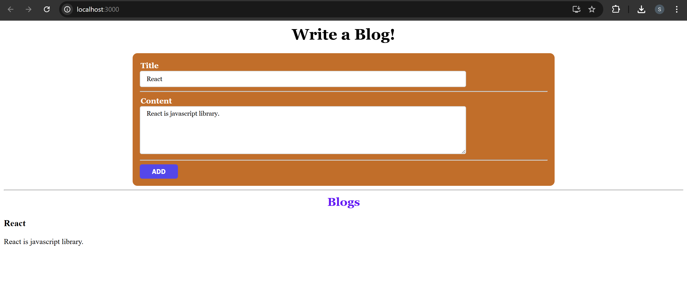
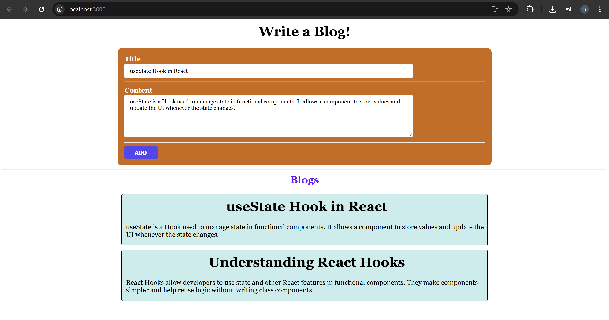
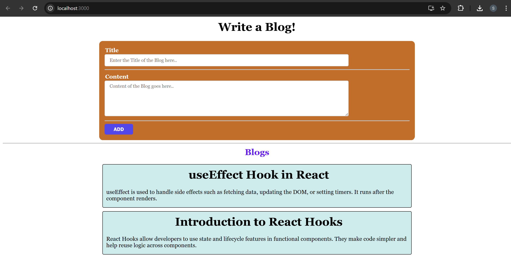
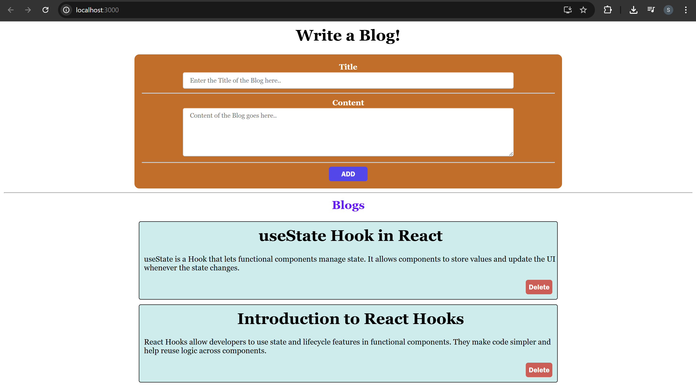
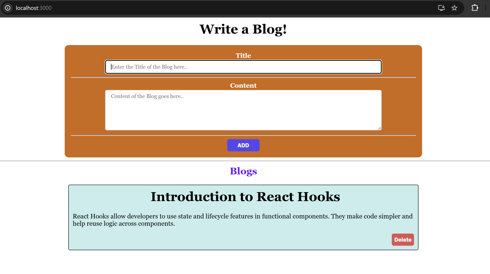
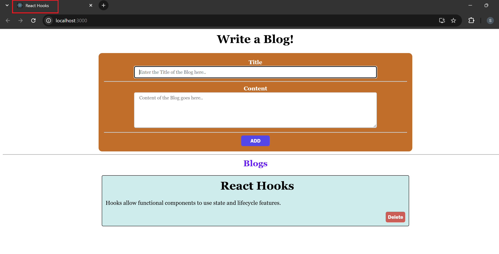
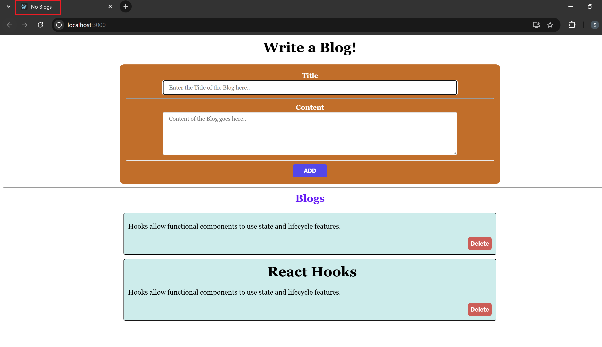

# REACT HOOKS PART-II

## Blogging-App Project Setup

### Blog.js

```jsx
import { useState } from "react";

export default function Blog() {
  const [title, setTitle] = useState("");
  const [content, setContent] = useState("");

  function handleSubmit(e) {
    e.preventDefault();
  }

  return (
    <>
      <h1>Write a Blog!</h1>

      <div className="section">
        <form onSubmit={handleSubmit}>
          <Row label="Title">
            <input
              className="input"
              placeholder="Enter the Title of the Blog here.."
              value={title}
              onChange={(e) => setTitle(e.target.value)}
            />
          </Row>

          <Row label="Content">
            <textarea
              className="input content"
              placeholder="Content of the Blog goes here.."
              value={content}
              onChange={(e) => setContent(e.target.value)}
            />
          </Row>

          <button className="btn">ADD</button>
        </form>
      </div>

      <hr />

      <h2>Blogs</h2>
      <h3>{title}</h3>
      <p>{content}</p>
    </>
  );
}

// Row component to introduce a new row section in the form
function Row(props) {
  const { label } = props;
  return (
    <>
      <label>
        {label}
        <br />
      </label>
      {props.children}
      <hr />
    </>
  );
}
```

- Created a Blog component to implement the blog writing feature.
- Added `useState` hooks to manage `title` and `content` input values.
- Implemented a form to allow users to enter a blog title and blog content.
- Added `handleSubmit()` function to prevent the default form refresh behavior.
- Displayed the entered blog `title` and `content` below the form.
- Created a reusable `Row` component to structure each form field with a label and input area.

### App.js

```jsx
import Blog from "./Blog";

function App() {
  return (
    <>
      <Blog />
    </>
  );
}

export default App;
```

- Imported the Blog component.
- Rendered the Blog component as the main UI of the application.

#### 🖥️ What You See in Browser:



## Adding a new Blog

### Blog.js

```diff
 import { useState } from "react";

 export default function Blog() {
   const [title, setTitle] = useState("");
   const [content, setContent] = useState("");
+  const [blogs, setBlogs] = useState([]);

   function handleSubmit(e) {
     e.preventDefault();
+
+    // Add new blog to the blogs array
+    setBlogs([{ title, content }, ...blogs]);
+    console.log(blogs);
   }

   return (
     <>
       <h1>Write a Blog!</h1>

       ...
       <hr />

       <h2>Blogs</h2>

-      <h3>{title}</h3>
-      <p>{content}</p>

+      {blogs.map((blog, i) => (
+        <div className="blog" key={i}>
+          <h1>{blog.title}</h1>
+          <p>{blog.content}</p>
+        </div>
+      ))}
     </>
   );
 }
```

#### Changes in Blog.js

- Added a new state blogs using `useState([])` to store multiple blog posts instead of just displaying one.
- Updated `handleSubmit()` to add a new blog object (`{ title, content }`) to the blogs array.
- Used the spread operator (`...blogs`) to keep previously added blogs and prepend the new blog.
- Implemented dynamic rendering of blogs using `blogs.map()` instead of directly displaying `title` and `content`.
- Each blog is displayed inside a `<div className="blog">` with a unique key.
- Added `console.log(blogs)` to debug and verify blog data after submission.

#### 🖥️ What You See in Browser:



## Passing an Object in useState()

### Blog.js

```diff
 import { useState } from "react";

 export default function Blog() {
-  const [title, setTitle] = useState("");
-  const [content, setContent] = useState("");
+  const [formData, setFormData] = useState({ title: "", content: "" });
   const [blogs, setBlogs] = useState([]);

   function handleSubmit(e) {
     e.preventDefault();

-    setBlogs([{ title, content }, ...blogs]);
+    setBlogs([{ title: formData.title, content: formData.content }, ...blogs]);
+    setFormData({ title: "", content: "" });
     console.log(blogs);
   }

   return (
     <>
       ...
       <Row label="Title">
         <input
-          value={title}
-          onChange={(e) => setTitle(e.target.value)}
+          value={formData.title}
+          onChange={(e) =>
+            setFormData({
+              title: e.target.value,
+              content: formData.content,
+            })
+          }
         />
       </Row>

       <Row label="Content">
         <textarea
-          value={content}
-          onChange={(e) => setContent(e.target.value)}
+          value={formData.content}
+          onChange={(e) =>
+            setFormData({
+              title: formData.title,
+              content: e.target.value,
+            })
+          }
         />
       </Row>
       ...
     </>
   );
 }
```

#### Changes in Blog.js

- Replaced two individual state variables (`title`, `content`) with a single state object `formData`.
- Updated form inputs to use `formData.title` and `formData.content` as values.
- Updated `onChange` handlers to update specific fields inside the `formData `object.
- Modified `handleSubmit()` to create new blog entries using `formData` values.
- Added form reset logic `(setFormData({ title: "", content: "" }))` after blog submission to clear the inputs.

#### Why the Entire `formData` Object is Passed to `setFormData`?

- `formData` is **one object state**. So when you call `setFormData`(), React expects the complete new object.

- If you update only one field like this:

  ```jsx
  setFormData({ title: e.target.value });
  ```

  - React will replace the whole object and `content` will be lost.

- So we pass the entire object:

  ```jsx
  setFormData({
    title: e.target.value, // changed field
    content: formData.content, // unchanged field (kept from previous state)
  });
  ```

  - `title`→ updated with the new value from the input.
  - `content` → remains the same by using the existing value from `formData`

- This ensures both fields remain in the state object.

The entire `formData` object is passed to `setFormData` because React replaces the whole state object during updates, so unchanged fields must be preserved.

#### 🖥️ What You See in Browser:



## Deleting a Blog

### Blog.js

```diff
 export default function Blog() {

  function handleSubmit(e) {
    e.preventDefault();

    setBlogs([{ title: formData.title, content: formData.content }, ...blogs]);
    setFormData({ title: "", content: "" });
  }

+  // Function to remove a blog
+  function removeBlog(i) {
+    setBlogs(blogs.filter((blog, index) => index !== i));
+  }

  return (
    <>
      ...
      <h2>Blogs</h2>

      {blogs.map((blog, i) => (
        <div className="blog" key={i}>
          <h1>{blog.title}</h1>
          <p>{blog.content}</p>

+          <div className="blog-btn">
+            <button
+              className="btn remove"
+              onClick={() => removeBlog(i)}
+            >
+              Delete
+            </button>
+          </div>

        </div>
      ))}
    </>
  );
}
```

#### Changes in Blog.js

- Added a new function `removeBlog()` to delete a blog from the `blogs` state.

- Implemented `Array.filter()` to remove the selected blog based on its index.

- Added a Delete button inside each blog card to trigger blog removal.

- Attached an `onClick` event handler to call `removeBlog(i)` when the Delete button is clicked.

- This update allows users to dynamically remove blogs from the list.

#### 🖥️ What You See in Browser:



## Focus on input field

### Blog.js

```diff
-import { useState } from "react";
+import { useState, useRef, useEffect } from "react";

 export default function Blog() {
   const [formData, setFormData] = useState({ title: "", content: "" });
   const [blogs, setBlogs] = useState([]);
+  const titleRef = useRef(null);

+  useEffect(() => {
+    titleRef.current.focus();
+  }, []);

   function handleSubmit(e) {
     e.preventDefault();

     setBlogs([{ title: formData.title, content: formData.content }, ...blogs]);
     setFormData({ title: "", content: "" });
     titleRef.current.focus();
     console.log(blogs);
   }

   function removeBlog(i) {
     setBlogs(blogs.filter((blog, index) => index !== i));
   }

   return (
     <>
       <h1>Write a Blog!</h1>

       ...
       <Row label="Title">
         <input
           className="input"
           placeholder="Enter the Title of the Blog here.."
           value={formData.title}
+          ref={titleRef}
           onChange={(e) =>
             setFormData({
               title: e.target.value,
               content: formData.content,
             })
           }
         />
       </Row>
       ...
     </>
   );
}
```

#### Use of `useRef` for Managing Input Focus

- Added the `useRef` hook to create a reference (`titleRef`) for the title input field so the DOM element can be accessed directly.
- Attached the reference to the input using `ref={titleRef}`, allowing the component to control the input programmatically.
- Used `titleRef.current.focus()` inside `useEffect()` to automatically focus the title input when the component first renders, enabling the user to start typing immediately.
- Used `titleRef.current.focus()` inside `handleSubmit()` to return focus to the title input after a blog is submitted and the form is reset.
- This improves the **user experience by keeping the cursor in the title field**, making it easier to quickly add multiple blogs.

#### 🖥️ What You See in Browser:



## Setting the Title

### Blogs.js

```diff
 export default function Blog() {

   const [formData, setFormData] = useState({ title: "", content: "" });
   const [blogs, setBlogs] = useState([]);
   const titleRef = useRef(null);

   useEffect(() => {
     titleRef.current.focus();
   }, []);

+  useEffect(() => {
+    if (blogs.length && blogs[0].title) {
+      document.title = blogs[0].title;
+    } else {
+      document.title = "No Blogs";
+    }
+  }, [blogs]);

   function handleSubmit(e) {
     e.preventDefault();

     setBlogs([{ title: formData.title, content: formData.content }, ...blogs]);
     setFormData({ title: "", content: "" });
     titleRef.current.focus();
     console.log(blogs);
   }

   function removeBlog(i) {
     setBlogs(blogs.filter((blog, index) => index !== i));
   }

   return (
     <>
       ...
       <Row label="Content">
         <textarea
           className="input content"
           placeholder="Content of the Blog goes here.."
           value={formData.content}
+          required
           onChange={(e) =>
             setFormData({ title: formData.title, content: e.target.value })
           }
         />
       </Row>
       ...
     </>
   );
}
```

- Added a second `useEffect` hook that runs whenever the `blogs` state changes.
- This effect updates the browser tab title (`document.title`) with the title of the most recently added blog (`blogs[0].title`).
- If no blogs exist, the tab title is set to "No Blogs".
- This demonstrates the use of `useEffect` for handling side effects, specifically interacting with the browser outside the React component.
- Added the `required` attribute to the content textarea to enforce form validation, ensuring that blog content must be entered before submitting the form.

#### 🖥️ What You See in Browser:




## The useReducer Hook

`useReducer` is a React Hook that lets you add a reducer to your component. It is
typically used when you have complex state transitions that involve multiple
sub-values or when the next state depends on the previous state.

It is a more powerful alternative to the useState hook and is particularly useful when
managing state for large or deeply nested objects. The `useReducer` hook provides a
simple API for dispatching actions and updating state in a predictable way.

### Parameters

1. `reducer`: In React, the `useReducer` hook takes a pure reducer function as its
   first argument, which defines how the state gets updated. The reducer
   function should take in the current state and an action as arguments and
   return the new state. The state and action can be of any type.
2. `initialState`: The value that represents the initial state of the component. This
   can be any value, including an object or an array.

### Returns

`useReducer` returns an array with exactly two values:

1. The current state. During the first render, it’s set to the initialState.
2. The dispatch function that lets you update the state to a different value and
   trigger a re-render.

#### Example: Usage of useReducer hook

```jsx
const [state, dispatch] = useReducer(reducer, initialState);
```

This code snippet uses the `useReducer` hook to define a state variable named `state`
with an initial value of `initialState`, and a function named `dispatch` that can be used
to dispatch updates to the state.

### The dispatch function

The `dispatch` function returned by `useReducer` lets you update the state to a
different value and trigger a re-render. You need to pass the `action` as the only
argument to the dispatch function

#### Example:

```jsx
const [timer, dispatch] = useReducer(reducer, initialState);

const handleIncrement = () => {
  dispatch({ type: "INCREMENT_COUNT" });
};
```

This code snippet uses the `dispatch` function from the `useReducer` hook and
passes an action object of type "INCREMENT_COUNT". The reducer function then
checks this action type to update the state of the timer.

### Writing the reducer function

The `reducer` function used in useReducer hook of React is a pure function that takes
the current state and an action as arguments, and returns the new state.

The reducer function evaluates the type of the action and updates the state based on
the type of action.

#### Example:

```jsx
const reducer = (state, action) => {
  switch (action.type) {
    case "incremented_age": {
      return {
        name: state.name,
        age: state.age + 1,
      };
    }

    case "changed_name": {
      return {
        name: action.nextName,
        age: state.age,
      };
    }

    default:
      return state;
  }
};
```

## Blogs using useReducer()

### Blog.js

```diff
-import { useState, useRef, useEffect } from "react";
+import { useState, useRef, useEffect, useReducer } from "react";

+// Reducer function to manage blogs state
+const blogsReducer = (state, action) => {
+  switch (action.type) {
+    case "ADD":
+      return [action.blog, ...state];
+    case "REMOVE":
+      return state.filter((blog, index) => index !== action.index);
+    default:
+      return [];
+  }
+};

 export default function Blog() {

   const [formData, setFormData] = useState({ title: "", content: "" });

-  const [blogs, setBlogs] = useState([]);
+  // Replaced useState with useReducer for blogs state management
+  const [blogs, dispatch] = useReducer(blogsReducer, []);

   const titleRef = useRef(null);

   ...

   function handleSubmit(e) {
     e.preventDefault();

-    setBlogs([{ title: formData.title, content: formData.content }, ...blogs]);
+    dispatch({
+      type: "ADD",
+      blog: { title: formData.title, content: formData.content },
+    });

     setFormData({ title: "", content: "" });
     titleRef.current.focus();
   }

   function removeBlog(i) {
-    setBlogs(blogs.filter((blog, index) => index !== i));
+    dispatch({ type: "REMOVE", index: i });
   }

   ...
}
```

#### Explanation

1. Introduced `useReducer`
   - The `useReducer` hook was added to manage the blogs state instead of using `useState`.
     It is useful when state logic involves multiple actions such as adding and removing blogs.

2. Created a Reducer Function (`blogsReducer`)
   - A reducer function was defined to control how the blogs state updates based on actions.
     - `"ADD"` → Adds a new blog at the beginning of the blogs array.
     - `"REMOVE"` → Removes a blog using its index.
     - `default` → Returns an empty array if no action matches.

   - This keeps state update logic centralized and predictable.

3. Replaced `useState` with `useReducer`
   - `useState([])` → simple state update
   - `useReducer(blogsReducer, [])` → state managed through actions and reducer logic. `useReducer` returns:
     - blogs → current state
     - dispatch → function used to send actions to update state.

4. Replaced `setBlogs` with `dispatch`
   - Adding a blog
     - Instead of directly updating state, an ADD action is dispatched:
       ```jsx
       dispatch({
         type: "ADD",
         blog: { title: formData.title, content: formData.content },
       });
       ```
     - The reducer handles this action and updates the state.

   - Removing a blog
     - To delete a blog, a REMOVE action is dispatched:

     ```jsx
     dispatch({ type: "REMOVE", index: i });
     ```

     - The reducer filters the blog list and removes the selected blog.

5. Benefit of Using `useReducer`
   - Organizes state update logic in one place
   - Makes complex state updates easier to manage
   - Improves code readability and scalability
   - Separates state logic from component UI logic

`useReducer` replaces `useState` for the blogs list and manages blog operations through actions (`ADD`, `REMOVE`) handled by a reducer function.

## Custom Hooks

- Custom hooks are functions in React that allow you to reuse stateful logic across
  multiple components. They follow the naming convention of starting with the word
  "use" and can be defined and used in the same way as the built-in hooks provided
  by React.

- Custom hooks are a way to abstract and share logic that is not tied to a specific
  component, which makes your code more modular, easier to read and maintain.
  They can encapsulate complex stateful logic and make it easy to use in multiple
  components, without having to repeat the same code in each component.

- Custom hooks can use other built-in hooks and can also be composed with other
  custom hooks, which makes it easy to create complex and reusable logic that can be
  used across different parts of your application.

#### Example: The `useLocalStorage` custom hook

```jsx
import { useState, useEffect } from "react";

const useLocalStorage = (key, initialValue) => {
  const [value, setValue] = useState(() => {
    const storedValue = localStorage.getItem(key);
    return storedValue !== null ? JSON.parse(storedValue) : initialValue;
  });

  useEffect(() => {
    localStorage.setItem(key, JSON.stringify(value));
  }, [key, value]);

  return [value, setValue];
};
```

This custom hook allows you to store and retrieve data in the browser's localStorage.
It takes a key and initial value as arguments and returns a state `value` and a
`setValue` function to update it.

