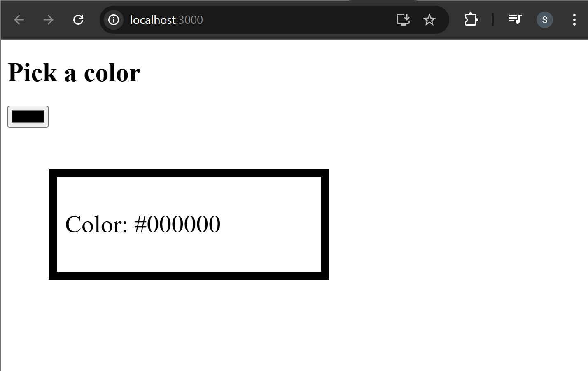
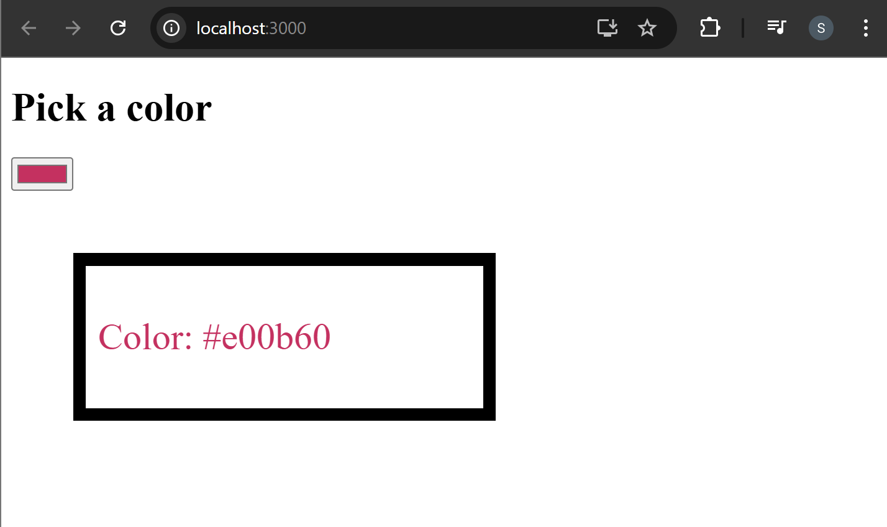
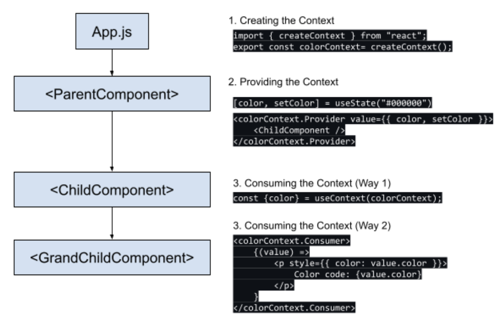

# CONTEXT API PART-I

## Passing Data From Parent to Child

### Prop Drilling - Passing State from Parent to Child

Your application might initially only have one component, but as it becomes more
sophisticated, you must continue dividing it into smaller components. We can create
a separation of concerns by isolating specific portions of a bigger application using
components. Whenever anything in your program malfunctions, fault isolation makes
it simple to pinpoint the problem area.

Props can be used to enable communication between our components in React.
Prop drilling is a situation where data is passed from one component through
multiple interdependent components until you get to the component where the data
is needed. Prop drilling is not ideal as it quickly introduces complicated, hard-to-read
code, re-rendering excessively, and slows down performance. Component
re-rendering is especially damaging since passing data down multiple levels of
components triggers the re-rendering of components unnecessarily.

### Lifting Up the State - Passing State to siblings

Lifting state up occurs when the state is placed in a common ancestor (or parent) of
child components. Because each child component has access to the parent, they will
then have access to the state (via prop drilling). If the state is updated inside the
child component, it is lifted back to the parent container. However, as we are utilizing
a poorly maintained pattern for the state, this approach can create issues in the
future.

### Context

Context provides a way to pass data through the component tree without having to
pass props down manually at every level. This is the alternative to "prop drilling" or
moving props from grandparent to child to parent, and so on. Context is designed to
share data that can be considered “global” for a tree of React components, such as
the current authenticated user, theme, or preferred language.

## Prop Drilling Example

The color state is created in the `ParentComponent` and passed down through `ChildComponent` to `GrandChildComponent`. This process of passing data through multiple component levels using props is called **Prop Drilling**.

### 1. App.js

```jsx
import ParentComponent from "./Components/ParentComponent";
import "./styles.css";

const App = () => {
  return <ParentComponent />;
};

export default App;
```

The `App` component acts as the root component of the application. It simply imports and renders the `ParentComponent`, which contains the main logic of the color picker.

### 2. ParentComponent.js

```jsx
import { useState } from "react";
import ChildComponent from "./ChildComponent";

const ParentComponent = (props) => {
  const [color, setColor] = useState("#000000");

  return (
    <>
      <h1>Pick a color</h1>
      <input
        type="color"
        onChange={(e) => {
          setColor(e.target.value);
        }}
        value={color}
      />
      <ChildComponent color={color} />
    </>
  );
};

export default ParentComponent;
```

This component manages the application state using the `useState` hook. It stores the selected color and provides a color input field for users to choose a color. The selected color is passed as a prop (`color`) to the `ChildComponent`.

### 3. ChildComponent.js

```jsx
import GrandChildComponent from "./GrandChildComponent";

const ChildComponent = (props) => (
  <div
    style={{
      border: `10px solid #000000`,
      margin: "50px",
      padding: "10px",
      fontSize: "30px",
      width: "300px",
    }}
  >
    <GrandChildComponent color={props.color} />
  </div>
);

export default ChildComponent;
```

The `ChildComponent` receives the `color` prop from `ParentComponent`. It does not modify the data but simply forwards the `color` prop to the `GrandChildComponent`. This step demonstrates prop drilling, where props are passed through intermediate components.

### 4. GrandChildComponent.js

```jsx
const GrandChildComponent = (props) => (
  <p style={{ color: props.color }}>Color: {props.color}</p>
);

export default GrandChildComponent;
```

This component receives the `color` prop and displays it in a paragraph. The text color dynamically changes based on the selected color value.

#### 🖥️ What You See in Browser:





## React Context API

The React Context API is a component structure that allows us to share data across
all levels of the application. The main aim of Context API is to solve the problem of
prop drilling (also called "Threading"). There are three steps to using React context:

1. **Create context** - using the `createContext` method.
2. **Provide Context** - Setup a `Context.provider` and define the data which
   you want to store.
3. **Consume the Context** - Use a `Context.consumer` or `useContext` hook
   whenever you need the data from the store.

Let’s consider the following example:

#### 🖥️ What You See in Browser:



### Creating the Context

#### **React.createContext**

```text
const MyContext = React.createContext(defaultValue);
```

It is used for creating a Context object. When React renders a component
subscribing to this Context object, it will read the current context value from the
closest matching Provider above it in the tree.

```jsx
import { createContext } from "react";
export const colorContext = createContext();
```

### Providing the Context

#### **Context.Provider**

```text
<MyContext.Provider value={/* some value */}>
```

Every Context object has a Provider React component which allows consuming
components to subscribe to context changes. It acts as a delivery service. When a
consumer component asks for something, it finds it in the context and provides it to
where it is needed. The provider accepts a prop (value), and the data in this prop
can be used in all the other child components. This value could be anything from the
component state.

All consumers that are child components of a Provider will re-render whenever the
Provider’s value prop changes. Changes are determined by comparing the new and
old values using the same algorithm as Object.is.

```jsx
import { useState } from "react";
import ChildComponent from "./ChildComponent";
import { colorContext } from "../context";

const ParentComponent = (props) => {
  const [color, setColor] = useState("#000000");

  return (
    <>
      <h1>Pick a color</h1>

      <input
        type="color"
        onChange={(e) => {
          setColor(e.target.value);
        }}
        value={color}
      />

      {/* Providing the context to the child component */}
      <colorContext.Provider value={{ color, setColor }}>
        <ChildComponent />
      </colorContext.Provider>
    </>
  );
};

export default ParentComponent;
```

## Implementing Context

### Context Creation (context.js)

```jsx
import { createContext } from "react";

export const colorContext = createContext();
```

- A new context called `colorContext` is created using `createContext()`.
- Purpose: This context allows data (like color) to be shared across components without passing props manually through each component.

### ParentComponent.js

```diff
 import { useState } from "react";
 import ChildComponent from "./ChildComponent";
+import { colorContext } from "../context";

 const ParentComponent = (props) => {
   const [color, setColor] = useState("#000000");

   return (
     <>
       <h1>Pick a color</h1>
       <input
         type="color"
         onChange={(e) => {
           setColor(e.target.value);
         }}
         value={color}
       />
-      <ChildComponent color={color} />
+      <colorContext.Provider value="red">
+        <ChildComponent />
+      </colorContext.Provider>
     </>
   );
 };

 export default ParentComponent;
```

- `colorContext` was imported.
- `ChildComponent` was wrapped inside `colorContext.Provider`.
- The Provider supplies a value (`"red"`) to all components inside it.
- Purpose: The Provider makes the context value available to all nested components without passing props.

A `colorContext` is created using `createContext()` and provided in `ParentComponent` using `colorContext.Provider` so that child components can access shared data without prop drilling.
