# COMPONENT LIFECYCLE METHODS

## Introduction to Component Lifecycle

### Lifecycle

Lifecycle is the series of stages through which a component passes from the
beginning of its life until its death. The life of the React component starts when it is
born ( Created/Mounted) and ends when it is destroyed (Unmounted).

### Different Phases of a Lifecycle

Different Phases of a component lifecycle are:

- **Mounting:** When a component is being created and inserted into the DOM.
- **Updating:** When a Component is being re-rendered due to any updates
  made to its state or props.
- **Unmounting:** When it is destroyed/ removed from the DOM.
- **Error Handling:** When there is an error during rendering

During the lifecycle of a component, certain methods are called at each phase where
we can execute some logic or perform a side-effect.

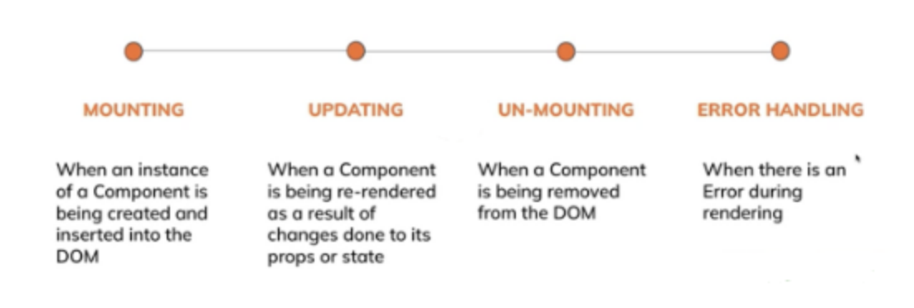

### Side effects

Side effects are actions that are not predictable because they are actions that are
performed with the "outside world."

For example: Using Browser APIs like localStorage, using the native DOM methods
instead of the ReactDOM, fetching the data from an API, and setting timeouts and
intervals.

## Mounting Phase

These methods are called in the following sequence when an instance of a
component is being created:

- `constructor()`
- `static getDerivedStateFromProps()`
- `render()`
- `componentDidMount()`

### constructor

- A special function that will get called whenever a new component is created.
- It can be used to initialize the state and bind the event handlers.
- This is the only place where the state can be modified directly. Everywhere
  else state should be updated using the`setState` function (used to update the
  state of a component).
  -mAvoid introducing any side effects/subscriptions in the constructor.

#### Example:

```jsx
class Counter extends Component {
  constructor(props) {
    super(props);

    this.state = {
      name: "Counter",
      count: 0,
    };

    console.log("Counter Constructor");
  }
}
```

### static getDerivedStateFromProps

- It is invoked right before the render function. This method is invoked in both
  the mounting and updating phases.
- This method exists for rare use cases where the state depends on changes in
  the props over time.If there is no change in state, then this method returns the
  null value.
- It is a static method that does not have any access to this keyword.

#### Example:

It will return an object to update the state. if the props.value is equal to state.counter
then it will return a null value.

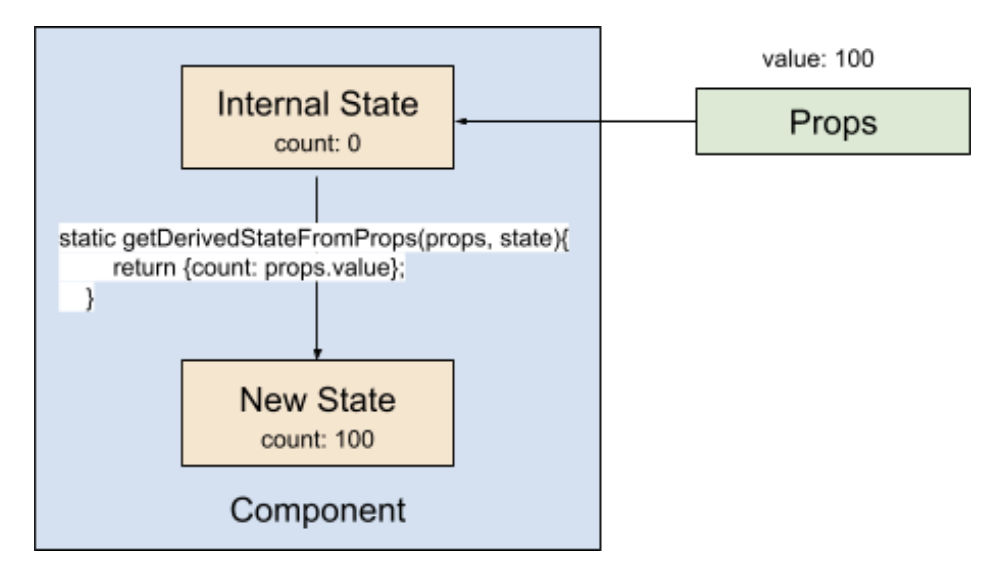

```jsx
static getDerivedStateFromProps(props, state) {
  console.log("Counter getDerivedStateFromProps");

  return { count: props.value };
}
```

### render()

- This is the only required method in the class component. `render()` executes
  during both the mounting and updating phase of the component's lifecycle.
- It is used to render elements to the DOM by returning some JSX.
- The `render()` method must be a pure function, meaning it should not modify
  the component's state, as when the state gets updated, the render method
  gets automatically called, which could lead to infinite looping.
- `render()` will not be invoked if `shouldComponentUpdate()` returns false.

#### Example:

It returns JSX to render your UI and returns null value if there is nothing to render
inside the component.

```jsx
render() {
  console.log("Counter Render");

  return (
    <h1>{this.state.count}</h1>
  );
}
```

### componentDidMount

- It is invoked after a component is mounted. (initially renders on the screen).
- This method is a good place to handle side effects like setting up
  subscriptions and loading data from a remote endpoint.
- You can also use the setState function in this method to update the state.

#### Example:

When the state gets updated inside this method, it causes another rendering just
before the browser updates the UI.

```jsx
componentDidMount() {
  console.log("Counter componentDidMount");

  setTimeout(() => {
    this.setState({ count: 50 });
  }, 1000);
}
```

## Order of Lifecycle Methods

### App.js

```jsx
import React from "react";
import ComponentA from "./ComponentA";

class App extends React.Component {
  render() {
    return <ComponentA />;
  }
}

export default App;
```

The App component simply imports and renders ComponentA, acting as the root component of the application.

### ComponentA.js

```jsx
import React from "react";

class ComponentA extends React.Component {
  constructor() {
    super();
    this.state = {
      name: "ComponentA",
    };
    console.log("ComponentA constructor!");
  }

  static getDerivedStateFromProps() {
    console.log("ComponentA getDerivedStateByProps!");
    return null;
  }

  componentDidMount() {
    console.log("ComponentA componentDidMount!");
  }

  render() {
    console.log("ComponentA render!");
    return <h1>{this.state.name}</h1>;
  }
}

export default ComponentA;
```

A class componentA created to demonstrate lifecycle methods:

- **constructor()** initializes the component state with `name: "ComponentA"` and logs a message to show when the constructor is executed.

- **getDerivedStateFromProps()** is a static lifecycle method used to sync state with props. Here it only logs a message and returns `null` since no state update is required.

- **componentDidMount()** runs after the component is mounted to the DOM and logs a message to indicate that the component has been successfully rendered.

- **render()** displays the value of `name` from the state inside an `<h1>` element and logs when rendering occurs.

#### Order of execution of React class component lifecycle methods:

```text
constructor → getDerivedStateFromProps → render → componentDidMount
```

#### 🖥️ What You See in Browser:

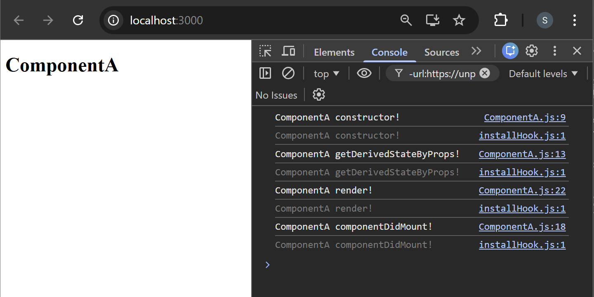

## Lifecycle with Parent–Child Components

### ComponentB.js

```jsx
import React from "react";

class ComponentB extends React.Component {
  constructor() {
    super();
    this.state = {
      name: "ComponentB",
    };
    console.log("ComponentB constructor!");
  }

  static getDerivedStateFromProps() {
    console.log("ComponentB getDerivedStateByProps!");
    return null;
  }

  componentDidMount() {
    console.log("ComponentB componentDidMount!");
  }

  render() {
    console.log("ComponentB render!");
    return <h2>{this.state.name}</h2>;
  }
}

export default ComponentB;
```

#### Created a new file ComponentB.js

- Added a separate class component with its own:
  - `constructor`
  - `state`
  - `getDerivedStateFromProps`
  - `componentDidMount`
  - `render`

### ComponentA.js

- Imported ComponentB

  ```diff
  + import ComponentB from "./ComponentB";
  ```

  - Allows ComponentA to use the ComponentB component.

- Rendered ComponentB inside ComponentA

  ```diff
  render() {
    console.log("ComponentA render!");
    return (
  -   <h1>{this.state.name}</h1>
  +   <>
  +     <h1>{this.state.name}</h1>
  +     <ComponentB />
  +   </>
    );
  }
  ```

  - ComponentB is now a child component of ComponentA.

#### Lifecycle Impact (when the app loads)

```text
ComponentA constructor
ComponentA getDerivedStateFromProps
ComponentA render

ComponentB constructor
ComponentB getDerivedStateFromProps
ComponentB render

ComponentB componentDidMount
ComponentA componentDidMount
```

#### Purpose of Change

- Demonstrates parent–child component relationship.

- Shows how lifecycle methods execute when nested components are used.

#### 🖥️ What You See in Browser:

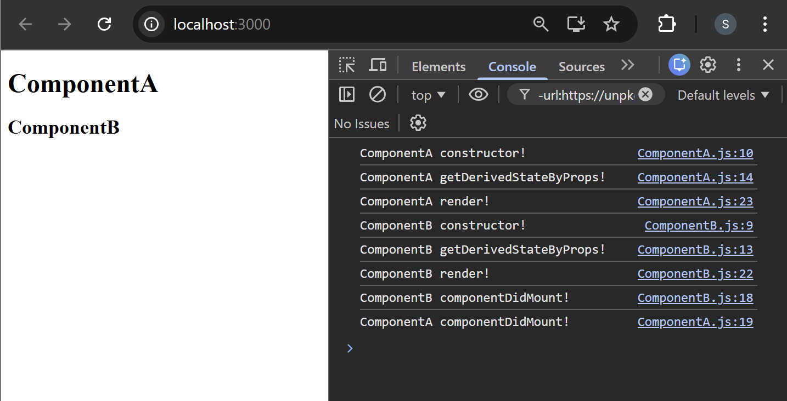

## Causing Side-Effects

### ComponentA.js

```jsx
import React from "react";

class ComponentA extends React.Component {
  constructor() {
    super();
    this.state = {
      name: "ComponentA",
      data: [],
    };
    console.log("ComponentA constructor!");
  }

  static getDerivedStateFromProps() {
    console.log("ComponentA getDerivedStateByProps!");
    return null;
  }

  componentDidMount() {
    console.log("ComponentA componentDidMount!");
    fetch("https://jsonplaceholder.typicode.com/users")
      .then((response) => response.json())
      .then((data) => this.setState({ data }));
  }

  render() {
    console.log(this.state.data);
    console.log("ComponentA render!");
    return (
      <>
        <h1>{this.state.name}</h1>
        <ul>
          {this.state.data.map((d) => {
            return <li key={d.id}>{d.username}</li>;
          })}
        </ul>
      </>
    );
  }
}

export default ComponentA;
```

#### Explaination:

1. Added State to Store API Data

   ```jsx
   data: [];
   ```

   - A new state variable `data` was introduced to store the list of users fetched from the API. This allows the component to render dynamic data after the API request completes.

2. . Added API Call in `componentDidMount`

   ```jsx
   fetch("https://jsonplaceholder.typicode.com/users")
     .then((response) => response.json())
     .then((data) => this.setState({ data }));
   ```

   - The API request is performed inside `componentDidMount()` so that the data is fetched after the component is mounted. This ensures that the UI renders first and then updates when the data is received.

3. Rendering Dynamic Data Using `map`

   ```jsx
   <ul>
     {this.state.data.map((d) => {
       return <li key={d.id}>{d.username}</li>;
     })}
   </ul>
   ```

   - `map()` is used to iterate over the fetched user data and dynamically create list items. The key attribute is added to help React efficiently update the DOM.

### Why Side Effect Is Written in `componentDidMount`

The API call is a side effect because it interacts with an external system (server) and updates the component state asynchronously.

`componentDidMount()` is the correct place because:

- It runs after the component is mounted to the DOM
- It executes only once during the component lifecycle
- It prevents unnecessary repeated API calls

### Issues If Side Effects Are Written Elsewhere

1. If written inside `render()`
   - Problem:
     - `render()` runs every time state changes
     - `setState()` inside API response triggers another render
   - Result:
     ```text
     render → fetch → setState → render → fetch → setState → infinite loop
     ```
   - This causes continuous API calls and performance issues.

2. If written inside `constructor()`
   - Problem:
     - The component is not yet mounted
     - Side effects should not run during state initialization
     - Can lead to unexpected lifecycle behavior

3. If written in `getDerivedStateFromProps()`
   - Problem:
     - This method is \***\*static**
     - Cannot access `this`
     - Must remain a pure function without side effects.

The component was enhanced to demonstrate data fetching, state management, and dynamic rendering. The side effect (API request) was placed in `componentDidMount()` to ensure proper lifecycle behavior and avoid unnecessary or repeated executions.

#### 🖥️ What You See in Browser:

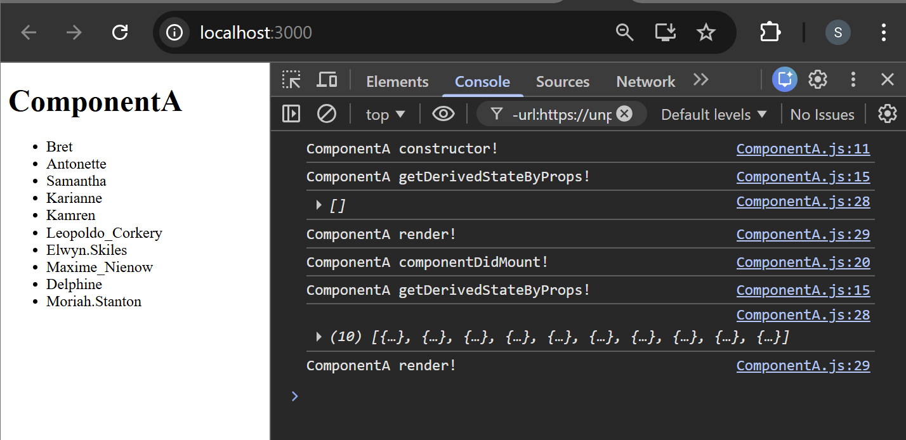

## Updating Phase

Changes to props or state can cause an update. These methods are called in the
foll

- `static getDerivedStateFromProps()`
- `shouldComponentUpdate()`
- `render()`
- `getSnapshotBeforeUpdate()`
- `componentDidUpdate()`
  `shouldComponentUpdate()`

### shouldComponentUpdate()

- `shouldComponentUpdate()` is called as soon as `static
getDerivedStateFromProps()` the method is invoked.
- In the `shouldComponentUpdate()` method, you can return a Boolean value that
  controls whether the component gets rerendered upon a change in
  state/props. It defaults to `true`.
- This method only exists as a performance optimization. Do not rely on it to
  “prevent” a rendering, as this can lead to bugs.

#### Example:

It returns the boolean value true or false if you want to re-render or not.

```jsx
shouldComponentUpdate(nextProps, nextState) {
  console.log("Counter shouldComponentUpdate");

  if (this.state.count == nextState.count) {
    return false;
  }

  return true;
}
```

### getSnapshotBeforeUpdate()

- `getSnapshotBeforeUpdate()` is invoked just after the render() method.
- It stores the previous values of the state after the DOM is updated, meaning
  that even after the update, you can check what the values were before the
  update. Any value returned by this lifecycle method will be passed as a
  parameter to `componentDidUpdate()`.
- Most likely, you’ll rarely reach for this lifecycle method. But it comes in handy
  when you need to grab information from the DOM (and potentially change it)
  just after an update is made, like a chat thread that needs to handle the scroll
  position.
- A snapshot value (or null) should be returned.

#### Example:

```jsx
getSnapshotBeforeUpdate(prevProps, prevState) {
  console.log("Counter getSnapshotBeforeUpdate");
  return prevState.time || null;
}
```

### componentDidUpdate()

- `componentDidUpdate()` is invoked immediately after updating occurs.
  -mIt can operate on the DOM when the component has been updated.
- This is also a good place to do network requests as long as you compare the
  current props to previous props (e.g., a network request may not be
  necessary if the props have not changed).
- It is similar to `componentDidMount()` as you can use `setState`() or fetch API
  call but you have to mention a condition to check if the previous state or props
  has changed or not.

#### Example:

```jsx
getSnapshotBeforeUpdate(prevProps, prevState) {
  console.log("Counter getSnapshotBeforeUpdate");
  return prevState.count || null;
}

componentDidUpdate(prevProps, prevState, snapshot) {
  console.log("Counter componentDidUpdate");

  if (snapshot !== null) {
    this.setState({ count: 20 });
  }
}
```

## Unmounting Phase

This method is called when a component is being removed from the DOM:

- `componentWillUnmount()`

### componentWillUnmount()

- It is invoked immediately before a component is unmounted and destroyed.
- Perform any necessary cleanup in this method, such as invalidating timers,
  canceling network requests, or cleaning up any subscriptions that were
  created in `componentDidMount()`.
- You should not call `setState()` in `componentWillUnmount()` because the
  component will never be re-rendered. Once a component instance is
  unmounted, it will never be mounted again.

#### Example:

```jsx
componentWillUnmount() {
  if (this.count) {
    clearInterval(this.timer);
  }
}
```

## Setting the TImer

### Timer.js

```jsx
import React from "react";

export default class Timer extends React.Component {
  constructor() {
    super();

    this.state = {
      time: 0,
    };

    this.timer = null;
    console.log("Timer Constructor");
  }

  static getDerivedStateFromProps(props, state) {
    console.log("Timer getDerivedStateFromProps");
    return null;
  }

  componentDidMount() {
    console.log("Timer ComponentDidMount");
    console.log("_________________________________");
    this.timer = setInterval(() => {
      this.setState((prevState) => ({ time: prevState.time + 1 }));
    }, 1000);
  }

  getSnapshotBeforeUpdate(prevProp, prevState) {
    console.log("Timer getSnapshotBeforeUpdate");
    return null;
  }

  //   shouldComponentUpdate(nextProps, nextState) {
  //     console.log("Timer shouldComponentUpdate");
  //     return true;
  //   }

  componentDidUpdate(prevProps, prevState, snapshot) {
    console.log("Timer componentDidUpdate");
    console.log("_________________________________");
  }

  render() {
    console.log("Timer render");
    return (
      <div>
        <h2>Time Spent: {this.state.time}</h2>
        {new Date(this.state.time * 1000).toISOString().slice(11, 19)}
      </div>
    );
  }
}
```

This component creates a simple timer that increases every second and demonstrates the React class component lifecycle during updates.

1. Constructor

   ```jsx
   constructor() {
     super();

     this.state = {
       time: 0,
     };

     this.timer = null;
   }
   ```

   - Initializes the component.
   - `time` state is set to 0 seconds.
   - `this.timer` stores the interval ID so the timer can be controlled later.
   - A console log is added to observe lifecycle execution.

2. getDerivedStateFromProps

   ```jsx
   static getDerivedStateFromProps(props, state)
   ```

   - Runs before every render (both mount and update).
   - Used when state needs to be updated from props.
   - In this case it does nothing and returns `null`.
   - Purpose here: only to observe lifecycle order in console.

3. componentDidMount
   - Runs once after the component is added to the DOM.
   - Starts a timer using `setInterval`.
   - Every second: `time` increases by 1 using `setState`.
     ```jsx
     this.timer = setInterval(() => {
       this.setState((prevState) => ({ time: prevState.time + 1 }));
     }, 1000);
     ```

4. getSnapshotBeforeUpdate
   - Runs right before DOM updates.
   - Can capture information (like scroll position).
   - Here it just logs execution and returns `null`.

5. componentDidUpdate
   - Runs after the component updates.
   - Triggered every time time changes.
   - Used for side effects after updates.
   - Here it only logs lifecycle execution.

6. Render Method
   - Displays the timer.
   - Two formats are shown:
     - Raw seconds

       ```jsx
       <h2>Time Spent: {this.state.time}</h2>
       ```

     - Formatted time (HH:MM:SS)

       ```jsx
       {
         new Date(this.state.time * 1000).toISOString().slice(11, 19);
       }
       ```

   - Example display:

     ```text
     Time Spent: 5
     00:00:05
     ```

7. shouldComponentUpdate (Commented)
   - Used to control re-rendering for performance.
   - If it returns `false`, the component will not update.

### Overall Flow

Every second this happens:

```text
setState()
   ↓
getDerivedStateFromProps
   ↓
shouldComponentUpdate (if used)
   ↓
render
   ↓
getSnapshotBeforeUpdate
   ↓
componentDidUpdate
```

#### ✅ Purpose of this code

- Demonstrates React lifecycle methods during updates
- Shows state updates with setInterval
- Displays formatted time

#### 🖥️ What You See in Browser:

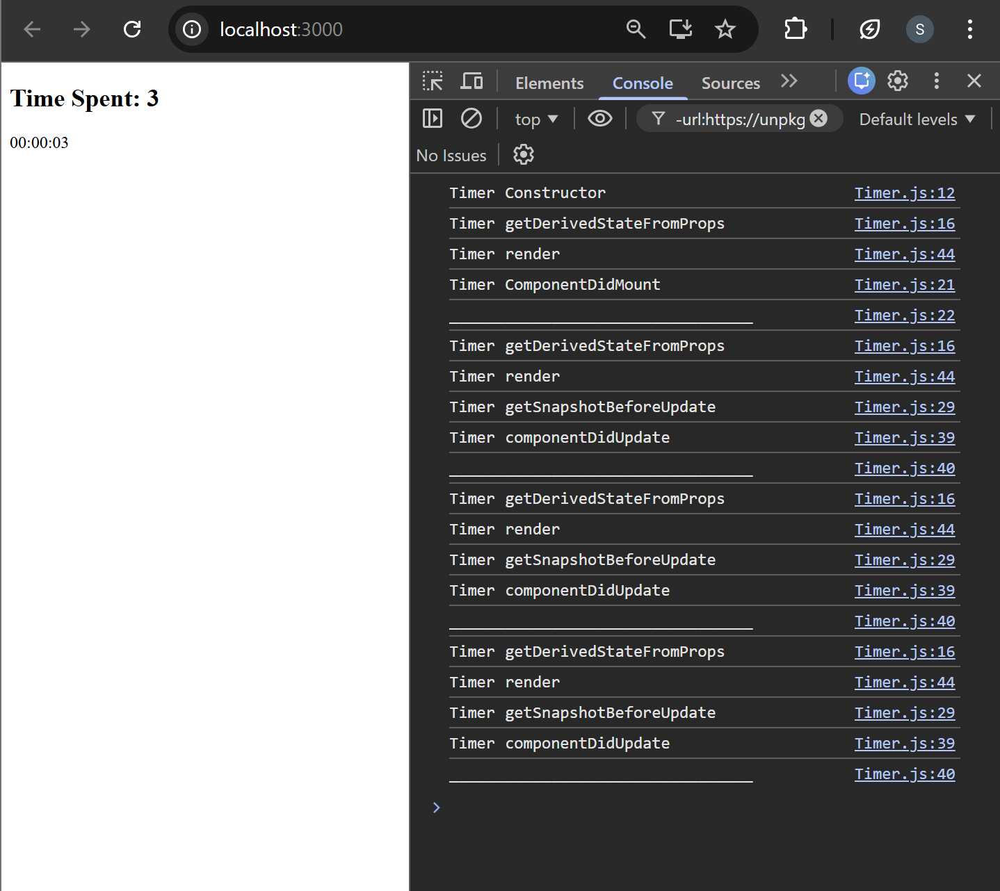

## Stopping & Un-Mounting the Timer

### Changes in Timer.js

1. Stop Timer at 10 Seconds

   ```diff
   componentDidUpdate(prevProps, prevState, snapshot) {
     console.log("Timer componentDidUpdate");
     console.log("_________________________________");
   + if (this.state.time === 10) {
   +   clearInterval(this.timer);
   + }
   }
   ```

   - Added a condition to stop the timer when `time` reaches 10 seconds.
   - `clearInterval(this.timer)` prevents further state updates.

2. Added `componentWillUnmount()` for Cleanup

   ```diff
   + componentWillUnmount() {
   +   console.log("Timer componentWillUnmount");
   +   clearInterval(this.timer);
   + }
   ```

   - Ensures the interval timer is cleared when the component is removed from the DOM.
   - Prevents memory leaks or unnecessary background timers.

### Changes in App.js

```jsx
import React from "react";
import Timer from "./Timer";

class App extends React.Component {
  constructor() {
    super();
    this.state = {
      mount: false,
    };
  }

  handleMount = () => {
    this.setState((prevState) => ({ mount: !prevState.mount }));
  };

  render() {
    return (
      <>
        <button onClick={this.handleMount}>
          {this.state.mount ? "Un-MOUNT" : "MOUNT"}
        </button>
        {this.state.mount ? <Timer /> : null}
      </>
    );
  }
}

export default App;
```

- Added a state variable (`mount`)
  - Used to control whether the `Timer` component should be rendered or removed from the DOM.
- Added `handleMount` method
  - This method toggles the `mount` state between `true` and `false`.
- Added a button
  - The button allows the user to mount or unmount the `Timer` component by clicking it.
- Added conditional rendering for `Timer`
  - The `Timer` component renders only when `mount` is `true`.
    When `mount` becomes `false`, the `Timer` component is removed from the DOM, triggering the `componentWillUnmount()` lifecycle method.

The mount/unmount condition is added to control whether the `Timer` component should be present in the DOM. `componentWillUnmount()` only runs when React removes a component from the DOM. If the `Timer` component is always rendered, it will never be removed and this method will never execute. By using a `mount` state and conditional rendering, the component can be mounted or unmounted, which allows React to trigger `componentWillUnmount()` and perform cleanup tasks like clearing timers.

#### 🖥️ What You See in Console:

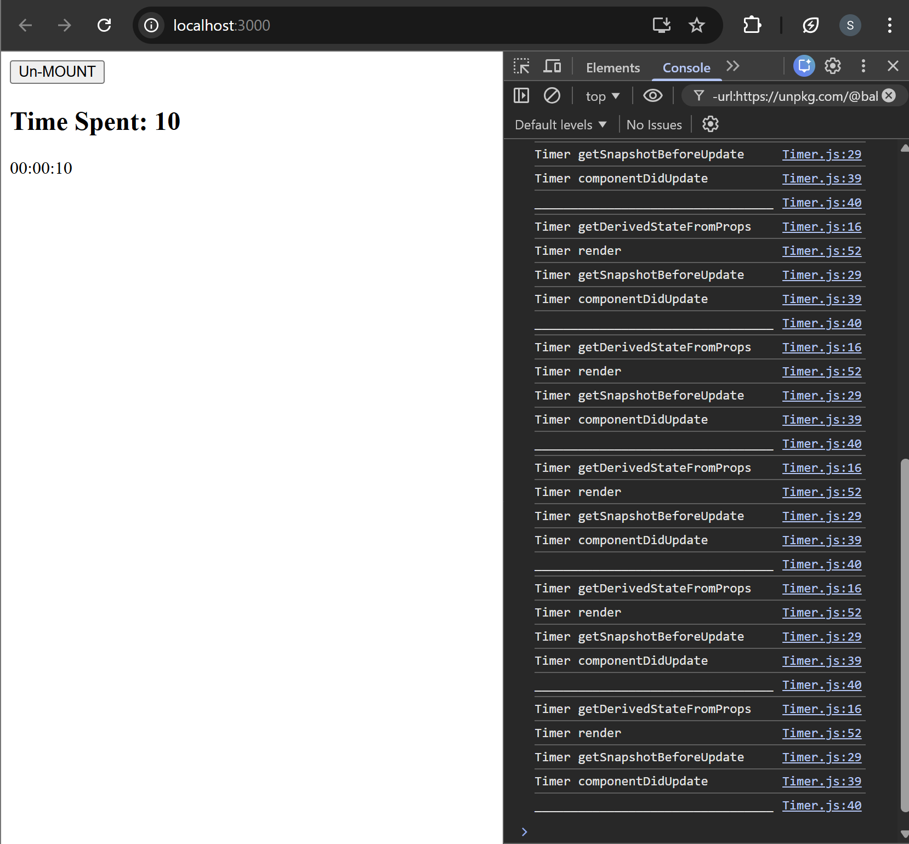

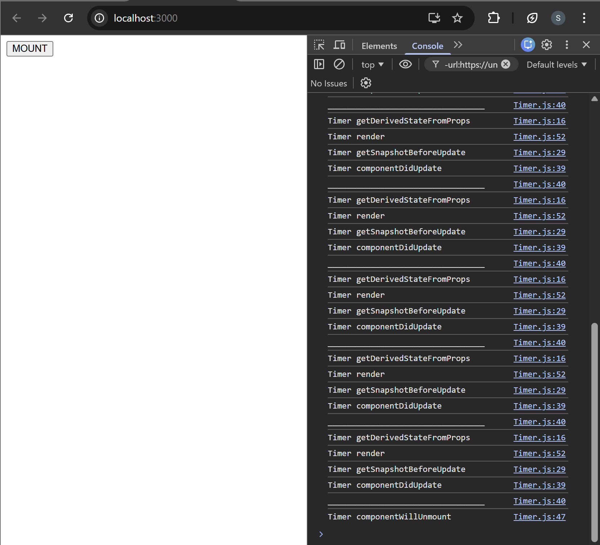

## Understanding Update Methods

### Changes in Timer.js

- Updated Timer Interval

  ```diff
  componentDidMount() {
    console.log("Timer ComponentDidMount");
    console.log("_________________________________");
    this.timer = setInterval(() => {
      this.setState((prevState) => ({ time: prevState.time + 1 }));
  - }, 1000);
  + }, 5000);
  }
  ```

  - The timer interval was changed from 1 second to 5 seconds to slow down the updates.

- Updated `getSnapshotBeforeUpdate()`

  ```diff
  getSnapshotBeforeUpdate(prevProp, prevState) {
    console.log("Timer getSnapshotBeforeUpdate");
  - return null;
  + return 5;
  }
  ```

  - Instead of returning `null`, it now returns a snapshot value (`5`) which is passed to `componentDidUpdate()`.

- Modified componentDidUpdate()

  ```diff
  componentDidUpdate(prevProps, prevState, snapshot) {
    console.log("Timer componentDidUpdate");
    console.log("_________________________________");

  - if (this.state.time === 10) {
  -   clearInterval(this.timer);
  - }

  + console.log("Previous Props:", prevProps);
  + console.log("Previous State:", prevState);
  + console.log("Snapshot from getSnapshotBeforeUpdate:", snapshot);
  }
  ```

  - Removed the timer stop condition.
  - Logging statements were added to demonstrate how `componentDidUpdate()` receives information about the previous render.
    - `prevProps` shows the props the component had before the update.
    - `prevState` shows the state values before the update happened.
    - `snapshot` contains the value returned from `getSnapshotBeforeUpdate()`.

### Changes in App.js

- Replaced Mount/Unmount Logic with Timer Control

  ```diff
  constructor() {
    super();
    this.state = {
  -   mount: false,
  +   timerOn: false,
    };
  }
  ```

  - mount state was replaced with timerOn to control the timer behavior.

- Updated Handler Function

  ```diff
  - handleMount = () => {
  -   this.setState((prevState) => ({ mount: !prevState.mount }));
  - };

  + handleTimerOn = () => {
  +   this.setState((prevState) => ({ timerOn: !prevState.timerOn }));
  + };
  ```

  - Function renamed and updated to toggle the timer state.

- Updated Component Rendering

  ```diff
  - {this.state.mount ? <Timer /> : null}
  + <Timer timerOn={this.state.timerOn} />
  ```

- Updated Button Logic

  ```diff
  <button onClick={this.handleTimerOn}>
  - {this.state.mount ? "Un-MOUNT" : "MOUNT"}
  + {this.state.timerOn ? "STOP" : "START"}
  </button>
  ```

  - Button now starts or stops the timer instead of mounting or unmounting the component.

This helps demonstrate how React allows access to previous state, previous props, and snapshot values after a component updates, which is useful for debugging, comparing values, or performing operations based on changes.

#### 🖥️ What You See in Console:

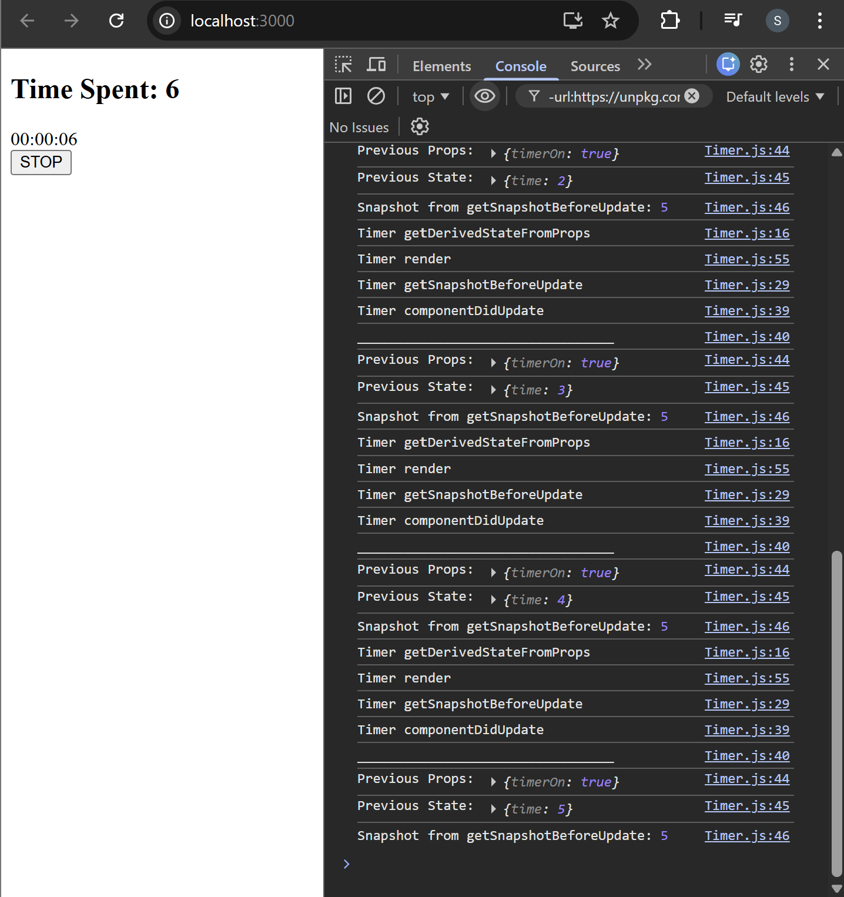

## Controlling the Timer

### Changes in Timer.js

1. Timer Initialization
   - First Version

     ```jsx
     componentDidMount() {
       this.timer = setInterval(() => {
         this.setState(prevState => ({ time: prevState.time + 1 }));
       }, 5000);
     }
     ```

     - Timer starts automatically when the component mounts.
     - Runs every 5 seconds.
     - Independent of any props.

   - Second Version

     ```jsx
     componentDidUpdate(prevProps, prevState, snapshot) {
       if (this.props.timerOn) {
         this.timer = setInterval(() => {
           this.setState(prevState => ({ time: prevState.time + 1 }));
         }, 1000);
       } else {
         clearInterval(this.timer);
       }
     }
     ```

     - Timer is controlled using the `timerOn` prop.
     - Starts when `timerOn` = `true`.
     - Stops when `timerOn` = `false`.
     - Runs every `1` second.

2. Lifecycle Method Responsibility

   | Version | Lifecycle Method Used |
   | ------- | --------------------- |
   | First   | `componentDidMount`   |
   | Second  | `componentDidUpdate`  |
   - First version: timer starts once when the component mounts.
   - Second version: timer reacts to prop changes.

3. Component Control

   | First Version         | Second Version           |
   | --------------------- | ------------------------ |
   | Self-controlled timer | Parent-controlled timer  |
   | Starts automatically  | Starts/stops using props |

4. Cleanup
   - Both versions stop the timer in:

     ```jsx
     componentWillUnmount() {
       clearInterval(this.timer);
     }
     ```

   - This prevents memory leaks when the component is removed.

#### ✅ Final Summary

- First component: Simple timer that starts automatically when the component mounts.

- Second component: Timer controlled by a `timerOn` prop, allowing the parent component to start or stop the timer dynamically.

#### 🖥️ What You See in Browser:

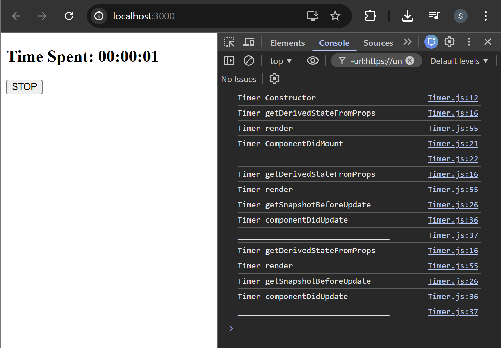
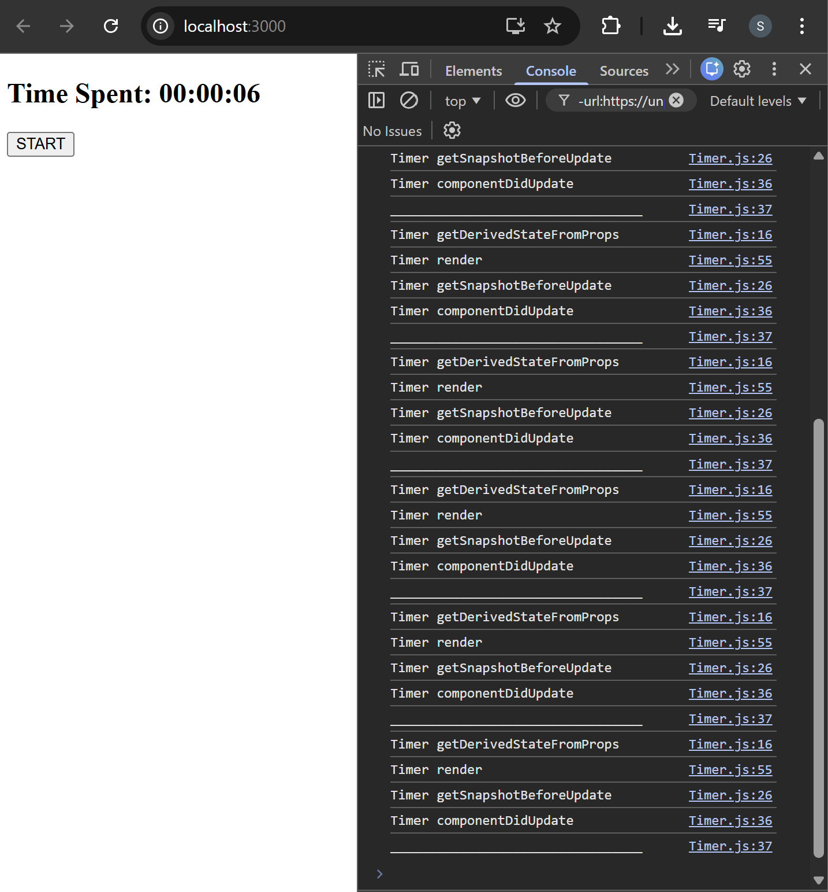

## Refreshing the Timer after 5 seconds

### Changes Made in Timer.js

Added `shouldComponentUpdate()` for Render Optimization

```diff
+ shouldComponentUpdate(nextProps, nextState) {
+   return nextProps.timerOn !== this.props.timerOn || nextState.time % 5 === 0;
+ }
```

#### Explaination

- Introduced `shouldComponentUpdate()` to control when the component should re-render.
- The component now updates only when:
  - `timerOn` prop changes (START / STOP button is clicked), or
  - `time` becomes a multiple of 5.

This reduces unnecessary renders and demonstrates how `shouldComponentUpdate()` can be used for performance optimization.

#### How it Controls Re-render

Whenever state or props change, React normally re-renders the component. Before doing that, React calls `shouldComponentUpdate()`.

- If the function returns `true` → React re-renders the component.
- If the function returns `false` → React skips the render.

#### Behavior Change

- Previously:
  - The component re-rendered every second whenever `time` changed.
- Now:
  - The timer still increments every second, but the UI re-renders only every 5 seconds.
- Example:

  ```text
  time = 1 → no render
  time = 2 → no render
  time = 3 → no render
  time = 4 → no render
  time = 5 → render
  ```

#### Purpose of This Change

- Demonstrates how `shouldComponentUpdate()` prevents unnecessary re-renders.

- Shows how React can update state frequently while limiting UI updates for better performance.

### Timer.js

```jsx
import React from "react";

export default class Timer extends React.Component {
  constructor() {
    super();
    this.state = {
      time: 0,
    };
    this.timer = null;
    console.log("Timer Constructor");
  }

  static getDerivedStateFromProps(props, state) {
    console.log("Timer getDerivedStateFromProps");
    return null;
  }

  componentDidMount() {
    console.log("Timer ComponentDidMount");
    console.log("_________________________________");
  }

  getSnapshotBeforeUpdate(prevProp, prevState) {
    console.log("Timer getSnapshotBeforeUpdate");
    return 5;
  }

  shouldComponentUpdate(nextProps, nextState) {
    //console.log("Timer shouldComponentUpdate");
    return nextProps.timerOn !== this.props.timerOn || nextState.time % 5 === 0;
  }

  componentDidUpdate(prevProps, prevState, snapshot) {
    console.log("Timer componentDidUpdate");
    console.log("_________________________________");
    if (prevProps.timerOn !== this.props.timerOn) {
      if (this.props.timerOn) {
        this.timer = setInterval(() => {
          this.setState((prevState) => ({ time: prevState.time + 1 }));
        }, 1000);
      } else {
        clearInterval(this.timer);
      }
    }
  }

  componentWillUnmount() {
    console.log("Timer componentWillUnmount");
    clearInterval(this.timer);
  }

  render() {
    console.log("Timer render");
    return (
      <div>
        <h2>
          Time Spent:{" "}
          {new Date(this.state.time * 1000).toISOString().slice(11, 19)}
        </h2>
      </div>
    );
  }
}
```

### App.js

```jsx
import React from "react";
import Timer from "./Timer";

class App extends React.Component {
  constructor() {
    super();
    this.state = {
      timerOn: false,
    };
  }

  handleTimerOn = () => {
    this.setState((prevState) => ({ timerOn: !prevState.timerOn }));
  };

  render() {
    return (
      <>
        <Timer timerOn={this.state.timerOn} />
        <button onClick={this.handleTimerOn}>
          {this.state.timerOn ? "STOP" : "START"}
        </button>
      </>
    );
  }
}

export default App;
```

#### 🖥️ What You See in Browser:

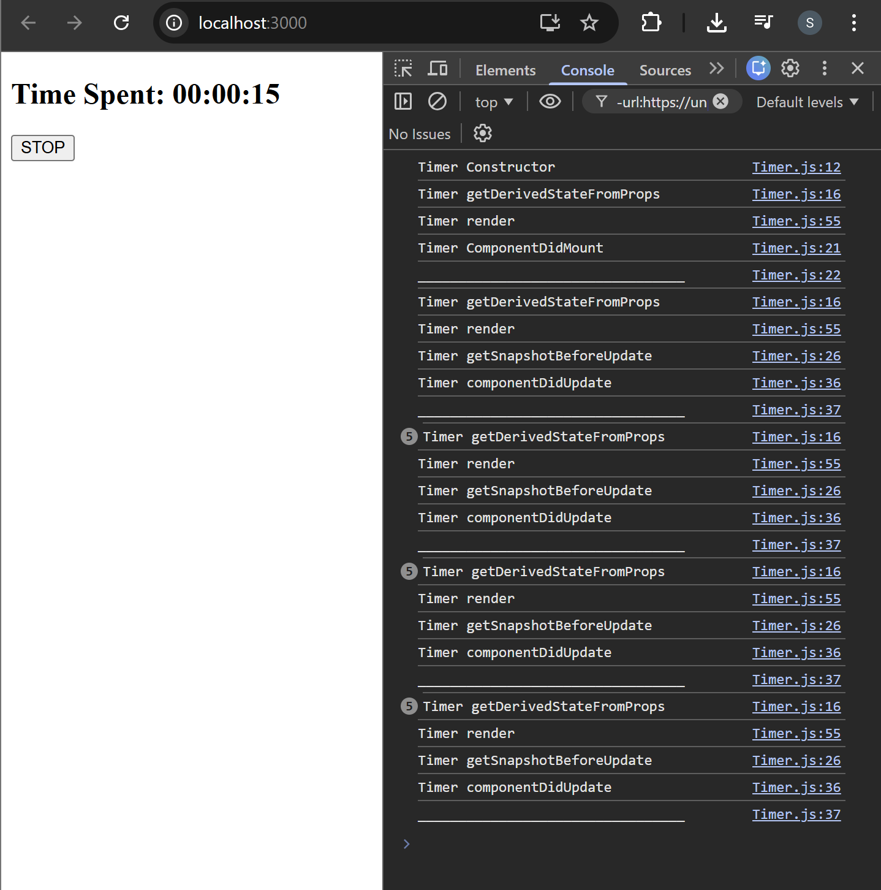

## Error-Handling Phase

These methods are called when an error occurs during rendering, in a lifecycle
method, or the constructor of any child component.

- `static getDerivedStateFromError()`
- `componentDidCatch()`

### static getDerivedStateFromError()

- This lifecycle is invoked after a descendant component has thrown an error.
- It receives the error thrown as a parameter and should return a value to
  update the state.
- `getDerivedStateFromError()` is called during the “render” phase, so side
  effects are not permitted. For those use cases, use `componentDidCatch()`
  instead.

#### Example:

Whenever an error is thrown in a descendant component, the error will be logged to
the console i.e `console.error(error)`, and an object is returned from the
`getDerivedStateFromError` method. This will be used to update the state of the
ErrorBoundary component i.e. with `hasError: true`.

```jsx
static getDerivedStateFromError(error) {
  console.log("Error:", error);
  return {
    hasError: true,
    error: error
  };
}
```

### componentDidCatch()

- This lifecycle is invoked after a descendant component has thrown an error. It
  receives two parameters:
  - `error` - The error that was thrown.
  - `info` - An object with a componentStack key containing information
    about which component threw the error.
- `componentDidCatch()` is called during the “commit” phase, so side effects are
  permitted. It should be used for things like logging errors.

### Example:

```jsx
componentDidCatch(error, info) {
  console.log("Error:", error);
  console.log("Error Info:", info);
}
```

### Error boundaries

Error boundaries are React components that catch JavaScript errors anywhere in
their child component tree, log those errors, and display a fallback UI instead of the
component tree that crashed.

### 1️⃣ New File Added — ErrorBoundary.js

```jsx
import { Component } from "react";

class ErrorBoundary extends Component {
  constructor() {
    super();
    this.state = {
      hasError: false,
      error: "",
    };
  }

  static getDerivedStateFromError(error) {
    return {
      hasError: true,
      error: error,
    };
  }

  componentDidCatch(error, info) {
    console.log("Error:", error);
    console.log("Error Info: ", info);
  }

  render() {
    if (this.state.hasError) {
      return (
        <h1>
          Something Went Wrong with {this.props.children.type.name}! <br />{" "}
          Please contact the admin.
        </h1>
      );
    }
    return this.props.children;
  }
}

export default ErrorBoundary;
```

- Created a custom Error Boundary component to handle runtime errors in child components.
- Added `getDerivedStateFromError()` to update the state when an error occurs.
- Added `componentDidCatch()` to log error details and debugging information.
- Implemented conditional rendering to display a fallback UI when an error is detected instead of crashing the entire application.

- Purpose: To prevent the whole React app from crashing when an error occurs in a component.

### 2️⃣ Changes in ComponentA.js

- Introduced an Error Scenario

  ```diff
  -fetch("https://jsonplaceholder.typicode.com/users") +
  +fetch("https://jsonplaceholder.typicode.com/user");
  ```

  - Modified the API endpoint from `users` to `user`.
  - This intentionally causes invalid data or runtime errors, which helps demonstrate how ErrorBoundary catches component errors.

- Purpose: To simulate an error so the Error Boundary can handle it.

### 3️⃣ Changes in App.js

```jsx
import React from "react";
import ComponentA from "./ComponentA";
import ComponentB from "./ComponentB";
import ErrorBoundary from "./ErrorBoundary";

class App extends React.Component {
  constructor() {
    super();
  }

  render() {
    return (
      <>
        <ErrorBoundary>
          <ComponentA />
        </ErrorBoundary>

        <ErrorBoundary>
          <ComponentB />
        </ErrorBoundary>
      </>
    );
  }
}

export default App;
```

- Wrapped Components with ErrorBoundary
  - Each component is wrapped with ErrorBoundary.
  - If an error occurs in ComponentA or ComponentB, only that component will show the fallback UI instead of crashing the entire application.

- Purpose: To isolate errors in individual components and display a fallback message.

Added a custom Error Boundary to handle runtime errors, introduced an intentional API error in ComponentA, and wrapped components in App.js with ErrorBoundary to prevent the app from crashing.

#### 🖥️ What You See in Browser:

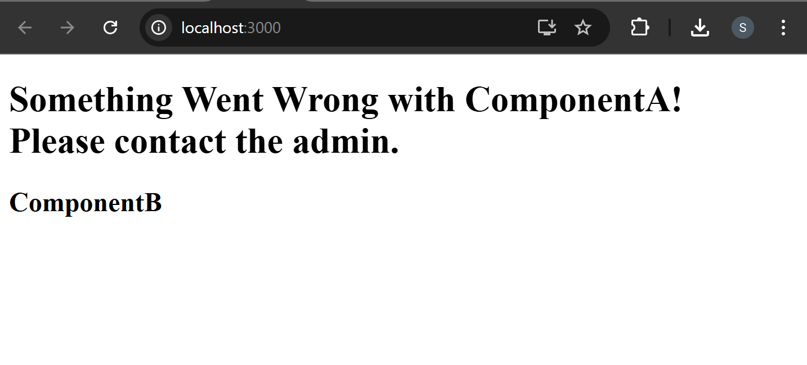

### Overview

React follows a proper path of calling all lifecycle methods, which are called in
different phases of a component’s lifetime. Starting before the component is created,
when the component is mounted, updated, or unmounted, and finally, during error
handling. They all have roles, but some are used more often than others. The only
required method in the whole lifecycle is the `render()` method.

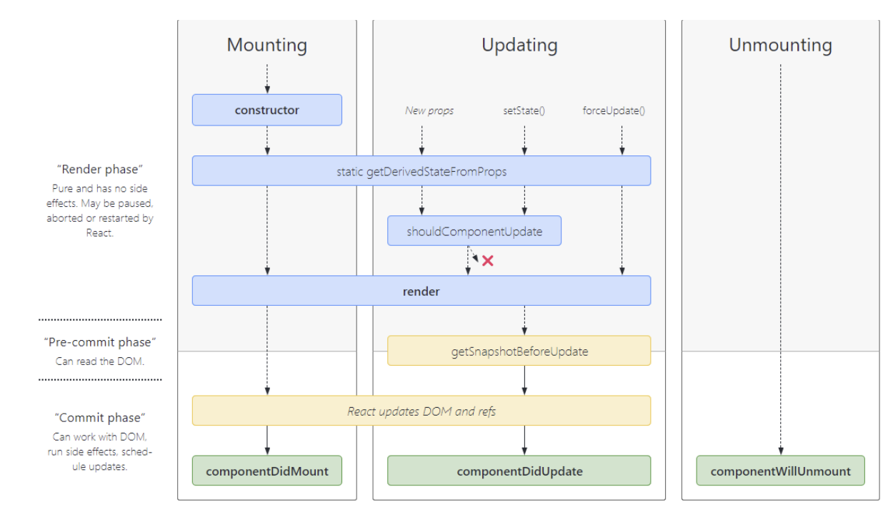

## Summarising it

Let’s summarise what we have learned in this Lecture:
- Learned about the component lifecycle.
- Learned about different phases of a lifecycle.
- Learned about lifecycle methods in different phases.
- Learned about the order in which lifecycle methods are called during Execution.
- Learned about how and where to perform side effects.

### Some References:

[Component Lifecycle](https://www.geeksforgeeks.org/reactjs/reactjs-lifecycle-components/)

[React Lifecycle Methods](https://www.devcript.com/react-lifecycle-methods/)
