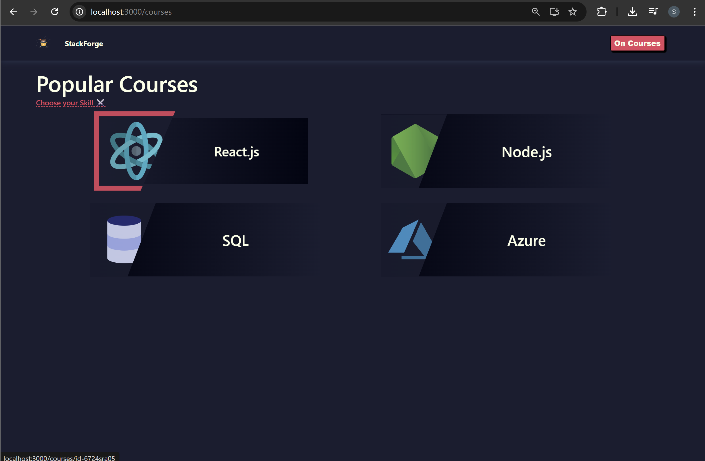
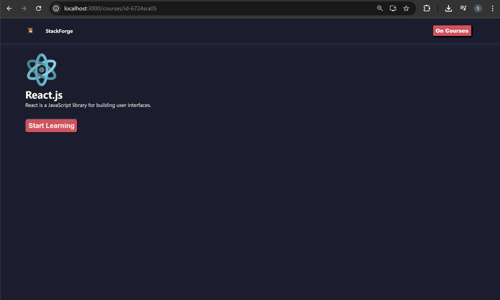
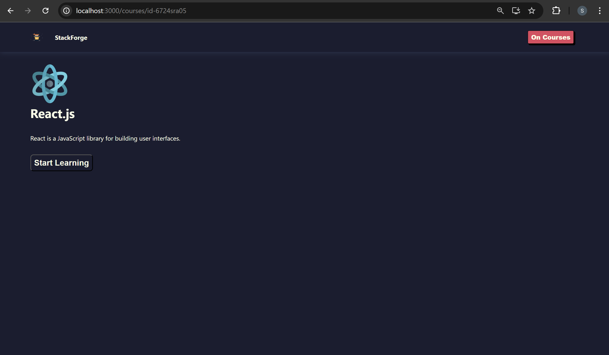
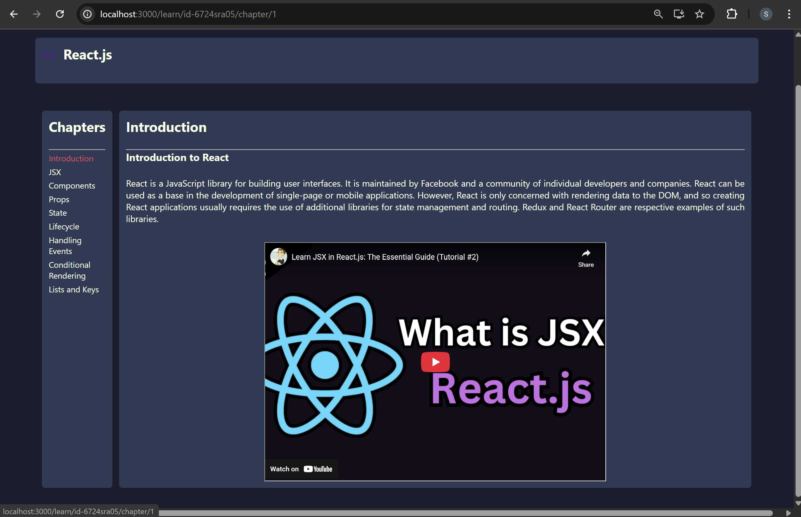
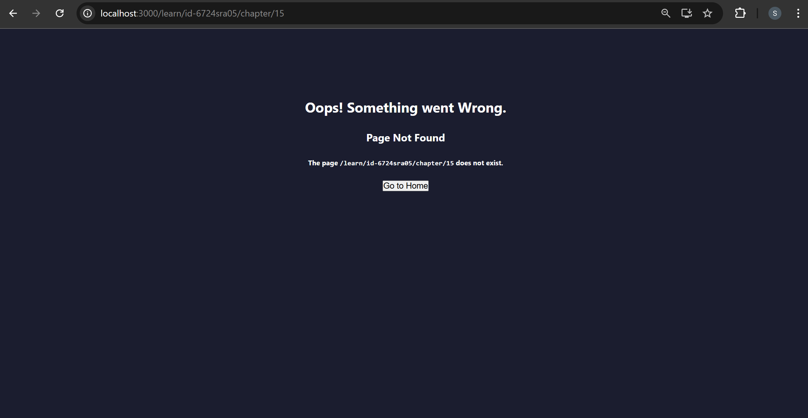

# E-Learning App

## 📁 Project Structure

```
E-Learning-App
│
├── node_modules
├── public
│
├── src
│   │
│   ├── components            # Reusable UI components
│   │   ├── card
│   │   ├── error-toast
│   │   ├── loader
│   │   └── nav
│   │
│   ├── context               # React context for global state
│   │   └── Theme.context.js
│   │
│   ├── data                  # Static data used in the app
│   │   └── courses.json
│   │
│   ├── pages                 # Application pages
│   │   ├── app
│   │   │   ├── chapter
│   │   │   ├── courses
│   │   │   ├── details
│   │   │   ├── hero
│   │   │   └── learn
│   │   │
│   │   └── misc
│   │       └── Page404       # Page displayed for unknown routes
│   │
│   ├── App.js                # Root component with routing
│   ├── index.css             # Global styles
│   └── index.js              # Application entry point
│
├── .gitignore
├── package.json              # Dependencies and scripts
├── package-lock.json
└── README.md
```

#### 🖥️ What You See in Browser:


## Creating Routes

Routing was added to enable navigation between different pages instead of rendering all components in `App` directly.

- Before: `Nav`, `Hero`, and `Courses` were rendered directly inside `App`, so all components appeared on the same page.
- After: Introduced routing using `createBrowserRouter` and `RouterProvider` from `react-router-dom`.
- Defined route configuration where `Nav` acts as a **layout component** and child routes (`Hero`, `Courses`) render inside it.
- Added `Outlet` in `Nav` to display the matched child route dynamically.
- Now:
  - `/` → renders Hero
  - `/courses` → renders Courses

Result: The application now supports **structured navigation with nested routes**.

#### 🖥️ What You See in Browser:


## Dynamic Routes

Dynamic routing was implemented to show course-specific details based on the selected course.

- Added a **dynamic route** `:courseId` under the `/courses` path to load the Details page for each course.
- Wrapped each course Card with a `Link` so clicking a course navigates to `/courses/:courseId`.
- Used the `useParams` hook to retrieve the `courseId` from the URL.
- Matched the extracted `courseId` with the corresponding course in `courses.json`.
- Displayed the selected course’s **image, title, and description** dynamically on the Details page.

Result:
Each course now opens a **unique details page using a dynamic URL**.

#### 🖥️ What You See in Browser:

Click “Go To Courses” → Select the React course → View the course details.






## Nested Routes

The Learn page implements nested routing to display course chapters dynamically while sharing course data between components.

- **Learn Page**: Uses `useParams()` to get `courseId`, fetches the course from `courses.json`, displays the course title and chapter list, and renders chapter content using `<Outlet />`.
- **Chapter Component**: Uses `useParams()` to get `chapterId` and `useOutletContext()` to access course data passed from the Learn page, then displays the selected chapter details and video.
- `useOutletContext` **Hook**: Allows the parent route (`Learn`) to pass course data to nested child routes (`Chapter`) without prop drilling.
- **Navigation**: Uses `Link` to move between pages like Courses → Details → Learn → Chapter.
- **Error Handling**: A custom `Page404` component is used with `errorElement` to show a friendly error message and redirect users to the home page when an invalid route is accessed.

### useOutletContext Hook

`useOutletContext` is used in **nested routing to share data from a parent route component to its child routes**.

- It allows the parent component rendering `<Outlet />` to pass data to nested components.
- Helps avoid **prop drilling** when multiple nested routes need the same data.
- In this project, the **Learn page passes course data** through `<Outlet context={course} />`.
- The **Chapter component retrieves that data** using `useOutletContext()` to display chapter details.

Result: Child routes can easily access parent route data while using **React Router nested routing**.

#### 🖥️ What You See in Browser:

Click “Start Learning” → Select the Introduction chapter → View the chapter title, description, detailed explanation, and video lesson.




Enter an invalid chapter URL (e.g., /chapter/15) → You will be redirected to the custom Error Page → Click “Go to Home” to return to the Home page.



---
