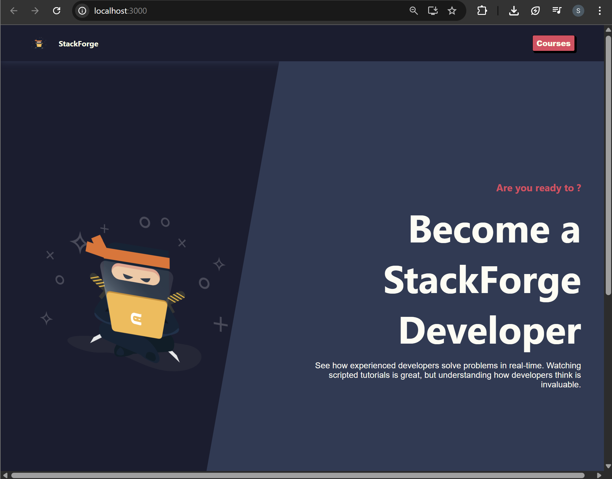
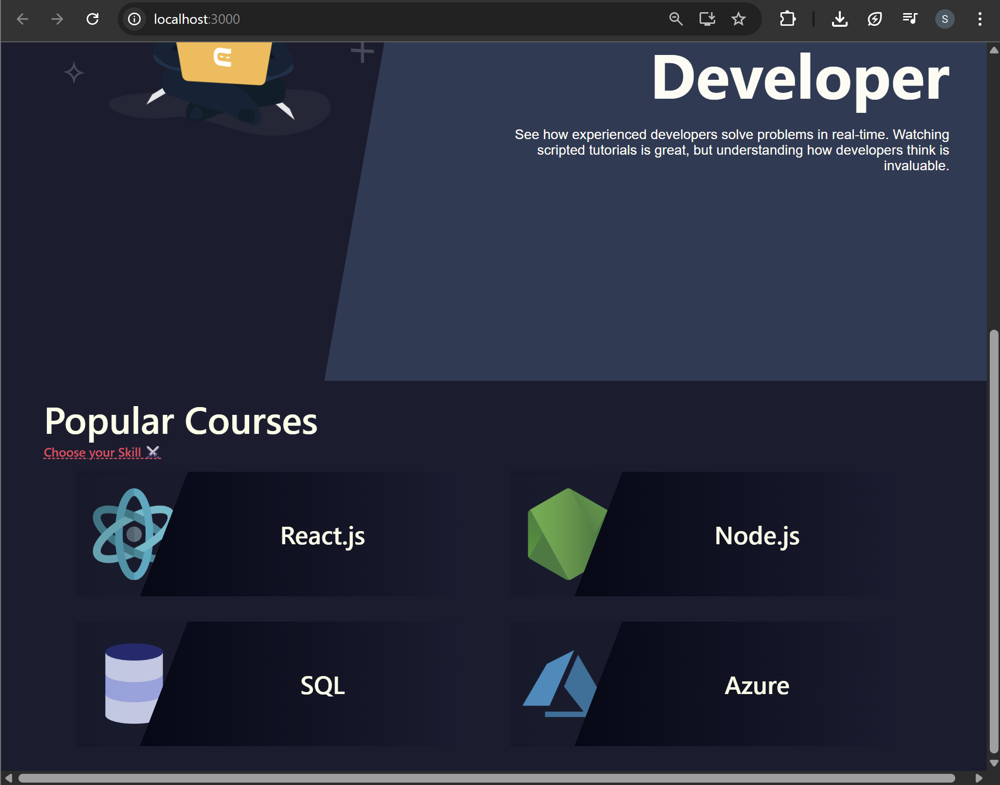
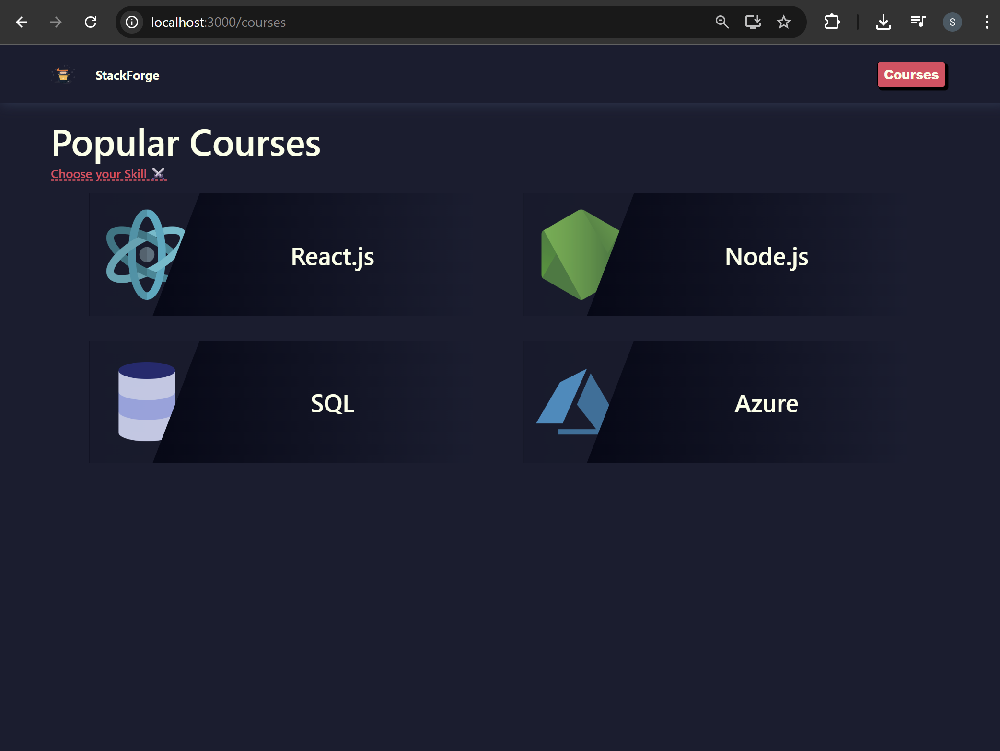

# E-Learning App

## 📁 Project Structure

```
E-Learning-App
│
├── node_modules
├── public
│
├── src
│   │
│   ├── components            # Reusable UI components
│   │   ├── card
│   │   ├── error-toast
│   │   ├── loader
│   │   └── nav
│   │
│   ├── context               # React context for global state
│   │   └── Theme.context.js
│   │
│   ├── data                  # Static data used in the app
│   │   └── courses.json
│   │
│   ├── pages                 # Application pages
│   │   ├── app
│   │   │   ├── chapter
│   │   │   ├── courses
│   │   │   ├── details
│   │   │   ├── hero
│   │   │   └── learn
│   │   │
│   │   └── misc
│   │       └── Page404       # Page displayed for unknown routes
│   │
│   ├── App.js                # Root component with routing
│   ├── index.css             # Global styles
│   └── index.js              # Application entry point
│
├── .gitignore
├── package.json              # Dependencies and scripts
├── package-lock.json
└── README.md
```

#### 🖥️ What You See in Browser:





## Creating Routes

Routing was added to enable navigation between different pages instead of rendering all components in `App` directly.

- Before: `Nav`, `Hero`, and `Courses` were rendered directly inside `App`, so all components appeared on the same page.
- After: Introduced routing using `createBrowserRouter` and `RouterProvider` from `react-router-dom`.
- Defined route configuration where `Nav` acts as a **layout component** and child routes (`Hero`, `Courses`) render inside it.
- Added `Outlet` in `Nav` to display the matched child route dynamically.
- Now:
  - `/` → renders Hero
  - `/courses` → renders Courses

Result: The application now supports **structured navigation with nested routes**.

#### 🖥️ What You See in Browser:



