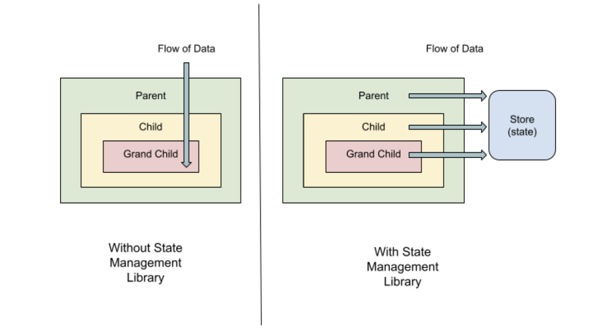

# Getting Started with Redux

## Issues with Prop Drilling

Prop drilling is a common problem in React applications where data is passed down
through multiple layers of components via props. Prop drilling can lead to several
issues:

1. **Storage Issue**: When large amounts of data is passed down through many
   layers of components via props, It can lead to issues with data storage and
   retrieval, as well as code maintainability and performance.
2. **Predictability of data**: Prop drilling can also make it difficult to predict where
   data comes from and how it will be used. It can be difficult to keep track of
   where the data is being used and where it is being modified. This can lead to
   issues with data consistency and can make it difficult to debug issues.
3. **Flow of Data**: Prop drilling can also make it difficult to pass data back up the
   component hierarchy.
4. **Data from multiple sources**: In complex applications, data may come from
   multiple sources, such as APIs or external services. Prop drilling can make it
   difficult to manage data and adds complexity to the application.

## State Management

State management is a way to facilitate communication and sharing of data across
components. State management libraries are tools used to manage and organize the
state of an application predictably and efficiently. These libraries provide a set of
rules and techniques for storing, retrieving, and updating application states.
Advantages of using state management libraries are:

1. **Centralized state**: State management libraries typically use a centralized
   store to manage the application state. This store is often implemented as a
   JavaScript object that can be accessed and modified by components
   throughout the application.
2. **Unidirectional data flow**: Data flows in a single direction in state
   management libraries, from the store to components. Components can
   update the store, but they cannot update other components directly.
3. **Predictable state updates**: State management libraries provide a set of rules
   for updating the state, which helps to ensure that state changes are
   predictable and consistent across the application.
4. **Immutable state**: Many state management libraries encourage the use of
   immutable data structures, which can help to prevent unintended side effects
   and make state updates more predictable.

   

## Context API

Context API is a feature in React that provides a way to pass data through the
component tree without having to pass props down manually at every level. It allows
you to create a global state that can be accessed and modified by any component in
the tree without the need for prop drilling. Context API can be useful for managing
states in cases where a small amount of data needs to be shared across multiple
components, but is not ideal for larger and more complex state management needs.

### Limitations

- **Overuse of context**: Overusing context can lead to a complex and
  difficult-to-manage application. Context should be used sparingly and only for
  data that needs to be shared across multiple components.
- **Designed for static content**: Context is designed for passing static data
  through the component tree, so it may not be the best choice for managing a
  dynamic state that changes frequently.
- **Re-renders the Context Consumers**: Whenever the value of the context
  changes, all the components that consume that context will re-render. This
  can lead to performance issues if the context value changes frequently.
  - **Performance**: Context can cause performance issues if the context value is
    deeply nested and needs to be updated frequently.
- **Difficult to debug**: When an issue arises, debugging can be difficult since the
  data flow is not always clear. It can be difficult to trace where data is being
  passed and where it is being modified.
  - **Difficult to extend and scale**: As an application grows in size and
    complexity, context can become difficult to manage and maintain.

## Pure Functions

A pure function is a function that always returns the same output given the
same input and has no side effects (i.e., it doesn't modify any variables
outside of its scope, it doesn't mutate its input arguments, and it doesn't have
any I/O operations such as reading from or writing to a file or a database).
Pure functions are predictable and easier to reason about since they don't
have any hidden dependencies or side effects. Pure functions can be
composed together to create more complex functions or pipelines of functions
since their input and output types are well-defined and consistent.

```javascript
function add(a, b) {
  // A pure function adding two integers
  return a + b;
}

function divide(a, b) {
  // Pure function to divide two integers
  return a / b;
}

function multi(a, b) {
  // Pure function to multiply two integers
  return a * b;
}

console.log(
  // Calling all the pure functions
  add(2, 5),
  multi(3, 2),
  divide(20, 5),
);
```

All three functions in the above code are pure functions. Their return value
depends on the input arguments, they don't mutate any non-local state, and
they have no side effects (we will discuss side effects further in this article).
Examples of pure functions in JavaScript include Math.abs(), parseInt(),
JSON.stringify(), and many others.

Pure functions can be used with functional programming techniques such as
higher-order functions, currying, and partial application. JavaScript libraries
and frameworks such as Redux, Ramda, and Lodash emphasize using pure
functions and functional programming principles.

### Impure Functions

An impure function is a function that either modifies variables outside of its scope,
mutates its input arguments, has I/O operations such as reading from or writing to a
file or a database, or has other side effects that are not purely computational. Impure
functions can have hidden dependencies and side effects, which can make them
harder to reason about and debug.

```javascript
const message = "Hi! ";

function myMessage(value) {
  return `${message}${value}`;
}

console.log(myMessage("Shivani"));
```

In the above code, the result the function returns is dependent on the variable that is
not declared inside the function. That's why this is an impure function.
Examples of impure functions in JavaScript include console.log(), Math.random(),
and Date.now(), Array.sort(), Array.splice(), and many others.

Impure functions can be necessary for tasks such as reading and writing to a file or a
database, generating random numbers, or interacting with the user interface.
However, it's important to minimize impure functions and keep them separate from
pure functions as much as possible, to maintain a clear separation of concerns and
avoid unexpected interactions or bugs. Pure functions can be composed together to
create complex logic and pipelines of functions, whereas impure functions can only
be used in a more limited and isolated way.

JavaScript libraries and frameworks such as React and Angular provide mechanisms
for managing the state of an application and minimizing the use of impure functions
in the user interface.

## Currying in Javascript

Currying is defined as changing a function having multiple arguments into a
sequence of functions with a single argument.
When currying a function in JavaScript, closures are used to retain the values of
previous arguments that have been passed to the curried function. This is because
each time a new argument is passed, a new function is returned that has access to
the previous arguments.

#### For Example:

```javascript
function sum(x) {
  return function (y) {
    return function (z) {
      return x + y + z;
    };
  };
}

const sumXResult = sum(2);
const sumYResult = sumXResult(4);
const sumZResult = sumYResult(6);

console.log(sumZResult);
```

`sum` is a curried function that takes one argument `x` and returns another function that
takes one argument `y`, which returns a third function that takes one argument `z`. The
final function returns the sum of `x`, `y`, and `z`.

- When `sum(2)` is called, it returns a new function that takes one argument y.
  This returned function is assigned to `sumXResult`.
- When `sumXResult(4)` is called, it returns a new function that takes one
  argument z. This returned function is assigned to `sumYResult`.
- When `sumYResult(6)` is called, the final function is invoked, and it returns the
  sum of 2, 4, and 6, which is 12.

  Finally, the result of `sumZResult` is printed to the console, which outputs 12.

### Benefits of Currying

1. **Reusability**: Currying allows you to create reusable functions by breaking
   down a function that takes multiple arguments into smaller functions that can
   be reused.
2. **Readability**: Currying can improve the readability of the code by reducing the
   number of arguments passed to a function.
3. **Function Composition**: Currying is useful for function composition, where the
   output of one function is the input to another function. It makes it easier to
   chain multiple functions together and create new functions that perform
   complex operations.

### Code Snippet (currying.js)

```javascript
/*
  ================================
  NORMAL FUNCTION (NO CURRYING)
  ================================
  - Takes all arguments at once
  - Simple and straightforward
  - Example: sum(10, 20, 30)
*/

// function sum(x, y, z) {
//   return x + y + z;
// }

// const result = sum(10, 20, 30);
// console.log(result); // 60

/*
  ================================
  CURRYING IN JAVASCRIPT
  ================================
  - Breaks a function into multiple nested functions
  - Each function takes ONE argument
  - Uses closures to remember previous values
  - Example: sumX(10)(20)(30)
*/

function sumX(x) {
  // First function receives x
  return function sumY(y) {
    // Second function receives y and remembers x
    return function sumZ(z) {
      // Third function receives z and has access to x and y
      return x + y + z;
    };
  };
}

/*
  ================================
  STEP-BY-STEP EXECUTION
  ================================
*/

const resultSumX = sumX(10);
console.log(resultSumX);
// Output: [Function: sumY]
// Explanation: sumX returns the next function (sumY)

const resultSumY = resultSumX(20);
console.log(resultSumY);
// Output: [Function: sumZ]
// Explanation: sumY returns the next function (sumZ)

const result = resultSumY(30);
console.log(result);
// Output: 60
// Explanation: sumZ calculates x + y + z

/*
  ================================
  SHORT CURRIED VERSION (MODERN JS)
  ================================
  - Using arrow functions
  - Cleaner and commonly used in React/Redux
*/

const sum = (x) => (y) => (z) => x + y + z;

console.log(sum(10)(20)(30)); // 60

/*
  ================================
  KEY DIFFERENCE
  ================================
  Normal Function  → sum(10, 20, 30)
  Curried Function → sum(10)(20)(30)
*/
```
