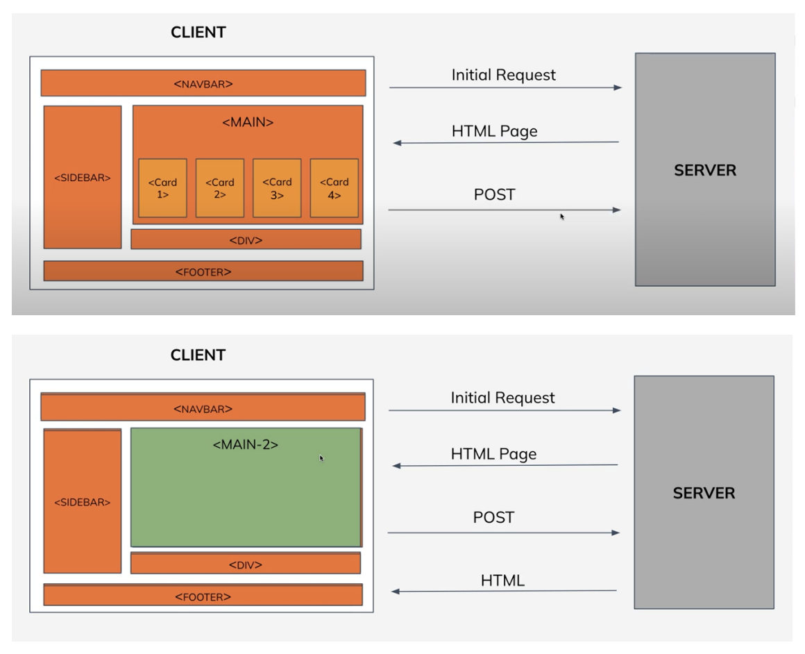
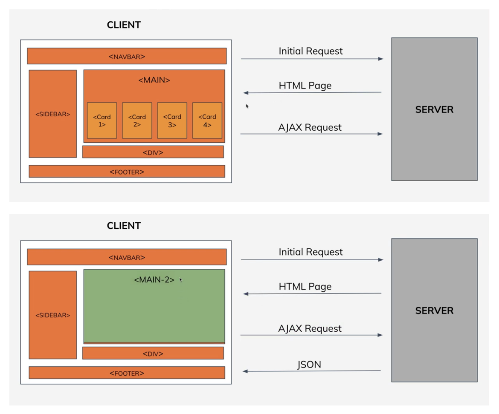

# INTRODUCTION TO REACTJS

## What is React?

React is a JavaScript library for building user interfaces. JavaScript libraries like
React are collections of prewritten code snippets that can be used and reused to
perform common JavaScript functions, helps in faster development with fewer
vulnerability to have errors. UI(User Interface) is built from small units like buttons,
text, and images. Everything on the screen can be broken down into components,
from websites to phone apps. React lets you combine them into reusable, nestable
components.

### History of React

- React was originally created by Jordan Walke, a software engineer at
  Facebook. But today, it is maintained by Meta(formerly Facebook) and a
  community of over a thousand open-source developers.
- It was first deployed on Facebook's News Feed in 2011 and later on
  Instagram in 2012. It was open-sourced at JSConf US in May 2013.
- Some of the major companies that currently use React include Netflix,
  Facebook, Instagram, Airbnb, Reddit, Dropbox, and Postmates.
- Current(Latest) version of React is v18.

### Why React?

1. **React is Composable**: Components are the building blocks of any React
   application, and a single app usually consists of multiple components. These
   components have their logic and controls, and they can be reused throughout
   the application, which in turn dramatically reduces the application’s
   development time.
2. **Faster performance**: React uses Virtual DOM, thereby creating web
   applications faster. Virtual DOM compares the components’ previous states and updates only the items in the Real DOM that were changed, instead of
   updating all of the components again, as conventional web applications do.
3. **React is Declarative**: React is easy to learn, mostly combining basic HTML
   and JavaScript concepts with some beneficial additions. Still, as is the case
   with other tools and frameworks, you have to spend some time to get a proper
   understanding of React’s library.
4. **Dedicated tools for easy debugging**: Facebook has released a Chrome
   extension that can be used to debug React applications. This makes the
   process of debugging React web applications faster and easier.

### Multi-Page Applications vs Single-Page Applications

**Multi-Page Application (MPA)** is a traditional implementation of a web application
that reloads the whole page when a user interacts with the app.

**Single-Page Application (SPA)** is a web application that loads a single document(HTML) and updates the parts of the document using APIs(AJAX).

### Difference between MPA and SPA

#### Multi-Page Application:

1. In MPAs, content is constantly loaded, which increases the load on your server. This can adversely affect
   web page speed and overall system performance.
2. Multi-page applications have more features than single-page applications. Therefore, more effort and resources are required to make them. Development time increases in proportion to the number of pages created and the activity to be executed.
3. Multi-page applications are more SEO-friendly than single-page applications. Their content is constantly updated. In addition, they have many pages for adding various keywords, images, and meta tags.
4. It is difficult to maintain and is not budget-friendly.
5. It always requires an internet connection as it does not load all the data at once.

#### Single-Page Application:

1. SPAs provide increased content load speed because they do not have many pages and load content at once.
2. Single-page app development is easy because you need to create fewer pages, create less functionality, and test and display less content.
3. Single-page app developers have trouble indexing a website properly Multi-page applications are more SEO-friendly than single-page and achieve high search rankings.
4. It is easy to maintain at a low cost.
5. It has the ability to work offline if there are some problems with the internet connection, as it loads all the data at once.
