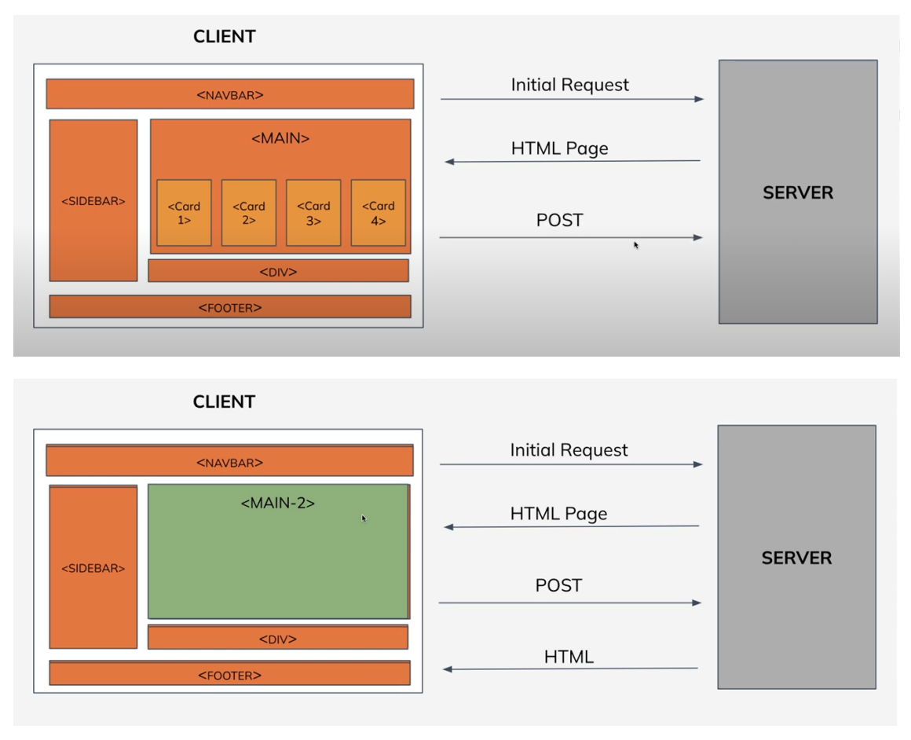

# INTRODUCTION TO REACTJS

## What is React?

React is a JavaScript library for building user interfaces. JavaScript libraries like
React are collections of prewritten code snippets that can be used and reused to
perform common JavaScript functions, helps in faster development with fewer
vulnerability to have errors. UI(User Interface) is built from small units like buttons,
text, and images. Everything on the screen can be broken down into components,
from websites to phone apps. React lets you combine them into reusable, nestable
components.

### History of React

- React was originally created by Jordan Walke, a software engineer at
  Facebook. But today, it is maintained by Meta(formerly Facebook) and a
  community of over a thousand open-source developers.
- It was first deployed on Facebook's News Feed in 2011 and later on
  Instagram in 2012. It was open-sourced at JSConf US in May 2013.
- Some of the major companies that currently use React include Netflix,
  Facebook, Instagram, Airbnb, Reddit, Dropbox, and Postmates.
- Current(Latest) version of React is v18.

### Why React?

1. **React is Composable**: Components are the building blocks of any React
   application, and a single app usually consists of multiple components. These
   components have their logic and controls, and they can be reused throughout
   the application, which in turn dramatically reduces the application’s
   development time.
2. **Faster performance**: React uses Virtual DOM, thereby creating web
   applications faster. Virtual DOM compares the components’ previous states and updates only the items in the Real DOM that were changed, instead of
   updating all of the components again, as conventional web applications do.
3. **React is Declarative**: React is easy to learn, mostly combining basic HTML
   and JavaScript concepts with some beneficial additions. Still, as is the case
   with other tools and frameworks, you have to spend some time to get a proper
   understanding of React’s library.
4. **Dedicated tools for easy debugging**: Facebook has released a Chrome
   extension that can be used to debug React applications. This makes the
   process of debugging React web applications faster and easier.

### Multi-Page Applications vs Single-Page Applications

**Multi-Page Application (MPA)** is a traditional implementation of a web application
that reloads the whole page when a user interacts with the app.



**Single-Page Application (SPA)** is a web application that loads a single document(HTML) and updates the parts of the document using APIs(AJAX).


### Difference between MPA and SPA

#### Multi-Page Application:

1. In MPAs, content is constantly loaded, which increases the load on your server. This can adversely affect
   web page speed and overall system performance.
2. Multi-page applications have more features than single-page applications. Therefore, more effort and resources are required to make them. Development time increases in proportion to the number of pages created and the activity to be executed.
3. Multi-page applications are more SEO-friendly than single-page applications. Their content is constantly updated. In addition, they have many pages for adding various keywords, images, and meta tags.
4. It is difficult to maintain and is not budget-friendly.
5. It always requires an internet connection as it does not load all the data at once.

#### Single-Page Application:

1. SPAs provide increased content load speed because they do not have many pages and load content at once.
2. Single-page app development is easy because you need to create fewer pages, create less functionality, and test and display less content.
3. Single-page app developers have trouble indexing a website properly Multi-page applications are more SEO-friendly than single-page and achieve high search rankings.
4. It is easy to maintain at a low cost.
5. It has the ability to work offline if there are some problems with the internet connection, as it loads all the data at once.

## How to include Javascript in HTML?

You can include JavaScript in your HTML in two ways:

1. Embedding code in your HTML file using `<script>` tag
2. Including it as a link to an external file.

### Embedding Code

You can add JavaScript code in an HTML document by employing the dedicated
HTML tag `<script`> that wraps around JavaScript code. The `<script>` tag can be
placed in the `<head>` section of your HTML or in the `<body>` section, depending on
when you want the JavaScript to load.

```html
<!DOCTYPE html>
<html>
  <head>
    <title>Document</title>
    <script>
      document.write("Welcome to the session");
    </script>
  </head>
  <body>
    <h1>Hello</h1>
  </body>
</html>
```

### External File

To include an external JavaScript file, we can use the script tag with the attribute src.
The value for the src attribute should be the path to your JavaScript file. This script
tag should be included between your HTML document's `<head>` tags.When
JavaScript files are cached, pages load more quickly.

```html
<script type="text/javascript" src="path-to-javascript-file.js"></script>
```

## How React is declarative?

Declarative programming is when you say what you want to do, and describe the
final state of the desired UI. Imperative programming is when you say how to get
what you want and provide step-by-step DOM mutations until you reach the desired
UI. Javascript is an imperative Language whereas React is a declarative language.

For eg: For the following output, You need to add an element to the DOM
imperatively using JavaScript. As your app gets bigger, with more DOM elements you
being created, this can become hard to maintain. But, React it performs all of the
JavaScript/DOM steps as per the declared code to get us to our desired result. It
abstracts away all the nuts and bolts of how the DOM renders these elements. In
your code you tell your page "Look like this" and you'll get that result. Declarative
programming is much easier to read and figure out what is going on in your code.
That makes it easier to debug and easier for other devs to work on.

### Javascript CODE

#### index.html

```html
<!DOCTYPE html>
<html>
  <head>
    <title>HTML</title>
  </head>
  <body>
    <div id="root"></div>

    <script src="script.js" type="text/javascript"></script>
  </body>
</html>
```

#### script.js

```javascript
const div = document.createElement("div");

const heading = document.createElement("h1");
heading.textContent = "Hello";
heading.className = "header";

const para = document.createElement("p");
para.textContent = "Welcome to the session";
para.className = "para";

const btn = document.createElement("button");
btn.textContent = "Click";
btn.className = "btn";

div.append(heading);
div.append(para);
div.append(btn);

document.getElementById("root").append(div);
```

### React CODE

#### index.html

```html
<!DOCTYPE html>
<html>
  <head>
    <title>Document</title>

    <script
      crossorigin
      src="https://unpkg.com/react@18/umd/react.development.js"
    ></script>
    <script
      crossorigin
      src="https://unpkg.com/react-dom@18/umd/react-dom.development.js"
    ></script>
    <script src="https://unpkg.com/@babel/standalone/babel.min.js"></script>
  </head>
  <body>
    <div id="root"></div>

    <script src="scripts.js" type="text/babel"></script>
  </body>
</html>
```

#### script.js

```javascript
const heading = React.createElement("h1", null, "Hello");

const para = React.createElement(
  "p",
  { className: "para" },
  "Welcome to the session"
);

const btn = React.createElement("button", { className: "btn" }, "Click");

const div = React.createElement("div", {
  className: "App",
  children: [heading, para, btn],
});

ReactDOM.createRoot(document.getElementById("root")).render(div);
```

#### script.js (Using JSX)

```javascript
const header = (
  <div>
    <h1 className="header">Hello</h1>
    <p className="para">Welcome to the session</p>
    <button className="btn">Click</button>
  </div>
);

ReactDOM.createRoot(document.getElementById("root")).render(header);
```

## Creating First React Element

To include React in a simple web page, CDN(Content Delivery Network) can be
used. You need to create a new HTML file and include the CDN links of the following:

**React**: React-script-tag is an npm package that provides a React `<script>` tag which
supports universal rendering. With this library, we can create react components, that
is, a plain javascript object with some properties.

```html
<script
  crossorigin
  src="https://unpkg.com/react@18/umd/react.development.js"
></script>
```

**React-DOM**: React-DOM basically converts the javascript object returned by React
script tag to HTML nodes that can be rendered in the browser.

```html
<script
  crossorigin
  src="https://unpkg.com/react-dom@18/umd/react-dom.development.js"
></script>
```

**Babel**: JSX files are not understandable by the browser. It is a tool that converts JSX
files to simple javascript code that the browser understands. Moreover, it also
converts ES6 and ES5 code to javascript code.

```html
<script src="https://unpkg.com/@babel/standalone/babel.min.js"></script>
```

Now, we are ready to use React library in our webpage. So, introduce a div tag with
an id “root” in the body. We call this a “root” DOM node because everything inside it
will be managed by React DOM.

```html
<div id="root" type="text/babel"></div>
```

Now, create a script section at the end of the document. Then, pass the DOM
element to `ReactDOM.createRoot()`, and then to `root.render()` to render an
HTML element dynamically.

```html
<script language="JavaScript">
  const heading = React.createElement("h1", null, "Hello");
  ReactDOM.createRoot(document.getElementById("root")).render(heading);
</script>
```

After that, use the **live server** extension of VS Code to serve the webpage and see
the output.

### React.createElement

A React element describes what the real Document Object Model (DOM) element
should look like. React.js uses virtual DOM to design the UI and interact with the
browser. It is made up of react elements that seem similar to HTML elements but
are JavaScript objects. In simple words, react elements are the instructions for how
the browser DOM should be created. We can create the react elements using the
below syntax by embedding HTML elements in JavaScript to display the content on
the screen.

`React.createElement(type,{props},children);`

It takes three arguments. They are:

- **type**: specifies the type of the HTML element (h1, p, button).
- **props**: specifies properties of the object ({style:{size:10px}} or event handlers,
  classNames,etc).
- **children**: anything that needs to be displayed on the screen.

### React.createRoot

It creates a React root for the supplied container and returns the root. The root can
be used to render a React element into the DOM with render:

`const root = createRoot(container);`

`root.render(element);`

### Root.render

React elements are immutable. Once you create an element, you can’t change its
children or attributes. The only way to update the UI is to create a new element, and
pass it to root.render().

`root.render(element, container element);`

It takes two arguments:

- element: The element that needs to be rendered in the DOM.
- container element: It specifies where to render the element in the DOM.

#### Note:

For running your React.js project, there are two modes available –
development and Reactjs build production. During the development phase, we will
be running our code locally using the development mode where React provides us
with many helpful warnings and tools for easily detecting and fixing problems in our
application code and eliminating potential bugs. But in production mode, the
warning messages and other features present in development mode for debugging
are suppressed. It minifies your code, optimizes assets, and produces lighter-weight
source maps. As a result, the bundle size is drastically reduced, improving page load
time. React recommends utilizing the production mode while deploying the
application.

## Understanding Real DOM and Virtual DOM

### Real DOM

DOM stands for “Document Object Model”. The DOM in simple words represents the
UI of your application. Every time there is a change in the state of your application
UI, the updated element and its children have to be re-rendered to represent that
change. But frequently manipulating the DOM affects performance, making it slow.
Therefore, the more UI components you have, the more expensive the DOM updates
could be, since they need to be re-rendered for every DOM update.

### Virtual DOM

The virtual DOM is only a virtual representation of the DOM. Every time the state of
our application changes, the virtual DOM gets updated instead of the real DOM. If
the state of any of these elements changes, a new virtual DOM tree is created. This
tree is then compared or “diffed” from the previous virtual DOM tree. Once this is
done, the virtual DOM calculates the best possible method to make these changes to
the real DOM. This ensures that there are minimal operations on the real DOM.
Hence, reducing the performance cost of updating the real DOM.


React compares the Virtual DOM with Real DOM. It finds out the changed nodes and
updates only the changed nodes in Real DOM leaving the rest nodes as it is. This
process is called **Reconciliation**. Diffing algorithm is a technique of reconciliation
that is used by React.

## JSX

JSX, or JavaScript XML, is an extension to the JavaScript language syntax. Similar
in appearance to HTML, JSX provides a way to structure component rendering using
syntax familiar to many developers. React components are typically written using
JSX, although they do not have to be (components may also be written in pure JavaScript). JSX is similar to another extension syntax created by Facebook for PHP
called XHP.

- **Why is a class not used as an attribute in JSX?** We cannot use class
  attributes in script tags. Instead of this, we use it because the class is a
  reserved keyword in javascript.
- **Using javascript variables in JSX:** We can use variable names instead of
  static text by creating variables. We can add them in a JSX file using
  {variable_name}.

For Example:

```javascript
const name = "Shiv";

const header = () => (
  <>
    <h1 className="header">Hello {name}</h1>
    <p className="para">Welcome to the session</p>
    <button className="btn">Click</button>
  </>
);
```

- Declares a constant variable name with the value "Shiv".
- Defines a functional React component header using an arrow function.
- Returns a JSX Fragment (`<>...</>`) containing:
  - An `<h1>` that displays “Hello Shiv” using `{name}` interpolation.
  - A `<p>` with a welcome message.
  - A `<button>` with the label “Click”.
- CSS classes (`header`, `para`, `btn`) are assigned for styling.

## Babel: Javascript Compiler

React uses JSX syntax and JSX files are not understandable by the browser. Babel
is a transpiler i.e. it converts the JSX to vanilla JavaScript. It can also convert the
latest version of JavaScript code into the one that the browser understands. [Link](https://babeljs.io/)


#### React JSX Example

```javascript
/* REACT with JSX */
//const jsxHeading = (<h1 className="head">Hello, Shiv !</h1>);
const jsxHeading = <h1 className="head">Hello, Shiv !</h1>;
ReactDOM.createRoot(document.getElementById("root")).render(jsxHeading);
```


## React Fragments

In React, when a component returns multiple elements, we must wrap them in a
container element like a div for the code to work. While this is fine, it may however
cause unintended issues in our components. React fragments serve as a cleaner
alternative to using unnecessary divs in our code. Fragments let you group a list of
children without adding extra nodes to the DOM.

#### Here is a code snippet for your reference:

```javascript
const header = () => (
  <React.Fragment>
    <h1 className="header">Hello</h1>
    <p className="para">Welcome to the session</p>
    <button className="btn">Click</button>
  </React.Fragment>
);
```

You can create a React fragment using `<React.Fragment></React.Fragment>`.
You can also use the shorthand syntax to wrap components using an empty HTML
element like syntax, `<></>`.

```javascript
const header = () => (
  <>
    <h1 className="header">Hello</h1>
    <p className="para">Welcome to the session</p>
    <button className="btn">Click</button>
  </>
);
```

NOTE: `()` wraps multi-line JSX to ensure JavaScript treats it as a single expression when assigning to a variable or returning from an arrow function, preventing syntax errors from line breaks or automatic semicolon insertion.

## Components in React

Components are independent and reusable codes. They work for the same purpose
as JavaScript functions but work independently and restore HTML with the render()
function. In simple words, react is like the lego game, and here components are
bricks of lego that are used to build different applications. Components are of two
types:

1. **Class components**: The class component name must start with a capital
   letter. This component should contain `React.Component` statement, which
   creates the inheritance for `React.Component` and gives your component
   access to the functions of `React.Component`. The component also requires a
   `render()` method, which provides HTML.
2. **Function components**: A functional component is just a plain JavaScript
   function that accepts props (arguments passed into React components) as an
   argument and returns a React element. There is no render method used in
   functional components.

#### React Functional Component: A Simple Example

```javascript
function App() {
  //functional component
  return (
    <>
      <h1>Hello, Shiv ! </h1>
      <p>This heading is created using JSX</p>
    </>
  );
}

/* During Call: App() --> function , <App/> --> Component */
//ReactDOM.createRoot(document.getElementById("root")).render(App());
ReactDOM.createRoot(document.getElementById("root")).render(<App />);

/*
Add Extension to Chrome : React Developers Tools
Inspect --> >> --> Components --> you will see 'App" as Components
*/
```

## Arrow Function in React

- An arrow function expression is a JavaScript expression that has a shorter syntax
  than the function keyword. It is designed for situations where you want to create a
  one−line anonymous function expression, like in event handlers.
- The arrow function expression syntax for the above function is as follows:
  `let handleClick = (parameter) => { // code };`
- An arrow function expression always has a single parameter, following the => token,
  and then an expression or statement within parentheses that follow the return value
  using the parameter.

#### There are several benefits to using arrow functions in ReactJS.

1. They are much simpler to write and understand than traditional function
   expressions. This can make your code more readable and easier to debug.
2. Arrow functions do not create a new scope, so they can be used in ReactJS
   without polluting the global scope.
3. Arrow functions can be used as arguments to other functions, which can
   make your code more flexible and expressive.

#### React Functional Component Using Arrow Function: A Simple Example

```javascript
/* Functional Component using Arrow Function */

const App1 = () => {
  return (
    <>
      <h1>Hello, Shiv ! </h1>
      <p>This heading is created using JSX</p>
    </>
  );
};

//here we are returning one expression so we can remove return keyword and curly braces.
const App2 = () => (
  <>
    <h1>Hello, Shiv ! </h1>
    <p>This heading is created using JSX</p>
  </>
);

function Name() {
  return (
    <>
      <p>JSX is Javascript XML</p>
    </>
  );
}

/* here we are calling 3 components, so we need to enclose inside the parent component or fragment */
ReactDOM.createRoot(document.getElementById("root")).render(
  <>
    <App1 />
    <App2 />
    <Name />
  </>
);

/* Benefits of Arrow function over normal function: */
// 1. Decreases lines of code
// 2. Arrow function implicitely "returns" if curly braces not present (but only for 1 expression)
// whereas normal function only returns when you write "return" keyword explicitely.
```

## Summarising it

Let’s summarise what we have learned in this module:

- Learned about React, its history, and its features.
- Learned about Multi-Page and Single Page Applications.
- Learned about Declarative and Imperative Languages.
- Learned how to create elements in React.
- Learned about Real DOM and Virtual DOM.
- Learned about JSX.
- Learned about Babel.
- Learned about React Fragments
- Learned about types of components.
- Learned how to create components using arrow functions

### Some Additional Resources: To explore more

[React Official Documentation](http://react.dev/learn)

[MPA vs SPA](https://simicart.com/blog/spa-vs-mpa/)

[Reconciliation](https://www.mindbowser.com/react-virtual-dom-vs-real-dom/)

[Babel Documentation](https://babeljs.io/docs/)

[Babel Try it out](https://babeljs.io/repl/)

[React Fragments](https://react.dev/reference/react/Fragment?utm_source=chatgpt.com)

[Understanding Fragments](https://blog.logrocket.com/understanding-react-fragments/)
