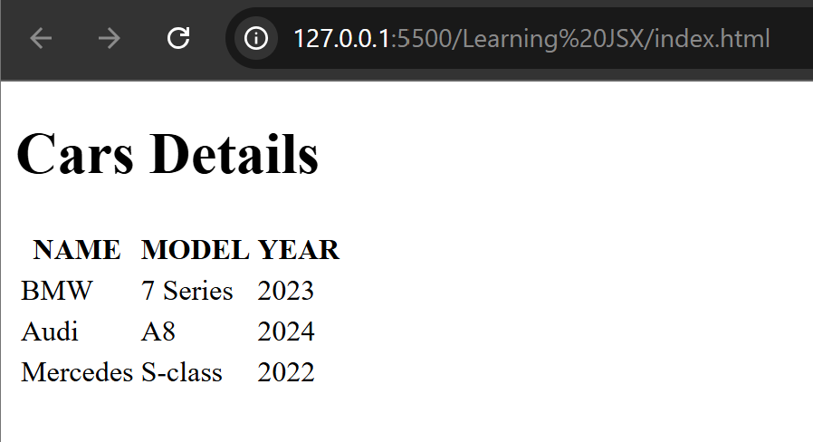

# LEARNING JSX

## What is JSX?

JSX stands for JavaScript XML. It is syntactic sugar for creating React
Elements. It is a syntax extension to JavaScript. It is used with React to
describe what the UI should look like. JSX may remind you of a template
language, but it comes with the full power of JavaScript. It produces React
“elements.”

#### Example:

```javascript
const element = <h1>Hello world!</h1>;
```

## Why JSX

JSX allows us to write HTML elements in JavaScript and place them in the
DOM without any createElement() and appendChild() methods. JSX
converts HTML tags into react elements. You are not required to use JSX, but
JSX makes it easier to write React applications.

### Without JSX

```javascript
const myElement = React.createElement("h1", {}, "I do not use JSX!");
const root = ReactDOM.createRoot(document.getElementById("root"));
root.render(myElement);
```

### With JSX

```javascript
const myElement = <h1>I Love JSX!</h1>;
const root = ReactDOM.createRoot(document.getElementById("root"));
root.render(myElement);
```

- React embraces the fact that rendering logic should be coupled with UI logic.
  It is helpful as a visual aid when working with UI inside the javascript. React
  separates concerns instead of separating technologies. It allows React to
  show more valuable errors and warning messages.
- Babel is a JavaScript Compiler that allows us to use future JavaScript in
  today's browsers. Simply put, it can convert the latest version of JavaScript
  code into the one the browser understands.
  Babel can convert JSX syntax. It is therefore used to convert JSX expressions
  into JavaScript code browsers can understand.
  You can try it yourself.
  [Here is the link](https://babeljs.io/repl/)

## React Fragments

It is a common pattern in React that a component returns multiple elements.
Fragments let you group a list of children without adding extra nodes to the
DOM. We know that we use the render method inside a component whenever
we want to render something to the screen. We may generate single or
multiple elements. However, rendering multiple elements will require a ‘div’ tag
around the content as the render method will only render a single root node
inside it at a time.

#### Example:

```javascript
function App() {
  return (
    <div>
      <h2>Hello</h2>
      <p>How are you doing?</p>
    </div>
  );
}
```

**Reason to use Fragments**: As we saw in the above code, when we are
trying to render more than one root element, we have to put the entire content
inside the ‘div’ tag, which is not a good approach because no one wants to
include an extra div element if that is not required in the code. Hence, Fragments were introduced, and we use them instead of the extraneous ‘div’
tag.

#### Example:

```javascript
function App() {
  return (
    <React.Fragment>
      <h2>Hello</h2>
      <p>How are you doing?</p>
    </React.Fragment>
  );
}
```

**Shorthand Fragment**: The output of the first code and the code above is the
same, but the main reason for using it is that it is a tiny bit faster when
compared to the one with the ‘div’ tag inside it, as we didn’t create any DOM
nodes. Also, it takes less memory. Another shorthand also exists for the above
method in which we use ‘<>’ and ‘</>’ instead of the ‘React.Fragment’.

#### Example:

```javascript
function App() {
  return (
    <>
      <h2>Hello</h2>
      <p>How are you doing?</p>
    </>
  );
}
```

## Embedding Javascript inside JSX

### A Simple Example

```javascript
function App() {
  var name = "Shiv";
  var age = 24;
  let demo = null;
  let undefineValue = undefined;
  let isMarried = false;

  return (
    <>
      <h1>Hello, {name} ! </h1>
      <p> Your age is {age} </p>
      <p> Null value : {demo} </p>
      <p> Undefined value : {undefineValue} </p>
      <p> Boolean value : {isMarried}</p>
      <p> Boolean value : {isMarried.toString()}</p>
    </>
  );
}

ReactDOM.createRoot(document.getElementById("root")).render(<App />);
```

#### Code Explanation:

This code defines a React functional component called `App`. The component demonstrates how to embed various JavaScript data types inside JSX.

1. JavaScript Variables:

   ```javascript
   var name = "Shiv";
   var age = 24;
   let demo = null;
   let undefineValue = undefined;
   let isMarried = false;
   ```

   - `name`: A string variable containing the name `"Shiv"`.
   - `age`: A number variable holding the value `24`.
   - `demo`: A variable set to `null`. In JSX, `null` will render nothing.
   - `undefineValue`: A variable set to `undefined`. It also renders nothing in JSX.
   - `isMarried`: A boolean value `false`.

2. JSX:

   Inside the `return` statement, you’re using JSX to render HTML-like elements. You can embed JavaScript variables within curly braces `{}`.

   ```javascript
   return (
     <>
       <h1>Hello, {name} ! </h1>
       <p> Your age is {age} </p>
       <p> Null value : {demo} </p>
       <p> Undefined value : {undefineValue} </p>
       <p> Boolean value : {isMarried}</p>
       <p> Boolean value : {isMarried.toString()}</p>
     </>
   );
   ```

   - `{name}`: Displays the value of `name`, which is `"Shiv"`.
   - `{age}`: Displays the value of `age`, which is `24`.
   - `{demo}`: Since `demo` is `null`, it renders nothing in JSX.
   - `{undefineValue}`: Similarly, `undefined` renders nothing.
   - `{isMarried}`: Displays `false`. Booleans are not automatically rendered in JSX as text.
   - `{isMarried.toString()}`: Converts the boolean `false` to a string `"false"` using `.toString()`, so it gets rendered properly.

3. React Rendering:

   ```javascript
   ReactDOM.createRoot(document.getElementById("root")).render(<App />);
   ```

   This line uses `ReactDOM.createRoot` to render the `App` component into the `root` element in your HTML.

## JSX Expression

With JSX, you can write expressions inside curly braces { }. JSX Expressions,
written inside curly brackets, allow only things that evaluate some value like
string, number, array map method, etc. The expression can be a React
variable, property, or any other valid JavaScript expression. JSX will execute
the expression and return the result.

#### Example:

```javascript
// A simple function that calculates and returns a value
function sum() {
  let a = 3 + 4;
  return a; // returns 7
}

// React functional component
function App() {
  // Data variables to be used in JSX
  var name = "Shivani Rathore";
  let age = 24;

  // Storing a JSX heading element in a constant
  const header = <h2>This is Header</h2>;

  // Returning JSX content wrapped in a Fragment
  return (
    <>
      {/* Render the header JSX element */}
      {header}

      {/* Display name and age dynamically */}
      <p>My name is {name}.</p>
      <p>My age is {age}.</p>

      {/* Call sum() function and display its result */}
      <p>Calling function: {sum()}</p>
    </>
  );
}
```

In JavaScript, a function can only return one value at a time. Since **JSX is just syntactic sugar for JavaScript**, it also follows the same rule ~ it can only return **one parent element**.

To return multiple elements, we must wrap them inside a single outer wrapper. This wrapper is often a `<div>`, but in React, we can also use a Fragment (`<> </>`), which groups elements without adding extra nodes to the DOM.

That’s why in this example, we used a **Fragment** to return multiple elements cleanly.

For example, the code below will throw an error because **JSX expressions must return only one parent element**:

```javascript
function App() {
  return (
      <div>Hello</div>
      <div>World</div>
  );
}
```

### Comments in JSX

To add JavaScript code inside JSX, we need to write it in curly brackets. To
add a comment for that code, then you have to wrap that code in JSX
expression syntax inside the /_ and _/ comment symbols like this:

```javascript
{
  /* <p>This is some text</p> */
}
```

### Null/Undefines/Boolean in JSX

JSX ignores `null`, `undefined`, and `Booleans` (false, true). They don’t render as
JSX is syntactic sugar for `React.createElement(component, props,
...children)`. Let's Understand JSX Rendering of Special Values:

#### For Example

In React JSX, the following expressions:

```javascript
<div />
<div></div>
<div>{false}</div>
<div>{null}</div>
<div>{undefined}</div>
<div>{true}</div>
```

may look different in code, but they all render the same way in the browser:

```javascript
<div></div>
<div></div>
<div></div>
<div></div>
<div></div>
<div></div>
```

#### ❓ Why do they render the same?

Because JSX ignores certain JavaScript values inside `{}` when rendering:

- `false`
- `true`
- `null`
- `undefined`

These values do **not produce any visible output** in the DOM. React skips them silently.

#### ✅ How to Show These Values on Screen

If you want to display them (e.g., true, false, null), you must convert them to strings:

```javascript
const myVariable = false;
<div>My JavaScript variable is {String(myVariable)}.</div>;
```

This will correctly render the value as text:

```javascript
<div>My JavaScript variable is false</div>
```

## Functions in JSX

A function can be defined and used by the expression. The component takes the
function's output to produce content. We can simply define a function inside our
component, and we can call it inside the return() method. We can invoke the function
by adding parentheses () at the end.

#### Example:

```javascript
const App = () => {
  const a = 4;
  const b = 6;

  const sum = (a, b) => a + b;

  return (
    <h2>
      Sum of {a} and {b} is: {sum(a, b)}
    </h2>
  );
};
```

## Arrays in JSX

Arrays can be rendered inside the JSX Expressions easily using curly braces
similar to any variable.

#### Example

```javascript
const arr = [1, 2, 3, 4, 5];

const App = () => {
  return <h2>Array is: {arr}</h2>;
};
```

**Output**: Array is: 12345;

### Iterating over the array

We usually use the map function to iterate through the array in React. The
map is a JavaScript function that can be called on any array. With the map
function, we map every element of the array to the custom components in a
single line of code. That means there is no need to call components and their
props array elements repeatedly.

The **.map()** method allows you to run a function on each item in the array,
**returning a new array**. In React, map() can be used to generate lists and
render a list of data to the DOM. To use the map() function, we attach it to an
array we want to iterate over.

#### Example:

```javascript
const myArray = ["apple", "banana", "orange"];

const myList = myArray.map((item, index) => <p key={index}>{item}</p>);
```

**Note**: Keys allow React to keep track of elements. This way, if an item is
updated or removed, only that item will be re-rendered instead of the entire
list. Keys need to be unique to each sibling.

Generally, the key should be a unique ID assigned to each item. As a last
resort, you can use the array index as a key.

### Filter()

The filter() method is an iterative method. It calls a provided callbackFn
function once for each element in an array and constructs a new array of all
the values for which callbackFn returns a truthy value. Array elements that do
not pass the callbackFn test are not included in the new array.

The JavaScript Array filter() Method is used to create a new array from a
given array consisting of only those elements from the given array which
satisfy a condition set by the argument method.

#### Example:

```javascript
function isEven(value) {
  return value % 2 == 0;
}

var originalArr = [11, 98, 31, 23, 944];
var newArr = originalArr.filter(isEven);

console.log(newArr);
```

**Output**: [98,944]

The function passed in the filter function checks whether each element is even
or odd. The filter function then returns only the truthy element; hence, the new
array returned consists of only 2 elements, 98 and 944.

## Objects in JSX

Objects can be defined as an unordered collection of data in the form of “key:
value” pairs. JSX can’t render objects. React has no way to tell what to render
when provided with an object, thus the Invariant Violation error pops up when
attempting so. The error "Objects are not valid as a React child" is standard,
and the solution is to manipulate the object so that it becomes a valid element.

And this is excellent because it now remains in the developer's hand to decide
how to present the data in the object in its application.

#### Example:

```javascript
const App = () => {
  const myVariable = {
    productName: "Watermelon",
    price: 12,
  };

  return (
    <div>
      {myVariable.productName} : ${myVariable.price}
    </div>
  );
};
```

And the above code would render a div with the content: Watermelon: $12

### Arrays and Object Rendering in JSX

```javascript
/*Arrays and Object Rendering in JSX*/
function App() {
  let arr = [1, 2, 3, 4, 5, 6, 7];

  let obj = {
    name: "Shiv",
    age: 24,
  };

  return (
    <>
      <h1>Arrays and Objects in Javascript</h1>
      <h2>{arr}</h2>
      {arr.map((num) => (
        <h2>{num}</h2>
      ))}
      <h3>{obj.name}</h3>
    </>
  );
}

const rootElement = ReactDOM.createRoot(document.getElementById("root"));
rootElement.render(<App />);

/*
1. We cannot directly access object as {obj} inside JSX, it gives error as: Objects are 
not valid as a React child. But object properties are accessible inside JSX.
2. In React, for loop doesn't work becoz for loop doesn't return anything. In order to JSX
to render it on the screen it should return something. 
So, Alternative solution : Map function which returns something.
*/
```

🖥️ What You See in Browser:

```text
Arrays and Objects in Javascript
1,2,3,4,5,6,7
1
2
3
4
5
6
7
Shiv
```

## Assigning Unique Keys

### A Simple Example

```javascript
/* Assigning Unique Keys */
function App() {
  let cars = ["BMW", "Audi", "Nexa", "Honda", "Maruti"];

  return (
    <>
      <h1>List of cars</h1>
      <ul>
        {cars.map((car, index) => (
          <li key={index}> {car} </li>
        ))}
      </ul>
    </>
  );
}

ReactDOM.createRoot(document.getElementById("root")).render(<App />);
```

#### Code Explanation:

1. Component Definition:
   - `App` is a functional React component ~ a simple function that returns JSX (UI code).
2. Data:
   - Inside the component, an array called `cars` holds car brand names: `["BMW", "Audi", "Nexa", "Honda", "Maruti"]`
3. JSX Return (UI):
   - The component returns:
     - A heading: `<h1>List of cars</h1>`
     - An unordered list: `<ul>...</ul>` containing car names.
4. Dynamic List Rendering with `.map()`:
   - c`ars.map((car, index) => ( ... ))` loops through each item in the cars array.
   - For each `car`, it returns a `<li>` element displaying the car's name.
5. Why the key Prop is Important

   ```javascript
   <li key={index}> {car} </li>
   ```

   `key={index}` is used to give each `<li>` a unique identity.

   - What the `key` does:
     - Helps React **track** each item when the list is updated, added, or removed.
     - Allows React to **efficiently re-render only what's changed**, improving performance.
   - Why `key` must be unique:
     - If two items have the same key, React can get confused during updates, causing UI bugs.
   - Why using `index` is okay here:
     - Since this is a **static list** (no items are added/removed dynamically), using the array `index` as the key is acceptable.
     - But if this list were dynamic (e.g., adding/removing cars), using `index` could cause incorrect updates.
     - In real apps, use a **unique ID** (like a database ID or UUID) instead of `index`.

6. Rendering the Component

   ```javascript
   ReactDOM.createRoot(document.getElementById("root")).render(<App />);
   ```

   - Finds the DOM element with ID `root`.
   - Renders the `App` component inside it.
   - This is the standard way to mount a React app using React 18+.

### Without Using 'key' prop

#### ⚠️ Console Warning: "Each child in a list should have a unique 'key' prop"


### With Using 'key' prop

#### 🖥️ What You See in Browser:


## Tables in JSX

The tables are created using the `<table>` tag in which the `<tr>` tag is used to
create table rows, and the `<td>` tag is used to create data cells. The elements
under `<td>` are regular and left aligned by default. Here, the border is an
attribute of `<table>` tag, and it is used to put a border across all the cells. If
you do not need a border, then you can use border = "0".

### Table Heading

Table heading can be defined using `<th>` tag. This tag will be put to replace
`<td>` tag, which is used to represent actual data cells. Normally you will put
your top row as a table heading as shown below; otherwise, you can use `<th>`
element in any row. Headings, which are defined in `<th>` tag are centred and
bold by default.

### Colspan and Rowspan Attributes

You can use the `colSpan` attribute if you want to merge two or more columns
into a single column. Similarly, you can use `rowSpan` if you want to merge two
or more rows.

#### Example:

```javascript
<table border="1">
  <tr>
    <th>Column 1</th>
    <th>Column 2</th>
    <th>Column 3</th>
  </tr>
  <tr>
    <td rowspan="2">Row 1 Cell 1</td>
    <td>Row 1 Cell 2</td>
    <td>Row 1 Cell 3</td>
  </tr>
  <tr>
    <td>Row 2 Cell 2</td>
    <td>Row 2 Cell 3</td>
  </tr>
  <tr>
    <td colspan="3">Row 3 Cell 1</td>
  </tr>
</table>
```


### Table Caption

The caption tag will serve as a title or explanation for the table and will show
up at the top. It can be just before the table's 1st `<tr>` element.

#### Example:

```javascript
<table border="1">
  <caption>This is the caption</caption>
  <tr>
    <td>row 1, column 1</td>
    <td>row 1, column 2</td>
  </tr>
  <tr>
    <td>row 2, column 1</td>
    <td>row 2, column 2</td>
  </tr>
</table>
```


### `<thead>`, `<tbody>`, `<tfoot>`

The `<thead>` tag is used to group header content in a table. The `<tbody>` tag
is used to group the body content in a table. The `<tfoot>` tag is used to group
footer content in a table. These are the semantic tags that not only provide
meaning to the elements but also have some other useful functions as well.
Browsers can use these elements to enable scrolling of the table body
independently of the header and footer. Also, when printing a large table that
spans multiple pages, these elements can enable the table header and footer
to be printed at the top and bottom of each page.

Note: You can use one table inside another table. Not only tables, but you can
also use almost all the tags inside table data tag `<td>`. This is called a nested
table.

#### Example: Displaying Student Information in a Table

```jsx
function App() {
  let students = [
    {
      name: "Shivani",
      age: 24,
      marks: 90,
    },
    {
      name: "MSD",
      age: 43,
      marks: 95,
    },
    {
      name: "Neeraj",
      age: 26,
      marks: 91,
    },
  ];
  return (
    <>
      <h1>Student Details</h1>
      <table>
        <thead>
          <tr>
            <th>NAME</th>
            <th>AGE</th>
            <th>MARKS</th>
          </tr>
        </thead>

        <tbody>
          {students.map((student, index) => (
            <tr key={index}>
              <td>{student.name}</td>
              <td>{student.age}</td>
              <td>{student.marks}</td>
            </tr>
          ))}
        </tbody>
      </table>
    </>
  );
}
const rootElement = ReactDOM.createRoot(document.getElementById("root"));
rootElement.render(<App />);

/*
1. If we don't use the "key" property:
   ➤ Console Warning: Each child in a list should have a unique "key" prop.
   ➤ Use the index number as the key because it is unique within the list.
   ➤ However, when working with objects (like from a database), prefer using a unique "id" if available.
   ➤ Note: The "key" prop can be passed to any element in a list, not just <li>. It's used by React to track which items change, are added, or removed.

2. If we don't use <thead> or <tbody>:
   ➤ Console Warning: validateDOMNesting(...): <tr> cannot appear as a child of <table>.
   ➤ Solution: Wrap <tr> elements inside <thead>, <tbody>, or <tfoot> to follow valid HTML structure and avoid warnings.
*/
```

### Without Using `<thead>` or `<tbody>` Tag

#### ⚠️ Console Warning: validateDOMNesting(...): `<tr>` cannot appear as a child of `<table>`.


### With Using `<thead>` or `<tbody>` Tag

#### 🖥️ What You See in Browser:


## Conditional Rendering

Conditional rendering in React works the same way conditions work in
JavaScript. We can use JavaScript operators like if - else or the conditional
operator (ternary operator) or AND operator or OR operator in JSX.

### Conditional Rendering with if-else Statement

We can use the if-else statements to render a JSX expression on the basis of
some conditions. Note that if-else statements can’t return additional JSX
elements apart from the elements which are inside the if-else statements. This
is because the return keyword inside the App component will return the
elements which are after the return statement. So, if any condition inside the
if-else statement is true, then just the elements inside that condition gets
rendered and it doesn’t even check the rest of the conditions or elements
which are put outside that truthy condition.

#### Example-1

```javascript
const App = () => {
  const email = "shivanirathore@gmail.com";
  const password = "Shiv@24";

  if (email == "shivanirathore@gmail.com") {
    if (password == "Shiv@24") {
      return <h1>User is an employee.</h1>;
    } else {
      return <h1>Incorrect password</h1>;
    }
  } else {
    return <h1>User is a student.</h1>;
  }
};
```

#### Example-2

```javascript
/* Rendering components based on condition */
function Student() {
  let students = [
    {
      name: "Shivani",
      age: 24,
      marks: 77,
    },
    {
      name: "MSD",
      age: 33,
      marks: 80,
    },
    {
      name: "Neeraj",
      age: 26,
      marks: 78,
    },
  ];
  return (
    <>
      <h1>Student Details</h1>
      <table>
        <thead>
          <tr>
            <th>NAME</th>
            <th>AGE</th>
            <th>MARKS</th>
          </tr>
        </thead>

        <tbody>
          {students.map((student, index) => (
            <tr key={index}>
              <td>{student.name}</td>
              <td>{student.age}</td>
              <td>{student.marks}</td>
            </tr>
          ))}
        </tbody>
      </table>
    </>
  );
}

function Car() {
  let cars = [
    {
      name: "BMW",
      model: "7 Series",
      year: 2023,
    },
    {
      name: "Audi",
      model: "A8",
      year: 2024,
    },
    {
      name: "Mercedes",
      model: "S-class",
      year: 2022,
    },
  ];
  return (
    <>
      <h1>Cars Details</h1>
      <table>
        <thead>
          <tr>
            <th>NAME</th>
            <th>MODEL</th>
            <th>YEAR</th>
          </tr>
        </thead>

        <tbody>
          {cars.map((car, index) => (
            <tr key={index}>
              <td>{car.name}</td>
              <td>{car.model}</td>
              <td>{car.year}</td>
            </tr>
          ))}
        </tbody>
      </table>
    </>
  );
}

function CarName() {
  let cars = ["BMW", "Audi", "Mercedes", "Jaguar", "Rolls-Royce"];

  return (
    <>
      <h1>Cars Name</h1>
      {cars.map((car, index) => (
        <h3 key="index">{car}</h3>
      ))}
    </>
  );
}

/*Rendering multiple components */
/*
function App() {
  return (
    <>
      <Student />
      <Car />
      <CarName />
    </>
  );
}
*/

/* Rendering components/elements based on some condition , and this concept is known as conditional rendering */
function App() {
  let showCars = true;

  /*we can skip parenthesis i.e () if returning single component */
  if (showCars) {
    return <Car />;
  }
  return (
    <>
      <Student />
      <CarName />
    </>
  );
}

const rootElement = ReactDOM.createRoot(document.getElementById("root"));
rootElement.render(<App />);
```

#### 🖥️ What You See in Browser:



### Conditional Rendering with Ternary Operator

The conditional (ternary) operator is the only JavaScript operator that takes
three operands: a condition followed by a question mark (`?`), then an
expression to execute if the condition is "truthy" followed by a colon (`:`), and finally, the expression to execute if the condition is "falsy". This operator is
frequently used as an alternative to an if...else statement

#### Example-1

```javascript
const App = () => {
  const email = "shivanirathore@gmail.com";
  const password = "Shiv@24";

  return (
    <>
      {email === "shivanirathore@gmail.com" ? (
        password === "Shiv@24" ? (
          <h1>User is an employee.</h1>
        ) : (
          <h1>Incorrect password.</h1>
        )
      ) : (
        <h1>User is a student.</h1>
      )}
    </>
  );
};
```

#### Example-2

```javascript
/* Conditional rendering using ternary operator */

function App() {
  let loggedIn = true;
  return (
    <>
      <h1>Hello, {loggedIn ? "Shiv" : "User"}</h1>
    </>
  );
}

const rootElement = ReactDOM.createRoot(document.getElementById("root"));
rootElement.render(<App />);
```

- Conditional rendering using ternary operator: useful when you want to change some part of component instead of changing whole component.

- Using if-else inside JSX would be complicated just for changing some part of component, return inside return is not acceptable so, solution : ternary operator.

#### 🖥️ What You See in Browser:


### Conditional Rendering with AND Operator

Another way to conditionally render a React component is by using the `&&`
operator. It returns the "first falsy" and "last truthy" value.

#### Example-1

```javascript
const App = () => {
  const email = "shivanirathore@gmail.com";
  const password = "Shiv@24";

  return (
    <>
      {email === "shivanirathore@gmail.com" && password === "Shiv@24" && (
        <h1>User is an employee.</h1>
      )}

      {email === "shivanirathore@gmail.com" && password !== "Shiv@24" && (
        <h1>Incorrect password.</h1>
      )}

      {email !== "shivanirathore@gmail.com" && <h1>User is a student.</h1>}
    </>
  );
};
```

#### Example-2

```javascript
/* Conditional rendering using AND Operator */
function App() {
  let loggedIn = true;

  return (
    <>
      <h1>Hey, {loggedIn ? "Shiv" : "User"}</h1>
      {loggedIn && <p>Welcome to the Sports Club!</p>}
    </>
  );
}

const rootElement = ReactDOM.createRoot(document.getElementById("root"));
rootElement.render(<App />);
```

#### Explaination:

1. You define a boolean variable:
   - `let loggedIn = true;`
   - This controls whether the user is considered logged in or not.
2. Inside `return`, you display:

- A heading (`<h1>`)
  - Shorthand for `if-else`
    ```jsx
    <h1>Hey, {loggedIn ? "Shiv" : "User"}</h1>
    ```
  - This uses a ternary operator: `condition ? valueIfTrue : valueIfFalse`
    - If `loggedIn === true`, it shows: `Hey, Shiv`
    - If `loggedIn === false`, it shows: `Hey, User`
- A paragraph (`<p>`) – Conditional rendering using **AND (&&) operator**
  - Logic: If the left side is true, the right side is executed/rendered.
    ```jsx
    {
      loggedIn && <p>Welcome to the Sports Club!</p>;
    }
    ```
  - The AND operator checks the left condition:
    - If `loggedIn === true`, it renders the `<p>` element.
    - If `loggedIn === false`, it **renders nothing**.

#### Expected Output:

If `loggedIn` is `true`:

```text
Hey, Shiv
Welcome to the Sports Club!
```

If `loggedIn` is `false`:

```text
Hey, User
```

(No paragraph rendered)

#### NOTE:

- Falsy values in JavaScript: `0`, `""`, `null`, `undefined`, `false`, `NaN`
- Truthy values: Everything else (like `"text"`, `1`, `[]`, `{}`)
- AND (`&&`) behavior:
  - Returns:
    - Second value if the first is truthy
    - First value if the first is falsy
- Boolean values are not rendered in JSX:
  ```jsx
  {
    false;
  } // renders nothing
  ```

#### 🖥️ What You See in Browser:


### Conditional Rendering with OR Operator

We can also render a React component by using the `||` operator. It returns "last falsy" and "first truthy" value.

#### Example-1

```javascript
const App = () => {
  const email = "shivanirathore@gmail.com";

  return (
    <>
      {(email === "shivanirathore@gmail.com" ||
        email === "shivani.rathore24@gmail.com") && (
        <h1>User is an employee.</h1>
      )}
    </>
  );
};
```

#### Example-2

```javascript
/* Conditional rendering using OR Operator */
//case-1
function App1() {
  let loggedIn = true;
  let firstName = "Shivani";
  let lastName = "";

  return (
    <>
      <h1>Hey, {loggedIn ? lastName || firstName : "User"}</h1>
      {loggedIn && <p>Welcome to the Sports Club!</p>}
    </>
  );
}

//case-2
function App2() {
  let loggedIn = true;
  let fname = "Shivani";
  let lname = "Rathore";

  return (
    <>
      <h1>Hey, {loggedIn ? lname || fname : "User"}</h1>
      {loggedIn && <p>Welcome to the Sports Club!</p>}
    </>
  );
}

const rootElement = ReactDOM.createRoot(document.getElementById("root"));
rootElement.render(
  <>
    <App1 />
    <App2 />
  </>
);
```

#### Explaination:

The **OR (`||`) operator** returns the "first truthy" value it finds. If all values are falsy, it returns the "last falsy" one.

#### 🔹 Case-1:

```javascript
let firstName = "Shivani";
let lastName = ""; // falsy
```

- Expression: `lastName || firstName`
  - **lastName** is `""` → falsy
  - **firstName** is `"Shivani"` → truthy
  - ✅ Output: `Hey, Shivani`

#### 🔹 Case-2:

```javascript
let fname = "Shivani";
let lname = "Rathore"; // truthy
```

- Expression: `lname || fname`
  - **lname** is `"Rathore"` → truthy (so it is selected)
  - ✅ Output: `Hey, Rathore`

#### 📘 Additional Note:

- `loggedIn ? lname || fname : "User"` is a compact way to:
  - Show `lname` if it's available
  - Else show `fname`
  - Else show `"User"` if not logged in
- `loggedIn && <p>Welcome to the Sports Club!</p>`:
  - Shows the welcome message only if `loggedIn === true`

#### 🖥️ What You See in Browser:


## Summarising it

Let’s summarise what we have learned in this module:

- Learned about the JSX.
- Learned about React Fragments and its shortcut.
- Learned about JSX Expressions.
- Learned about how arrays and lists are rendered in React.
- Learned about how to use objects in JSX.
- Learned about how to use tables in JSX.
- Learned about different types of conditional rendering in JSX.

### Additional References (if you want to explore more):

[To apply React Developer tools](https://chromewebstore.google.com/detail/react-developer-tools/fmkadmapgofadopljbjfkapdkoienihi?hl=en)

[To read more about the array iteration methods](https://developer.mozilla.org/en-US/docs/Web/JavaScript/Reference/Global_Objects/Array)

[More information on Tables](https://developer.mozilla.org/en-US/docs/Learn_web_development/Core/Structuring_content/HTML_table_basics)

[Advanced information on Tables](https://developer.mozilla.org/en-US/docs/Learn_web_development/Core/Structuring_content/Table_accessibility)

[You can read about nullish coalescing operator](https://developer.mozilla.org/en-US/docs/Web/JavaScript/Reference/Operators/Nullish_coalescing)

[Logical operators](https://reactpatterns.js.org/docs/logical-and-operator/)
