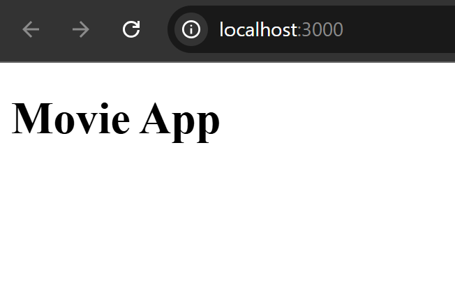
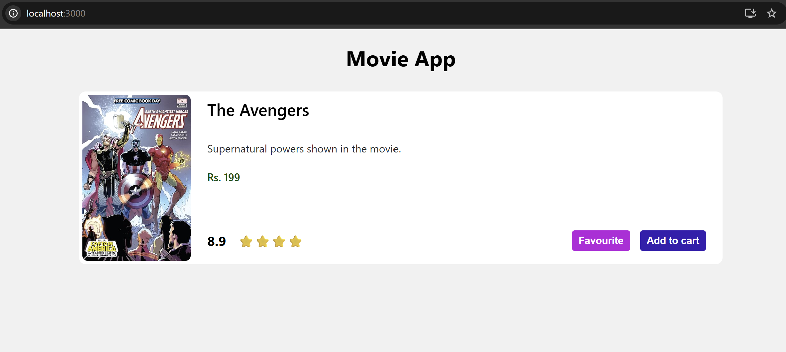
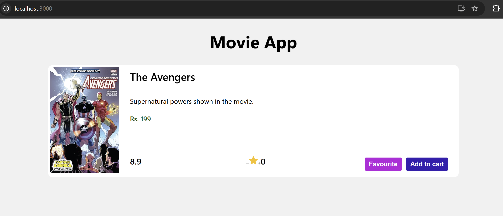
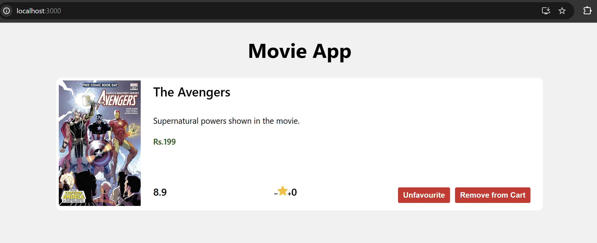

# MOVIE APP

## Movie-App Project Setup

### Steps to Create React App:

1. Go to the Desktop using `cd Desktop` or navigate to your project folder.
2. Use the command `npx create-react-app movieapp` to create the React app.  
   _(Later, I renamed `movieapp` to `Movie App`.)_
3. Run `cd movieapp` to navigate into the project.
4. Use `ls` to display the files in the current directory.
5. Open the project in VS Code using `code .`
6. Run `npm start` to start your first React project.

### App.js file:

```jsx
function App() {
  return (
    <>
      <h1>Movie App</h1>
    </>
  );
}

export default App;
```

### index.js file:

```jsx
import React from "react";
import ReactDOM from "react-dom/client";
import App from "./App";

const root = ReactDOM.createRoot(document.getElementById("root"));
root.render(
  <React.StrictMode>
    <App />
  </React.StrictMode>,
);
```

#### 🖥️ What You See in Browser:



## Designing the Movie Card

### Moviecard.js file:

```jsx
import { Component } from "react";

class MovieCard extends Component {
  render() {
    return (
      <div className="main">
        <div className="movie-card">
          <div className="left">
            
          </div>

          <div className="right">
            <div className="title">The Avengers</div>
            <div className="plot">Supernatural powers shown in the movie.</div>
            <div className="price">Rs. 199</div>

            <div className="footer">
              <div className="rating">8.9</div>
              <div className="stars">⭐️⭐️⭐️⭐️</div>
              <button className="favourite-btn">Favourite</button>
              <button className="cart-btn">Add to cart</button>
            </div>
          </div>
        </div>
      </div>
    );
  }
}
export default MovieCard;
```

### App.js file:

```jsx
import MovieCard from "./Moviecard";
function App() {
  return (
    <>
      <h1 className="app-title">Movie App</h1>
      <MovieCard />
    </>
  );
}

export default App;
```

### index.js file:

```jsx
import React from "react";
import ReactDOM from "react-dom/client";
import App from "./App";
import "./index.css";

const root = ReactDOM.createRoot(document.getElementById("root"));
root.render(
  <React.StrictMode>
    <App />
  </React.StrictMode>,
);
```

#### Explaination:

1. **Moviecard.js (Class Component)**
   - You created a class-based React component using
     `class MovieCard extends Component`.
   - Inside it, the render() method returns the UI (JSX).
   - The component displays:
     - A poster image (left side)
     - Movie title, plot, price (right side)
     - A footer containing rating, stars, and action buttons:
       - 🌟 Rating
       - ⭐ Star display
       - 💜 Favourite button
       - 🛒 Add to cart button

   - This component is self-contained, reusable, and cleanly structured.
   - Exporting it lets you use `<MovieCard />` anywhere in the app.

2. **App.js**
   - Imports the component: `import MovieCard from "./Moviecard"`;
   - Displays:
     - A centered header: “Movie App”
     - The MovieCard component

   - This file acts as the main UI screen of your application.

3. **index.js**
   - Starts your React app using ReactDOM.createRoot(...).
   - Wraps everything in <React.StrictMode> for safe rendering.
   - Imports index.css, so styles are applied globally.

4. **index.css**
   - Contains all visual styling:
     - Page background
     - Movie card layout
       Flexbox structure
     - Buttons (Favourite / Add to Cart)
     - Typography, spacing, colors

   - Ensures the movie card looks clean, centered, and styled properly.

#### 🖥️ What You See in Browser:



## Movie Card Continued...

### Moviecard.js file:

```jsx
import { Component } from "react";

class MovieCard extends Component {
  render() {
    return (
      <div className="main">
        <div className="movie-card">
          <div className="left">
            
          </div>

          <div className="right">
            <div className="title">The Avengers</div>
            <div className="plot">Supernatural powers shown in the movie.</div>
            <div className="price">Rs. 199</div>

            <div className="footer">
              <div className="rating">8.9</div>

              <div className="star-dis">
                
                
                
                <span>0</span>
              </div>

              <button className="favourite-btn">Favourite</button>
              <button className="cart-btn">Add to cart</button>
            </div>
          </div>
        </div>
      </div>
    );
  }
}

export default MovieCard;
```

#### 🖥️ What You See in Browser:



## State in React

State is a built-in object in React that is used to contain dynamic information about a
component. Unlike props that are passed from the outside, a component maintains
its own state.

A component's state is mutable and it can change over time. Whenever it changes,
the component re-renders.

### Adding an initial state

To add an initial state to a component instance we give that component a state
property. This property should be declared inside of the class constructor and should
be set to an object with key and value pairs. We must also call super with props
inside of the constructor to access common properties of the built-in Component
class.

### Super

The super keyword calls the constructor of the parent class. In our case the call to
super passes the props argument to the constructor of React.Component class and
saves the return value for the derived class component.

### Updating state with setState

The components state can be updated with **this.setState** built-in method. It takes an
object and merges it with the component's current state. If there are properties in the
current state that are not a part of that object, those properties remain unchanged.

Anytime that we call this.setState it automatically calls the render method as soon as
the state changes which rerenders the component with the updated state value.

### Accessing previous state values

The **setState** method can take a callback function as an argument which receives
the previous state as a default parameter. This is useful in cases where we need
access to previous state values to update the current state.

### State is Asynchronous

The setState method works in an asynchronous way. That means after calling
setState the **this.state** variable is not immediately changed.

So If we want to perform an action after the state value is updated we can pass a
callback function as a second parameter to the setState method.

#### Example snippet:

```jsx
import { Component } from "react";

export default class Navbar extends Component {
  constructor(props) {
    super(props);
    // initialising state
    this.state = { count: 0 };
  }

  // access previous state with a callback
  updateState = () => {
    this.setState((prev) => ({ count: prev.count + 1 }));
  };

  render() {
    return (
      <div>
        <h1>Count is {this.state.count}</h1>
        <button onClick={this.updateState}>Click Me</button>
      </div>
    );
  }
}
```

### Moviecard.js file:

```jsx
import { Component } from "react";

class MovieCard extends Component {
  constructor() {
    super();
    this.state = {
      title: "The Avengers",
      plot: "Supernatural powers shown in the movie.",
      price: 199,
      rating: 8.9,
    };
  }
  render() {
    const { title, plot, price, rating } = this.state;
    return (
      <div className="main">
        <div className="movie-card">
          <div className="left">
            
          </div>

          <div className="right">
            <div className="title">{title}</div>
            <div className="plot">{plot}</div>
            <div className="price">Rs.{price}</div>

            <div className="footer">
              <div className="rating">{rating}</div>

              <div className="star-dis">
                
                
                
                <span>0</span>
              </div>

              <button className="favourite-btn">Favourite</button>
              <button className="cart-btn">Add to cart</button>
            </div>
          </div>
        </div>
      </div>
    );
  }
}

export default MovieCard;
```

#### Changes made (step-by-step):

1. Added a constructor
   - The constructor is used to initialize the component when it is created.
   - super() calls the parent Component constructor so that we can use this inside the class.
   ```jsx
   constructor() {
     super();
     this.state = { ... };
   }
   ```
2. Initialized component state
   - this.state is used to store dynamic data in a React class component.
   - Here it holds the movie details instead of hardcoding them in the UI.
   ```jsx
   this.state = {
     title: "The Avengers",
     plot: "Supernatural powers shown in the movie.",
     price: 199,
     rating: 8.9,
   };
   ```
3. Used destructuring in the render() method

   ```jsx
   const { title, plot, price, rating } = this.state;
   ```

   - Destructuring allows us to extract values from this.state into variables, making the JSX cleaner and easier to read.

4. Displayed state values in JSX

   ```jsx
   <div className="title">{title}</div>
   <div className="plot">{plot}</div>
   <div className="price">Rs.{price}</div>
   <div className="rating">{rating}</div>
   ```

   - Instead of writing static text, the UI now renders values from the component state, so the data can be updated dynamically.

The component now uses React state to manage movie data, making it easier to update dynamically instead of using hardcoded values.

## Binding 'this'

### Moviecard.js file:

```jsx
import { Component } from "react";

class MovieCard extends Component {
  constructor() {
    super();

    this.state = {
      title: "The Avengers",
      plot: "Supernatural powers shown in the movie.",
      price: 199,
      rating: 8.9,
    };

    // Way-2: Binding inside constructor
    // this.addStars = this.addStars.bind(this);
  }

  // Way-1 and Way-2
  // addStars() {
  //   console.log("this.state: ", this.state);
  // }

  // Way-3 (Recommended): Arrow function automatically binds 'this'
  addStars = () => {
    console.log("this.state: ", this.state);
  };

  render() {
    const { title, plot, price, rating } = this.state;

    return (
      <div className="main">
        <div className="movie-card">
          <div className="left">
            
          </div>

          <div className="right">
            <div className="title">{title}</div>
            <div className="plot">{plot}</div>
            <div className="price">Rs.{price}</div>

            <div className="footer">
              <div className="rating">{rating}</div>

              <div className="star-dis">
                

                

                {/* Way-1: Binding directly in JSX */}
                {/* onClick={this.addStars.bind(this)} */}

                {/* Way-2 & Way-3 */}
                {/* onClick={this.addStars} */}
                

                <span>0</span>
              </div>

              <button className="favourite-btn">Favourite</button>
              <button className="cart-btn">Add to cart</button>
            </div>
          </div>
        </div>
      </div>
    );
  }
}

export default MovieCard;
```

#### Explaination:

1. Added addStars method
   - A new function addStars is introduced inside the class.
   - It logs the component state using:
     ```jsx
     console.log("this.state: ", this.state);
     ```
2. Event handler added
   - The increase star button now has an onClick event.
     ```jsx
     onClick={this.addStars}
     ```
   - When the button is clicked, the addStars function executes.
3. Different ways to bind this (shown in comments)
   - The code demonstrates three ways to handle this binding in class components:
     - Way-1: Bind inside JSX
       ```jsx
       onClick={this.addStars.bind(this)}
       ```
     - Way-2: Bind inside constructor
       ```jsx
       this.addStars = this.addStars.bind(this);
       ```
     - Way-3 (used in final code): Arrow function class property
       ```jsx
       addStars = () => { ... }
       ```
       Arrow functions automatically bind this.
4. Functional change
   - Previously the button had no action.
   - Now clicking the increase button triggers addStars and prints the component state in the console.

#### Why binding is needed ?

In React class components, `this` inside a method is not automatically bound to the component instance.
When a method is used as an event handler, this may become undefined, so you cannot access `this.state` or `this.setState()`.

Binding ensures that this correctly refers to the component instance, allowing the method to access and update the component’s state.

#### 🖥️ What You See in Console:


### Increasing Stars using setState()

### Moviecard.js file:

```jsx
import { Component } from "react";

class MovieCard extends Component {
  constructor() {
    super();

    this.state = {
      title: "The Avengers",
      plot: "Supernatural powers shown in the movie.",
      price: 199,
      rating: 8.9,
      stars: 0,
    };
  }

  // Method to increase star count
  addStars = () => {
    // Form-1: Object form of setState
    // Used when the new state does NOT depend on the previous state
    // this.setState({
    //   stars: this.state.stars + 0.5,
    // });

    // Form-2: Functional form of setState (Recommended)
    // Used when the new state depends on the previous state value
    this.setState((prevState) => {
      return {
        stars: prevState.stars + 0.5,
      };
    });

    // ❌ Incorrect way: Direct state mutation (React will not re-render)
    // this.state.stars += 0.5;
    // console.log("this.state.stars: ", this.state.stars);
  };

  render() {
    const { title, plot, price, rating, stars } = this.state;

    return (
      <div className="main">
        <div className="movie-card">
          <div className="left">
            
          </div>

          <div className="right">
            <div className="title">{title}</div>
            <div className="plot">{plot}</div>
            <div className="price">Rs.{price}</div>

            <div className="footer">
              <div className="rating">{rating}</div>

              <div className="star-dis">
                

                

                {/* Increase star count when clicked */}
                

                {/* Display current star count */}
                <span className="starCount">{stars}</span>
              </div>

              <button className="favourite-btn">Favourite</button>
              <button className="cart-btn">Add to cart</button>
            </div>
          </div>
        </div>
      </div>
    );
  }
}

export default MovieCard;
```

#### Changes made (step-by-step):

1. New state property added
   - A new state variable stars is introduced to store the number of stars.
     ```jsx
     stars: 0;
     ```
2. addStars function updated
   - Previously it only logged the state.
   - Now it updates the stars value using setState().
3. React provides two ways to update state using setState:
   - Form-1 (Object form)

     ```jsx
     this.setState({
       stars: this.state.stars + 0.5,
     });
     ```

     - Used when the new state does not depend on the previous state.

   - Form-2 (Functional form – used here)

     ```jsx
     this.setState((prevState) => ({
       stars: prevState.stars + 0.5,
     }));
     ```

     - Used when the new state depends on the previous state value, which makes it safer and recommended.

4. Direct state mutation example commented

   ```jsx
   // this.state.stars += 0.5;
   ```

   - This is not recommended in React because directly modifying state does not trigger a component re-rende

5. State destructuring updated

   ```jsx
   const { title, plot, price, rating, stars } = this.state;
   ```

   - stars is added to the destructuring.

6. Star count displayed in UI

   ```jsx
   <span className="starCount">{stars}</span>
   ```

   - The UI now shows the current star value.

7. Increase button functionality

   ```jsx
   onClick={this.addStars}
   ```

   - Clicking the increase button now increments the stars value by 0.5.

#### 🖥️ What You See in Browser:


## More on setState()

### Moviecard.js file:

```jsx
import { Component } from "react";

class MovieCard extends Component {
  constructor() {
    super();

    this.state = {
      title: "The Avengers",
      plot: "Supernatural powers shown in the movie.",
      price: 199,
      rating: 8.9,
      stars: 0,
    };
  }

  addStars = () => {
    // Form-1: Object form of setState
    // this.setState(
    //   {
    //     stars: this.state.stars + 0.5,
    //   },
    //   () => console.log("stars inside callback:", this.state.stars),
    // );
    // console.log("stars:", this.state.stars);

    // Form-2: Functional form of setState (Recommended)
    if (this.state.stars >= 5) {
      return;
    }
    this.setState((prevState) => {
      return {
        stars: prevState.stars + 0.5,
      };
    });
  };

  decStars = () => {
    if (this.state.stars <= 0) {
      return;
    }
    // this.setState({
    //   stars: this.state.stars - 0.5,
    // });
    this.setState((prevState) => {
      return {
        stars: prevState.stars - 0.5,
      };
    });
  };

  render() {
    console.log("Rendered the component!");
    const { title, plot, price, rating, stars } = this.state;

    return (
      <div className="main">
        <div className="movie-card">
          <div className="left">
            
          </div>

          <div className="right">
            <div className="title">{title}</div>
            <div className="plot">{plot}</div>
            <div className="price">Rs.{price}</div>

            <div className="footer">
              <div className="rating">{rating}</div>

              <div className="star-dis">
                

                

                

                <span className="starCount">{stars}</span>
              </div>

              <button className="favourite-btn">Favourite</button>
              <button className="cart-btn">Add to cart</button>
            </div>
          </div>
        </div>
      </div>
    );
  }
}

export default MovieCard;
```

#### Changes Added

1. Decrease stars functionality added
   - A new method decStars() is introduced to decrease the star count.

   ```jsx
   decStars = () => {
     this.setState((prevState) => ({
       stars: prevState.stars - 0.5,
     }));
   };
   ```

   - This allows the user to reduce the star value when the decrease button is clicked.

2. Boundary checks added
   - Conditions are added to keep the star value within a valid range.

   ```jsx
   if (this.state.stars >= 5) {
     return;
   }
   ```

   - Prevents stars from going above 5, maintaining a maximum limit.

   ```jsx
   if (this.state.stars <= 0) {
     return;
   }
   ```

   - Prevents stars from going below 0, maintaining a minimum limit.

3. Decrease button connected to function
   - The decrease button now triggers decStars.

   ```jsx
   onClick={this.decStars}
   ```

   - This connects the decrease button to the decStars method, so clicking it reduces the star value.

4. Console log added in render()

   ```jsx
   console.log("Rendered the component!");
   ```

   - This helps demonstrate that the component re-renders whenever the state changes.

5. setState callback example added (commented)

   ```jsx
   this.setState(
     {
       stars: this.state.stars + 0.5,
     },
     () => console.log("stars inside callback:", this.state.stars),
   );
   ```

   - This shows how a callback can be used to access the updated state after setState completes, since state updates are asynchronous.

The component now supports both increasing and decreasing stars with limits (0–5) and demonstrates React state updates, re-rendering, and `setState` callback usage.

#### 🖥️ What You See in Browser:


## Toggling the Favourite Button

### Moviecard.js file:

```jsx
import { Component } from "react";

class MovieCard extends Component {
  constructor() {
    super();

    this.state = {
      title: "The Avengers",
      plot: "Supernatural powers shown in the movie.",
      price: 199,
      rating: 8.9,
      stars: 0,
      fav: false,
    };
  }

  addStars = () => {
    // Form-1: Object form of setState
    // this.setState(
    //   {
    //     stars: this.state.stars + 0.5,
    //   },
    //   () => console.log("stars inside callback:", this.state.stars),
    // );
    // console.log("stars:", this.state.stars);

    // Form-2: Functional form of setState (Recommended)
    if (this.state.stars >= 5) {
      return;
    }
    this.setState((prevState) => {
      return {
        stars: prevState.stars + 0.5,
      };
    });
  };

  decStars = () => {
    if (this.state.stars <= 0) {
      return;
    }
    // this.setState({
    //   stars: this.state.stars - 0.5,
    // });
    this.setState((prevState) => {
      return {
        stars: prevState.stars - 0.5,
      };
    });
  };

  handleFav = () => {
    this.setState({
      fav: !this.state.fav,
    });
  };

  render() {
    console.log("Rendered the component!");
    const { title, plot, price, rating, stars, fav } = this.state;

    return (
      <div className="main">
        <div className="movie-card">
          <div className="left">
            
          </div>

          <div className="right">
            <div className="title">{title}</div>
            <div className="plot">{plot}</div>
            <div className="price">Rs.{price}</div>

            <div className="footer">
              <div className="rating">{rating}</div>

              <div className="star-dis">
                

                

                

                <span className="starCount">{stars}</span>
              </div>

              <!-- {fav ? (
                <button className="unfavourite-btn" onClick={this.handleFav}>
                  Un-Favourite
                </button>
              ) : (
                <button className="favourite-btn" onClick={this.handleFav}>
                  Favourite
                </button>
              )} -->

              <button
                className={fav ? "unfavourite-btn" : "favourite-btn"}
                onClick={this.handleFav}
              >
                {fav ? "Unfavourite" : "Favourite"}
              </button>
              <button className="cart-btn">Add to cart</button>
            </div>
          </div>
        </div>
      </div>
    );
  }
}

export default MovieCard;
```

#### Explaination:

1. Added a new state variable `fav`

   ```jsx
   fav: false,
   ```

   - To store whether the movie is favourited or not. React needs state to track UI changes dynamically.

2. Added `handleFav` method

   ```jsx
   handleFav = () => {
     this.setState({
       fav: !this.state.fav,
     });
   };
   ```

   - To toggle the favourite status when the button is clicked.
     !this.state.fav switches the value between true and false.

3. Destructured `fav` from state

   ```jsx
   const { title, plot, price, rating, stars, fav } = this.state;
   ```

   - `fav` is extracted from `state` so it can be used inside JSX.

4. Replaced two buttons with one ternary button

   ```jsx
   <button
     className={fav ? "unfavourite-btn" : "favourite-btn"}
     onClick={this.handleFav}
   >
     {fav ? "Unfavourite" : "Favourite"}
   </button>
   ```

   - Changes text and style dynamically using a single button

A `fav` state and `handleFav` toggle function were added to implement Favourite / Unfavourite functionality using a ternary operator for conditional rendering.

#### 🖥️ What You See in Browser:


