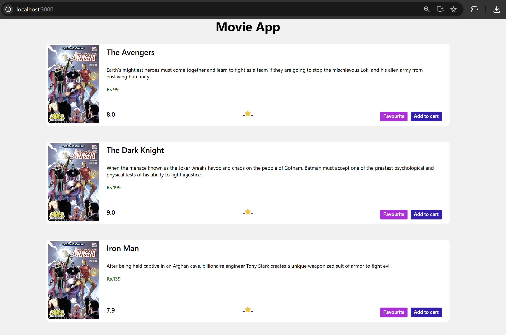

# REACT COMPONENT PART-II

## Toggling the Favourite & AddToCart Button

### MovieCard.js file:

```jsx
import { Component } from "react";

class MovieCard extends Component {
  constructor() {
    super();

    this.state = {
      title: "The Avengers",
      plot: "Supernatural powers shown in the movie.",
      price: 199,
      rating: 8.9,
      stars: 0,
      fav: false,
      isInCart: false,
    };
  }

  addStars = () => {
    // Form-1: Object form of setState
    // this.setState(
    //   {
    //     stars: this.state.stars + 0.5,
    //   },
    //   () => console.log("stars inside callback:", this.state.stars),
    // );
    // console.log("stars:", this.state.stars);

    // Form-2: Functional form of setState (Recommended)
    if (this.state.stars >= 5) {
      return;
    }
    this.setState((prevState) => {
      return {
        stars: prevState.stars + 0.5,
      };
    });
  };

  decStars = () => {
    if (this.state.stars <= 0) {
      return;
    }
    // this.setState({
    //   stars: this.state.stars - 0.5,
    // });
    this.setState((prevState) => {
      return {
        stars: prevState.stars - 0.5,
      };
    });
  };

  handleFav = () => {
    this.setState({
      fav: !this.state.fav,
    });
  };

  handleAddToCart = () => {
    this.setState({
      isInCart: !this.state.isInCart,
    });
  };

  render() {
    console.log("Rendered the component!");
    const { title, plot, price, rating, stars, fav, isInCart } = this.state;

    return (
      <div className="main">
        <div className="movie-card">
          <div className="left">
            
          </div>

          <div className="right">
            <div className="title">{title}</div>
            <div className="plot">{plot}</div>
            <div className="price">Rs.{price}</div>

            <div className="footer">
              <div className="rating">{rating}</div>

              <div className="star-dis">
                

                

                

                <span className="starCount">{stars}</span>
              </div>

              <!-- {fav ? (
                <button className="unfavourite-btn" onClick={this.handleFav}>
                  Un-Favourite
                </button>
              ) : (
                <button className="favourite-btn" onClick={this.handleFav}>
                  Favourite
                </button>
              )} -->

              <button
                className={fav ? "unfavourite-btn" : "favourite-btn"}
                onClick={this.handleFav}
              >
                {fav ? "Unfavourite" : "Favourite"}
              </button>

              <button
                className={isInCart ? "unfavourite-btn" : "cart-btn"}
                onClick={this.handleAddToCart}
              >
                {isInCart ? "Remove from Cart" : "Add to cart"}
              </button>
            </div>
          </div>
        </div>
      </div>
    );
  }
}

export default MovieCard;
```

#### Explaination:

1. Added new state variables

   ```jsx
   fav: false,
   isInCart: false,
   ```

   - `fav` → tracks whether the movie is marked as Favourite.

   - `isInCart` → tracks whether the movie is added to cart.

2. Added `handleFav` method

   ```jsx
   handleFav = () => {
     this.setState({
       fav: !this.state.fav,
     });
   };
   ```

   - Toggles the `fav` state between true and false when the Favourite button is clicked.

3. Added `handleAddToCart` method

   ```jsx
   handleAddToCart = () => {
     this.setState({
       isInCart: !this.state.isInCart,
     });
   };
   ```

   - Toggles the isInCart state to add or remove the movie from the cart.

4. Updated destructuring in `render()`

   ```jsx
   const { title, plot, price, rating, stars, fav, isInCart } = this.state;
   ```

   - Added `fav` and `isInCart` so they can be used inside JSX.

5. Replaced conditional JSX with dynamic button
   - Old commented code:
     ```jsx
     {
       /* {fav ? (...) : (...)} */
     }
     ```
   - Replaced with:

     ```jsx
     <button
       className={fav ? "unfavourite-btn" : "favourite-btn"}
       onClick={this.handleFav}
     >
       {fav ? "Unfavourite" : "Favourite"}
     </button>
     ```

     - Reason: Simplifies the conditional rendering by using **dynamic className and text** instead of writing two separate buttons.

6. Added Cart button with toggle logic

   ```jsx
   <button
     className={isInCart ? "unfavourite-btn" : "cart-btn"}
     onClick={this.handleAddToCart}
   >
     {isInCart ? "Remove from Cart" : "Add to cart"}
   </button>
   ```

   - Changes button style and text dynamically depending on whether the movie is already in the cart.

The update introduces Favourite and Cart functionality by adding new state variables, toggle handlers, and dynamic buttons to improve interactivity and simplify conditional rendering.

#### 🖥️ What You See in Browser:


## Creating Movie List

### MovieList.js

```jsx
import { Component } from "react";
import MovieCard from "./MovieCard";

class MovieList extends Component {
  render() {
    return (
      <>
        <MovieCard />
      </>
    );
  }
}

export default MovieList;
```

### App.js

```jsx
import MovieList from "./MovieList";
function App() {
  return (
    <>
      <h1 className="app-title">Movie App</h1>
      <MovieList />
    </>
  );
}

export default App;
```

#### Explaination

1. Created a `MovieList` Component
   - A new component `MovieList` was created to act as a container for movie cards.

   - It imports and renders the `MovieCard` component inside it.

2. Updated `App.js`
   - Previously, `App` was directly rendering the `MovieCard` component.
   - Now, `App` renders `MovieList` instead of `MovieCard`.

3. Improved Component Structure
   - This change separates UI responsibility:
     - `App` → Main application wrapper.
     - `MovieList` → Manages the list of movies.
     - `MovieCard` → Displays individual movie details.

4. Better Scalability
   - `MovieList` allows rendering multiple `MovieCard` components easily in the future.
   - Keeps the code cleaner and more modular.

## Props in React

A component can pass information to other components. Information that gets
passed from one component to another is known as props short for properties. A
component's props is an object which holds information about that component.

Props are passed down from parent to child components as a key and value pair. If
we want to pass information that is not string we have to wrap it with curly braces.
This information will be stored inside of the props object of the child component.

The most common use of props is to pass data and event handlers down to the child
components.

### Rules of Props

There is only one strict rule in regard to props in React. Props are read-only. A
component should never try to mutate or change the value of its props.

### Default Props

Default props can be used to define any props that you want to be set for a
component. They can be used to ensure that props will have a value if it was not
specified by the parent component.

We can set default values for the props by assigning to the special defaultProps
property on the component class.

### Additional Information: Type Checking in Props

&Note\*: Props type checking can be optionally used to ensure that the passed value
is of the correct data. This can help prevent errors in rendering and force correct
usage of components.

Props type-checking can be used to validate props that are passed down from the
parent for missing or incorrect data type values.

Type checking of props can also help document the code to make it easier to
understand and debug the component class.

We can add type checking to our props by specifying it on the _propsTypes_ static
property on the components class after it has been defined.The value of this property
is an object that has multiple key and value pairs. Each key corresponds to a prop of
that our component expects and the value should be the expected data type for that
prop.

We need to import the PropTypes object from ‘prop-types’ and use it to specify the
expected data type for each prop.

### Example Snippet-1

```jsx
import { Component } from "react";
import PropTypes from "prop-types";

export default class Navbar extends Component {
  render() {
    const { username, avatar } = this.props;

    return (
      <div>
        <span>{username}</span>
        
      </div>
    );
  }
}

// setting default props
Navbar.defaultProps = {
  username: "Shivani",
  avatar: "/image.png",
};

// type checking props
Navbar.propTypes = {
  username: PropTypes.string,
  avatar: PropTypes.string,
};
```

### State v/s Props

Props and state are both plain JavaScript objects. While both hold information
that influences the output of render, one important difference between the two
is that Props get passed to the component whereas state is managed within
the component.
| State | Props |
|------|------|
| State can be changed (mutable). | Props are read-only and cannot be changed (immutable). |
| State changes can be asynchronous. | Props cannot be changed. |
| State is managed within the component. | Props are passed to the component. |
| State is used to display changes within the component. | Props are used to pass information between components. |

### Example Snippet-2

#### Student.js

```jsx
import React from "react";

class Student extends React.Component {
  render() {
    console.log(this.props);
    const { name, marks } = this.props;
    return (
      <>
        <h1>Hello, {name}</h1>
        <p>You have secured {marks}%</p>
        <hr />
      </>
    );
  }
}

export default Student;
```

#### App.js

```jsx
import Student from "./Student";

function App() {
  return (
    <>
      <Student stuname="Shiv" marks={96} />
      <Student stuname="Shakti" marks={91} />
      <Student stuname="Sati" marks={95} />
    </>
  );
}

export default App;
```

#### Explaination

1. Student Component (`Student.js`)
   - A class component that receives data through props.
   - It destructures `name` and `marks` from `this.props`.
   - Displays the student's name and their percentage marks.
   - `console.log(this.props)` is used to view the passed props in the browser console.

2. Passing Props from `App.js`
   - The `App` component renders the `Student` component three times.
   - Each instance passes different values for `name` and `marks`.

3. Dynamic Rendering
   - The same `Student` component is reused with different props.

   - This demonstrates component reusability and dynamic data rendering in React.

#### 🖥️ What You See in Browser:


## Default Props in React

### Example Snippet-3

#### student.js

```jsx
/* Case-1: Props in Class Component */

// DefaultProps works properly with class components.
// Props are accessed using this.props inside render().

// import React from "react";
// class Student extends React.Component {
//   render() {
//     // Destructuring values from this.props
//     const { name, marks } = this.props;
//     return (
//       <>
//         <h1>Hello, {name}</h1>
//         <p>You have secured {marks}%</p>
//         <hr />
//       </>
//     );
//   }
// }

/* Case-2: Basic Functional Component */

// In functional components, props are received as a parameter.
// Using Student.defaultProps is not preferred in modern React.

// function Student(props) {
//   const { name, marks } = props;
//   return (
//     <>
//       <h1>Hello, {name}</h1>
//       <p>You have secured {marks}%</p>
//       <hr />
//     </>
//   );
// }

/* Case-3: Functional Component with Default Values Inside */

// Full props object is available (useful for debugging).
// Default values are assigned during destructuring.

// function Student(props) {
//   console.log(props); // Prints complete props object on every render

//   const { name = "Student", marks = "N.A" } = props;

//   return (
//     <>
//       <h1>Hello, {name}</h1>
//       <p>You have secured {marks}%</p>
//     </>
//   );
// }

/* Case-4: Recommended (Modern React Approach) */

// Default values are assigned directly in function parameters.
// Cleaner, shorter, and preferred in production code.

function Student({ name = "Student", marks = "N.A" }) {
  return (
    <>
      <h1>Hello, {name}</h1>
      <p>You have secured {marks}%</p>
      <hr />
    </>
  );
}

export default Student;
```

#### App.js

```jsx
import Student from "./Student";

function App() {
  return (
    <>
      <Student name="Shiv" marks={96} />
      <Student name="Shakti" marks={91} />
      <Student name="Sati" marks={95} />
      <Student />
    </>
  );
}

Student.defaultProps = {
  name: "Student",
  marks: "N.A",
};

export default App;
```

#### Changes Added

1. Converted Class Component to Functional Component
   - Replaced `extends React.Component` with a functional component.
   - Removed `render()` and `this.props`.
   - Used parameter destructuring for cleaner syntax.

2. Compared Multiple Approaches
   - Included class version and different functional patterns for learning and comparison.

3. Updated Default Values Handling
   - Removed `Student.defaultProps` usage.
   - Used default parameters inside the function:
     ```jsx
     function Student({ name = "Student", marks = "N.A" })
     ```
   - This is the recommended modern React approach.

4. Added <Student /> Without Props
   - Demonstrates how default values are automatically applied.

#### 🖥️ What You See in Browser:


## Passing data through props

### MovieList.js & MovieCard.js

#### Changes Added

1. Moved Movie Data to `MovieList` State
   - Previously, movie details were stored inside `MovieCard`.
   - Now, movie data is managed in `MovieList` using `this.state`.
   - This makes `MovieList` the parent data controller.

2. . Passed Movie Data via Props
   - Instead of hardcoding data inside `MovieCard`, the entire state is passed as a prop:
     ```jsx
     <MovieCard movies={this.state} />
     ```
   - Demonstrates parent → child data flow using props.

3. Accessed Props Inside `MovieCard`
   - Used `this.props.movies` to access passed data.
   - Applied destructuring:
     ```jsx
     const { title, plot, price, rating, stars, fav, isInCart } =
       this.props.movies;
     ```
   - This makes the component dynamic and reusable.

4. Improved Component Architecture
   - `MovieList` handles data (state management).
   - `MovieCard` handles UI rendering.
   - `Follows better separation of concerns.

## Displaying Movie List with props

### MovieList.js

#### Changes Added

1. Converted Single Movie Object to Movies Array
   - Previously, `MovieList` stored data for only one movie in state.
   - Updated state to store an array of movie objects inside `movies`.

2. Implemented Dynamic Rendering
   - Replaced single `<MovieCard />` with `.map()` method:

   ```jsx
   {
     movies.map((movie) => <MovieCard movies={movie} />);
   }
   ```

   - This allows rendering multiple movie cards dynamically.

3. Improved Component Scalability
   - Application now supports multiple movies instead of just one.
   - Makes the UI dynamic and scalable.

4. Better Data Structure
   - Each movie object now contains complete details (title, plot, poster, rating, price, etc.).
   - Follows real-world pattern for handling list-based data.

#### 🖥️ What You See in Browser:



## Event Handling in Movie List

### MovieList.js

```jsx
import React from "react";
import MovieCard from "./MovieCard";

class MovieList extends React.Component {
  constructor() {
    super();
    //Creating the state object
    this.state = {
      movies: [
        {
          title: "The Avengers",
          plot: "Earth's mightiest heroes must come together and learn to fight as a team if they are going to stop the mischievous Loki and his alien army from enslaving humanity.",
          poster:
            "https://m.media-amazon.com/images/M/MV5BNDYxNjQyMjAtNTdiOS00NGYwLWFmNTAtNThmYjU5ZGI2YTI1XkEyXkFqcGdeQXVyMTMxODk2OTU@._V1_SX300.jpg",
          rating: "8.0",
          price: 99,
          stars: 0,
          fav: false,
          isInCart: false,
        },
        {
          title: "The Dark Knight",
          plot: "When the menace known as the Joker wreaks havoc and chaos on the people of Gotham, Batman must accept one of the greatest psychological and physical tests of his ability to fight injustice.",
          poster:
            "https://m.media-amazon.com/images/M/MV5BMTMxNTMwODM0NF5BMl5BanBnXkFtZTcwODAyMTk2Mw@@._V1_SX300.jpg",
          rating: "9.0",
          price: 199,
          stars: 0,
          fav: false,
          isInCart: false,
        },
        {
          title: "Iron Man",
          plot: "After being held captive in an Afghan cave, billionaire engineer Tony starsk creates a unique weaponized suit of armor to fight evil.",
          poster:
            "https://m.media-amazon.com/images/M/MV5BMTczNTI2ODUwOF5BMl5BanBnXkFtZTcwMTU0NTIzMw@@._V1_SX300.jpg",
          rating: "7.9",
          price: 139,
          stars: 0,
          fav: false,
          isInCart: false,
        },
      ],
    };
  }

  handleAddStars = (movie) => {
    const { movies } = this.state;
    const movieId = movies.indexOf(movie);

    if (movies[movieId].stars < 5) {
      movies[movieId].stars += 0.5;
    }

    this.setState({
      movies,
    });
  };

  handleDecStars = (movie) => {
    const { movies } = this.state;
    const movieId = movies.indexOf(movie);

    if (movies[movieId].stars > 0) {
      movies[movieId].stars -= 0.5;
    }

    this.setState({
      movies,
    });
  };

  handleToggleFav = (movie) => {
    const { movies } = this.state;
    const movieId = movies.indexOf(movie);

    movies[movieId].fav = !movies[movieId].fav;

    this.setState({
      movies,
    });
  };

  handleAddtocart = (movie) => {
    const { movies } = this.state;
    const movieId = movies.indexOf(movie);

    movies[movieId].isInCart = !movies[movieId].isInCart;

    this.setState({
      movies,
    });
  };

  render() {
    const { movies } = this.state;

    return (
      <div className="main">
        {movies.map((movie, index) => (
          <MovieCard
            movies={movie}
            key={index}
            onIncStars={this.handleAddStars}
            onDecStars={this.handleDecStars}
            onClickFav={this.handleToggleFav}
            onClickAddtocart={this.handleAddtocart}
          />
        ))}
      </div>
    );
  }
}

export default MovieList;
```

#### Changes in MovieList.js (Parent Component)

1. State Management Moved Here
   - Previously, `MovieCard` was managing its own state.
   - Now, all movie data is stored inside `MovieList` in an array:
     ```jsx
     this.state = {
       movies: [ ... ]
     };
     ```
   - `MovieList` now controls the complete movie data.

2. Added Handler Functions in MovieList
   - These functions update the movie data:
     - handleAddStars() → Increases stars
     - handleDecStars() → Decreases stars
     - handleToggleFav() → Toggles favourite
     - handleAddtocart() → Toggles cart status
   - All state updates now happen in the parent component.

3. Passed Data + Functions to MovieCard
   - Inside render:
     ```jsx
     <MovieCard
       movies={movie}
       onIncStars={this.handleAddStars}
       onDecStars={this.handleDecStars}
       onClickFav={this.handleToggleFav}
       onClickAddtocart={this.handleAddtocart}
     />
     ```
   - Movie data is passed as props
   - Handler functions are passed as callback props

### MovieCard.js

```jsx
import React from "react";

class MovieCard extends React.Component {
  render() {
    const { movies, onIncStars, onClickFav, onClickAddtocart, onDecStars } =
      this.props;
    const { title, plot, poster, price, rating, stars, fav, isInCart } =
      this.props.movies;

    return (
      //Movie Card
      <div className="movie-card">
        {/**Left section of Movie Card */}
        <div className="left">
          
        </div>

        {/**Right section Movie Card */}
        <div className="right">
          {/**Title, plot, price of the movie */}
          <div className="title">{title}</div>
          <div className="plot">{plot}</div>
          <div className="price">Rs. {price}</div>

          {/**Footer starts here with ratings, stars and buttons */}
          <div className="footer">
            <div className="rating">{rating}</div>

            {/**Star image with increase and decrease buttons and star count */}
            <div className="star-dis">
               onDecStars(movies)}
              />
              
               onIncStars(movies)}
              />
              <span className="starCount">{stars}</span>
            </div>

            {/**conditional rendering on Favourite button */}
            <button
              className={fav ? "unfavourite-btn" : "favourite-btn"}
              onClick={() => onClickFav(movies)}
            >
              {fav ? "Un-favourite" : "Favourite"}
            </button>

            {/**Conditional Rendering on Add to Cart Button */}
            <button
              className={isInCart ? "unfavourite-btn" : "cart-btn"}
              onClick={() => onClickAddtocart(movies)}
            >
              {isInCart ? "Remove from Cart" : "Add to Cart"}
            </button>
          </div>
        </div>
      </div>
    );
  }
}

export default MovieCard;
```

#### Changes in MovieCard.js (Child Component)

1. Removed Internal State
   - MovieCard no longer has its own state.
   - It now depends completely on props from MovieList.
   - This makes it a controlled component.
2. Used Props Instead of State

   ```jsx
   const { title, plot, poster, price, rating, stars, fav, isInCart } =
     this.props.movies;
   ```

   - MovieCard now only displays data received from parent.

3. Triggered Parent Functions
   Instead of updating its own state:

   ```jsx
   onClick={() => onIncStars(movies)}
   ```

   - When user clicks, it calls parent function
   - Parent updates state
   - Updated data flows back to child

### Final Architecture After Changes:

| Component              | Responsibilities                                                                                                                                  |
| ---------------------- | ------------------------------------------------------------------------------------------------------------------------------------------------- |
| **MovieList (Parent)** | - Holds movie data in state <br> - Updates movie data (stars, favourite, cart) <br> - Passes movie data and handler functions to child component  |
| **MovieCard (Child)**  | - Displays movie UI <br> - Receives data via props <br> - Calls parent handler functions on user interaction <br> - Does NOT manage its own state |

## Some References:

[Props Vs State](https://www.geeksforgeeks.org/reactjs/reactjs-state-vs-props/)

[Presentational and Container components](https://www.patterns.dev/react/presentational-container-pattern/)
