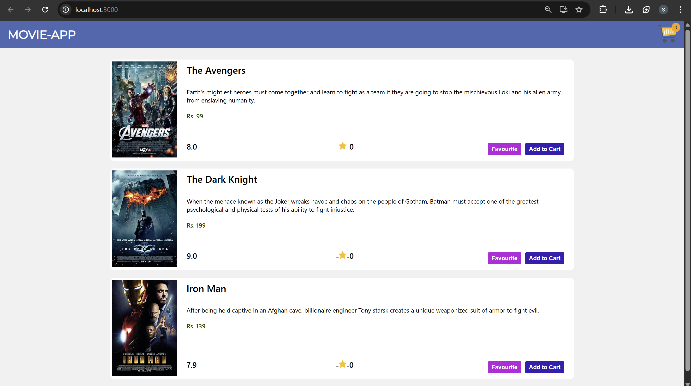
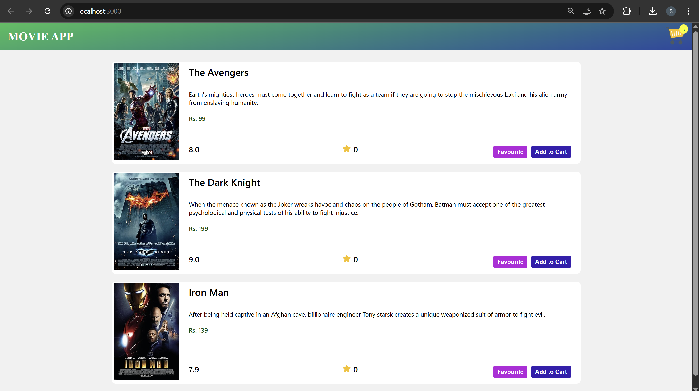

# STYLING IN REACT

Styling is one of the most important aspects of the React application. There
are various ways to follow when planning to style React components. Some of
the most popular and modern styling strategies are:

- CSS Stylesheets
- Inline Styling
- Styled Components
- CSS Modules

## CSS Style sheets

This is the conventional way of styling websites. In this method, we separate the
CSS part into an external file with a .css extension which is simply imported into the
React component. After that, we can give className and id to point which styles
should point to which element.

**Note:** `class` attribute is used in HTML, whereas `className` is used in React. This
is because class is a reserved keyword in JavaScript and since React uses JSX,
which is a syntax extension to JavaScript, we must use className instead of the
class attribute.

### Example: Styling the Navbar

#### Navbar.js

```jsx
Navbar.js;
import "./Navbar.css";
const Navbar = () => {
  return (
    <div className="navbar">
      <span>Title of Navbar</span>
      <span>
        Cart Icon<sup>count</sup>
      </span>
    </div>
  );
};
export default Navbar;
```

#### Navbar.css

```jsx
.navbar {
  display: flex;
  justify-content: space-between;
}
```

### Advantages:

- Styles of numerous documents can be organized from one single file.
- Good performance as it is easy for the browser to optimize and cache the files
  locally for repeated visits.
- You can very easily rip out the entire stylesheet and create a new one to
  refresh the look and feel of your app.

### Disadvantages:

- If not properly structured, It can become long and difficult to navigate through
  as the application becomes complex.
- CSS Stylesheets have global scopes and can cause conflicts in styles if the
  same selector names are used in the codebase

## Creating the Navbar Component

### Navbar.js

```jsx
import React from "react";
class Navbar extends React.Component {
  render() {
    return (
      <>
        <div>
          <div>Title</div>
          <div>
            
            <span>0</span>
          </div>
        </div>
      </>
    );
  }
}

export default Navbar;
```

#### Explaination:

1. Navbar.js (New File Created)
   - Created a new Navbar component.
   - Added basic layout structure:
     - Title section
     - Cart icon with count (0)
   - This component will act as the top navigation bar of the app.
2. MovieList.js (Updated)
   - Added id Property to Each Movie
     - Each movie object now includes a unique id.
       ```jsx
       id: 1;
       ```
     - This helps React efficiently identify elements in a list.
   - Replaced key={index} with key={movie.id}

     ```jsx
     key={movie.id}
     ```

     - Using a unique id is the recommended React practice instead of array index.

3. App.js (Updated)
   - Imported Navbar
     ```jsx
     import Navbar from "./Navbar";
     ```
   - Added <Navbar /> Component

     ```jsx
     <Navbar />
     ```

     - Navbar is now rendered above MovieList.
     - Improved application layout and structure.

## Inline styles in React

Inline CSS is the widely preferred but less recommended way to style your website.
In React, you will write your style using the style attribute followed by `=` and then
CSS properties enclosed by double curly braces `{{ }}` instead of quotes `“ ”`. React
uses JSX, In JSX for evaluation of any variable, state object , expression etc has to
be enclosed in {}. The style attribute in React only accepts a JavaScript object with
camelCased properties and values enclosed with quotes rather than a CSS string.
This is the reason there are two pairs of curly braces.

**NOTE**: Note: Inline styles have got more priority, and they will overwrite any other styles
given to them in any manner.

### Example: Styling the Navbar

#### Navbar.js - Method 1 (inline styling)

```jsx
const Navbar = () => {
  return (
    <div style={{ display: "flex", justifyContent: "space-between" }}>
      <span>Title of Navbar</span>
      <span>
        Cart Icon <sup>count</sup>
      </span>
    </div>
  );
};

export default Navbar;
```

#### Navbar.js - Method 2 (internal style object)

```jsx
const Navbar = () => {
  return (
    <div style={styles}>
      <span>Title of Navbar</span>
      <span>
        Cart Icon <sup>count</sup>
      </span>
    </div>
  );
};

let styles = {
  display: "flex",
  justifyContent: "space-between",
};

export default Navbar;
```

### Advantages:

- Inline CSS is best suited for learners and when you are testing a particular
  style.

### Disadvantages:

- It cannot be reused, i.e you must write the same CSS code repeatedly for
  the same styles.
- It does not provide browser cache advantages.
- Some useful CSS properties like pseudo-codes, pseudo-classes, media
  queries, etc. cannot be used in inline styles.

### Navbar.js

```jsx
import React from "react";
class Navbar extends React.Component {
  render() {
    return (
      <>
        <div
          style={{
            width: "100%",
            height: 70,
            background: "lightblue",
            display: "flex",
            justifyContent: "space-between",
          }}
        >
          <div className="title">Movie-App</div>
          <div>
            
            <span>3</span>
          </div>
        </div>
      </>
    );
  }
}

export default Navbar;
```

#### Changes Added

- Added inline styling to the navbar container (width, height, background, flex layout).
- Implemented flexbox to align title and cart section using `justify-content: space-between`.
- Updated title to "Movie-App".
- Added cart count display (`3`) beside the cart icon.

## CSS Scope in React

### Navbar.js

```jsx
import React, { Component } from "react";

class Navbar extends Component {
  render() {
    return (
      <div style={styles.nav}>
        <div style={styles.title}>Movie-App</div>
        <div style={styles.cartIconContainer}>
          
          <span style={styles.cartCount}>3</span>
        </div>
      </div>
    );
  }
}

const styles = {
  cartIcon: {
    height: 48,
    marginRight: 20,
  },
  nav: {
    height: 70,
    background: "#4267b2",
    display: "flex",
    justifyContent: "space-between",
    alignItems: "center",
    position: "relative",
  },
  title: {
    fontSize: 30,
    color: "#fff",
    fontWeight: 600,
    fontFamily: '"Montserrat", sans-serif',
    textTransform: "uppercase",
    marginLeft: 20,
  },

  cartIconContainer: {
    position: "relative",
    cursor: "pointer",
  },
  cartCount: {
    background: "orange",
    borderRadius: "50%",
    padding: "4px 8px",
    position: "absolute",
    right: 10,
    top: -5,
    fontSize: 12,
  },
};

export default Navbar;
```

#### Changes Added

- Replaced inline style inside JSX with a separate `styles` object.
- Applied styles using `style={styles.property}` for better readability and organization.
- Added cart icon image with styling.
- Implemented cart count badge with absolute positioning.
- Improved navbar design by adding background color, alignment, font styling, and positioning.

#### 🖥️ What You See in Browser:



## Styled Component

`styled-components` is a library for React that allows you to use component-level styles in your application that are written with a mixture of
JavaScript and CSS using a technique called CSS-in-JS. This is done using
the tagged template literal syntax. Follow the following steps to implement
styling using styles-components:

1. First, we need to installthe styled-components library by running

```sh
   npm install styled-components.
```

2. We then need to import the styled component library into our
   component by writing `import styled from 'styled-components'`.
3. Now we can create a variable by selecting a particular HTML element
   where we store our style keys.
4. Then we use the name of the variable we created as a wrapper around
   our JSX elements.

### Example: Styling the Navbar

#### Navbar.js

```jsx
import styled from "styled-components";

const Nav = styled.div`
  display: flex;
  justify-content: space-between;
`;

const Navbar = () => {
  return (
    <Nav>
      <span>Title of Navbar</span>
      <span>
        Cart Icon <sup>count</sup>
      </span>
    </Nav>
  );
};

export default Navbar;
```

### Example: Dynamic Styling with props

One of the advantages of styled-components is that the components themselves are
functional, as in you can use props within the CSS. You can also use conditional
statements to change styles based on a state or prop.

#### Navbar.js

```jsx
import styled from "styled-components";

const Nav = styled.div`
  display: flex;
  justify-content: space-between;
  background-color: ${(props) => props.color};
  font-weight: ${(props) => (props.bold ? "normal" : "bolder")};
`;

const Navbar = () => {
  return (
    <Nav color="yellow" bold="">
      <span>Title of Navbar</span>
      <span>
        Cart Icon <sup>count</sup>
      </span>
    </Nav>
  );
};

export default Navbar;
```

### Advantages:

- Styled components eliminate specificity problems as it encapsulates CSS
  inside a component.
- styled-components allow you to combine CSS and JS in the same file.
- You can make use of props to dynamically change the styles in any way.

### Disadvantages:

- Writing CSS in JS means separating the two in the future will be difficult,
  which is terrible for maintainability.
- Differentiating between styled and React components can be difficult
- For applications that use styled components, the browser downloads the CSS
  and parses it using JavaScript before injecting them into the page. This
  causes performance issues because the user must download a lot of
  JavaScript in the initial load.

### Navbar.js

```jsx
import React from "react";
import styled from "styled-components";

const Nav = styled.div`
  height: 70px;
  background: linear-gradient(170deg, #1bc059, #0d47a1);
  display: flex;
  justify-content: space-between;
  align-items: center;
  position: relative;
`;

const Title = styled.div`
  font-size: 30px;
  color: #fff;
  font-weight: 600;
  font-family: "Times New Roman", Times, serif;
  text-transform: uppercase;
  margin-left: 20px;
`;

const CartImg = styled.img`
  height: 48px;
  margin-right: 20px;
`;

const CartIconContainer = styled.div`
  position: relative;
  cursor: pointer;
`;

const CartCount = styled.div`
  background: yellow;
  border-radius: 50%;
  padding: 4px 8px;
  position: absolute;
  right: 10px;
  top: -5px;
  font-size: 12px;
`;

class Navbar extends React.Component {
  render() {
    return (
      <>
        <Nav>
          <Title>MOVIE APP</Title>

          <CartIconContainer>
            <CartImg
              alt="Cart-Icon"
              src="https://cdn-icons-png.flaticon.com/128/891/891462.png"
            />
            <CartCount>5</CartCount>
          </CartIconContainer>
        </Nav>
      </>
    );
  }
}

export default Navbar;
```

#### Changes Added

Navbar.js (Using Styled Components)

- Replaced the previous inline styling (`styles` object) with styled-components.
- Created styled elements like `Nav`, `Title`, `CartImg`, `CartIconContainer`, and `CartCount`.
- Styling is now written inside JavaScript using CSS syntax with `styled.div`, `styled.img`, etc.
- Each styled component acts like a React component with its own styles.
- This makes the code cleaner, reusable, and easier to manage compared to large inline style objects.


#### 🖥️ What You See in Browser:

