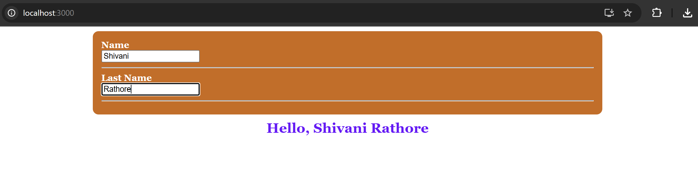
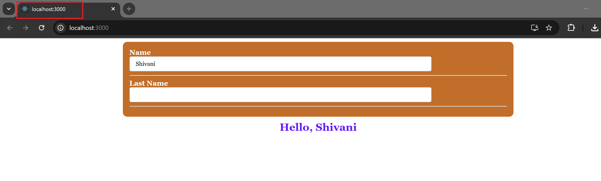
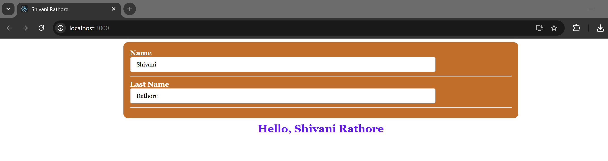

# REACT HOOKS

## Introduction

### What are hooks?

Hooks are a new addition in React 16.8. They are functions that let you manage the
internal state of component and handle post rendering side effects.

**Note:** Before we continue, note you can try Hooks in a few components without
rewriting any existing code and hooks are 100% backwards-compatible. They don’t
contain any breaking changes.

### Motivation to use hooks

Hooks can be used to address the following problems caused by using class based
components:

1. **Hard to reuse stateful logic between components**
   - Hooks provide a way to separate stateful logic from a component, which
     allows for independent testing and reusability. With Hooks, you can reuse this
     logic in multiple components without restructuring the component hierarchy.
     This flexibility makes it easy to share Hooks with others and promote
     community collaboration.

2. **Complex components become difficult to understand**
   - In class-based components, related code often gets mixed with unrelated
     code, which can lead to bugs and inconsistencies. Hooks address this issue
     by allowing you to break down a component into smaller functions that handle
     related pieces of logic, like setting up a subscription or fetching data. This
     approach is more intuitive than forcing a split based on lifecycle methods.

3. **Classes can be confusing at times**
   - Classes in React can be a significant hurdle for learning the framework. Not
     only do you have to understand how "this" works in JavaScript, which can be
     quite different from other languages, but they can also complicate code reuse
     and organization. Hooks provide a simpler way to use React's features
     without relying on classes. By embracing functions, Hooks allow for a more
     intuitive and functional programming style that is closer to the conceptual
     nature of React components.

### Rules of Hooks

The two main rules of Hooks in React are:

1. **Only call Hooks at the top level:**
   - This rule states that Hooks should only be called at the top level of a function
     component or another custom Hook. They should not be called inside loops,
     conditions, or nested functions, as this can lead to unexpected behavior and
     bugs.
   - Example 1: Incorrectly using hooks inside a function
     ```jsx
     const showAlert = () => {
       useEffect(() => {
         alert("Dependency has changed");
       }, [dependency]);
     };
     ```
   - Example 2: Correctly using hooks at the top level of the component
     ```jsx
     useEffect(() => {
       alert("Dependency has changed");
     }, [dependency]);
     ```
2. Only call Hooks from React function components: -
   - This rule states that Hooks can only be used in React function components or
     other custom Hooks. They should not be used in class components or regular
     JavaScript functions, as this can cause errors or crashes.
   - Example 1: Incorrectly using hooks inside a class based component
     ```jsx
     class Example extends Component {
       useEffect(() => {
         alert("Dependency has changed");
       }, [dependency]);
     }
     ```
   - Example 2: Correctly using hooks inside a functional component

     ```jsx
     const Example = () => {
       const [dependency, setDependency] = useState("");

       useEffect(() => {
         alert("Dependency has changed");
       }, [dependency]);
     };
     ```

Adhering to these rules ensures that Hooks work as intended and can help to
prevent common issues and errors when working with React.

### Order of Hooks

In React, hooks are executed in the order in which they are written. The order of
Hooks is important. The order in which Hooks are called within a component must
always be the same, so that React can correctly associate state and props with each
Hook.

## State in Function & Class based components

State management in functional and class-based React components is essentially
the same, but the syntax and implementation details differ.

### Syntax:

Class-based components have lifecycle methods, such as `componentDidMount`
and `componentDidUpdate`, which allow for fine-grained control over the state and
behavior of the component. Functional components have `hooks` that let you hook
into the state and lifecycle features of the component but the syntax and
implementation are different.

### Updates and Side effects:

In class-based components, state is updated via the `setState` method. In functional
components with hooks, state is updated via the update function returned by the
`useState` hook. Side effects in functional components are managed using the
`useEffect` hook which is a replacement for the lifecycle methods used in class-based
components, such as `componentDidMount` and `componentDidUpdate`.

### Boilerplate:

Class-based components require more boilerplate code to manage state and
lifecycle methods, which can make the code more verbose and harder to read.
Functional components with hooks have less boilerplate code, making them more
concise and easier to read.

### Recap: React State in Class Components

#### InputWithClassComponent.js

```jsx
import React from "react";

export default class Input extends React.Component {
  constructor() {
    super();
    this.state = {
      name: "",
      lastName: "",
    };
  }

  handleName = (e) => {
    this.setState({
      name: e.target.value,
    });
  };

  handleLastname = (e) => {
    this.setState({
      lastName: e.target.value,
    });
  };

  render() {
    return (
      <>
        <div className="section">
          <Row label="Name">
            <input value={this.state.name} onChange={this.handleName} />
          </Row>
          <Row label="Last Name">
            <input value={this.state.lastName} onChange={this.handleLastname} />
          </Row>
        </div>

        <h2>Hello, {this.state.name + " " + this.state.lastName}</h2>
      </>
    );
  }
}

function Row(props) {
  const { label } = props;
  return (
    <>
      <lable>
        {label}
        <br />
      </lable>
      {props.children}
      <hr />
    </>
  );
}
```

- Created a class component Input to manage form inputs using React state.

- Added two state variables: name and lastName.

- Implemented handleName and handleLastname functions to update state when the user types in the input fields.

- Used controlled components where the input values are controlled by React state.

- Displayed a greeting message (Hello, Name LastName) that updates dynamically as the user types.

- Created a reusable Row functional component to render a label and input field using props.children.

#### App.js

```jsx
import Input from "./InputWithClass";

function App() {
  return (
    <>
      <Input />
    </>
  );
}

export default App;
```

- Imported the Input component.

- Rendered the Input component inside the App component to display the input fields and greeting message in the application.

#### 🖥️ What You See in Browser:



## The useState() Hook

**useState** is a React Hook that lets you add a state variable to your component.

### Parameters

**Intial State:** The useState hook in React takes an initial state as a parameter.
The initial state can be a value of any type. If a function is passed as the initial
state, it will be treated as an initializer function. The initializer function should
be a pure function, taking no arguments, and returning a value of any type.
React will call the initializer function when initializing the component and store
the return value as the initial state.
The initial state is only used during the first render and subsequent calls to
useState with a new initial state will override the previous initial state.

### Returns

The **useState** hook returns an array with exactly two values:

1. The current state. During the first render, it will match the initialState you have
   passed.
2. The set function that lets you update the state to a different value and trigger
   a re-render.

#### Example: Usage useState hook

```jsx
const [count, setCount] = useState(0);
```

This code snippet uses the **useState** hook to define a state variable named **count**
with an initial value of 0, and a function named **setCount** that can be used to update
the state.

The set function returned by useState lets you update the state to a different value
and trigger a re-render. You can pass the next state directly, or a function that
calculates it from the previous state:

#### Example 1: Basic usage of state setter function

```jsx
const [count, setCount] = useState(0);
setCount(1);
```

#### Example 2: Passing a callback function to set the state

```jsx
const [count, setCount] = useState(0);
setCount((prevCount) => prevCount + 1);
```

**Note:** Using the state setter function with a callback allows you to access the latest
state value at the time of the update and perform calculations or updates based on
that value. This ensures that the state is always updated correctly and consistently,
regardless of the timing of the updates.

### React State in Functional Components

#### InputWithFunction.js

```jsx
import { useState } from "react";

export default function Input() {
  const [name, setName] = useState("");
  const [lastName, setLastName] = useState("");

  return (
    <>
      <div className="section">
        <Row label="Name">
          <input
            className="input"
            value={name}
            onChange={(e) => setName(e.target.value)}
          />
        </Row>
        <Row label="Last Name">
          <input
            className="input"
            value={lastName}
            onChange={(e) => setLastName(e.target.value)}
          />
        </Row>
      </div>
      <h2>
        Hello, {name} {lastName}
      </h2>
    </>
  );
}

function Row(props) {
  const { label } = props;
  return (
    <>
      <lable>
        {label}
        <br />
      </lable>
      {props.children}
      <hr />
    </>
  );
}
```

- Converted the form component to a functional component and used the `useState()` Hook for state management.
- Imported `useState` from React to create and manage state inside the function component.
- Created two state variables:
  - `name` with `setName`
  - `lastName` with `setLastName`
- `useState("")` initializes both states with an empty string.
- The input fields are controlled components, where the value comes from state and updates using the setter functions (`setName`, `setLastName`) on every change.
- As the user types in the input fields, `useState()` updates the state and the greeting message re-renders automatically to display the latest values.
- A reusable Row component is used to display the label and input field using `props.children`.

#### App.js

```jsx
import "./index.css";
import Input from "./InputWithFunction";

function App() {
  return (
    <>
      <Input />
    </>
  );
}

export default App;
```

- Imported the functional version of the `Input` component (`InputWithFunction`).

- Rendered the component inside `App` to display the form and greeting message.

- This setup demonstrates state management in functional components using `useState()` instead of class-based state.

NOTE: The output for the functional component using `useState()` will be the same as the class component example shown above.

## The useEffect hook

**useEffect** is a React Hook that lets you synchronize a component with an external
system.

### Parameters

1. **Setup:**
   - The **useEffect** hook in React takes a function as its first argument,
     which contains the logic of your effect. This function may also return a
     cleanup function. When your component is initially added to the DOM, React
     will execute the setup function you provided in the useEffect hook. On
     subsequent re-renders React will first call the cleanup function with the
     previous values. After that, React will run your setup function with the new
     values.

   - Finally, when your component is removed from the DOM, React will execute
     your cleanup function one last time. This ensures that your component's side
     effects are properly added and removed throughout its lifecycle.

2. **Options (dependencies):**
   - The **useEffect** hook in React takes a dependency
     array as its second argument, which contains all the reactive values
     referenced inside the setup code. These values include props, state, and all
     variables and functions declared directly in the component body. The list of
     dependencies must have a constant number of items and be written inline in
     the form of **[dep1, dep2, dep3]**.
   - React compares each dependency with its previous value using a comparison
     algorithm. If you don't provide the dependency array, your effect will run after
     every re-render of the component.

### Returns

The **useEffect** hook does not return an value.

#### Example 1: Usage of useEffect hook

```jsx
useEffect(() => {
  setInterval(() => {
    setTimer((prev) => prev++);
  }, 1000);
}, []);
```

- This code snippet uses the **useEffect** hook to set an interval that increments the
  state value of timer after every second. The effect runs only once on mount due to
  an empty dependency array.

#### Example 2: Usage of useEffect hook (with a cleanup function)

```jsx
useEffect(() => {
  const interval = setInterval(() => {
    setTimer((prev) => prev++);
  }, 1000);

  return () => clearInterval(interval);
}, []);
```

- This code snippet uses the useEffect hook to create a timer that updates every
  second. It sets up an interval to update the timer and clears it on unmount using the
  cleanup function. The effect runs only once on mount due to an empty dependency
  array.

### InputWithFunction.js

```diff
- import { useState } from "react";
+ import { useState, useEffect } from "react";
```

```diff
+ useEffect(() => {
+   document.title = name + " " + lastName;
+ }, [lastName]);
```

#### Functional Component with `useEffect`

- Added the `useEffect()` Hook to perform a side effect after rendering.
- The effect updates the browser tab title using the current `name` and `lastName`.
- A dependency array [`lastName`] was added so the effect runs only when `lastName` changes.
- Demonstrates how `useEffect()` handles lifecycle behavior in functional components similar to class lifecycle methods.
- Purpose of useEffect() here:
  - Run logic after the component renders.
  - Update document title whenever the dependency changes.

### InputWithClass.js

```diff
+ componentDidMount() {
+   document.title = this.state.name + " " + this.state.lastName;
+ }

+ componentDidUpdate() {
+   document.title = this.state.name + " " + this.state.lastName;
+ }
```

#### Added Lifecycle Methods in Class Component

- Added lifecycle methods `componentDidMount()` and `componentDidUpdate()`.
- These methods update the document title whenever the component mounts or state changes.
- Demonstrates how side effects are handled in class components using lifecycle methods.

`useEffect()` is used in functional components to perform side effects such as updating the document title, fetching data, or setting timers. In class components, similar behavior is handled using lifecycle methods like `componentDidMount()` (runs after the component mounts) and `componentDidUpdate()` (runs after updates). The dependency array in `useEffect()` controls when the effect should run, making it a flexible way to replicate lifecycle behavior that previously required multiple class lifecycle methods.

#### 🖥️ What You See in Browser:




