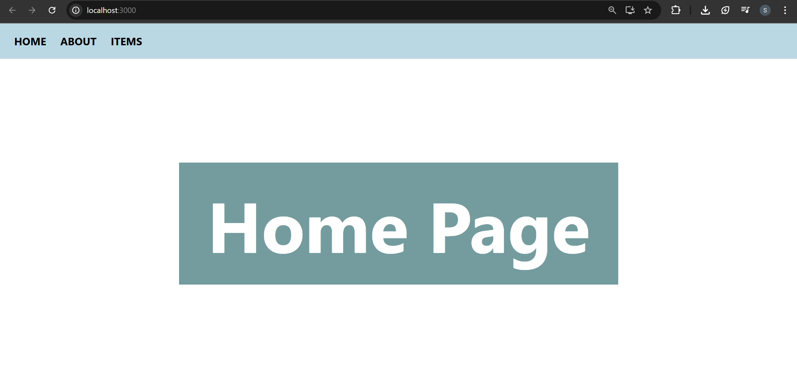
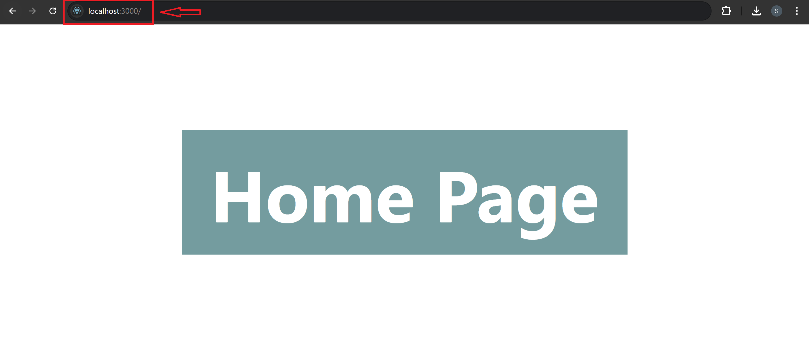
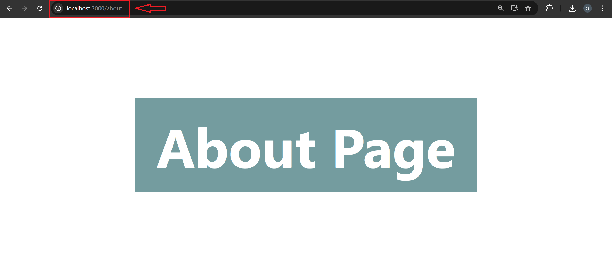
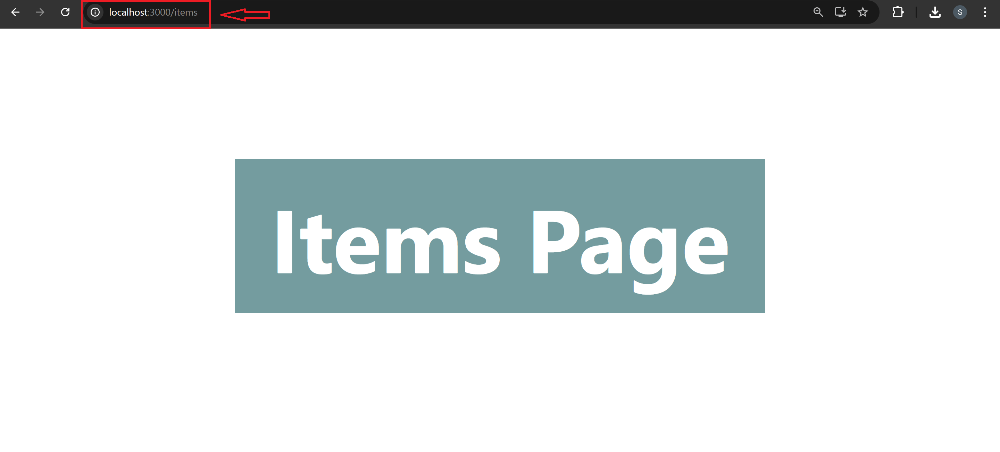

# REACT ROUTER

## Introduction to Routing

### Routing Mechanism

Routing in React is used to manage the URLs of the application and map them to
different views or components that need to be displayed on the page.

In MPAs, each page has its own URL, and when the user navigates to a new page,
the browser sends a request to the server, and the server responds with a new
HTML page, which replaces the current page in the browser. The server determines
which page to return based on the URL requested by the client. This process is
known as server-side routing. This approach can be slower and less responsive, and
it can lead to longer load times.

In contrast, in SPAs, the application is loaded once, and all the content is loaded
dynamically without the need for page refreshes. Instead of loading new pages, the
application updates the current view by manipulating the DOM. SPAs use client-side
routing, which means that the routing is handled by the client-side JavaScript code.
This process is known as client-side routing.This allows for faster and more
responsive navigation, as the entire page does not need to be reloaded.

### React Router

ReactJS Router is mainly used for developing Single Page Web Applications. React
Router is used to define multiple routes in the application. A Route is used to define
and render components based on the specified path. When the user navigates to a
particular URL, React Router renders the component associated with that route.

For Example:

```text
src/
│
├── components/
│   ├── Header.js
│   ├── Footer.js
│   ├── Button.js
│   ├── Input.js
│   └── ...
│
├── pages/
│   ├── Home.js
│   ├── About.js
│   ├── Contact.js
│   └── ...
│
├── routes.js
├── App.js
└── index.js
```

In this example, the components folder contains reusable UI components that can be
used across different pages. The pages folder contains the different views or pages
of the application.

The routes.js file contains the route definitions for the application. This is where the
`<Route>` components are defined, along with the path and the component to be
rendered for each route.

## React Router Setup

```text
React-Router
│
├── node_modules
├── public
│
├── src
│   │
│   ├── components
│   │   └── Navbar.js
│   │
│   ├── pages
│   │   ├── About.js
│   │   ├── Home.js
│   │   └── Items.js
│   │
│   ├── App.js
│   ├── index.css
│   └── index.js
│
├── .gitignore
├── package-lock.json
├── package.json
└── README.md
```

### App.js

```jsx
import Navbar from "./components/Navbar";
import About from "./pages/About";
import Home from "./pages/Home";
import Items from "./pages/Items";
import { useState } from "react";

function App() {
  const [page, setPage] = useState("home");
  return (
    <>
      <Navbar setPage={setPage} />
      {page === "home" && <Home />}
      {page === "about" && <About />}
      {page === "items" && <Items />}
    </>
  );
}

export default App;
```

Controls the **application's page navigation using React state**.

- Uses `useState` to store the currently active page.
- Passes the `setPage` function to Navbar so it can update the page.
- Conditionally renders `Home`, `About`, or `Items` components depending on the current state value.
- Demonstrates **manual navigation logic before using React Router**.

### components/Navbar.js

```jsx
function Navbar({ setPage }) {
  return (
    <>
      <div className="nav">
        <h4 onClick={() => setPage("home")}>HOME</h4>
        <h4 onClick={() => setPage("about")}>ABOUT</h4>
        <h4 onClick={() => setPage("items")}>ITEMS</h4>
      </div>
    </>
  );
}

export default Navbar;
```

Creates the **navigation bar used to switch between pages**.

- Receives the `setPage` function from `App`.
- Updates the page state when a navigation item is clicked.
- Allows users to switch between Home, About, and Items without reloading the page.

### pages/Home.js

```jsx
function Home() {
  return (
    <>
      <main>
        <h1>Home Page</h1>
      </main>
    </>
  );
}

export default Home;
```

Defines the Home page component of the application.

- Displays the main Home page heading.
- Rendered when the page state is set to `"home"`.

### pages/About.js

```jsx
function About() {
  return (
    <>
      <main>
        <h1>About Page</h1>
      </main>
    </>
  );
}

export default About;
```

Defines the **About page component**.

- Displays information for the About section.
- Rendered when the page state is set to `"about"`.

### pages/Items.js

```jsx
function Items() {
  return (
    <>
      <main>
        <h1>Items Page</h1>
      </main>
    </>
  );
}

export default Items;
```

Defines the Items page component.

- Displays the Items section of the application.
- Rendered when the page state is set to `"items"`.

### index.js

```jsx
import React from "react";
import ReactDOM from "react-dom/client";
import "./index.css";
import App from "./App";

const root = ReactDOM.createRoot(document.getElementById("root"));
root.render(
  <React.StrictMode>
    <App />
  </React.StrictMode>,
);
```

Acts as the entry point of the React application.

- Imports the main `App` component.
- Renders the application into the root DOM element using React DOM.
- Also,`index.css` contains global styling for layout, navigation bar, and page headings.

This setup demonstrates **how page navigation can be simulated using React state before learning React Router**.

#### 🖥️ What You See in Browser:



## Types of React Router

In React Router v6.4, there are different types of routers that can be used depending
on the needs of the application:

1. `<BrowserRouter>`: This is the most commonly used router and is designed
   for applications that will be hosted on a server that will serve all requests to
   the application. It uses HTML5 history API to keep the UI in sync with the
   URL.
2. `<HashRouter>`: This router is designed for applications that will be hosted on
   a server that does not support HTML5 history API, such as GitHub Pages or
   static file servers. It uses the URL hash to keep the UI in sync with the URL.
3. `<MemoryRouter>`: This router is designed for testing and non-visual use
   cases, such as server-side rendering or testing.
4. `<NativeRouter>`: This router is designed for React Native applications and
   uses the native routing features of the platform.
5. `<StaticRouter>`: This router is designed for server-side rendering and
   generates a set of static routes based on a given location.

In v6.4, new routers were introduced that support the new data APIs and to create
custom routers:

- **createBrowserRouter**: This function creates a custom `<BrowserRouter>`
  router with a custom history object. The custom history object can be used to
  manipulate the browser's URL and handle navigation between pages without
  causing a full page refresh.
- **createMemoryRouter**: This function creates a custom `<MemoryRouter>`
  router with a custom history object. The custom history object can be used to
  manipulate the router's state and handle navigation between pages.
- **createHashRouter**: This function creates a custom `<HashRouter>` router with
  a custom history object. The custom history object can be used to manipulate
  the browser's URL hash and handle navigation between pages without
  causing a full page refresh.

## createBrowserRouter

This is the recommended router for all React Router web projects. It uses the
DOM History API to update the URL and manage the history stack.

### For Example: WAY-1

```jsx
import { createBrowserRouter, RouterProvider } from "react-router-dom";
import Home from "./pages/Home";
import About from "./pages/About";

function App() {
  const router = createBrowserRouter([
    { path: "/", element: <Home /> },
    { path: "/about", element: <About /> },
  ]);

  return (
    <>
      <RouterProvider router={router} />
    </>
  );
}

export default App;
```

In this example, the createBrowserRouter function is used to create a custom
<BrowserRouter> router with two routes: one for the home page, and one for the
about page. The RouterProvider component is used to wrap the app and provide
access to the custom router.

1. Import the necessary modules, including createBrowserRouter,
   RouterProvider, Home, and About.
2. Use createBrowserRouter to create a custom `<BrowserRouter>` router with
   the two routes: Home and About.
3. Wrap the app with RouterProvider and pass in the custom router as a prop.
   The RouterProvider component ensures that the routing context is available to
   all child components of your app.
4. Render the App component.

### For Example: WAY-2

```jsx
import {
  createBrowserRouter,
  createRoutesFromElements,
  Route,
  RouterProvider,
} from "react-router-dom";
import Home from "./pages/Home";
import About from "./pages/About";
import Items from "./pages/Items";

function App() {
  const routes = createRoutesFromElements(
    <>
      <Route path="/" element={<Home />} />
      <Route path="/about" element={<About />} />
      <Route path="/items" element={<Items />} />
    </>,
  );

  const router = createBrowserRouter(routes);

  return (
    <>
      <RouterProvider router={router} />
    </>
  );
}

export default App;
```

In this example, the **createRoutesFromElements** function is used to create an array
of route objects from JSX elements and avoid manually creating an array of route
objects. The **createBrowserRouter** function is then used to create a custom
`<BrowserRouter>` router with the array of route objects. Finally, the **RouterProvider**
component is used to wrap the app and provide access to the custom router.

## Creating routes

### App.js

```diff
 import Home from "./pages/Home";
 import About from "./pages/About";
 import Items from "./pages/Items";
-import Navbar from "./components/Navbar";
-import { useState } from "react";
+import { createBrowserRouter, RouterProvider } from "react-router-dom";

 function App() {
-  const [page, setPage] = useState("home");
+  const router = createBrowserRouter([
+    { path: "/", element: <Home /> },
+    { path: "about", element: <About /> },
+    { path: "items", element: <Items /> },
+  ]);

   return (
     <>
-      <Navbar setPage={setPage} />
-      {page === "home" && <Home />}
-      {page === "about" && <About />}
-      {page === "items" && <Items />}
+      <RouterProvider router={router} />
     </>
   );
 }

 export default App;
```

Navigation is implemented using **React Router instead of state management**.

- `createBrowserRouter`
  - Defines application routes and maps paths to components.
- `RouterProvider`
  - Provides routing configuration to the entire application.
- Route configuration
  - `/` → `Home`
  - `/about` → `About`
  - `/items` → `Items`

- Removed `useState` page control
  - Navigation is now handled through URL paths instead of conditional rendering.

### Navbar.js

```diff
-function Navbar({setPage}) {
+function Navbar() {
   return (
     <>
       <div className="nav">
-        <h4 onClick={() => setPage('home')}>HOME</h4>
-        <h4 onClick={() => setPage('about')}>ABOUT</h4>
-        <h4 onClick={() => setPage('items')}>ITEMS</h4>
+        <h4>HOME</h4>
+        <h4>ABOUT</h4>
+        <h4>ITEMS</h4>
       </div>
     </>
   );
 }

 export default Navbar;
```

Navbar is simplified to **only display navigation items**.

- Removed `setPage` prop
  - Component no longer controls page state.
- Removed `onClick` handlers
  - Page switching is not handled through state anymore.
- Acts as a UI navigation component
  - Routing behavior will be handled by React Router.

#### 🖥️ What You See in Browser:







## Route Element

```jsx
import Home from "./pages/Home";
import About from "./pages/About";
import Items from "./pages/Items";
import {
  createBrowserRouter,
  RouterProvider,
  createRoutesFromElements,
  Route,
} from "react-router-dom";

function App() {
  //Way-2
  const routes = createRoutesFromElements(
    <>
      <Route path="/" element={<Home />} />
      <Route path="/about" element={<About />} />
      <Route path="items" element={<Items />} />
    </>,
  );
  const router = createBrowserRouter(routes);

  //Way-1
  // const router = createBrowserRouter([
  //   { path: "/", element: <Home /> },
  //   { path: "about", element: <About /> },
  //   { path: "items", element: <Items /> },
  // ]);

  return (
    <>
      <RouterProvider router={router} />
    </>
  );
}

export default App;
```

Routing configuration is updated to use `createRoutesFromElements` with `<Route />` components instead of defining routes directly inside an array.

- Added `createRoutesFromElements` and `Route` imports
  - Enables defining routes using JSX elements.
- Created `routes` using `<Route />` components
  - `/` → `Home`
  - `/about`→ `About`
  - `/items` → `Items`
- Passed `routes` into `createBrowserRouter`
  - Router instance is created using the generated route elements.
- Previous array-based routing kept as comment
  - Shows an alternative way to define routes using an object array.
- `RouterProvider` still used to provide router configuration
  - Makes routing available to the entire application.
