# MINI-PROJECT: SCORE- KEEPER

## Events in JSX

Handling events with React elements is very similar to handling events on DOM
elements. There are some syntax differences:

- React events are named using camelCase, rather than lowercase.
- With JSX you pass a function as the event handler, rather than a string.

### For example

#### In HTML:

```html
<button onclick="activateLasers()">Activate Lasers</button>
```

#### In React: Slightly different

```jsx
<button onClick={activateLasers}>Activate Lasers</button>
```

Another difference is that you cannot return false to prevent default behavior in
React. You must call preventDefault explicitly. For example, with plain HTML, to
prevent the default form behavior of submitting, you can write:

```jsx
<form onsubmit="console.log('You clicked submit.'); return false">
  <button type="submit">Submit</button>
</form>
```

In React, this could instead be:

```jsx
function Form() {
  function handleSubmit(e) {
    e.preventDefault();
    console.log("You clicked submit.");
  }

  return (
    <form onSubmit={handleSubmit}>
      <button type="submit">Submit</button>
    </form>
  );
}
```

Here, e is a synthetic event. React defines these synthetic events, so you don’t need
to worry about cross-browser compatibility. React events do not work the same as
native events. See the [SyntheticEvent](https://legacy.reactjs.org/docs/events.html) reference guide to learn more.
When using React, you generally don’t need to call addEventListener to add
listeners to a DOM element after it is created. Instead, just provide a listener when
the element is initially rendered.

### Score-Keeper App: Events in JSX

```html
<!DOCTYPE html>
<html lang="en">
  <head>
    <title>Score-Keeper App</title>
    <script
      crossorigin
      src="https://unpkg.com/react@18/umd/react.development.js"
    ></script>
    <script
      crossorigin
      src="https://unpkg.com/react-dom@18/umd/react-dom.development.js"
    ></script>
    <script src="https://unpkg.com/@babel/standalone/babel.min.js"></script>
  </head>
  <body>
    <div id="root" style="text-align: center"></div>

    <script type="text/babel">
      let score = 0;
      let wicket = 0;

      function clickOne() {
        alert("1 is clicked!");
      }

      const App = () => (
        <>
          <h1>SCORE KEEPER</h1>
          <h2>
            SCORE: {score}/{wicket}
          </h2>
          <div>
            <button onClick={clickOne}>1</button>
            <button>2</button>
            <button>3</button>
            <button>4</button>
            <button>5</button>
            <button>6</button>
            <button>Wicket</button>
          </div>
        </>
      );
      const rootElement = ReactDOM.createRoot(document.getElementById("root"));
      rootElement.render(<App />);
    </script>
  </body>
</html>
```

#### 🖥️ What You See in Browser:

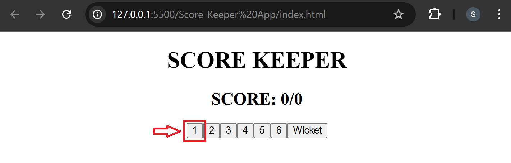
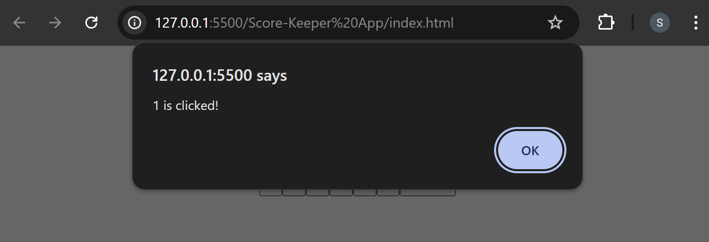

## Virtual DOM

The virtual DOM (VDOM) is a programming concept where an ideal, or “virtual”,
representation of a UI is kept in memory and synced with the “real” DOM by a library
such as ReactDOM. This process is called reconciliation.
In reality, the virtual DOM is just an organized collection of React elements — plain
objects, and it mimics the browser DOM in a way that is easier to maintain and
update.
Let‘s take a step back and check out an example of a React element.

```jsx
const title = <h1>Hello, world!</h1>;
```

JSX does the heavy lifting to convert the familiar HTML syntax into a React element.
Without JSX, this is just:

```jsx
const title = React.createElement("h1", null, "Hello, world!");
```

And below is the created React element under the hood.

```jsx
{
  "type": "h1",
  "props": {
    "children": "Hello, world!"
  }
}
```

### Score-Keeper App: Virtual DOM

```html
<body>
  <div id="root" style="text-align: center"></div>

  <script type="text/babel">
    let score = 0;
    let wicket = 0;

    function addOne() {
      score += 1;
      rootElement.render(<App />);
      console.log(score);
    }

    const App = () => (
      <>
        <h1>SCORE KEEPER</h1>
        <h2>
          SCORE: {score}/{wicket}
        </h2>
        <div>
          <button onClick={addOne}>1</button>
          <button>2</button>
          <button>3</button>
          <button>4</button>
          <button>5</button>
          <button>6</button>
          <button>Wicket</button>
        </div>
      </>
    );
    const rootElement = ReactDOM.createRoot(document.getElementById("root"));
    rootElement.render(<App />);
  </script>
</body>
```

#### 🖥️ What You See in Browser:

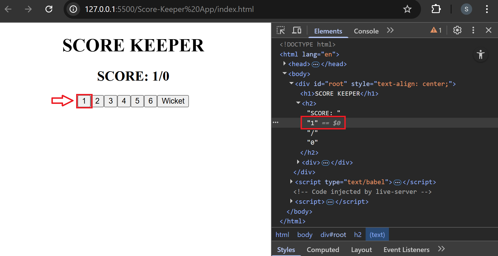

## More on Event-Handling

When you define a component using an ES6, a common pattern is for an event
handler like ‘handleClick’ to be a method on the components. For example, the
Toggle component returns a button that lets the user toggle between “ON” and “OFF”
states:

```jsx
import React, { useState } from "react";

function Toggle() {
  const [isToggleOn, setIsToggleOn] = useState(true);

  const handleClick = () => {
    setIsToggleOn(!isToggleOn);
  };

  return <button onClick={handleClick}>{isToggleOn ? "ON" : "OFF"}</button>;
}

export default Toggle;
```

The alternate way to pass arguments to event handlers is using inline functions:

```jsx
<button onClick={() => (state.isToggleOn = !isToggleOn)}>
  {state.isToggleOn ? "ON" : "OFF"}
</button>
```

You have to be careful about the meaning of this in JSX callbacks. In JavaScript,
class methods are not bound by default. If you forget to bind this.handleClick and
pass it to onClick, this will be undefined when the function is called.
But this is not the case in functional components and that's why we are using public
fields syntax to correctly bind callbacks.

### Score-Keeper App: More on Event Handling

```html
<body>
  <div id="root" style="text-align: center"></div>

  <script type="text/babel">
    let score = 0;
    let wicket = 0;

    function addOne() {
      score += 1;
      rootElement.render(<App />);
      console.log(score);
    }

    function addTwo() {
      score += 2;
      rootElement.render(<App />);
      console.log(score);
    }

    function addScore(num) {
      score += num;
      rootElement.render(<App />);
    }

    const App = () => (
      <>
        <h1>SCORE KEEPER</h1>
        <h2>
          SCORE: {score}/{wicket}
        </h2>
        <div>
          <button onClick={addOne}>1</button>
          <button onClick={addTwo}>2</button>
          <button onClick={() => addScore(3)}>3</button>
          <button onClick={() => addScore(4)}>4</button>
          <button onClick={() => addScore(5)}>5</button>
          <button onClick={() => addScore(6)}>6</button>
          <button>Wicket</button>
        </div>
      </>
    );
    const rootElement = ReactDOM.createRoot(document.getElementById("root"));
    rootElement.render(<App />);
  </script>
</body>
```

#### 🖥️ What You See in Browser:

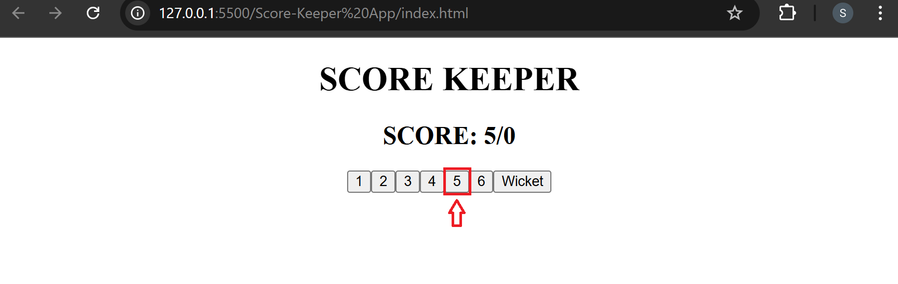

### Score-keeper App: Mini-Project continued

```html
<body>
  <div id="root" style="text-align: center"></div>

  <script type="text/babel">
    let score = 0;
    let wicket = 0;

    function addScore(num) {
      if (wicket < 10) {
        score += num;
        rootElement.render(<App />);
      }
    }

    function addWicket() {
      if (wicket < 10) {
        wicket += 1;
        rootElement.render(<App />);
      }
    }

    const App = () => (
      <>
        <h1>SCORE KEEPER</h1>
        <h2>
          SCORE: {score}/{wicket}
        </h2>
        <div>
          <button onClick={() => addScore(1)}>1</button>
          <button onClick={() => addScore(2)}>2</button>
          <button onClick={() => addScore(3)}>3</button>
          <button onClick={() => addScore(4)}>4</button>
          <button onClick={() => addScore(5)}>5</button>
          <button onClick={() => addScore(6)}>6</button>
          <button onClick={addWicket}>Wicket</button>
        </div>
      </>
    );
    const rootElement = ReactDOM.createRoot(document.getElementById("root"));
    rootElement.render(<App />);
  </script>
</body>
```

### Score-keeper App: Storing the score in an array

```html
<body>
  <div id="root" style="text-align: center"></div>

  <script type="text/babel">
    let score = 0;
    let wicket = 0;
    let ballWiseRes = [];

    function addScore(num) {
      if (wicket < 10) {
        ballWiseRes.push(num);
        score += num;
        rootElement.render(<App />);
        console.log(ballWiseRes);
      }
    }

    function addWicket() {
      if (wicket < 10) {
        ballWiseRes.push("W");
        wicket += 1;
        rootElement.render(<App />);
        console.log(ballWiseRes);
      }
    }

    const ScoreButton = () => (
      <div>
        <button onClick={() => addScore(0)}>0</button>
        <button onClick={() => addScore(1)}>1</button>
        <button onClick={() => addScore(2)}>2</button>
        <button onClick={() => addScore(3)}>3</button>
        <button onClick={() => addScore(4)}>4</button>
        <button onClick={() => addScore(5)}>5</button>
        <button onClick={() => addScore(6)}>6</button>
        <button onClick={addWicket}>Wicket</button>
      </div>
    );

    const App = () => (
      <>
        <h1>SCORE KEEPER</h1>
        <h2>
          SCORE: {score}/{wicket}
        </h2>
        <ScoreButton />
      </>
    );
    const rootElement = ReactDOM.createRoot(document.getElementById("root"));
    rootElement.render(<App />);
  </script>
</body>
```

#### 🖥️ What You See in Browser:

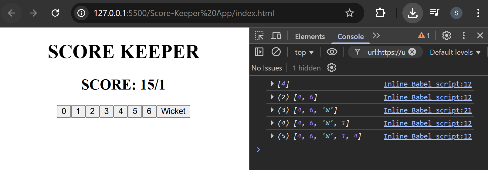

### Score-Keeper App: Display Ball-Wise Result

```html
<body>
  <div id="root" style="text-align: center"></div>

  <script type="text/babel">
    let score = 0;
    let wicket = 0;
    let ballWiseRes = [];

    function addScore(num) {
      if (wicket < 10) {
        ballWiseRes.push(num);
        score += num;
        rootElement.render(<App />);
        console.log(ballWiseRes);
      }
    }

    function addWicket() {
      if (wicket < 10) {
        ballWiseRes.push("W");
        wicket += 1;
        rootElement.render(<App />);
        console.log(ballWiseRes);
      }
    }

    const ScoreButton = () => (
      <div>
        <button onClick={() => addScore(0)}>0</button>
        <button onClick={() => addScore(1)}>1</button>
        <button onClick={() => addScore(2)}>2</button>
        <button onClick={() => addScore(3)}>3</button>
        <button onClick={() => addScore(4)}>4</button>
        <button onClick={() => addScore(5)}>5</button>
        <button onClick={() => addScore(6)}>6</button>
        <button onClick={addWicket}>Wicket</button>
      </div>
    );

    // ❌ Alternate version using shorthand fragment (<>...</>)
    // Commented out because it triggers a React warning:
    // "Each child in a list should have a unique 'key' prop".
    // Reason: <>...</> cannot take a key, and the key on <span> is ignored
    // since the fragment is the actual root element returned by .map().
    // ✅ Fix: use <React.Fragment key={index}>...</React.Fragment> instead.

    // const Result = () => (
    //   <div>
    //     {ballWiseRes.map((res, index) => (
    //       <>
    //         {index % 6 === 0 ? <br /> : null}
    //         <span key={index}>{res === 0 ? <strong>*</strong> : res}</span>
    //         &nbsp; &nbsp;
    //       </>
    //     ))}
    //   </div>
    // );

    // ✅ Working version: uses React.Fragment with key
    const Result = () => (
      <div>
        {ballWiseRes.map((res, index) => (
          <React.Fragment key={index}>
            {index % 6 === 0 ? <br /> : null}
            <span>{res === 0 ? <strong>*</strong> : res}</span>
            &nbsp;&nbsp;&nbsp;
          </React.Fragment>
        ))}
      </div>
    );

    const App = () => (
      <>
        <h1>SCORE KEEPER</h1>
        <h2>
          SCORE: {score}/{wicket}
        </h2>
        <ScoreButton />
        <Result />
      </>
    );
    const rootElement = ReactDOM.createRoot(document.getElementById("root"));
    rootElement.render(<App />);
  </script>
</body>
```

#### 🖥️ What You See in Browser:

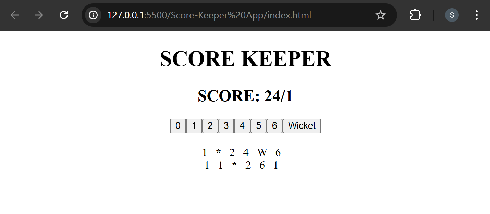

## Forms in JSX

HTML form elements work a bit differently from other DOM elements in React
because form elements naturally keep some internal state. For example, this form in
plain HTML accepts a single name:

```html
<form>
  <label>
    Name:
    <input type="text" name="name" />
  </label>
  <input type="submit" value="Submit" />
</form>
```

This form has the default HTML form behavior of browsing to a new page when the
user submits the form. If you want this behavior in React, it just works. But in most
cases, it’s convenient to have a JavaScript function that handles the submission of
the form and has access to the data that the user entered. The standard way to
achieve this is with a technique called “controlled components”

```jsx
// variable to store form's values
var state = { value: "" };

// methods used on handling Events in JSX
function handleChange(event) {
  state = { value: event.target.value };
}

function handleSubmit(event) {
  alert("A name was submitted: " + state.value);
  event.preventDefault();
}

// created form in JSX
const Form = () => {
  return (
    <form onSubmit={handleSubmit}>
      <label>
        Name:
        <input type="text" value={state.value} onChange={handleChange} />
      </label>
      <input type="submit" value="Submit" />
    </form>
  );
};
```

In a controlled component, form data is handled by a React component. The
alternative is uncontrolled components, where form data is handled by the DOM
itself. To write an uncontrolled component, instead of writing an event handler for
every state update, you can use a ref to get form values from the DOM.

### Score-Keeper App: Forms in JSX

```html
<body>
  <div id="root" style="text-align: center"></div>

  <script type="text/babel">
    let score = 0;
    let wicket = 0;
    let ballWiseRes = [];

    function addScore(num) {
      if (wicket < 10) {
        ballWiseRes.push(num);
        score += num;
        rootElement.render(<App />);
        console.log(ballWiseRes);
      }
    }

    function addWicket() {
      if (wicket < 10) {
        ballWiseRes.push("W");
        wicket += 1;
        rootElement.render(<App />);
        console.log(ballWiseRes);
      }
    }

    const ScoreButton = () => (
      <div>
        <button onClick={() => addScore(0)}>0</button>
        <button onClick={() => addScore(1)}>1</button>
        <button onClick={() => addScore(2)}>2</button>
        <button onClick={() => addScore(3)}>3</button>
        <button onClick={() => addScore(4)}>4</button>
        <button onClick={() => addScore(5)}>5</button>
        <button onClick={() => addScore(6)}>6</button>
        <button onClick={addWicket}>Wicket</button>
      </div>
    );

    const Result = () => (
      <div>
        {ballWiseRes.map((res, index) => (
          <React.Fragment key={index}>
            {index % 6 === 0 ? <br /> : null}
            <span>{res === 0 ? <strong>*</strong> : res}</span>
            &nbsp;&nbsp;&nbsp;
          </React.Fragment>
        ))}
      </div>
    );

    function handleSubmit(event) {
      event.preventDefault();
    }

    const Form = () => (
      <form onSubmit={handleSubmit}>
        <input />
        <input />
        <button>Submit</button>
      </form>
    );

    const App = () => (
      <>
        <h1>SCORE KEEPER</h1>
        <h2>
          SCORE: {score}/{wicket}
        </h2>
        <ScoreButton />
        <br />
        <Form />
        <hr />
      </>
    );
    const rootElement = ReactDOM.createRoot(document.getElementById("root"));
    rootElement.render(<App />);
  </script>
</body>
```

#### 🖥️ What You See in Browser:

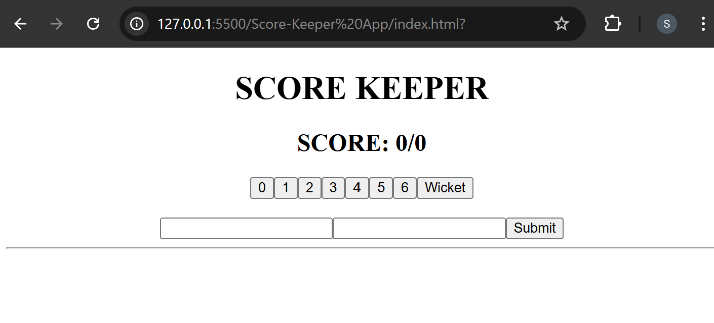

### Score-Keeper App: Populating the score field

```html
<body>
  <div id="root" style="text-align: center"></div>

  <script type="text/babel">
    let score = 0;
    let wicket = 0;
    let ballWiseRes = [];
    let hit = 0;

    function addScore(num) {
      hit = num;
      rootElement.render(<App />);
      console.log(hit);
    }

    function addWicket() {
      hit = "W";
      rootElement.render(<App />);
      console.log(hit);
    }

    const ScoreButton = () => (
      <div>
        <button onClick={() => addScore(0)}>0</button>
        <button onClick={() => addScore(1)}>1</button>
        <button onClick={() => addScore(2)}>2</button>
        <button onClick={() => addScore(3)}>3</button>
        <button onClick={() => addScore(4)}>4</button>
        <button onClick={() => addScore(5)}>5</button>
        <button onClick={() => addScore(6)}>6</button>
        <button onClick={addWicket}>Wicket</button>
      </div>
    );

    const Result = () => (
      <div>
        {ballWiseRes.map((res, index) => (
          <React.Fragment key={index}>
            {index % 6 === 0 ? <br /> : null}
            <span>{res === 0 ? <strong>*</strong> : res}</span>
            &nbsp;&nbsp;&nbsp;
          </React.Fragment>
        ))}
      </div>
    );

    function handleSubmit(event) {
      event.preventDefault();
    }

    const Form = () => (
      <form onSubmit={handleSubmit}>
        <input value={hit} />
        <input />
        <button>Submit</button>
      </form>
    );

    const App = () => (
      <>
        <h1>SCORE KEEPER</h1>
        <h2>
          SCORE: {score}/{wicket}
        </h2>
        <ScoreButton />
        <br />
        <Form />
        <hr />
      </>
    );
    const rootElement = ReactDOM.createRoot(document.getElementById("root"));
    rootElement.render(<App />);
  </script>
</body>
```

#### 🖥️ What You See in Browser:

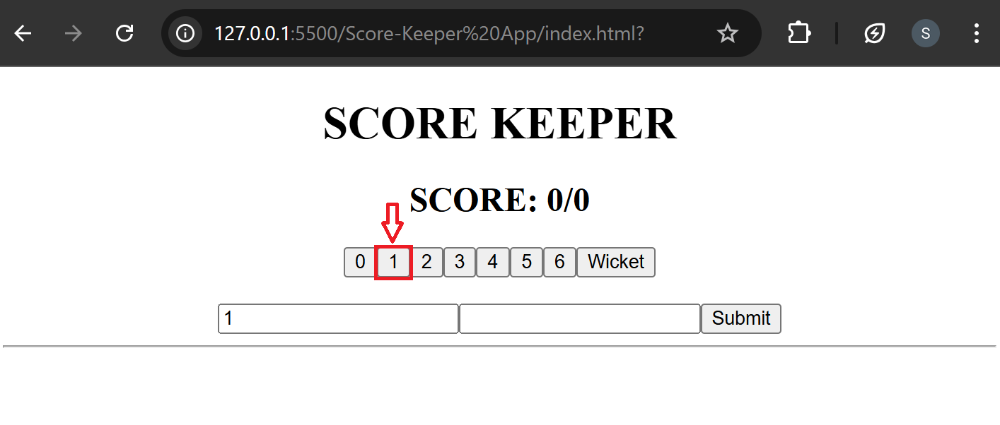

## Iterate over Arrays in JSX

Given the code below, we use the map() function to take an array of numbers
and double their values. We assign the new array returned by map() to the
variable doubled and log it: For example:

```jsx
const numbers = [1, 2, 3, 4, 5];
const doubled = numbers.map((number) => number * 2);
console.log(doubled);
```

This code logs **[2, 4, 6, 8, 10]** to the console.
You can build collections of elements and **include them in JSX** using curly
braces **{}**.

#### Note:

The map() method is used to transform the elements of an array,
whereas the forEach() method is used to loop through the elements of an
array. The map() method can be used with other array methods, such as the
filter() method, whereas the forEach() method cannot be used with other array
methods.

### Score-Keeper App: Displaying Current Ball Result

```html
<body>
  <div id="root" style="text-align: center"></div>

  <script type="text/babel">
    let score = 0;
    let wicket = 0;
    let ballWiseRes = [];
    let hit = 0;

    function addScore(num) {
      hit = num;
      rootElement.render(<App />);
      console.log(hit);
    }

    function addWicket() {
      hit = "W";
      rootElement.render(<App />);
      console.log(hit);
    }

    const ScoreButton = () => (
      <div>
        <button onClick={() => addScore(0)}>0</button>
        <button onClick={() => addScore(1)}>1</button>
        <button onClick={() => addScore(2)}>2</button>
        <button onClick={() => addScore(3)}>3</button>
        <button onClick={() => addScore(4)}>4</button>
        <button onClick={() => addScore(5)}>5</button>
        <button onClick={() => addScore(6)}>6</button>
        <button onClick={addWicket}>Wicket</button>
      </div>
    );

    function handleSubmit(event) {
      event.preventDefault();
      ballWiseRes.unshift(hit);
      rootElement.render(<App />);
    }

    const Form = () => (
      <form onSubmit={handleSubmit}>
        <input value={hit} readOnly />
        <input />
        <button>Submit</button>
      </form>
    );

    // const Result = () => (
    //   <div>
    //     {ballWiseRes.map((res, index) => (
    //       <React.Fragment key={index}>
    //         {index % 6 === 0 ? <br /> : null}
    //         <span>{res === 0 ? <strong>*</strong> : res}</span>
    //         &nbsp;&nbsp;&nbsp;
    //       </React.Fragment>
    //     ))}
    //   </div>
    // );

    const Result = () => (
      <>
        {ballWiseRes.map((res, index) => (
          <p key={index}>{res}</p>
        ))}
      </>
    );

    const App = () => (
      <>
        <h1>SCORE KEEPER</h1>
        <h2>
          SCORE: {score}/{wicket}
        </h2>
        <ScoreButton />
        <br />
        <Form />
        <hr />
        <Result />
      </>
    );
    const rootElement = ReactDOM.createRoot(document.getElementById("root"));
    rootElement.render(<App />);
  </script>
</body>
```

#### 🖥️ What You See in Browser:

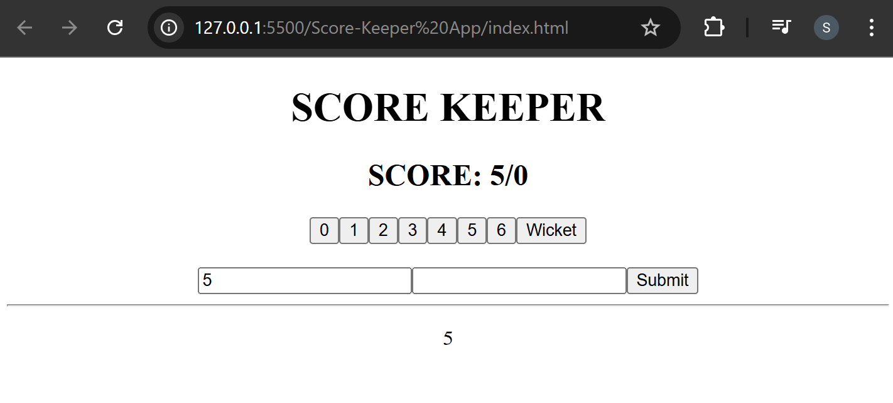
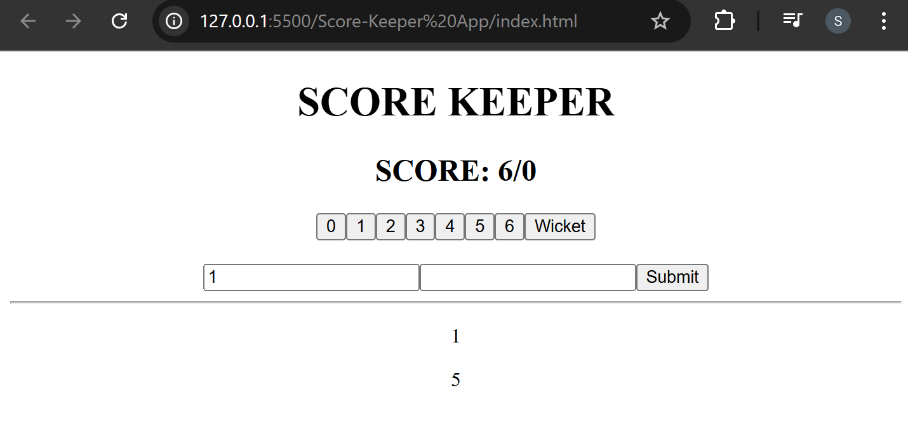

## Few Important Concepts

### Creating Refs

Refs are created using `React.createRef()` and attached to React elements
via the `ref` attribute. Refs are commonly assigned to an instance property
when a component is constructed so they can be referenced throughout the
component.

### Accessing Refs

When a `ref` is passed to an element in render, a reference to the inputRef becomes
accessible at the current attribute of the ref.

```js
let inputRef = React.createRef();
```

The value of the `ref` differs depending on the type of the node:

- When the `ref` attribute is used on an HTML element, the ref is created in the
  constructor with `React.createRef()` receives the underlying DOM element
  as its current property.
- When the `ref` attribute is used on a custom class component, the `ref` object
  receives the mounted instance of the component as its `current`.

### Adding a Ref to a DOM Element

This code uses a ref to store a reference to a DOM node:

```jsx
const Form = () => {
  <form onSubmit={handleSubmit}>
    <input ref={inputRef} placeholder="Name" />
    <button>Submit</button>
  </form>;
};
```

- Pass it as `<input ref={inputRef}>`. This tells React to put this `<input>`'s
  DOM node into `inputRef.current`.
- In the handleClick function, read the input DOM node from `inputRef.current`
  and call `focus()` on it with `inputRef.current.focus()`.
- Pass the handleClick event handler to `<button>` with onClick.

While DOM manipulation is the most common use case for refs, the createRef can
be used for storing other things outside React. Similarly to the state, refs remain
between renders. Refs are like state variables that don’t trigger re-renders when you
set them.

### SyntheticEvent

Your event handlers will be passed instances of `SyntheticEvent`, a cross-browser
wrapper around the browser’s native event. It has the same interface as the
browser’s native event, including `stopPropagation()` and `preventDefault()`,
except the events work identically across all browsers.
React normalizes events so that they have consistent properties across different
browsers.

### Score-Keeper App: Accessing 'input' values with 'refs'

```html
<body>
  <div id="root" style="text-align: center"></div>

  <script type="text/babel">
    let score = 0;
    let wicket = 0;
    let ballWiseRes = [];
    let hit = 0;
    let inputRef = React.createRef();

    function addScore(num) {
      hit = num;
      rootElement.render(<App />);
      console.log(hit);
    }

    function addWicket() {
      hit = "W";
      rootElement.render(<App />);
      console.log(hit);
    }

    const ScoreButton = () => (
      <div>
        <button onClick={() => addScore(0)}>0</button>
        <button onClick={() => addScore(1)}>1</button>
        <button onClick={() => addScore(2)}>2</button>
        <button onClick={() => addScore(3)}>3</button>
        <button onClick={() => addScore(4)}>4</button>
        <button onClick={() => addScore(5)}>5</button>
        <button onClick={() => addScore(6)}>6</button>
        <button onClick={addWicket}>Wicket</button>
      </div>
    );

    function handleSubmit(event) {
      event.preventDefault();
      if (hit == "W") {
        wicket += 1;
      } else {
        score += hit;
      }
      ballWiseRes.unshift(hit);
      console.log(inputRef.current.value);
      rootElement.render(<App />);
    }

    const Form = () => (
      <form onSubmit={handleSubmit}>
        <input value={hit} readOnly />
        <input ref={inputRef} placeholder="Add a comment..." />
        <button>Submit</button>
      </form>
    );

    // const Result = () => (
    //   <div>
    //     {ballWiseRes.map((res, index) => (
    //       <React.Fragment key={index}>
    //         {index % 6 === 0 ? <br /> : null}
    //         <span>{res === 0 ? <strong>*</strong> : res}</span>
    //         &nbsp;&nbsp;&nbsp;
    //       </React.Fragment>
    //     ))}
    //   </div>
    // );

    const Result = () => (
      <>
        {ballWiseRes.map((res, index) => (
          <p key={index}>{res}</p>
        ))}
      </>
    );

    const App = () => (
      <>
        <h1>SCORE KEEPER</h1>
        <h2>
          SCORE: {score}/{wicket}
        </h2>
        <ScoreButton />
        <br />
        <Form />
        <hr />
        <Result />
      </>
    );
    const rootElement = ReactDOM.createRoot(document.getElementById("root"));
    rootElement.render(<App />);
  </script>
</body>
```

#### 🖥️ What You See in Browser:

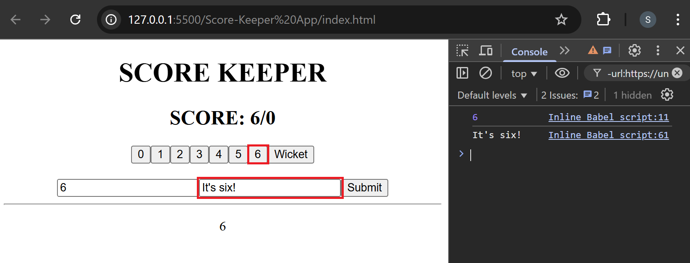

### Score-Keeper App: Finishing up the Mini-Project

```html
<body>
  <div id="root" style="text-align: center"></div>

  <script type="text/babel">
    let score = 0;
    let wicket = 0;
    let ballWiseRes = [];
    let hit = 0;
    let inputRef = React.createRef();

    function addScore(num) {
      hit = num;
      rootElement.render(<App />);
      console.log(hit);
    }

    function addWicket() {
      hit = "W";
      rootElement.render(<App />);
      console.log(hit);
    }

    const ScoreButton = () => (
      <div>
        <button onClick={() => addScore(0)}>0</button>
        <button onClick={() => addScore(1)}>1</button>
        <button onClick={() => addScore(2)}>2</button>
        <button onClick={() => addScore(3)}>3</button>
        <button onClick={() => addScore(4)}>4</button>
        <button onClick={() => addScore(5)}>5</button>
        <button onClick={() => addScore(6)}>6</button>
        <button onClick={addWicket}>Wicket</button>
      </div>
    );

    function handleSubmit(event) {
      event.preventDefault();
      if (hit == "W") {
        wicket += 1;
      } else {
        score += hit;
      }
      ballWiseRes.unshift(
        // <span>{hit} {","} {inputRef.current.value}</span>
        <span>{`${hit}, ${inputRef.current.value}`}</span>
      );
      hit = 0;
      inputRef.current.value = "";

      console.log(inputRef.current.value);
      rootElement.render(<App />);
    }

    const Form = () => (
      <form onSubmit={handleSubmit}>
        <input value={hit} readOnly />
        <input ref={inputRef} placeholder="Add a comment..." />
        <button>Submit</button>
      </form>
    );

    // const Result = () => (
    //   <div>
    //     {ballWiseRes.map((res, index) => (
    //       <React.Fragment key={index}>
    //         {index % 6 === 0 ? <br /> : null}
    //         <span>{res === 0 ? <strong>*</strong> : res}</span>
    //         &nbsp;&nbsp;&nbsp;
    //       </React.Fragment>
    //     ))}
    //   </div>
    // );

    const Result = () => (
      <>
        {ballWiseRes.map((res, index) => (
          <p key={index}>{res}</p>
        ))}
      </>
    );

    const App = () => (
      <>
        <h1>SCORE KEEPER</h1>
        <h2>
          SCORE: {score}/{wicket}
        </h2>
        <ScoreButton />
        <br />
        <Form />
        <hr />
        <Result />
      </>
    );
    const rootElement = ReactDOM.createRoot(document.getElementById("root"));
    rootElement.render(<App />);
  </script>
</body>
```

#### 🖥️ What You See in Browser:

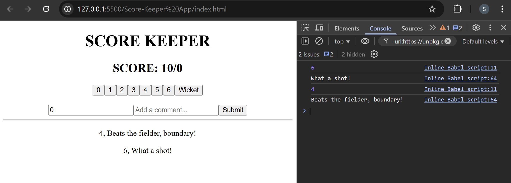

## Summarising it

Let’s summarise what we have learned in this Lecture:

- Learned about the Events in JSX.
- Learned about Form in JSX.
- Learned about Virtual DOM under the hood.
- Learned about how to store elements in an array and populate it.

### Some References:

[More information JSX Events](https://react.dev/learn/responding-to-events?utm_source=chatgpt.com)

[More information on Ref and the DOM](https://react.dev/learn/manipulating-the-dom-with-refs?utm_source=chatgpt.com)
