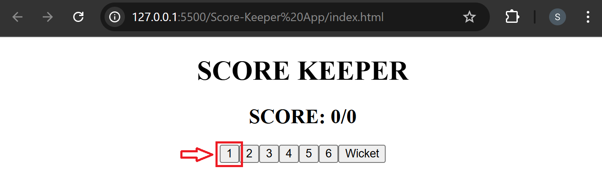
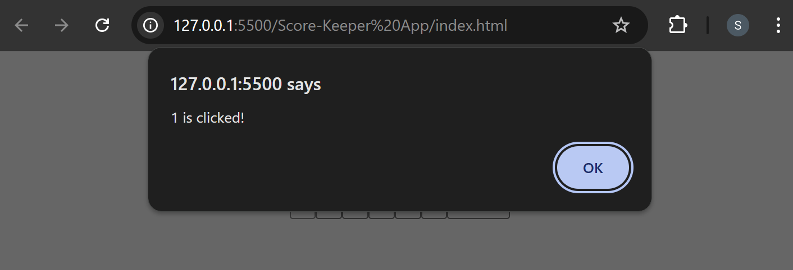

# MINI-PROJECT: SCORE- KEEPER

## Events in JSX

Handling events with React elements is very similar to handling events on DOM
elements. There are some syntax differences:

- React events are named using camelCase, rather than lowercase.
- With JSX you pass a function as the event handler, rather than a string.

### For example

#### In HTML:

```html
<button onclick="activateLasers()">Activate Lasers</button>
```

#### In React: Slightly different

```jsx
<button onClick={activateLasers}>Activate Lasers</button>
```

### Score-Keeper App: Events in JSX

```html
<!DOCTYPE html>
<html lang="en">
  <head>
    <meta charset="UTF-8" />
    <meta name="viewport" content="width=device-width, initial-scale=1.0" />
    <title>Score-Keeper App</title>
    <script
      crossorigin
      src="https://unpkg.com/react@18/umd/react.development.js"
    ></script>
    <script
      crossorigin
      src="https://unpkg.com/react-dom@18/umd/react-dom.development.js"
    ></script>
    <script src="https://unpkg.com/@babel/standalone/babel.min.js"></script>
  </head>
  <body>
    <div id="root" style="text-align: center;"></div>
    <script type="text/babel">
      let score = 0;
      let wicket = 0;

      function clickOne() {
        alert("1 is clicked!");
      }
      const App = () => (
        <>
          <h1>SCORE KEEPER</h1>
          <h2>
            SCORE: {score}/{wicket}
          </h2>
          <div>
            <button onClick={clickOne}>1</button>
            <button>2</button>
            <button>3</button>
            <button>4</button>
            <button>5</button>
            <button>6</button>
            <button>Wicket</button>
          </div>
        </>
      );
      const rootElement = ReactDOM.createRoot(document.getElementById("root"));
      rootElement.render(<App />);
    </script>
  </body>
</html>
```

#### 🖥️ What You See in Browser:




