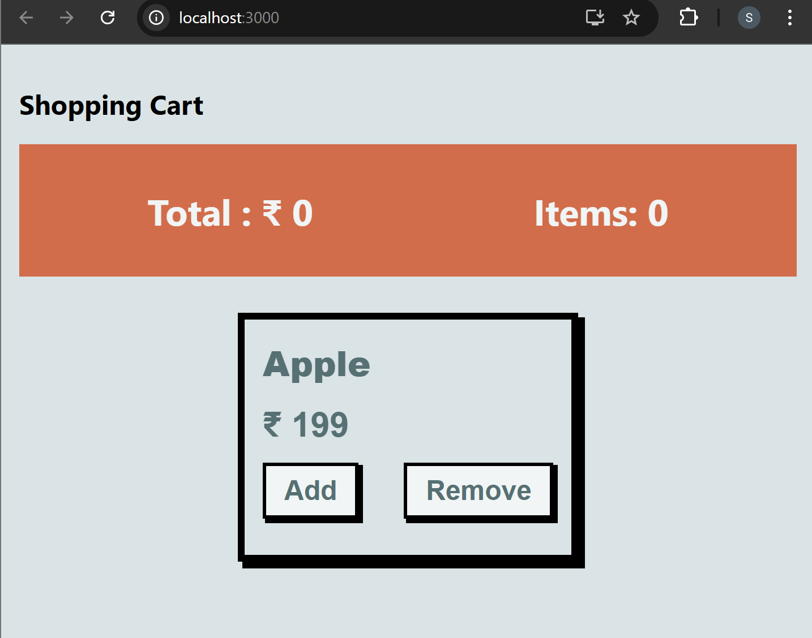
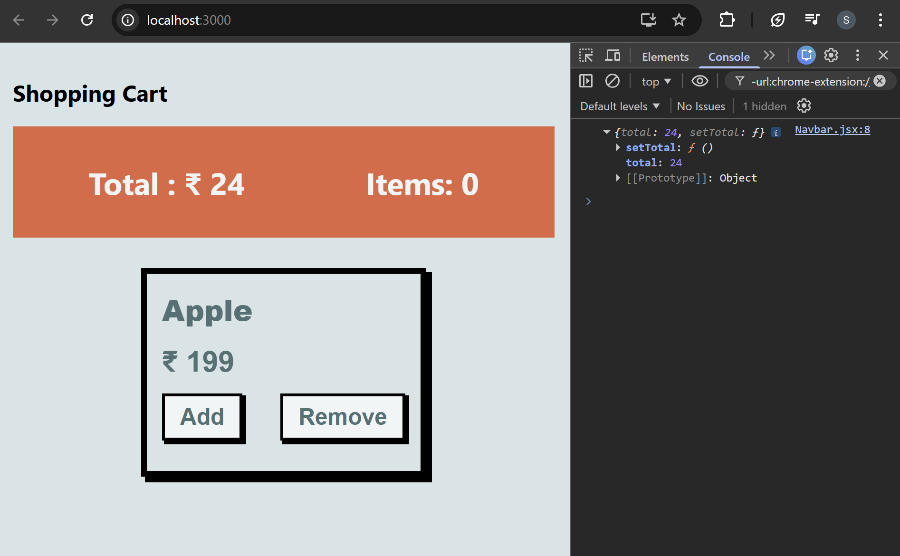
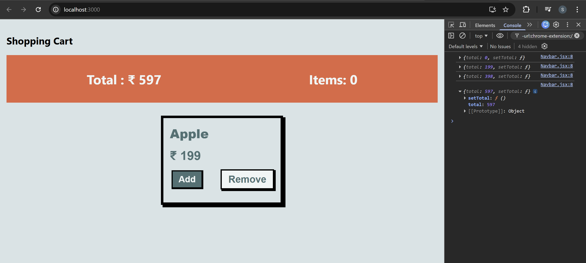
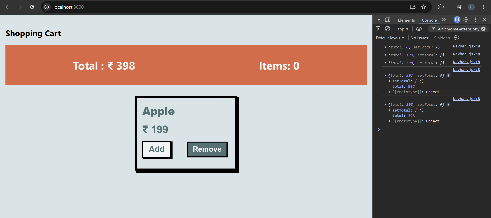
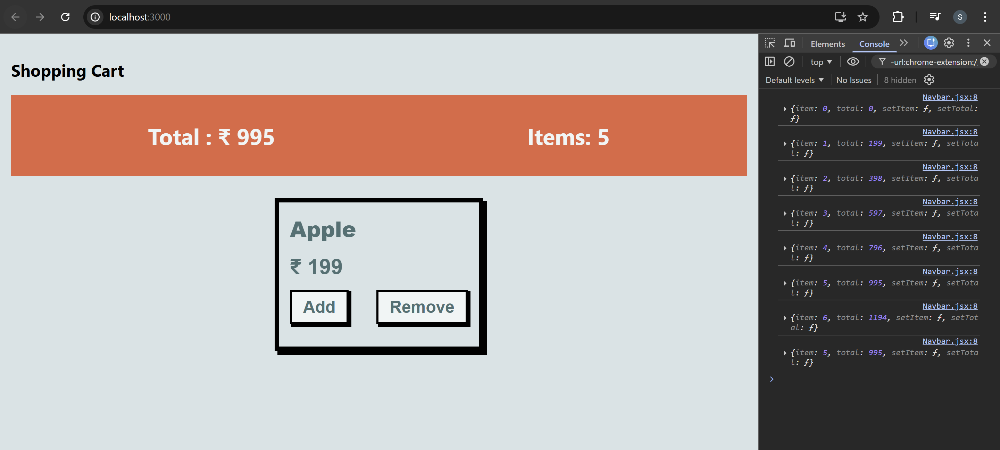

# CONTEXT API PART-II

## Shopping-Cart App: Project Setup

### Project folder structure

```text
Shopping-Cart-App
│
├── node_modules
├── public
│
├── src
│   │
│   ├── components
│   │   ├── ItemCard.jsx
│   │   ├── Items.jsx
│   │   └── Navbar.jsx
│   │
│   ├── data
│   │   └── itemData.js
│   │
│   ├── styles
│   │   ├── Item.module.css
│   │   ├── ItemCard.module.css
│   │   └── Total.module.css
│   │
│   ├── App.css
│   ├── App.js
│   ├── index.css
│   └── index.js
│
├── .gitignore
├── package.json
├── package-lock.json
└── README.md
```

### 1. App.js

```jsx
import "./App.css";
import { useState } from "react";
import Items from "./components/Items";
import Navbar from "./components/Navbar";

function App() {
  const [total, setTotal] = useState(0);
  const [item, setItem] = useState(0);
  return (
    <div className="App">
      <h2>Shopping Cart</h2>
      <Navbar />
      <Items />
    </div>
  );
}
export default App;
```

- Purpose:
  - Main component of the application. It manages the overall layout and application state.
- What it does:
  - Uses useState to store:
    - `total` → total price of items in cart
    - `item` → number of items in cart
  - Renders the main UI:
    - Navbar component (shows total and items)
    - Items component (displays available products)

### 2. Navbar.js

```jsx
import React from "react";
import styles from "../styles/Total.module.css";

function Navbar() {
  return (
    <div className={styles.container}>
      <h1>Total : &#x20B9; 0</h1>
      <h1>Items: 0</h1>
    </div>
  );
}

export default Navbar;
```

- Purpose:
  - Displays the cart summary.

- What it does:
  - Shows:
    - Total cart price
    - Total number of items
  - Uses CSS module Total.module.css for styling.
- Example display:
  ```text
  Total : ₹0
  Items : 0
  ```

### 3. Items.js

```jsx
import styles from "../styles/Item.module.css";
import ItemCard from "./ItemCard";

function Items() {
  return (
    <div className={styles.wrapper}>
      <ItemCard name="Apple" price={199} />
    </div>
  );
}

export default Items;
```

- Purpose:
  - Displays the list of items available for purchase.
- What it does:
  - Imports ItemCard component.
  - Wraps item cards inside a styled container.
  - Currently renders one item:
    ```jsx
    <ItemCard name="Apple" price={199} />
    ```

### 4. ItemCard.js

```jsx
import React from "react";
import styles from "../styles/ItemCard.module.css";

function ItemCard({ name, price }) {
  const handleAdd = () => {};

  const handleRemove = () => {};

  return (
    <div className={styles.itemCard}>
      <div className={styles.itemName}>{name}</div>
      <div className={styles.itemPrice}>&#x20B9; {price}</div>
      <div className={styles.itemButtonsWrapper}>
        <button className={styles.itemButton} onClick={() => handleAdd()}>
          Add
        </button>
        <button className={styles.itemButton} onClick={() => handleRemove()}>
          Remove
        </button>
      </div>
    </div>
  );
}

export default ItemCard;
```

- Purpose:
  - Represents a single product card.
- What it does:
  - Displays:
    - Item name
    - Item price
  - Contains two buttons:
    - **Add** → add item to cart
    - **Remove** → remove item from cart
  - Event handler functions:
    - `handleAdd()`
    - `handleRemove()`
      (Currently these functions are empty.)

### 5. itemData.js

- Stores product data used in the application.
- It contains an array of product objects with: `id`, `name`, `price`
  ```jsx
  {
  id: 1,
  name: "T-shirt",
  price: 100
  }
  ```
- This file separates data from UI logic, making the project easier to maintain.

### 6. Styles (`styles` folder)

- Contains CSS modules used to style components.
- Responsibilities:
  - Item.module.css → styles the items container layout
  - ItemCard.module.css → styles product cards and buttons
  - Total.module.css → styles the navbar displaying cart summary.
- CSS Modules ensure:
  - Scoped styles
  - No class name conflicts
  - Better component-level styling.

### 7. index.js

- Entry point of the React application.
- Responsibilities:
  - Renders the App component
  - Mounts the React application to the DOM.

### Component Render Hierarchy

Shows how components are nested and rendered.

```text
index.js
   │
   ▼
App.js
   │
   ├── Navbar.jsx
   │       └── Displays total price and item count
   │
   └── Items.jsx
           │
           └── ItemCard.jsx
                   ├── Item Name
                   ├── Item Price
                   ├── Add Button
                   └── Remove Button
```

#### Explanation:

- `index.js` starts the React application.
- `App.js` is the root component.
- `App` renders:
  - `Navbar` (cart summary)
  - `Items` (list of products).
- `Items` renders multiple `ItemCard `components.

### Data & Interaction Flow

Shows how data moves when a user interacts with the application.

```text
itemData.js
     │
     ▼
Items.jsx
     │
     ▼
ItemCard.jsx
     │
     ▼
User clicks Add / Remove
     │
     ▼
App.js (updates total price and item count)
     │
     ▼
Navbar.jsx (displays updated values)
```

#### Explanation

- `itemData.js` contains the list of products.
- `Items.jsx` reads the product data.
- Each product is displayed using `ItemCard`.
- When the user clicks **Add** or **Remove**:
- The action updates the state in **App.js**.
- Updated values are passed to **Navbar** to display the new **total price** and **item count**.

✅ One simple rule for React

- Render Flow → Top to Bottom
- Data/Event Flow → Bottom to Top

#### 🖥️ What You See in Browser:



## Passing State using Context

### 1. itemContext.js

```jsx
import { createContext } from "react";

const itemContext = createContext();
export { itemContext };
```

Creates and exports a React Context used for sharing cart data across components.

- Imports createContext from React.
- Creates a context object named itemContext.
- Exports the context so other components can use it.

### 2. App.js

```diff
 import Navbar from "./components/Navbar";
+import { itemContext } from "./createContext";

 function App() {
   const [total, setTotal] = useState(24);
   const [item, setItem] = useState(0);

-  return (
-    <div className="App">
+  return (
+    <itemContext.Provider value={{ total, setTotal }}>
+      <div className="App">
       <h2>Shopping Cart</h2>
       <Navbar />
       <Items />
-    </div>
+      </div>
+    </itemContext.Provider>
   );
 }
```

Manages the cart state and provides it to other components using React Context.

- Imports `useState`, `Navbar`, `Items`, and `itemContext`.
- Creates state variables:
  - `total` → total price of items in the cart.
  - `item` → number of items in the cart.
- Wraps the application with `itemContext.Provider`.
- Passes `{ total, setTotal } `through the provider so child components can access the cart state.
- Renders the main UI including Shopping Cart title, `Navbar`, and `Items`.

```jsx
<itemContext.Provider value={{ total, setTotal }}>
```

### 3. Navbar.js

```diff
 import styles from "../styles/Total.module.css";
+import { useContext } from "react";
+import { itemContext } from "../createContext";

 function Navbar() {
+  const value = useContext(itemContext);

   return (
     <div className={styles.container}>
-      <h1>Total : &#x20B9; 0</h1>
+      <h1>Total : &#x20B9; {value.total}</h1>
       <h1>Items: 0</h1>
     </div>
   );
 }
```

Displays the cart summary using data from the shared context.

- Imports `useContext` and `itemContext`.
- Uses `useContext(itemContext)` to access context values.
- Retrieves the `total` value stored in `App`.
- Displays the total cart price in the UI.

  ```jsx
  const value = useContext(itemContext);
  ```

- Displayed in UI:

  ```text
  Total : ₹24
  Items : 0
  ```

#### 🖥️ What You See in Browser:



## Updating the Total Value

### ItemCard.js

```diff
import React from "react";
import styles from "../styles/ItemCard.module.css";
+import { useContext } from "react";
+import { itemContext } from "../itemContext";

 function ItemCard({ name, price }) {
-  const handleAdd = () => {};
+  const { total, setTotal } = useContext(itemContext);
+
+  const handleAdd = () => {
+    setTotal(total + price);
+  };

-  const handleRemove = () => {};
+  const handleRemove = () => {
+    if (total <= 0) {
+      return;
+    }
+    setTotal((prevState) => prevState - price);
+  };

   return (
     <div className={styles.itemCard}>
       <div className={styles.itemName}>{name}</div>
       <div className={styles.itemPrice}>&#x20B9; {price}</div>
       <div className={styles.itemButtonsWrapper}>
         <button className={styles.itemButton} onClick={() => handleAdd()}>
           Add
         </button>
         <button className={styles.itemButton} onClick={() => handleRemove()}>
           Remove
         </button>
       </div>
     </div>
   );
 }

 export default ItemCard;
```

Handles adding and removing items from the cart by updating the shared cart total using React Context.

- Imports `useContext` and `itemContext`.
- Accesses shared values `total` and `setTotal` from the context.
- Add button: calls `handleAdd()` to increase the cart total using `setTotal(total + price)`.
- Remove button: calls `handleRemove()` to decrease the cart total using `setTotal((prevState) => prevState - price)`.
- Includes a condition to prevent the cart total from going below 0.

This allows each item card to **directly update the global cart total when items are added or removed**.

### App.js

```diff
- const [total, setTotal] = useState(24);
+ const [total, setTotal] = useState(0);
```

- The initial cart total was changed from 24 to 0.
- This ensures the shopping cart starts empty when the application loads.

#### 🖥️ What You See in Browser:





## Updating Items

### App.js

```diff
 import { itemContext } from "./itemContext";

 function App() {
   const [total, setTotal] = useState(0);
   const [item, setItem] = useState(0);

   return (
-    <itemContext.Provider value={{ total, setTotal }}>
+    <itemContext.Provider value={{ item, setItem, total, setTotal }}>
       <div className="App">
         <h2>Shopping Cart</h2>
         <Navbar />
         <Items />
       </div>
     </itemContext.Provider>
   );
 }
```

Added item count state and shared it through `itemContext`.

- Added `item` and `setItem` using `useState`.
- Passed `item`, `setItem`, `total`, and `setTotal` through `itemContext.Provider`.
- This allows child components to access and update both cart total and item count.

### ItemCard.js

```diff
-const { total, setTotal } = useContext(itemContext);
+const { total, setTotal, item, setItem } = useContext(itemContext);

 const handleAdd = () => {
   setTotal(total + price);
+  setItem(item + 1);
 };

 const handleRemove = () => {
   if (total <= 0) {
     return;
   }
   setTotal((prevState) => prevState - price);
+  setItem(item - 1);
 };
```

Updated the component to manage item count along with total price.

- Accessed `item` and `setItem` from `itemContext`.
- **Add button:** increases both the cart total and item count.
- **Remove button:** decreases both the cart total and item count.

### Navbar.js

```diff
 <h1>Total : ₹ {value.total}</h1>
-<h1>Items: 0</h1>
+<h1>Items: {value.item}</h1>
```

Updated the Navbar to display the number of items in the cart.

#### 🖥️ What You See in Browser:



## Multiple Context

React also allows you to create multiple contexts. By providing multiple contexts in
this way, components that require access to both context values can consume them
both and be able to interact with their respective states. We should always try to
separate contexts for different purposes to maintain the code structure and better
readability. To keep context re-rendering fast, React needs to make each context
consumer a separate node in the tree.

For Example: The Items component can access the item state from itemContext and the total state from totalContext, allowing it to display both the number of items in the cart and the total cart cost.

### totalContext.js

```jsx
import { createContext } from "react";

const totalContext = createContext();
export { totalContext };
```

The `totalContext` is used to manage and **share the total price of the shopping cart** across components.

- Created using `createContext`.
- Stores the **total cart value** and its update function.
- Allows components like **Navbar** and **ItemCard** to access and update the cart total.

### App.js

```diff
 import "./App.css";
 import { useState } from "react";
 import Items from "./components/Items";
 import Navbar from "./components/Navbar";
 import { itemContext } from "./itemContext";
+import { totalContext } from "./totalContext";

 function App() {
   const [total, setTotal] = useState(0);
   const [item, setItem] = useState(0);

   return (
-    <itemContext.Provider value={{ item, setItem, total, setTotal }}>
+    <totalContext.Provider value={{ total, setTotal }}>
+      <itemContext.Provider value={{ item, setItem }}>
       <div className="App">
         <h2>Shopping Cart</h2>
         <Navbar />
         <Items />
       </div>
-    </itemContext.Provider>
+      </itemContext.Provider>
+    </totalContext.Provider>
   );
 }

 export default App;
```

Updated the app to use **two separate context providers** instead of passing all values through a single context.

- `totalContext` now manages the **cart total value**.
- `itemContext` now manages the **number of items in the cart**.
- Both providers wrap the application so child components can access the required state independently.

## ItemCard.js

```diff
 import React from "react";
 import styles from "../styles/ItemCard.module.css";
 import { useContext } from "react";
 import { itemContext } from "../itemContext";
+import { totalContext } from "../totalContext";

 function ItemCard({ name, price }) {
-  const { total, setTotal, item, setItem } = useContext(itemContext);
+  const { total, setTotal } = useContext(totalContext);
+  const { item, setItem } = useContext(itemContext);

   const handleAdd = () => {
     setTotal(total + price);
     setItem(item + 1);
   };

   const handleRemove = () => {
     if (total <= 0) {
       return;
     }
     setTotal((prevState) => prevState - price);
     setItem(item - 1);
   };

   return (
     <div className={styles.itemCard}>
       <div className={styles.itemName}>{name}</div>
       <div className={styles.itemPrice}>&#x20B9; {price}</div>
       <div className={styles.itemButtonsWrapper}>
         <button className={styles.itemButton} onClick={() => handleAdd()}>
           Add
         </button>
         <button className={styles.itemButton} onClick={() => handleRemove()}>
           Remove
         </button>
       </div>
     </div>
   );
 }

 export default ItemCard;
```

The `ItemCard` component was updated to consume **two separate contexts** for managing cart state.

- Imports and uses `totalContext` to access and update the **cart total price**.
- Uses `itemContext` to access and update the **number of items in the cart**.
- The **Add button** increases both the cart total and item count.
- The **Remove button** decreases both values while preventing the total from going below 0

### Navbar.js

```diff
 import React from "react";
 import styles from "../styles/Total.module.css";
 import { useContext } from "react";
 import { itemContext } from "../itemContext";
+import { totalContext } from "../totalContext";

 function Navbar() {
-  const value = useContext(itemContext);
+  const { total } = useContext(totalContext);
+  const { item } = useContext(itemContext);

   return (
     <div className={styles.container}>
-      <h1>Total : &#x20B9; {value.total}</h1>
-      <h1>Items: {value.item}</h1>
+      <h1>Total : &#x20B9; {total}</h1>
+      <h1>Items: {item}</h1>
     </div>
   );
 }

 export default Navbar;
```

The `Navbar` component was updated to read data from **two contexts instead of one**.

- Uses totalContext to retrieve the total price of the cart.
- Uses itemContext to retrieve the number of items in the cart.
- Displays both values in the navigation bar as the cart summary.
