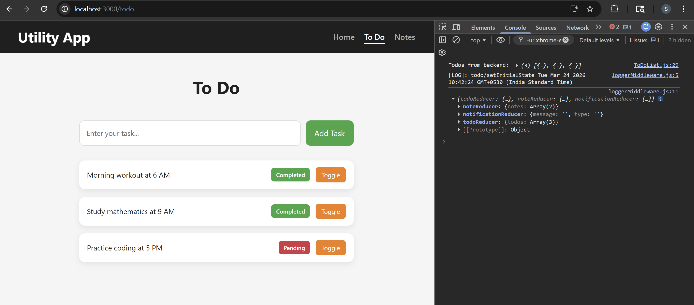
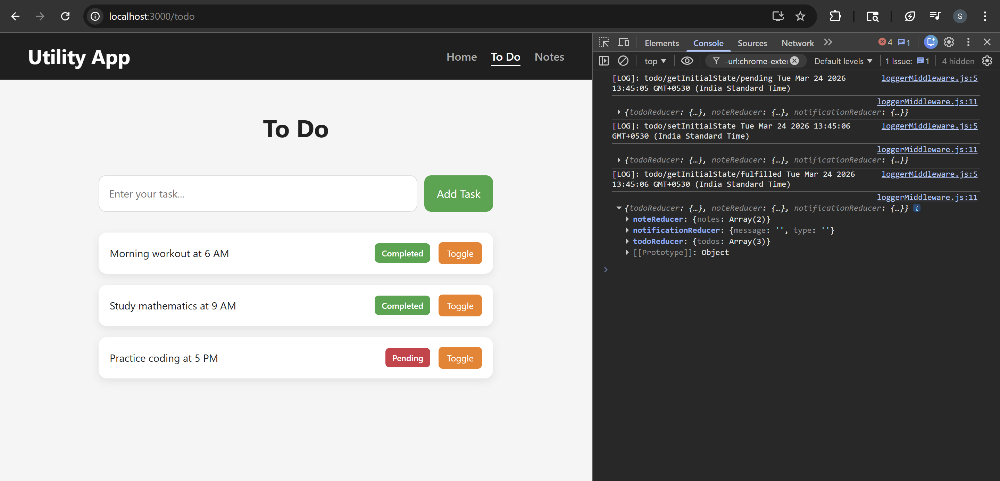

# ADVANCED REDUX

## Manual Logger

Added simple console-based logging to track when Todo actions are dispatched during user interactions. This helps in understanding the flow of actions and debugging state changes during development.

### components/ToDoForm/ToDoForm.js

```diff
...
  const handleSubmit = (e) => {
    e.preventDefault();
    if (!todoText.trim()) return;
+   console.log("[LOG]: Todo - Add Action dispatched!");
    dispatch(actions.add(todoText));
    setTodoText("");
  };
...
```

Added logging for Todo creation action.

- Adding manual log
  - Logs message when add action is triggered
  - Helps track user interaction during debugging
- No change in functionality
  - Logic remains same
  - Only debugging support added

### components/ToDoList/ToDoList.js

```diff
...
function ToDoList() {
  const todos = useSelector(todoSelector);
  console.log(todos);
  const dispatch = useDispatch();

  return (
    <div className={styles["list-container"]}>
      <ul>
        {todos.map((todo, index) => (
          <li key={todo.id}>
            <span className={styles.content}>{todo.text}</span>

            <span
              className={todo.completed ? styles.completed : styles.pending}
            >
              {todo.completed ? "Completed" : "Pending"}
            </span>

            <button
              className={styles["toggle-btn"]}
-             onClick={() => dispatch(actions.toggle(index))}
+             onClick={() => {
+               console.log("[LOG]: Todo - Toggle Action dispatched!");
+               console.log("[LOG]: Current Todos:", todos);
+               dispatch(actions.toggle(index));
+             }}
            >
              Toggle
            </button>

          </li>
        ))}
      </ul>
    </div>
  );
}
...
```

Added logging for Todo toggle action.

- Adding manual log
  - Logs message when toggle action is triggered
  - Helps identify state change triggers
- Wrapping dispatch in function
  - Allows executing multiple statements (log + dispatch)
- No impact on UI
  - Only improves debugging visibility

### Issue with Manual Logger

Using `console.log` for logging has several limitations in real applications.

- Hard to manage
  - Logs are scattered across components
  - Difficult to track or maintain as app grows
- Not scalable
  - Repetitive logging code in multiple places
  - No central control over logging behavior
- No structure
  - Logs are plain text (no action/state context)
  - Hard to debug complex flows
- Cannot be disabled easily
  - Logs remain in production unless manually removed

### Solution

Use a **centralized logging approach using Redux Middleware**.

- Centralized logging
  - All actions pass through middleware
  - Single place to log everything
- Automatic tracking
  - Logs every dispatched action
  - No need to write logs in components
- Structured logging
  - Can log action type, payload, previous & next state
- Easy to control
  - Enable/disable logging based on environment

#### 🖥️ What You See in Browser:


## Redux Logger Middleware

### Problem

In large projects, it is important to keep track of what is happening inside the
application at all times. This is where loggers come into play. A logger is a utility that
captures information about various events that occur during the application's runtime,
such as user actions, server responses, errors, and warnings.

In Redux, actions are dispatched from components to the store to update the state.
Logging every action dispatched from the components to the store using
console.log() can help debug and track the application flow. However, modifying
every reducer to add console.log statements is not an ideal approach, as it can
become difficult to manage when there are many components and reducers. One
solution to this problem is to use middleware in Redux.

### Solution: Middleware

Middleware in Redux intercepts actions as they are dispatched to the store and can
perform some additional logic on them before they reach the reducer.

One such middleware that can be used to log all actions is the loggerMiddleware.
In the case of Redux, middleware is added to the store as a pipeline, and each
middleware in the pipeline can access the store, the next middleware in the pipeline,
and the action being dispatched. When an action is dispatched from the component,
it first passes through the middleware pipeline before reaching the reducer. Each
middleware in the pipeline has the option to modify the action, dispatch additional
actions, or perform other logic before passing it on to the next middleware using the
next pointer. The concept of closure allows the middleware to access the Redux
store and the next function even after the middleware function has completed
execution.

It is important to note that every middleware in the pipeline should call the next
function with the action as its argument to pass it along to the next middleware. This
ensures that all middleware in the pipeline can process the action before it reaches
the reducer.


To solve the problem of logging every action, we can create a custom middleware
that logs the action before passing it on to the next middleware. To use the
middleware, we can add it to the middleware array in the Redux store.

### redux/middlewares/loggerMiddleware.js

Integrated a custom Redux middleware to centrally log every dispatched action and the updated state, improving debugging and visibility of state changes.

```jsx
export const loggerMiddleware = (store) => {
  return function (next) {
    return function (action) {
      //log actions
      console.log("[LOG]: " + action.type + " " + new Date().toString());

      // call next middleware in pipeline
      const result = next(action);

      // log the modified state of app
      console.log(store.getState());
      return result;
    };
  };
};
```

Added a custom logger middleware.

- Logging dispatched actions
  - Prints action type with timestamp
  - Helps track user interactions
- Logging updated state
  - Shows latest store state after reducer execution
- Maintaining middleware chain
  - Uses `next(action)` and returns result
  - Ensures proper flow of dispatch

### redux/store.js

```diff
...
 import { configureStore } from "@reduxjs/toolkit";
 import { notificationReducer } from "./reducers/notificationReducer";
+import { loggerMiddleware } from "./middlewares/loggerMiddleware";

...

 export const store = configureStore({
   reducer: {
     todoReducer,
     noteReducer,
     notificationReducer,
   },
+  middleware: (getDefaultMiddleware) =>
+    getDefaultMiddleware().concat(loggerMiddleware),
 });
```

Configured store to use logger middleware.

- Adding custom middleware
  - Imported `loggerMiddleware` into store
- Using `getDefaultMiddleware`
  - Preserves default RTK middleware
  - Extends with custom logger
- Centralized logging
  - Removes need for manual `console.log` in components

NOTE: Commented out all manual `console.log` statements from Todo components after integrating Redux logger middleware. Logging is now handled centrally through middleware, which automatically captures actions and state changes across Todo, Notes, and Notification (including reset), ensuring consistent and cleaner debugging throughout the application.

#### 🖥️ What You See in Browser:


## Backend Structure

The backend is structured using a modular architecture to separate configuration, models, controllers, and routes.

```bash
backend/
│
├── config/
│   └── db.js              # MongoDB connection setup
│
├── models/
│   ├── Todo.js            # Todo schema
│   └── Note.js            # Note schema
│
├── controllers/
│   ├── todoController.js  # Todo logic (get, add, toggle)
│   └── noteController.js  # Note logic (get, add, delete)
│
├── routes/
│   ├── todoRoutes.js      # Todo API routes
│   └── noteRoutes.js      # Note API routes
│
├── .env                   # Environment variables
├── .gitignore             # Ignored files
├── package.json           # Dependencies
├── package-lock.json
└── server.js              # Entry point (Express server)
```

- Express server setup
  - `server.js` as entry point
  - Middleware: `express.json`, `cors`
  - Routes connected for todos and notes

- Database configuration
  - MongoDB connection using Mongoose (`config/db.js`)
  - Connection string managed via `.env`

- Models
  - `Todo` → text, completed
  - `Note` → text, createdOn

- Controllers
  - Handle business logic for API requests
  - Todos → get, add, toggle
  - Notes → get, add, delete

- Routes
  - Map HTTP methods to controller functions
  - Follow REST API design

- Architecture
  - Follows MVC-like structure for scalability and maintainability

### API Documentation

#### Todo APIs

| Method | URL              | Description        | Request Body         | Response            |
| ------ | ---------------- | ------------------ | -------------------- | ------------------- |
| GET    | `/api/todos`     | Get all todos      | ❌ None              | Array of todos      |
| POST   | `/api/todos`     | Add new todo       | `{ "text": "Task" }` | Created todo object |
| PUT    | `/api/todos/:id` | Toggle todo status | ❌ None              | Updated todo object |

#### Note APIs

| Method | URL              | Description   | Request Body         | Response            |
| ------ | ---------------- | ------------- | -------------------- | ------------------- |
| GET    | `/api/notes`     | Get all notes | ❌ None              | Array of notes      |
| POST   | `/api/notes`     | Add new note  | `{ "text": "Note" }` | Created note object |
| DELETE | `/api/notes/:id` | Delete note   | ❌ None              | Success message     |

All APIs follow RESTful conventions where the HTTP method defines the action and the URL represents the resource.

### Setup & Run Instructions

#### Backend

```bash
cd backend
npm install
node server.js
```

Server runs at: `http://localhost:5000`

#### Frontend

```bash
npm install
npm start
```

App runs at: `http://localhost:3000`

#### 🔄 Application Flow

```text
Frontend (React) → API Call → Backend (Express) → Database (MongoDB) → Response → UI
```

#### ⚠️ Notes

- Start backend before frontend
- Ensure MongoDB is running
- `.env` and `node_modules` are ignored via `.gitignore`

### API Testing (Postman)

You can test the APIs using the following URLs in Postman. Some sample todos and notes are already added and can be viewed in the database screenshots below.

#### Todos

- GET all todos:
  `http://localhost:5000/api/todos`

- Add todo:
  `http://localhost:5000/api/todos`

  Body:

  ```json
  { "text": "Practice coding at 5 PM" }
  ```

- Toggle todo:
  `http://localhost:5000/api/todos/:id`

#### Notes

- GET all notes:
  `http://localhost:5000/api/notes`

- Add note:
  `http://localhost:5000/api/notes`

  Body:

  ```json
  {
    "text": "Understand Redux Toolkit middleware flow including logger and async actions handling"
  }
  ```

- Delete note:
  `http://localhost:5000/api/notes/:id`

#### 🖥️ What You See in Database:


## Calling an API

### Fetch function

To make an asynchronous call to an API in React using the fetch function, you can
wrap the fetch function in a `useEffect` hook. Since the fetch function is asynchronous
and returns a promise, you can use either then and catch or async/await to handle
the promise.

For Example, we make an API call to fetch todos from the server running on
`http://localhost:5000/api/todos`. We then convert the response to JSON using the
`json()` function, which also returns a promise. Finally, we log the parsed JSON data
to the console.

```jsx
useEffect(() => {
  fetch("http://localhost:5000/api/todos")
    .then((res) => res.json())
    .then((parsedJson) => {
      console.log(parsedJson);
    });
}, []);
```

### Axios Function

Axios is a commonly used library for making HTTP requests to an API. Axios
provides an easy-to-use interface for making asynchronous requests, and it can be
used in combination with Redux to manage state and handle API responses.
You can run `npm install axios` to install Axios.

For example, the useEffect hook is used to make an HTTP GET request to an API
using Axios. The axios.get method takes the API URL as its argument and returns a
promise that resolves with the response data. Once the response is received, the
data is logged into the console. The `[]` as the second argument to useEffect ensures
that the effect runs only once when the component mounts.

```jsx
useEffect(() => {
  axios.get("http://localhost:5000/api/todos").then((res) => {
    console.log(res.data);
  });
}, []);
```

## Using 'fetch' API

Added a `fetch` call to retrieve todos from the backend and log the response, verifying frontend-backend connectivity.

### components/ToDoList/ToDoList.js

```diff
import { useSelector, useDispatch } from "react-redux";
import { actions } from "../../redux/reducers/todoReducer";
import { todoSelector } from "../../redux/reducers/todoReducer";
+import { useEffect } from "react";
import styles from "./ToDoList.module.css";

function ToDoList() {
  const todos = useSelector(todoSelector);
  const dispatch = useDispatch();

+  useEffect(() => {
+    fetch("http://localhost:5000/api/todos")
+      .then((res) => res.json())
+      .then((parsedJson) => {
+        console.log("Todos from backend →", parsedJson);
+      })
+      .catch((err) => {
+        console.error("Fetch failed →", err);
+      });
+  }, []);

  return (
    <div className={styles["list-container"]}>
      <ul>
        {todos.map((todo, index) => (
          <li key={todo.id}>
            <span className={styles.content}>{todo.text}</span>

            <span
              className={todo.completed ? styles.completed : styles.pending}
            >
              {todo.completed ? "Completed" : "Pending"}
            </span>

            <button
              className={styles["toggle-btn"]}
              onClick={() => {
                dispatch(actions.toggle(index));
              }}
            >
              Toggle
            </button>
          </li>
        ))}
      </ul>
    </div>
  );
}

export default ToDoList;
```

Introduced `useEffect` to fetch data from backend and log it in console.

- Adding `useEffect`
  - Executes API call when component mounts
  - Ensures fetch runs only once
- Using `fetch` API
  - Calls backend endpoint `/api/todos`
  - Converts response to JSON
- Logging response
  - Displays backend todos in console
  - Helps verify API integration
- Error handling
  - Logs error if request fails
  - Useful for debugging connection issues

#### 🖥️ What You See in Console:


## Using 'axios' Library

Replaced the `fetch` API with `axios` to simplify HTTP requests and response handling while keeping the same functionality.

### components/ToDoList/ToDoList.js

```diff
...
import { useEffect } from "react";
+import axios from "axios";

function ToDoList() {
...
-  useEffect(() => {
-    fetch("http://localhost:5000/api/todos")
-      .then((res) => res.json())
-      .then((parsedJson) => {
-        console.log("Todos from backend:", parsedJson);
-      })
-      .catch((err) => {
-        console.error("Fetch failed:", err);
-      });
-  }, []);

+  useEffect(() => {
+    axios.get("http://localhost:5000/api/todos")
+      .then((res) => {
+        console.log("Todos from backend:", res.data);
+      })
+      .catch((err) => {
+        console.error("Fetch failed:", err);
+      });
+  }, []);
...
}

```

Replaced fetch with axios for cleaner API calls and simpler response handling.

- Added axios
  - Imported `axios` library
  - Used for making HTTP requests
- Replaced fetch with axios
  - `axios.get()` directly returns parsed data
  - No need for `.json()` conversion
- Simplified response handling
  - Access data using `res.data`
  - Cleaner and shorter syntax
- Added error handling
  - `.catch()` handles API errors

NOTE: Fetch is a built-in browser API, while Axios is an external library.

## How to manage API Data?

To manage API data in React Redux, there are two ways: either in the components
or in the Redux itself.

### Using Components

If you choose to manage API calls in the components, you can use the useEffect
hook to fetch the initial data from the API, and then once you have received the data,
dispatch an action to update the Redux store.

For Example,
You can specify an action to update the Redux Store.

```jsx
const todoSlice = createSlice({
  name: "todo",
  initialState: initialState,
  reducers: {
    setInitialState: (state, action) => {
      state.todos = action.payload;
    },
    // ...
  },
});
```

Then you can dispatch the action, once you receive data from the API

```jsx
useEffect(() => {
  axios.get("http://localhost:5000/api/todos").then((res) => {
    console.log(res.data);
    dispatch(actions.setInitialState(res.data));
  });
}, []);
```

### Using Redux

When managing API data in Redux, it's important to note that we cannot make
asynchronous calls from our reducer actions. This is because reducers are designed
to be pure functions, meaning they should not have any side effects. They should
only handle state updates based on the actions they receive. Instead, we can use
the `createAsyncThunk` function provided by Redux Toolkit to handle async calls and
update the Redux store accordingly. This allows you to manage API calls and state
updates in a centralized location in the Redux store, making it easier to manage your
application's state and data flow

## HTTP Calls with Redux

Moved from static (hardcoded) todos to dynamic data fetched from backend and stored in Redux, so UI reflects real data.

### redux/reducers/todoReducer.js

```diff
 // Import createSlice from Redux Toolkit
 const { createSlice } = require("@reduxjs/toolkit");

 // Initial state containing default todos
 const initialState = {
-  todos: [
-    {
-      text: "Study mathematics at 6 AM",
-      completed: true,
-    },
-    {
-      text: "Evening workout at 5 PM",
-      completed: false,
-    },
-  ],
+  todos: [],
 };

 // Redux Toolkit Slice (Reducer + Actions)
 const todoSlice = createSlice({
   name: "todo",
   initialState,

   reducers: {
+    // Set todos from backend API
+    setInitialState: (state, action) => {
+      state.todos = [...action.payload];
+    },

     // Add a new todo item
     add: (state, action) => {
       state.todos.push({
         text: action.payload,
         completed: false,
       });
     },

     // Toggle completion status of a todo by index
     toggle: (state, action) => {
       const todo = state.todos[action.payload];
       if (todo) {
         todo.completed = !todo.completed;
       }
     },
   },
 });

 // Export reducer and actions from slice
 export const todoReducer = todoSlice.reducer;
 export const actions = todoSlice.actions;

 // Selector to access todos from Redux store
 export const todoSelector = (state) => state.todoReducer.todos;
```

Replaced static todos with API-driven state by initializing an empty store and adding a reducer to populate it from backend data.

- Initial state updated
  - Removed predefined todos
  - `todos` now starts as an empty array
- Added `setInitialState`
  - Accepts API response (`action.payload`)
  - Directly updates Redux store with fetched todos
- Purpose
  - Enables backend-controlled data instead of hardcoded values
  - Keeps UI in sync with server data

### components/ToDoList/ToDoList.js

```diff
...
 useEffect(() => {
   axios.get("http://localhost:5000/api/todos").then((res) => {
     console.log("Todos from backend:", res.data);
+    dispatch(actions.setInitialState(res.data));
   });
-}, []);
+}, [dispatch]);
...
```

Connected frontend to backend and Redux by fetching and storing data.

- API call using `axios`
  - Fetches todos from `/api/todos`
  - Runs once when component mounts (`useEffect`)
- Dispatching to Redux
  - Instead of just logging, data is now stored
  - `dispatch(actions.setInitialState(res.data))` updates global state
- Dependency array improvement
  - Added `dispatch` → follows React best practices

#### 🖥️ What You See in Browser:



## Create AsyncThunk

`createAsyncThunk` is a utility function provided by the Redux Toolkit that generates a
Redux thunk. A thunk is a function that can be dispatched like a regular Redux
action, but **it can also contain asynchronous logic**, such as fetching data from an API.
The generated thunk function can be dispatched to trigger the async operation.
When the async operation completes, it will automatically dispatch the appropriate
action type based on the result.

For Example, When calling `createAsyncThunk`, you provide it with two parameters: a
string that represents the **base action type** and a **callback function** that performs the
asynchronous operation. The callback function passed to `createAsyncThunk` should
be an async function. It should return the result of the operation as its resolved value
or throw an error if the operation fails.

```jsx
export const getInitialState = createAsyncThunk(
  "todo/getInitialState",
  async (_, thunkAPI) => {
    // async calls
    try {
      const res = await axios.get("http://localhost:5000/api/todos");

      thunkAPI.dispatch(actions.setInitialState(res.data));
    } catch (err) {
      console.log(err);
    }
  },
);
```

When using `createAsyncThunk`, you may encounter an issue with the middleware in
the Redux store. By default, the Redux Toolkit adds some middleware to the store,
including the thunk middleware that enables using thunks like `createAsyncThunk`.
However, if you have other middleware in your store that modifies the action or
dispatch behavior, it may interfere with the behavior of createAsyncThunk. By using
`getDefaultMiddleware` and spreading it into your middleware array, you ensure that
the necessary middleware for createAsyncThunk is included while also allowing you
to add any other middleware that you need to the store.

```jsx
middleware: (getDefaultMiddleware) =>
  getDefaultMiddleware().concat(loggerMiddleware);
```

### Advantages

- **Separation of Async Code**: By using `createAsyncThunk`, you can separate
  the async logic from the component code and move it to the Redux actions.
  This keeps the components lightweight and easier to manage and also
  simplifies testing.
- **Consistent pattern**: By using `createAsyncThunk`, you establish a consistent
  pattern for representing async operation states in your Redux store. This
  makes it easier to reason about your code and to debug it when issues arise.
- **Flexibility**: `createAsyncThunk` is flexible enough to allow you to customize its
  behavior if needed. For example, you can provide your own middleware to
  modify the behavior of the async operation or to add additional logic to the
  action dispatching process.

## Fetching Data in Redux

Moved API logic from component to Redux using `createAsyncThunk`, and triggered the async operation from the component using dispatch.

### redux/reducers/todoReducer.js

```diff
- const { createSlice } = require("@reduxjs/toolkit");
+ import { createSlice, createAsyncThunk } from "@reduxjs/toolkit";
+ import axios from "axios";

 const initialState = {
   todos: [],
 };

+export const getInitialState = createAsyncThunk(
+  "todo/getInitialState",
+  async (_, thunkAPI) => {
+    try {
+      const res = await axios.get("http://localhost:5000/api/todos");
+      thunkAPI.dispatch(actions.setInitialState(res.data));
+    } catch (error) {
+      console.error(error);
+    }
+  }
+);

 const todoSlice = createSlice({
   name: "todo",
   initialState,
   reducers: {
     setInitialState: (state, action) => {
       state.todos = [...action.payload];
     },
     add: (state, action) => {
       state.todos.push({
         text: action.payload,
         completed: false,
       });
     },
     toggle: (state, action) => {
       const todo = state.todos[action.payload];
       if (todo) {
         todo.completed = !todo.completed;
       }
     },
   },
 });

 export const todoReducer = todoSlice.reducer;
 export const actions = todoSlice.actions;
 export const todoSelector = (state) => state.todoReducer.todos;
```

Introduced async thunk using `async/await` with proper error handling to manage API calls inside Redux.

- Added `createAsyncThunk`
  - Handles asynchronous API calls inside Redux instead of components
  - Automatically dispatches lifecycle actions like `pending` and `fulfilled`
- Updated `getInitialState`
  - Uses `async/await` for cleaner and more readable API handling
  - Fetches todos from backend (`/api/todos`)
  - Dispatches existing reducer to update Redux store
- Added error handling
  - Wrapped API call inside `try...catch`
  - Logs error safely to prevent application crash
- Shifted responsibility
  - API logic moved from component → Redux
  - Improves separation of concerns and reusability

### components/ToDoList/ToDoList.js

```diff
 import { useSelector, useDispatch } from "react-redux";
-import { actions } from "../../redux/reducers/todoReducer";
+import { actions, getInitialState } from "../../redux/reducers/todoReducer";
 import { todoSelector } from "../../redux/reducers/todoReducer";
 import { useEffect } from "react";
-import axios from "axios";
 import styles from "./ToDoList.module.css";

 function ToDoList() {
   const todos = useSelector(todoSelector);
   const dispatch = useDispatch();
   //const todos = store.getState().todos;

+  // Fetch todos using Redux thunk
+  useEffect(() => {
+    dispatch(getInitialState());
+  }, [dispatch]);

-  useEffect(() => {
-    axios.get("http://localhost:5000/api/todos").then((res) => {
-      console.log("Todos from backend:", res.data);
-      dispatch(actions.setInitialState(res.data));
-    });
-  }, [dispatch]);

   return (
     <div className={styles["list-container"]}>
       <ul>
         {todos.map((todo, index) => (
           <li key={todo.id}>
             <span className={styles.content}>{todo.text}</span>

             <span
               className={todo.completed ? styles.completed : styles.pending}
             >
               {todo.completed ? "Completed" : "Pending"}
             </span>

             <button
               className={styles["toggle-btn"]}
               onClick={() => {
                 dispatch(actions.toggle(index));
               }}
             >
               Toggle
             </button>
           </li>
         ))}
       </ul>
     </div>
   );
 }

 export default ToDoList;
```

Replaced direct API call with thunk dispatch, making component simpler and focused only on UI.

- Removed axios API call from component
  - Component no longer directly interacts with backend
- Added thunk dispatch inside `useEffect`
  - When component mounts, it triggers async thunk
  - Thunk handles API and updates Redux
- Cleaner component design
  - Component now focuses only on rendering UI and dispatching actions
  - Improves separation of concerns

### 3. redux/store.js

No changes required, as Redux Toolkit already supports async thunks by default.

- `configureStore` includes thunk middleware internally
- No extra setup needed to handle async logic

### 🔄 Final Flow

```text
Component → dispatch(thunk) → pending → API call → dispatch(reducer) → store update → fulfilled → UI update
```

#### 🖥️ What You See in Browser:


