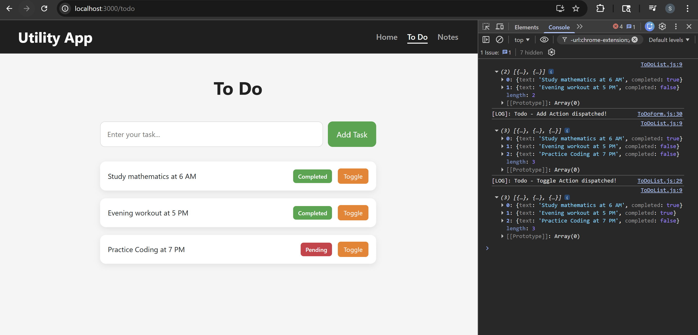
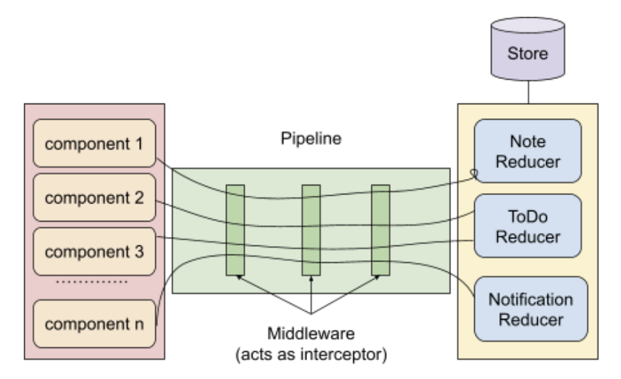
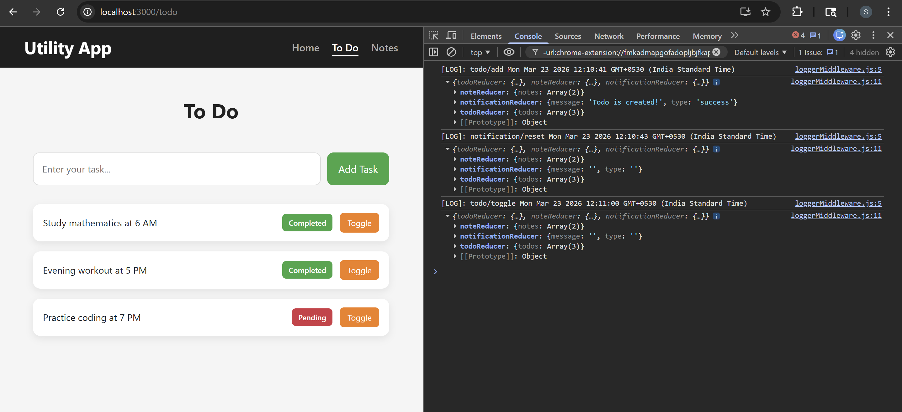
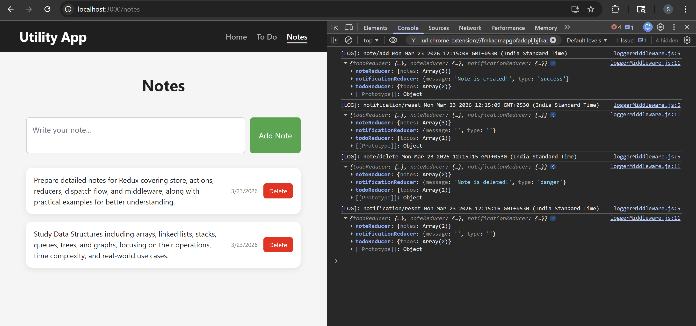
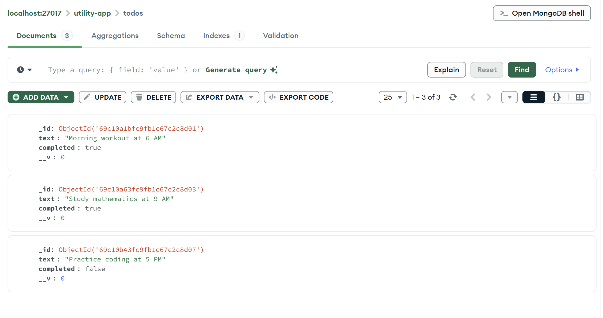
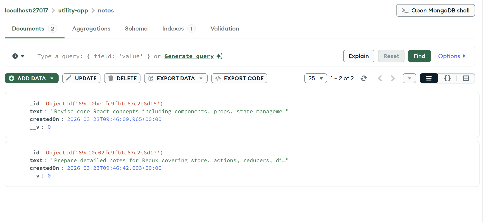
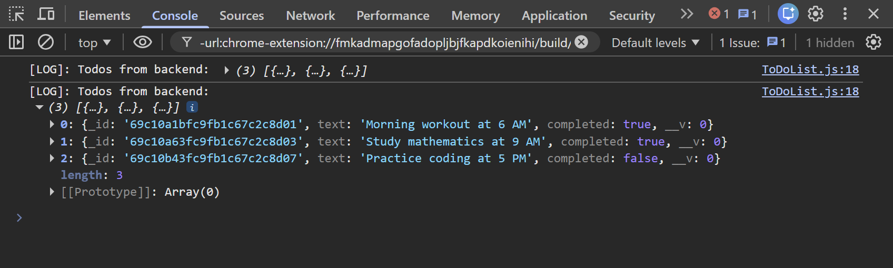

# ADVANCED REDUX

## Manual Logger

Added simple console-based logging to track when Todo actions are dispatched during user interactions. This helps in understanding the flow of actions and debugging state changes during development.

### components/ToDoForm/ToDoForm.js

```diff
...
  const handleSubmit = (e) => {
    e.preventDefault();
    if (!todoText.trim()) return;
+   console.log("[LOG]: Todo - Add Action dispatched!");
    dispatch(actions.add(todoText));
    setTodoText("");
  };
...
```

Added logging for Todo creation action.

- Adding manual log
  - Logs message when add action is triggered
  - Helps track user interaction during debugging
- No change in functionality
  - Logic remains same
  - Only debugging support added

### components/ToDoList/ToDoList.js

```diff
...
function ToDoList() {
  const todos = useSelector(todoSelector);
  console.log(todos);
  const dispatch = useDispatch();

  return (
    <div className={styles["list-container"]}>
      <ul>
        {todos.map((todo, index) => (
          <li key={todo.id}>
            <span className={styles.content}>{todo.text}</span>

            <span
              className={todo.completed ? styles.completed : styles.pending}
            >
              {todo.completed ? "Completed" : "Pending"}
            </span>

            <button
              className={styles["toggle-btn"]}
-             onClick={() => dispatch(actions.toggle(index))}
+             onClick={() => {
+               console.log("[LOG]: Todo - Toggle Action dispatched!");
+               console.log("[LOG]: Current Todos:", todos);
+               dispatch(actions.toggle(index));
+             }}
            >
              Toggle
            </button>

          </li>
        ))}
      </ul>
    </div>
  );
}
...
```

Added logging for Todo toggle action.

- Adding manual log
  - Logs message when toggle action is triggered
  - Helps identify state change triggers
- Wrapping dispatch in function
  - Allows executing multiple statements (log + dispatch)
- No impact on UI
  - Only improves debugging visibility

### Issue with Manual Logger

Using `console.log` for logging has several limitations in real applications.

- Hard to manage
  - Logs are scattered across components
  - Difficult to track or maintain as app grows
- Not scalable
  - Repetitive logging code in multiple places
  - No central control over logging behavior
- No structure
  - Logs are plain text (no action/state context)
  - Hard to debug complex flows
- Cannot be disabled easily
  - Logs remain in production unless manually removed

### Solution

Use a **centralized logging approach using Redux Middleware**.

- Centralized logging
  - All actions pass through middleware
  - Single place to log everything
- Automatic tracking
  - Logs every dispatched action
  - No need to write logs in components
- Structured logging
  - Can log action type, payload, previous & next state
- Easy to control
  - Enable/disable logging based on environment

#### 🖥️ What You See in Browser:



## Redux Logger Middleware

### Problem

In large projects, it is important to keep track of what is happening inside the
application at all times. This is where loggers come into play. A logger is a utility that
captures information about various events that occur during the application's runtime,
such as user actions, server responses, errors, and warnings.

In Redux, actions are dispatched from components to the store to update the state.
Logging every action dispatched from the components to the store using
console.log() can help debug and track the application flow. However, modifying
every reducer to add console.log statements is not an ideal approach, as it can
become difficult to manage when there are many components and reducers. One
solution to this problem is to use middleware in Redux.

### Solution: Middleware

Middleware in Redux intercepts actions as they are dispatched to the store and can
perform some additional logic on them before they reach the reducer.

One such middleware that can be used to log all actions is the loggerMiddleware.
In the case of Redux, middleware is added to the store as a pipeline, and each
middleware in the pipeline can access the store, the next middleware in the pipeline,
and the action being dispatched. When an action is dispatched from the component,
it first passes through the middleware pipeline before reaching the reducer. Each
middleware in the pipeline has the option to modify the action, dispatch additional
actions, or perform other logic before passing it on to the next middleware using the
next pointer. The concept of closure allows the middleware to access the Redux
store and the next function even after the middleware function has completed
execution.

It is important to note that every middleware in the pipeline should call the next
function with the action as its argument to pass it along to the next middleware. This
ensures that all middleware in the pipeline can process the action before it reaches
the reducer.



To solve the problem of logging every action, we can create a custom middleware
that logs the action before passing it on to the next middleware. To use the
middleware, we can add it to the middleware array in the Redux store.

### redux/middlewares/loggerMiddleware.js

Integrated a custom Redux middleware to centrally log every dispatched action and the updated state, improving debugging and visibility of state changes.

```jsx
export const loggerMiddleware = (store) => {
  return function (next) {
    return function (action) {
      //log actions
      console.log("[LOG]: " + action.type + " " + new Date().toString());

      // call next middleware in pipeline
      const result = next(action);

      // log the modified state of app
      console.log(store.getState());
      return result;
    };
  };
};
```

Added a custom logger middleware.

- Logging dispatched actions
  - Prints action type with timestamp
  - Helps track user interactions
- Logging updated state
  - Shows latest store state after reducer execution
- Maintaining middleware chain
  - Uses `next(action)` and returns result
  - Ensures proper flow of dispatch

### redux/store.js

```diff
...
 import { configureStore } from "@reduxjs/toolkit";
 import { notificationReducer } from "./reducers/notificationReducer";
+import { loggerMiddleware } from "./middlewares/loggerMiddleware";

...

 export const store = configureStore({
   reducer: {
     todoReducer,
     noteReducer,
     notificationReducer,
   },
+  middleware: (getDefaultMiddleware) =>
+    getDefaultMiddleware().concat(loggerMiddleware),
 });
```

Configured store to use logger middleware.

- Adding custom middleware
  - Imported `loggerMiddleware` into store
- Using `getDefaultMiddleware`
  - Preserves default RTK middleware
  - Extends with custom logger
- Centralized logging
  - Removes need for manual `console.log` in components

NOTE: Commented out all manual `console.log` statements from Todo components after integrating Redux logger middleware. Logging is now handled centrally through middleware, which automatically captures actions and state changes across Todo, Notes, and Notification (including reset), ensuring consistent and cleaner debugging throughout the application.

#### 🖥️ What You See in Browser:





## Backend Structure

The backend is structured using a modular architecture to separate configuration, models, controllers, and routes.

```bash
backend/
│
├── config/
│   └── db.js              # MongoDB connection setup
│
├── models/
│   ├── Todo.js            # Todo schema
│   └── Note.js            # Note schema
│
├── controllers/
│   ├── todoController.js  # Todo logic (get, add, toggle)
│   └── noteController.js  # Note logic (get, add, delete)
│
├── routes/
│   ├── todoRoutes.js      # Todo API routes
│   └── noteRoutes.js      # Note API routes
│
├── .env                   # Environment variables
├── .gitignore             # Ignored files
├── package.json           # Dependencies
├── package-lock.json
└── server.js              # Entry point (Express server)
```

- Express server setup
  - `server.js` as entry point
  - Middleware: `express.json`, `cors`
  - Routes connected for todos and notes

- Database configuration
  - MongoDB connection using Mongoose (`config/db.js`)
  - Connection string managed via `.env`

- Models
  - `Todo` → text, completed
  - `Note` → text, createdOn

- Controllers
  - Handle business logic for API requests
  - Todos → get, add, toggle
  - Notes → get, add, delete

- Routes
  - Map HTTP methods to controller functions
  - Follow REST API design

- Architecture
  - Follows MVC-like structure for scalability and maintainability

### API Documentation

#### Todo APIs

| Method | URL              | Description        | Request Body         | Response            |
| ------ | ---------------- | ------------------ | -------------------- | ------------------- |
| GET    | `/api/todos`     | Get all todos      | ❌ None              | Array of todos      |
| POST   | `/api/todos`     | Add new todo       | `{ "text": "Task" }` | Created todo object |
| PUT    | `/api/todos/:id` | Toggle todo status | ❌ None              | Updated todo object |

#### Note APIs

| Method | URL              | Description   | Request Body         | Response            |
| ------ | ---------------- | ------------- | -------------------- | ------------------- |
| GET    | `/api/notes`     | Get all notes | ❌ None              | Array of notes      |
| POST   | `/api/notes`     | Add new note  | `{ "text": "Note" }` | Created note object |
| DELETE | `/api/notes/:id` | Delete note   | ❌ None              | Success message     |

All APIs follow RESTful conventions where the HTTP method defines the action and the URL represents the resource.

### Setup & Run Instructions

#### Backend

```bash
cd backend
npm install
node server.js
```

Server runs at: `http://localhost:5000`

#### Frontend

```bash
npm install
npm start
```

App runs at: `http://localhost:3000`

#### 🔄 Application Flow

```text
Frontend (React) → API Call → Backend (Express) → Database (MongoDB) → Response → UI
```

#### ⚠️ Notes

- Start backend before frontend
- Ensure MongoDB is running
- `.env` and `node_modules` are ignored via `.gitignore`

### API Testing (Postman)

You can test the APIs using the following URLs in Postman. Some sample todos and notes are already added and can be viewed in the database screenshots below.

#### Todos

- GET all todos:
  `http://localhost:5000/api/todos`

- Add todo:
  `http://localhost:5000/api/todos`

  Body:

  ```json
  { "text": "Practice coding at 5 PM" }
  ```

- Toggle todo:
  `http://localhost:5000/api/todos/:id`

#### Notes

- GET all notes:
  `http://localhost:5000/api/notes`

- Add note:
  `http://localhost:5000/api/notes`

  Body:

  ```json
  {
    "text": "Understand Redux Toolkit middleware flow including logger and async actions handling"
  }
  ```

- Delete note:
  `http://localhost:5000/api/notes/:id`

#### 🖥️ What You See in Database:





## Using Fetch API 

`fetch` is a built-in browser API used to make HTTP requests (like GET, POST) to a server.
Added a `fetch` call to retrieve todos from the backend and log the response, verifying frontend-backend connectivity.

### components/ToDoList/ToDoList.js

```diff
import { useSelector, useDispatch } from "react-redux";
import { actions } from "../../redux/reducers/todoReducer";
import { todoSelector } from "../../redux/reducers/todoReducer";
+import { useEffect } from "react";
import styles from "./ToDoList.module.css";

function ToDoList() {
  const todos = useSelector(todoSelector);
  const dispatch = useDispatch();

+  useEffect(() => {
+    fetch("http://localhost:5000/api/todos")
+      .then((res) => res.json())
+      .then((parsedJson) => {
+        console.log("[LOG]: Todos from backend →", parsedJson);
+      })
+      .catch((err) => {
+        console.error("[ERROR]: Fetch failed →", err);
+      });
+  }, []);

  return (
    <div className={styles["list-container"]}>
      <ul>
        {todos.map((todo, index) => (
          <li key={todo.id}>
            <span className={styles.content}>{todo.text}</span>

            <span
              className={todo.completed ? styles.completed : styles.pending}
            >
              {todo.completed ? "Completed" : "Pending"}
            </span>

            <button
              className={styles["toggle-btn"]}
              onClick={() => {
                dispatch(actions.toggle(index));
              }}
            >
              Toggle
            </button>
          </li>
        ))}
      </ul>
    </div>
  );
}

export default ToDoList;
```

Introduced `useEffect` to fetch data from backend and log it in console.

- Adding `useEffect`
  - Executes API call when component mounts
  - Ensures fetch runs only once
- Using `fetch` API
  - Calls backend endpoint `/api/todos`
  - Converts response to JSON
- Logging response
  - Displays backend todos in console
  - Helps verify API integration
- Error handling
  - Logs error if request fails
  - Useful for debugging connection issues

#### 🖥️ What You See in Console:


