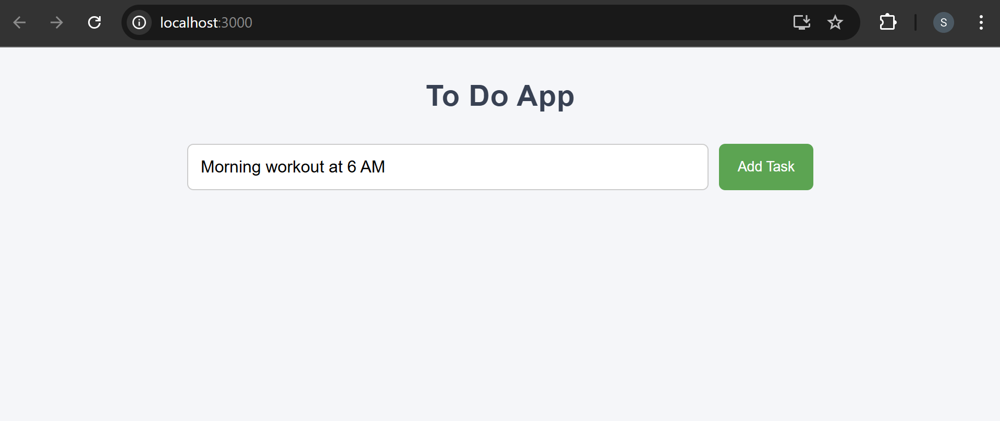
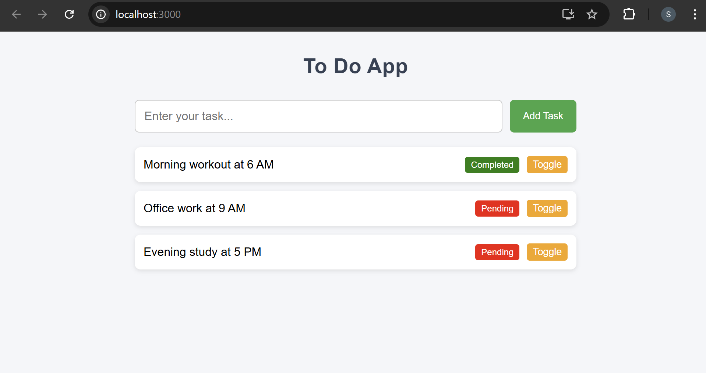
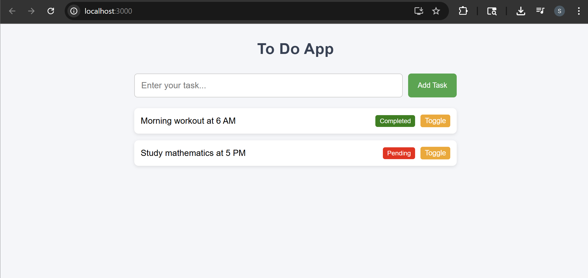
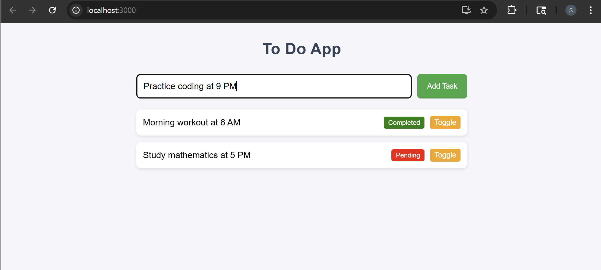
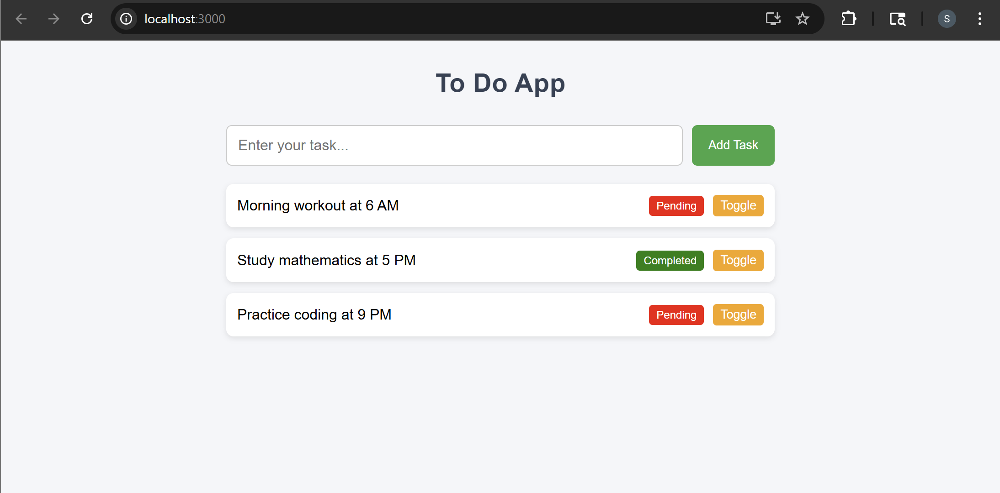
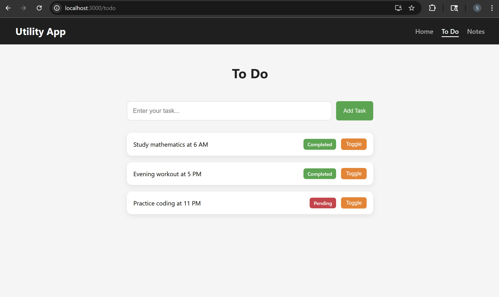
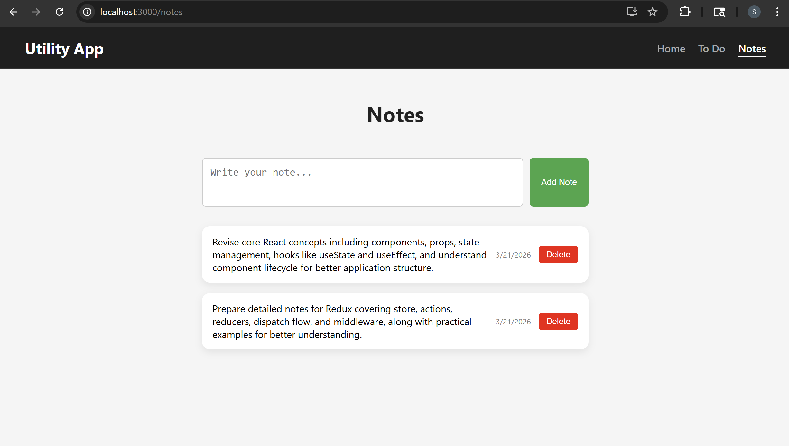

# REDUX IN REACT

## Utility-App : Project SetUp

A simple and interactive **Utility App** built with React that currently implements a **Todo feature**, allowing users to add tasks and toggle their completion status. The application is designed to support multiple utilities, with additional features like **Notes** planned for future implementation. **Currently, the application functions as a Todo app**.

This project was initialized using Create React App with the command:

```bash
npx create-react-app utility-app
```

### Folder Structure

```text
utility-app/
│
├── node_modules/        # Installed dependencies
├── public/              # Static files
│
├── src/                 # Main source code
│   ├── components/      # Reusable components
│   │   ├── ToDoForm/
│   │   │   ├── ToDoForm.js
│   │   │   └── ToDoForm.css
│   │   │
│   │   ├── ToDoList/
│   │   │   ├── ToDoList.js
│   │   │   └── ToDoList.css
│   │
│   ├── App.js           # Root component
│   ├── App.css          # App styles
│   ├── index.js         # Entry point
│   └── index.css        # Global styles
│
├── .gitignore           # Git ignored files
├── package.json         # Project metadata & dependencies
├── package-lock.json    # Dependency lock file
└── README.md            # Project documentation
```

### index.js (Application Entry Point)

```jsx
import React from "react";
import ReactDOM from "react-dom/client";
import "./index.css";
import App from "./App";

const root = ReactDOM.createRoot(document.getElementById("root"));
root.render(
  <React.StrictMode>
    <App />
  </React.StrictMode>,
);
```

This file starts the React application and renders it in the browser.

- Imports React and ReactDOM
- Imports global styles (`index.css`)
- Imports the main `App` component
- Creates a root using `ReactDOM.createRoot()`
- Renders `<App />` inside the HTML element with id `"root"`
- Uses `React.StrictMode` to detect potential issues during development

### App.js (Main Controller / State Manager)

```jsx
import { useState } from "react";
import TodoForm from "./components/ToDoForm/ToDoForm";
import TodoList from "./components/ToDoList/ToDoList";
import "./App.css";

function App() {
  const [todos, setTodos] = useState([]);

  const createTodo = (text) => {
    if (!text.trim()) return;
    setTodos([...todos, { id: Date.now(), text, completed: false }]);
  };

  const toggleTodo = (index) => {
    const list = [...todos];
    list[index].completed = !list[index].completed;
    setTodos(list);
  };

  return (
    <div className="app">
      <h1>To Do App</h1>

      <TodoForm onCreateTodo={createTodo} />
      <TodoList todos={todos} onToggle={toggleTodo} />
    </div>
  );
}

export default App;
```

his is the core component that manages all application data and logic.

- Uses `useState` to store the list of todos
- `createTodo(text)`:
  - Adds a new task to the list
  - Prevents empty inputs using `trim()`
- `toggleTodo(index)`:
  - Toggles task status (Completed ↔ Pending)
- Passes data and functions to child components:
  - `TodoForm` → receives function to add tasks
  - `TodoList` → receives tasks and toggle function

### components/ToDoForm/ToDoForm.js (Task Input Component)

```jsx
import { useState } from "react";
import "./ToDoForm.css";

function ToDoForm({ onCreateTodo }) {
  const [todoText, setTodoText] = useState("");

  const handleSubmit = (e) => {
    e.preventDefault();
    onCreateTodo(todoText);
    setTodoText("");
  };

  return (
    <div className="form-container">
      <form onSubmit={handleSubmit} className="form">
        <input
          type="text"
          placeholder="Enter your task..."
          value={todoText}
          onChange={(e) => setTodoText(e.target.value)}
        />
        <button type="submit">Add Task</button>
      </form>
    </div>
  );
}

export default ToDoForm;
```

This component handles user input for adding new tasks.

- Uses `useState` to manage input value (`todoText`)
- `handleSubmit()`:
  - Prevents page reload
  - Sends input data to App using `onCreateTodo`
  - Clears the input field after submission
- Input field is controlled via state (`value` and `onChange`)

### components/ToDoList/ToDoList.js (Task Display Component)

```jsx
import "./ToDoList.css";

function ToDoList({ todos, onToggle }) {
  return (
    <div className="list-container">
      <ul>
        {todos.map((todo, index) => (
          <li key={todo.id}>
            <span className="content">{todo.text}</span>

            <span className={todo.completed ? "completed" : "pending"}>
              {todo.completed ? "Completed" : "Pending"}
            </span>

            <button onClick={() => onToggle(index)}>Toggle</button>
          </li>
        ))}
      </ul>
    </div>
  );
}

export default ToDoList;
```

his component displays all tasks and allows users to update their status.

- Receives `todos` array from `App`
- Uses `.map()` to render each task
- Displays:
  - Task text
  - Status (Completed or Pending)
- `Toggle` button:
  - Calls `onToggle(index)` to update task status

### Styling Files

- `App.css` → Styles the main layout and overall appearance of the application

- `ToDoForm.css` → Styles the input form, including the field and button

- `ToDoList.css` → Styles the task list, including items and status display

- `index.css` → Provides global styles like fonts, spacing, and default resets

#### 🖥️ What You See in Browser:





## Setting up Actions

### redux/actions/todoActions.js (Redux Actions for Todos)

```jsx
// Action constants
export const ADD_TODO = "Add ToDO";
export const TOGGLE_TODO = "Toggle Todo";

// Action Creators
export const addTodo = (text) => ({ text, type: ADD_TODO });
export const toggleTodo = (index) => ({ index, type: TOGGLE_TODO });
```

Defines the actions for managing todos in a Redux-based app, including action types and action creators used to handle adding and updating todo items.

- Action constants(`ADD_TODO`, `TOGGLE_TODO`)
  - These are fixed identifiers for different actions.
  - Using constants ensures consistency and prevents typos across reducers and components.

- `addTodo(text)`
  - An action creator that returns an action object to add a new todo.
  - It includes:
    - `type: ADD_TODO` → tells the reducer what to do
    - `text` → the content of the new todo
- `toggleTodo(index)`
  - An action creator that returns an action object to toggle a todo’s status.
  - It includes:
    - `type: TOGGLE_TODO` → indicates toggle operation
    - `index` → identifies which todo to update

## Implementing Reducers

### redux/reducers/todoReducer.js (Todo State Reducer)

```jsx
import { ADD_TODO, TOGGLE_TODO } from "../actions/todoActions";

const initialState = {
  todos: [],
};

export function todoReducer(state, action) {
  switch (action.type) {
    case ADD_TODO:
      return {
        ...state,
        todos: [
          ...state.todos,
          {
            text: action.text,
            completed: false,
          },
        ],
      };

    case TOGGLE_TODO:
      return {
        ...state,
        todos: state.todos.map((todo, i) => {
          if (i === action.index) {
            todo.completed = !todo.completed;
          }
          return todo;
        }),
      };

    default:
      return state;
  }
}
```

Defines the reducer logic for managing todo state in a Redux-based app, handling actions such as adding new todos and toggling their completion status.

- Initial state (`initiaState`)
  - Stores the default state with an empty `todos` array
  - Represents the starting point of the application state
- `todoReducer(state, action)`
  - A reducer function that updates state based on the dispatched action
  - Uses a `switch` statement to handle different action types

- `ADD_TODO` case
  - Adds a new todo to the list
  - Returns a new state object with:
    - Existing todos spread (`...state.todos`)
    - New todo object with:
      - `text` from action
      - `completed: false`

- `TOGGLE_TODO` case
  - Toggles the completion status of a specific todo
  - Uses `map()` to iterate through todos
  - Matches todo by `index` and flips its `completed` value
- Default case
  - Returns the current state if no matching action is found

## Creating Store

Install Redux as a dependency required for state management in the application:

```bash
npm install redux
```

### redux/store.js (Redux Store Configuration)

```jsx
import * as redux from "redux";
import { todoReducer } from "./reducers/todoReducer";
export const store = redux.createStore(todoReducer);
```

Defines and configures the Redux store for the application, connecting it with the todo reducer to manage the global state.

- Importing Redux (`redux`)
  - Imports the Redux library to access store creation functionality
  - Uses `createStore` to initialize the central state container
- Importing reducer (`todoReducer`)
  - Connects the reducer that handles todo-related state updates
  - Ensures all dispatched actions are processed through this reducer
- Creating the store (`createStore`)
  - Initializes the Redux store using `todoReducer`
  - The store holds the entire application state (`todos`)
- Exporting the store (`store`)
  - Makes the store available across the application
  - Allows components to access state and dispatch actions

## Providing Store

### React Redux Library

React Redux is a popular library that provides a predictable state container for
JavaScript applications using the React library. The react-redux library provides a
centralized store for state management in React applications. It offers several hooks
that help in optimizing code and improving application performance. Hooks are an
important concept in React Redux because they allow developers to extract logic
from components and reuse it across the application.

#### Installation

To use React Redux with your React app, install it as a dependency:

```bash
npm install react-redux
```

### Provider Component

The Provider component is a React component that allows you to provide the Redux
store to all components in your application. It is the top-level component that wraps
your entire application and makes the store available to all child components.
The Provider component takes a store prop, which is the Redux store that you want
to provide to your application.

Here's an example of how to use the Provider component in a ToDo application:

```jsx
import { useState } from "react";
import { Provider } from "react-redux";
import TodoForm from "./components/ToDoForm/ToDoForm";
import TodoList from "./components/ToDoList/ToDoList";
import { store } from "./redux/store";
import "./App.css";

function App() {
  const [todos, setTodos] = useState([]);

  const createTodo = (text) => {
    setTodos([...todos, { id: todos.length + 1, text, completed: false }]);
  };

  const toggleTodo = (index) => {
    const list = [...todos];
    list[index].completed = !list[index].completed;
    setTodos(list);
  };

  return (
    <div>
      <h1>To Do App</h1>
      <Provider store={store}>
        <TodoForm onCreateTodo={createTodo} />
        <TodoList todos={todos} onToggle={toggleTodo} />
      </Provider>
    </div>
  );
}

export default App;
```

By default, when the Provider element is used, all child components will have access
to the entire Redux store. However, it is possible to scope store access to specific
components using the store prop of the Provider element. To do this, you can create
a separate Redux store for each component that requires scoped access to the
store. Then, when rendering the component, pass in the appropriate store as a prop
to the Provider element.

### App.js (Redux Provider Integration)

```diff
 import { useState } from "react";
 import TodoForm from "./components/ToDoForm/ToDoForm";
 import TodoList from "./components/ToDoList/ToDoList";
+import { Provider } from "react-redux";
+import { store } from "./redux/store";
 import "./App.css";

 function App() {
   const [todos, setTodos] = useState([]);

   const createTodo = (text) => {
     if (!text.trim()) return;
     setTodos([...todos, { id: Date.now(), text, completed: false }]);
   };

   const toggleTodo = (index) => {
     const list = [...todos];
     list[index].completed = !list[index].completed;
     setTodos(list);
   };

   return (
     <div className="app">
       <h1>To Do App</h1>
-      <TodoForm onCreateTodo={createTodo} />
-      <TodoList todos={todos} onToggle={toggleTodo} />
+      <Provider store={store}>
+        <TodoForm onCreateTodo={createTodo} />
+        <TodoList todos={todos} onToggle={toggleTodo} />
+      </Provider>
     </div>
   );
 }

 export default App;
```

Updates the App component to integrate Redux by wrapping the application with the Provider, enabling access to the centralized store across components.

- Importing `Provider` from react-redux
  - Adds Redux support to the React app
  - Allows components to access global state
- Importing `store`
  - Connects the Redux store created in `redux/store.js`
  - Makes the global state available to the app
- Wrapping with `<Provider>`
  - Wraps `TodoForm` and `TodoList` inside `Provider`
  - Enables these components to interact with Redux state
- Note on current setup
  - Local state (`useState`) is still being used for todos
  - Redux is added but not yet fully utilized for state updates

## Hooks

React Redux provides a pair of custom React hooks that allow your React
components to interact with the Redux store.

### useSelector

The **useSelector** hook is used to extract data from the Redux store. It takes a
selector function as input and returns the selected data from the store. So, if store
gets updated it will not directly impact the components. This also helps in abstraction
and encapsulation of store by hiding the important object. For example, Here the
useSelector hook is used to retrieve the todos state from the store. The todos state
is then mapped over and rendered to the screen as a list of todo items.

```jsx
import { useSelector } from "react-redux";
import "./ToDoList.css";

function ToDoList() {
  const todos = useSelector((state) => state.todos);

  return (
    <div className="container">
      <ul>
        {todos.map((todo, index) => (
          <li key={todo.id}>
            <span className="content">{todo.text}</span>
            <span className={todo.completed ? "completed" : "pending"}>
              {todo.completed ? "Completed" : "Pending"}
            </span>
            <button className="btn btn-warning">Toggle</button>
          </li>
        ))}
      </ul>
    </div>
  );
}

export default ToDoList;
```

The useSelector hook is useful for optimizing performance by avoiding unnecessary
re-renders. It allows you to select only the data you need from the store, which can
help reduce the amount of data that needs to be processed by the component.

### useDispatch

The useDispatch hook is used to dispatch actions to modify the state. It returns a
reference to the dispatch function provided by the store. This hook can be used to
dispatch actions from any component in the application, without the need for prop
drilling. The useDispatch hook can be used to dispatch actions from any component
in the application.

For example, Each todo item includes a button that, when clicked, dispatches a
toggleTodo action to the store. The toggleTodo action is imported from the
todoActions file, which contains action creators for various todo-related actions.

The dispatch function is used to dispatch the toggleTodo action, passing in the index
of the current todo item as a parameter. This will update the completed property of
the selected todo item in the store, which will trigger a re-render of the TodoList
component.

```jsx
import { useSelector, useDispatch } from "react-redux";
import { toggleTodo } from "../../redux/actions/todoActions";
import "./ToDoList.css";

function ToDoList() {
  const todos = useSelector((state) => state.todos);
  const disptach = useDispatch();

  return (
    <div className="container">
      <ul>
        {todos.map((todo, index) => (
          <li key={todo.id}>
            <span className="content">{todo.text}</span>

            <span className={todo.completed ? "completed" : "pending"}>
              {todo.completed ? "Completed" : "Pending"}
            </span>

            <button
              className="btn btn-warning"
              onClick={() => {
                dispatch(toggleTodo(index));
              }}
            >
              Toggle
            </button>
          </li>
        ))}
      </ul>
    </div>
  );
}

export default ToDoList;
```

The useDispatch hook is useful for optimizing code efficiency by providing a
simplified way of dispatching actions. It allows you to avoid the need to pass
dispatch down as a prop to child components.

## Using Selector

### redux/reducers/todoReducer.js (Reducer Initialization & Default State Setup)

```diff
 import { ADD_TODO, TOGGLE_TODO } from "../actions/todoActions";

 const initialState = {
-  todos: [],
+  todos: [
+    {
+      text: "Morning workout at 6 AM",
+      completed: true,
+    },
+    {
+      text: "Study mathematics at 5 PM",
+      completed: false,
+    },
+  ],
 };

-export function todoReducer(state, action) {
+export function todoReducer(state = initialState, action) {
   switch (action.type) {
     case ADD_TODO:
       return {
         ...state,
         todos: [
           ...state.todos,
           {
             text: action.text,
             completed: false,
           },
         ],
       };

     case TOGGLE_TODO:
       return {
         ...state,
         todos: state.todos.map((todo, i) => {
           if (i === action.index) {
             todo.completed = !todo.completed;
           }
           return todo;
         }),
       };

     default:
       return state;
   }
 }
```

Updates the reducer to initialize state properly and include predefined todos, ensuring the application has a valid default state and avoids undefined errors.

- Adding `initialState` with sample todos
  - Introduces default todo items (fitness and mathematics)
  - Helps in testing and displaying initial UI data
- Setting default state in reducer (`state = initialState`)
  - Ensures reducer always has a valid state
  - Prevents runtime errors like `Cannot read properties of undefined`
- Improved state handling
  - Maintains consistent structure of `todos` array
  - Ensures reducer works predictably with dispatched actions

### components/ToDoList/ToDoList.js (Redux State Integration)

```diff
 import "./ToDoList.css";
+import { useSelector } from "react-redux";

-function ToDoList({ todos, onToggle }) {
+function ToDoList({ onToggle }) {
+  const todos = useSelector((state) => state.todos);

   return (
     <div className="list-container">
       <ul>
         {todos.map((todo, index) => (
           <li key={todo.id}>
             <span className="content">{todo.text}</span>

             <span className={todo.completed ? "completed" : "pending"}>
               {todo.completed ? "Completed" : "Pending"}
             </span>

             <button onClick={() => onToggle(index)}>Toggle</button>
           </li>
         ))}
       </ul>
     </div>
   );
 }

 export default ToDoList;
```

Updates the component to retrieve todo data directly from the Redux store using `useSelector`, instead of receiving it via props.

- Using `useSelector`
  - Accesses global state directly from Redux store
  - Eliminates need to pass `todos` as props
- Simplifying component data flow
  - Reduces dependency on parent component
  - Makes component more connected to centralized state
- Maintaining toggle functionality (temporary)
  - Still uses `onToggle` prop (hybrid approach)
  - Can be replaced later with `dispatch` for full Redux usage

#### 🖥️ What You See in Browser:



## Dispatching Actions and Payloads

### components/ToDoForm/ToDoForm.js (Redux Dispatch Integration)

```diff
 import { useState } from "react";
+import { useDispatch } from "react-redux";
+import { addTodo } from "../../redux/actions/todoActions";
 import "./ToDoForm.css";

-function ToDoForm({ onCreateTodo }) {
+function ToDoForm() {
   const [todoText, setTodoText] = useState("");
+  const dispatch = useDispatch();

   const handleSubmit = (e) => {
     e.preventDefault();
-    onCreateTodo(todoText);
     setTodoText("");
+    dispatch(addTodo(todoText));
   };

   return (
     <div className="form-container">
       <form onSubmit={handleSubmit} className="form">
         <input
           type="text"
           placeholder="Enter your task..."
           value={todoText}
           onChange={(e) => setTodoText(e.target.value)}
         />
         <button type="submit">Add Task</button>
       </form>
     </div>
   );
 }

 export default ToDoForm;
```

Updates the form component to dispatch actions directly to the Redux store instead of passing data through props, enabling centralized state management.

- Adding `useDispatch`
  - Provides access to Redux dispatch function
  - Allows sending actions directly to the store
- Using `addTodo` action
  - Replaces prop-based handler with Redux action
  - Sends new todo data to the reducer
- Removing `onCreateTodo` prop
  - Eliminates dependency on parent component
  - Simplifies component structure

### components/ToDoList/ToDoList.js (Redux Toggle Action Integration)

```diff
+import { toggleTodo } from "../../redux/actions/todoActions";
 import "./ToDoList.css";
-import { useSelector } from "react-redux";
+import { useSelector, useDispatch } from "react-redux";

-function ToDoList({ onToggle }) {
+function ToDoList() {
   const todos = useSelector((state) => state.todos);
+  const dispatch = useDispatch();

   return (
     <div className="list-container">
       <ul>
         {todos.map((todo, index) => (
           <li key={todo.id}>
             <span className="content">{todo.text}</span>

             <span className={todo.completed ? "completed" : "pending"}>
               {todo.completed ? "Completed" : "Pending"}
             </span>

-            <button onClick={() => onToggle(index)}>Toggle</button>
+            <button onClick={() => dispatch(toggleTodo(index))}>
+              Toggle
+            </button>
           </li>
         ))}
       </ul>
     </div>
   );
 }

 export default ToDoList;
```

Updates the todo list component to dispatch toggle actions directly to Redux, removing reliance on parent props and enabling centralized state updates.

- Adding `useDispatch`
  - Enables dispatching actions from the component
  - Connects UI interactions to Redux
- Using `toggleTodo` action
  - Replaces prop-based toggle handler
  - Updates todo status via reducer
- Removing dependency on `onToggle`
  - Simplifies component communication
  - Moves logic fully into Redux

#### 🖥️ What You See in Browser:





## New 'Notes' Feature in Utility App

The application has been enhanced from a **Todo App** to a **Utility App** with two features: **Todo** and **Notes**. The Todo feature is fully functional using Redux for state management, while the Notes feature currently includes only the UI, with Redux integration to be implemented.

### Project Structure (Updated)

```text
utility-app/
│
├── node_modules/        # Installed dependencies
├── public/              # Public static files
│
├── src/                 # Main source code
│   │
│   ├── components/      # Reusable UI components
│   │   │
│   │   ├── Home/
│   │   │   ├── Home.js
│   │   │   └── Home.css
│   │   │
│   │   ├── NavBar/
│   │   │   ├── NavBar.js
│   │   │   └── NavBar.css
│   │   │
│   │   ├── ToDoForm/
│   │   │   ├── ToDoForm.js
│   │   │   └── ToDoForm.css
│   │   │
│   │   ├── ToDoList/
│   │   │   ├── ToDoList.js
│   │   │   └── ToDoList.css
│   │   │
│   │   ├── NoteForm/
│   │   │   ├── NoteForm.js
│   │   │   └── NoteForm.css
│   │   │
│   │   ├── NoteList/
│   │   │   ├── NoteList.js
│   │   │   └── NoteList.css
│   │
│   ├── redux/           # Redux state management
│   │   ├── actions/
│   │   │   └── todoActions.js
│   │   │
│   │   ├── reducers/
│   │   │   └── todoReducer.js
│   │   │
│   │   └── store.js
│   │
│   ├── App.js           # Root component (Routing + Layout)
│   ├── App.css          # App-level styles
│   ├── index.js         # Entry point (ReactDOM render)
│   └── index.css        # Global styles
│
├── .gitignore           # Ignored files
├── package.json         # Project config & dependencies
├── package-lock.json    # Dependency lock
└── README.md            # Documentation
```

### App.js (Routing & Multi-Feature Integration)

```jsx
import { Fragment } from "react";
import { Provider } from "react-redux";
import { store } from "./redux/store";
import { BrowserRouter, Routes, Route } from "react-router-dom";

import TodoForm from "./components/ToDoForm/ToDoForm";
import TodoList from "./components/ToDoList/ToDoList";
import NoteForm from "./components/NoteForm/NoteForm";
import NoteList from "./components/NoteList/NoteList";
import Home from "./components/Home/Home";
import NavBar from "./components/NavBar/NavBar";

import "./App.css";

function App() {
  return (
    <Provider store={store}>
      <BrowserRouter>
        <NavBar />

        <Routes>
          <Route path="/" element={<Home />} />

          <Route
            path="/todo"
            element={
              <>
                <h1>To Do</h1>
                <TodoForm />
                <TodoList />
              </>
            }
          />

          <Route
            path="/notes"
            element={
              <>
                <h1>Notes</h1>
                <NoteForm />
                <NoteList />
              </>
            }
          />
        </Routes>
      </BrowserRouter>
    </Provider>
  );
}

export default App;
```

Transforms the application from a single-feature Todo app using local state into a multi-feature utility app with routing and centralized state management using Redux.

- Removed local state (`useState`)
  - Eliminates component-level state handling for todos
  - Moves toward centralized state via Redux
- Integrated React Router
  - Adds `BrowserRouter`, `Routes`, and `Route`
  - Enables navigation between Home, Todo, and Notes pages
- Added global `NavBar`
  - Provides consistent navigation across all routes
  - Improves user experience and accessibility
- Separated features into routes
  - `/` → Home page
  - `/todo` → Todo functionality
  - `/notes` → Notes functionality
- Integrated multiple components
  - Combines Todo and Notes features into one application
  - Uses modular structure for better scalability

### components/Home/Home.js (Landing Page Component)

```jsx
import { Link } from "react-router-dom";
import "./Home.css";

function Home() {
  return (
    <div className="home-container">
      <h1>Utility App</h1>
      <p>Manage your daily tasks and notes efficiently</p>

      <div className="home-cards">
        <Link to="/todo" className="card">
          <h3>To Do</h3>
          <p>Track your daily tasks</p>
        </Link>

        <Link to="/notes" className="card">
          <h3>Notes</h3>
          <p>Write and manage notes</p>
        </Link>
      </div>
    </div>
  );
}

export default Home;
```

Defines the home page that serves as the entry point of the application, providing navigation to different features using interactive cards.

- Using `Link` for navigation
  - Enables client-side routing without refresh
  - Redirects users to Todo and Notes sections
- Card-based UI layout
  - Displays features as clickable cards
  - Improves usability and visual structure
- Introductory content
  - Shows app title and description
  - Helps users understand the purpose of the application

### components/NavBar/NavBar.js (Navigation Component)

```jsx
import { NavLink } from "react-router-dom";
import "./NavBar.css";

function NavBar() {
  return (
    <nav className="navbar">
      <h2 className="logo">Utility App</h2>

      <div className="nav-links">
        <NavLink to="/" end>
          Home
        </NavLink>
        <NavLink to="/todo">To Do</NavLink>
        <NavLink to="/notes">Notes</NavLink>
      </div>
    </nav>
  );
}

export default NavBar;
```

Defines a navigation bar using `NavLink` to enable seamless routing between different sections of the application with active link support.

- Using `NavLink` from react-router-dom
  - Enables navigation without page reload
  - Automatically applies active styling to current route
- Navigation structure
  - Includes links to Home, Todo, and Notes pages
  - Provides consistent access across the app
- Reusable layout component
  - Placed globally in `App.js`
  - Visible on all pages for better user experience

### components/NoteForm/NoteForm.js (Note Input Component)

```jsx
import { useState } from "react";
import "./NoteForm.css";

function NoteForm() {
  const [noteText, setNoteText] = useState("");

  const handleSubmit = (e) => {
    e.preventDefault();
    setNoteText("");
  };

  return (
    <div className="form-container">
      <form onSubmit={handleSubmit} className="form">
        <textarea
          placeholder="Write your note..."
          value={noteText}
          onChange={(e) => setNoteText(e.target.value)}
        />
        <button type="submit">Add Note</button>
      </form>
    </div>
  );
}

export default NoteForm;
```

Handles user input for creating notes using local state and controlled form elements.

- Using `useState`
  - Manages note input value
  - Keeps textarea controlled
- Form submission handling
  - Prevents default page reload
  - Clears input after submission
- User-friendly input UI
  - Uses textarea for multi-line note entry
  - Styled similarly to Todo form for consistency

### components/NoteList/NoteList.js (Notes Display Component)

```jsx
import "./NoteList.css";

function NoteList() {
  const notes = [
    {
      text: "Revise core React concepts including components, props, state management, hooks like useState and useEffect, and understand component lifecycle for better application structure.",
      createdOn: new Date(),
    },
    {
      text: "Prepare detailed notes for Redux covering store, actions, reducers, dispatch flow, and middleware, along with practical examples for better understanding.",
      createdOn: new Date(),
    },
  ];

  return (
    <div className="list-container">
      <ul>
        {notes.map((note, index) => (
          <li key={index}>
            <span className="note-content">{note.text}</span>

            <span className="note-date">
              {note.createdOn.toLocaleDateString()}
            </span>

            <button className="delete-btn">Delete</button>
          </li>
        ))}
      </ul>
    </div>
  );
}

export default NoteList;
```

Displays a list of notes in a structured format with content, date, and delete action.

- Rendering notes list
  - Uses `map()` to display each note
  - Dynamically generates UI elements
- Displaying note details
  - Shows note text and formatted creation date
  - Enhances readability
- Delete button (UI only)
  - Provides action button for future functionality
  - Currently used for visual interaction
- Consistent layout with Todo
  - Uses similar structure and styling
  - Maintains uniform UI across features

#### 🖥️ What You See in Browser:






## Creating Note Actions & Reducer

### redux/actions/noteActions.js (Redux Actions for Notes)

```jsx
// Actions constants
export const ADD_NOTE = "Add Note";
export const DELETE_NOTE = "Delete Note";

// Action Creators
export const addNote = (text) => ({ text, type: ADD_NOTE });
export const deleteNote = (index) => ({ index, type: DELETE_NOTE });
```

Defines the actions for managing notes in the application, including action types and action creators for adding and deleting notes.

- Action constants (`ADD_NOTE`, `DELETE_NOTE`)
  - Fixed identifiers for note-related actions
  - Ensure consistency across reducers and components
- `addNote(text)`
  - Creates an action to add a new note
  - Includes:
    - `type: ADD_NOTE` → specifies add operation
    - `text` → content of the note
- `deleteNote(index)`
- Creates an action to remove a note
- Includes:
  - `type: DELETE_NOTE` → specifies delete operation
  - `index` → identifies which note to remove

### redux/reducers/noteReducer.js (Notes State Reducer)

```jsx
import { ADD_NOTE, DELETE_NOTE } from "../actions/noteActions";

const initialState = {
  notes: [
    {
      text: "Revise core React concepts including components, props, state management, hooks like useState and useEffect, and understand component lifecycle for better application structure.",
      createdOn: new Date(),
    },
    {
      text: "Prepare detailed notes for Redux covering store, actions, reducers, dispatch flow, and middleware, along with practical examples for better understanding.",
      createdOn: new Date(),
    },
  ],
};

export function noteReducer(state = initialState, action) {
  switch (action.type) {
    case ADD_NOTE:
      return {
        ...state,
        notes: [
          ...state.notes,
          {
            text: action.text,
            createdOn: new Date(),
          },
        ],
      };
    case DELETE_NOTE:
      state.notes.splice(action.index, 1);
      return {
        ...state,
        notes: [...state.notes],
      };
    default:
      return state;
  }
}
```

Defines how the notes state is managed and updated in response to actions, handling the addition and deletion of notes.

- Initial state (`initialState`)
  - Contains a predefined list of notes
  - Each note includes:
    - `text` → note content
    - `createdOn` → timestamp of creation
- `noteReducer(state, action)`
  - Core function that updates state based on action type
  - Returns a new updated state for every change
- `ADD_NOTE` case
  - Adds a new note to the list
  - Creates a note object with:
    - `text` from action
    - `createdOn` with current date
- `DELETE_NOTE` case
  - Removes a note from the list using its index
  - Updates the notes array after deletion
- Default case
  - Returns current state if action type does not match

## Multiple Reducers

In a typical React Redux application, the state is managed by reducers, which are
functions responsible for handling different parts of the state. The decision to use
multiple reducers or a single reducer depends on the complexity of your application's
state. If your application's state is simple and straightforward, a single reducer may
suffice. However, as your application grows in complexity, it can become difficult to
manage a large state with a single reducer. Using multiple reducers in your React
Redux application can provide better organization, improved scalability, and better
performance. For example, let's say you have an e-commerce application that
manages user accounts, products, and orders. You can create three separate
reducers for each of these parts of the state.

## Combining Reducers

Combining reducers is a technique used in React Redux to manage a complex state
in a more organized and manageable way. It involves creating multiple reducers that
handle different parts of the state and then combining them into a single root reducer
using the **combineReducers** function. The combineReducers function takes an
object as its argument, where the keys represent the keys of the root state object,
and the values represent the individual reducers.

For example in this case, the root state object has two keys, todos and notes, each
of which maps to the corresponding reducer.

```jsx
import * as redux from "redux";
import { combineReducers } from "redux";
import { noteReducer } from "./reducers/noteReducer";
import { todoReducer } from "./reducers/todoReducer";

const result = combineReducers({
  todos: todoReducer,
  notes: noteReducer,
});

export const store = redux.createStore(result);
```

With this setup, you can now dispatch actions to update the state managed by each
reducer separately. For example, to add a todo item, you can dispatch the following
action:

```javascript
{
  type: "ADD_TODO",
  id: 1,
  text: "Study React and Redux for 2 hours"
}
```

This action will be handled by the todoReducer, which will update the todos state
accordingly. Similarly, to add a note, you can dispatch the following action:

```javascript
{
  type: "ADD_NOTE",
  id: 1,
  text: "Call, Shivani Rathore"
}
```

This action will be handled by the noteReducer, which will update the notes state
accordingly.

### redux/store.js (Combined Redux Store Configuration)

```diff
import * as redux from "redux";
+import { combineReducers } from "redux";
import { todoReducer } from "./reducers/todoReducer";
+import { noteReducer } from "./reducers/noteReducer";

+const result = combineReducers({
+  todos: todoReducer,
+  notes: noteReducer,
+});

-export const store = redux.createStore(todoReducer);
+export const store = redux.createStore(result);
```

Updates the Redux store to manage multiple state slices by combining reducers, enabling support for both Todo and Notes features within a single centralized store.

- Introduced `combineReducers`
  - Combines multiple reducers into one root reducer
  - Allows handling different parts of state separately
- Integrated `todoReducer` and `noteReducer`
  - `todoReducer` → manages todo-related state
  - `noteReducer` → manages notes-related state
- Structured global state
  - State is now divided into:
    - `todos` → handled by todoReducer
    - `notes` → handled by noteReducer
- Updated store creation
  - Replaced single reducer with combined reducer (`result`)
  - Enables scalability for adding more features in future

## Updating Notes with Redux

### redux/store.js (State Structure Update with combineReducers)

```diff
import * as redux from "redux";
import { combineReducers } from "redux";
import { todoReducer } from "./reducers/todoReducer";
import { noteReducer } from "./reducers/noteReducer";

const result = combineReducers({
-  todos: todoReducer,
-  notes: noteReducer,
+  todoReducer,
+  noteReducer,
});

export const store = redux.createStore(result);
```

Refactors the Redux store by changing how reducers are combined, updating the state structure and how data is accessed.

- Updated reducer configuration
  - Replaced custom keys (`todos`, `notes`) with direct reducer names
- Changed global state shape
  - `state.todos` → `state.todoReducer.todos`
  - `state.notes` → `state.noteReducer.notes`
- Impact
  - Requires updates in `useSelector` across components

### components/ToDoList/ToDoList.js (State Access Update)

```diff
...
function ToDoList() {
-  const todos = useSelector((state) => state.todos);
+  const todos = useSelector((state) => state.todoReducer.todos);
+  console.log(todos);
  const dispatch = useDispatch();
  return (
    ...
  );
}
```

Updates the component to align with the new Redux state structure and removes dependency on props by fully utilizing Redux for state management.

- Updated state selection
  - Changed from `state.todos` to `state.todoReducer.todos`
  - Matches new structure created by `combineReducers`
- Improved debugging
  - Added `console.log(todos)` to verify state updates during development

### components/ToDoForm/ToDoForm.js (Input Validation Enhancement)

```diff
...
const handleSubmit = (e) => {
  e.preventDefault();
+  if (!todoText.trim()) return;
   dispatch(addTodo(todoText));
   setTodoText("");
};
...
```

Adds validation to prevent empty tasks from being added and improves submission flow.

- Added validation
  - Prevents empty or whitespace input
- Improved dispatch flow
  - Dispatch only when valid input
- Maintains controlled input
  - Clears input after successful submission

### components/NoteForm/NoteForm.js (Redux Integration + Validation)

```diff
 import { useState } from "react";
+import { addNote } from "../../redux/actions/noteActions";
+import { useDispatch } from "react-redux";
 import "./NoteForm.css";

 function NoteForm() {
   const [noteText, setNoteText] = useState("");
+  const dispatch = useDispatch();

   const handleSubmit = (e) => {
     e.preventDefault();
+    if (!noteText.trim()) return;
+    dispatch(addNote(noteText));
     setNoteText("");
   };

   return (
     <div className="form-container">
       <form onSubmit={handleSubmit} className="form">
         <textarea
           placeholder="Write your note..."
           value={noteText}
           onChange={(e) => setNoteText(e.target.value)}
         />
         <button type="submit">Add Note</button>
       </form>
     </div>
   );
 }

 export default NoteForm;
```

Refactors the NoteForm component from a simple UI-only form into a Redux-connected component that dispatches actions to store notes, along with validation to ensure meaningful input.

- Integrated Redux with `useDispatch`
  - Introduced `useDispatch` to send actions directly to the Redux store
  - Replaces local-only handling with centralized state updates
- Connected `addNote` action
  - Dispatches note text to Redux using `addNote`
  - Enables notes to be stored and managed globally
- Added input validation
  - Uses `trim()` to prevent empty or whitespace-only notes
  - Ensures only valid data is added to state
- Improved submission flow
  - Dispatch happens only when input is valid
  - Input field is cleared after successful submission

### components/NoteList/NoteList.js (Redux State & Delete Action Integration)

```diff
 import "./NoteList.css";
+import { useSelector, useDispatch } from "react-redux";
+import { deleteNote } from "../../redux/actions/noteActions";

 function NoteList() {
-  const notes = [
-    ...
-  ];
+  const notes = useSelector((state) => state.noteReducer.notes);
+  const dispatch = useDispatch();

   return (
     <div className="list-container">
       <ul>
         {notes.map((note, index) => (
           <li key={index}>
             <span className="note-content">{note.text}</span>

             <span className="note-date">
               {note.createdOn.toLocaleDateString()}
             </span>

-            <button className="delete-btn">Delete</button>
+            <button
+              className="delete-btn"
+              onClick={() => dispatch(deleteNote(index))}
+            >
+              Delete
+            </button>
           </li>
         ))}
       </ul>
     </div>
   );
 }
```

Converts the NoteList component from static data rendering to a fully dynamic Redux-driven component that reflects real-time state changes and supports note deletion.

- Replaced static notes with Redux state
  - Removed hardcoded notes array
  - Uses `useSelector` to fetch notes from Redux store
  - Ensures UI always reflects latest state
- Integrated delete functionality
  - Added `useDispatch` to trigger delete actions
  - Uses `deleteNote(index)` to remove specific note
- Dynamic rendering of notes
  - Notes are rendered using `map()` from Redux state
  - Automatically updates UI when notes are added or deleted
- Improved component responsibility
  - Component now fully depends on Redux for data
  - No local or temporary data handling

#### 🖥️ What You See in Browser:

#### Add Note


#### Delete Note


## Summarizing it

Let’s summarize what we have learned in this Lecture:

- Learned about React Redux library.
- Learned about Provider Component.
- Learned about useSelector Hook.
- Learned about useDispatch Hook.
- Learned about Multiple Reducers.
- Learned about Combining the Reducer-

### Some References:

[Redux API Reference](https://react-redux.js.org/introduction/getting-started)

[React Redux Quick Start](https://react-redux.js.org/tutorials/quick-start)
