# REDUX TOOLKIT

## Introduction

Redux is a state management library that helps manage application states in a
predictable and consistent manner. It is widely used in modern web development
with React and has been an essential tool for building scalable and maintainable
applications. However, working with Redux can sometimes be challenging,
especially when it comes to setting up and managing reducers, actions, and
selectors. To address these challenges, the Redux team has released Redux Toolkit,
a package that simplifies the process of setting up and using Redux.

### Challenges with Redux

- **Boilerplate Code**: Setting up Redux involves a lot of boilerplate code. You
  must create separate files for actions, reducers, and store configuration. This
  can be time-consuming and error-prone.
- **Complex Reducers**: Writing complex reducers can be difficult, especially
  when dealing with nested data structures or asynchronous actions.
- **Debugging**: Debugging Redux applications can be challenging, especially
  when dealing with large and complex application states

## Redux Toolkit library

Redux Toolkit provides a streamlined way of working with Redux, eliminating many
of the common pain points of building large-scale Redux applications. It is designed
to be backward-compatible with existing Redux code, making it easy to adopt and
integrate into existing projects. Some of its key features include:

- A "slice" API that simplifies the process of creating Redux reducers
- A "createAsyncThunk" API that simplifies the process of handling
  asynchronous actions
- A simplified and standardized file structure for Redux code
- Automatic generation of Redux actions and reducers for common use cases
- A collection of other useful utilities and middleware for Redux.

## Migrating from Redux to Redux Toolkit

### Install Redux Toolkit

Start by installing Redux Toolkit in your application by running the command:

```bash
npm install @reduxjs/toolkit
```

### Creating Slices

Replace your existing Redux actions and reducers with "slices," which are
predefined Redux logic blocks in Redux Toolkit. You can create slices using the
createSlice() function provided by Redux Toolkit.
To define a slice using createSlice, you need to call the function and pass in an
object that contains the name, initialState, and reducers properties.

- **name**: This property is used to define the name of the slice. It is used to
  generate the action types for the slice automatically and to create action
  creators with the correct names.
- **initialState**: This property is used to define the initial state of the slice. It is
  used to set the initial state of the store when it is first created.
- **reducers**: This property defines a set of reducer functions that can update the
  slice's state. It takes an object as an argument where each key-value pair
  represents a case reducer. The key is the name of the action, and the value is
  a function that updates the state. When an action is dispatched, the
  corresponding reducer function will be called, and the slice's state will be
  updated accordingly. The payload property of the action object can be
  accessed using action.payload inside the reducer functions.

```jsx
const todoSlice = createSlice({
  name: "todo",
  initialState: initialState,
  reducers: {
    add: (state, action) => {
      state.todos.push({
        text: action.payload,
        completed: false,
      });
    },
    toggle: (state, action) => {
      state.todos.map((todo, i) => {
        if (i == action.payload) {
          todo.completed = !todo.completed;
        }
        return todo;
      });
    },
  },
});
```

### Migrating Store

Replace your existing store creation code with the `configureStore()` function provided
by Redux Toolkit. This function simplifies the store creation process by automatically
adding common middleware and other settings.

```jsx
export const store = configureStore({
  reducer: {
    todoReducer,
    noteReducer,
  },
});
```

### Dispatching Actions

The actions object is exported separately from the reducer

```jsx
export const todoReducer = todoSlice.reducer;
export const actions = todoSlice.actions;
```

You can use this object to access your actions by importing them and passing them
as arguments to the dispatch function.

```jsx
<button
  className="btn btn-warning"
  onClick={() => {
    disptach(actions.toggle(index));
  }}
>
  Toggle
</button>
```

### Setting Up Selectors

You can define a new selector function called todoSelector, which extracts the
todoReducer slice of the state.

```jsx
// selector
export const todoSelector = (state) => state.todoReducer.todos;
```

Once you have defined your selectors, you can use the useSelector hook from the
react-redux library to access the selected data in your components.

## Creating Slices

`createSlice` is a function from Redux Toolkit that simplifies Redux by combining reducers and actions in one place, reducing boilerplate and making state management easier.

### redux/reducers/todoReducer.js (Migration to Redux Toolkit Slice)

```jsx
// Import createSlice from Redux Toolkit
const { createSlice } = require("@reduxjs/toolkit");
// import { ADD_TODO, TOGGLE_TODO } from "../actions/todoActions";

// Initial state containing default todos
const initialState = {
  todos: [
    {
      text: "Study mathematics at 6 AM",
      completed: true,
    },
    {
      text: "Evening workout at 5 PM",
      completed: false,
    },
  ],
};

// ================= Redux Toolkit Slice (Reducer + Actions) =================
const todoSlice = createSlice({
  name: "todo", // Slice name (used as action prefix)
  initialState,

  reducers: {
    // Add a new todo item
    add: (state, action) => {
      state.todos.push({
        text: action.payload, // Todo text
        completed: false, // Default status
      });
    },

    // Toggle completion status of a todo by index
    toggle: (state, action) => {
      const todo = state.todos[action.payload]; // Get todo by index
      if (todo) {
        todo.completed = !todo.completed; // Flip completed status
      }

      // Alternative approach using map (not recommended here)
      // state.todos.map((todo, i) => {
      //   if (i === action.payload) {
      //     todo.completed = !todo.completed;
      //   }
      //   return todo;
      // });
    },
  },
});

// ---------------- Traditional Redux Reducer (Without Toolkit) ----------------
// export function todoReducer(state = initialState, action) {
//   switch (action.type) {

//     // Add a new todo
//     case ADD_TODO:
//       return {
//         ...state,
//         todos: [
//           ...state.todos,
//           {
//             text: action.text,
//             completed: false,
//           },
//         ],
//       };

//     // Toggle todo status by index
//     case TOGGLE_TODO:
//       return {
//         ...state,
//         todos: state.todos.map((todo, i) => {
//           if (i === action.index) {
//             todo.completed = !todo.completed;
//           }
//           return todo;
//         }),
//       };

//     default:
//       return state;
//   }
// }
```

Refactors the todo reducer from traditional Redux (`switch-case ` with separate actions) to Redux Toolkit using `createSlice`, reducing boilerplate and improving code readability.

- Replaced traditional reducer with `createSlice`
  - Removed `switch-case` logic and manual action handling
  - Combined reducer logic and actions inside a single slice
- Eliminated action constants and creators
  - No need for `ADD_TODO`, `TOGGLE_TODO` or separate action files
  - Actions are auto-generated from slice (`add`, `toggle`)
- Simplified state updates
  - Direct mutations like `state.todos.push()` are allowed
  - Redux Toolkit internally uses Immer to maintain immutability
- Optimized toggle logic
  - Accesses todo directly using index instead of iterating with `map()`
  - Makes logic more efficient and easier to read
- Improved code structure
  - Cleaner and more maintainable reducer setup
  - Easier to scale with additional features

### edux/reducers/noteReducer.js (Migration to Redux Toolkit Slice)

```jsx
// Import createSlice from Redux Toolkit
const { createSlice } = require("@reduxjs/toolkit");
//import { ADD_NOTE, DELETE_NOTE } from "../actions/noteActions";

// Initial state containing default notes
const initialState = {
  notes: [
    {
      text: "Revise core React concepts including components, props, state management, hooks like useState and useEffect, and understand component lifecycle for better application structure.",
      createdOn: new Date(),
    },
    {
      text: "Prepare detailed notes for Redux covering store, actions, reducers, dispatch flow, and middleware, along with practical examples for better understanding.",
      createdOn: new Date(),
    },
  ],
};

// ================= Redux Toolkit Slice (Reducer + Actions) =================
const noteSlice = createSlice({
  name: "note", // Slice name (used as action prefix)
  initialState,

  reducers: {
    // Add a new note with current timestamp
    add: (state, action) => {
      state.notes.push({
        text: action.payload, // Note content
        createdOn: new Date(), // Auto-generate creation time
      });
    },

    // Delete a note by index
    delete: (state, action) => {
      state.notes.splice(action.payload, 1);
    },
  },
});

// ---------------- Traditional Redux Reducer (Without Toolkit) ----------------
// export function noteReducer(state = initialState, action) {
//   switch (action.type) {

//     // Add a new note
//     case ADD_NOTE:
//       return {
//         ...state,
//         notes: [
//           ...state.notes,
//           {
//             text: action.text,
//             createdOn: new Date(),
//           },
//         ],
//       };

//     // Delete a note by index
//     case DELETE_NOTE:
//       state.notes.splice(action.index, 1); // Mutating original state (not recommended)
//       return {
//         ...state,
//         notes: [...state.notes], // Return updated copy
//       };

//     default:
//       return state;
//   }
// }
```

Refactors the note reducer to use Redux Toolkit, simplifying note management by combining reducer logic and actions while removing manual state handling.

- Replaced `switch-case` with `createSlice`
  - Removed manual reducer logic and action type checks
  - Centralized add and delete logic inside slice
- Removed action constants and creators
  - No need for `ADD_NOTE`, `DELETE_NOTE`
  - Actions are automatically generated (`add`, `delete`)
- Simplified note creation
  - Directly pushes new note into state
  - Automatically assigns current timestamp
- Improved delete logic
  - Uses `splice()` directly on state
  - No need to create new array manually
- Cleaner and scalable structure
  - Less boilerplate code
  - Easier to extend (edit, search, filter notes later)

### Overall Summary (Slices Creation)

- Migrated from **manual Redux → Redux Toolkit (createSlice)**
- Reduced boilerplate by removing:
  - Action constants
  - Action creators
  - Switch-case reducers
- Simplified state updates using **direct mutation (handled internally by Immer)**
- Improved readability, maintainability, and scalability of reducers
- Unified **actions + reducers into single slices** for better architecture

## Migrating Store

Migrated the Redux store to **Redux Toolkit’s** `configureStore`, simplifying setup by removing manual configuration and improving state management with a cleaner and modern structure

### redux/store.js (Migration to Redux Toolkit Store)

```jsx
// import * as redux from "redux";
// import { combineReducers } from "redux";
import { todoReducer } from "./reducers/todoReducer";
import { noteReducer } from "./reducers/noteReducer";
import { configureStore } from "@reduxjs/toolkit";

// const result = combineReducers({
//   todoReducer,
//   noteReducer,
// });
// export const store = redux.createStore(result);

export const store = configureStore({
  reducer: {
    todoReducer,
    noteReducer,
  },
});
```

Refactors the Redux store from manual setup using `createStore` and `combineReducers` to Redux Toolkit’s `configureStore`, simplifying configuration and improving default behavior.

- Replaced `createStore` with `configureStore`
  - Removed manual store creation
  - Uses Redux Toolkit’s built-in optimized store setup
- Removed explicit `combineReducers`
  - No need to manually combine reducers
  - `configureStore` automatically handles it
- Cleaner reducer configuration
  - Reducers are directly passed as an object
  - Improves readability and structure
- Better defaults
  - Includes Redux DevTools support
  - Adds middleware automatically (like thunk)

### redux/reducers/todoReducer.js (Exporting Slice Reducer)

```diff
import { configureStore } from "@reduxjs/toolkit";
 const todoSlice = createSlice({
   ...
 });

+export const todoReducer = todoSlice.reducer;
```

Updates the file to export reducer from Redux Toolkit slice so it can be used in the store configuration.

- Exported reducer from slice
  - `todoSlice.reducer` is now used as main reducer
- Removed dependency on traditional reducer export
  - No more `switch-case` export needed

### redux/reducers/noteReducer.js (Exporting Slice Reducer)

```diff
import { configureStore } from "@reduxjs/toolkit";
 const noteSlice = createSlice({
   ...
 });

+export const noteReducer = noteSlice.reducer;
```

Updates the file to export reducer from Redux Toolkit slice for integration with the new store setup.

- Exported reducer from slice
  - `noteSlice.reducer` is now used in store
- Removed traditional reducer dependency
  - Toolkit slice becomes single source of truth

### Overall Summary (Store Migration)

- Migrated from **manual Redux store → Redux Toolkit** `configureStore`
- Removed boilerplate:
  - `createStore`
  - `combineReducers`
- Simplified reducer integration
- Enabled built-in middleware and DevTools support
- Aligned store setup with modern Redux best practices

## Dispatching Actions

Updated the way actions are dispatched by using **Redux Toolkit slice actions** instead of manual action creators, making the code simpler and more direc

### redux/reducers/todoReducer.js (Exporting Slice Actions)

```diff
const { createSlice } = require("@reduxjs/toolkit");

const initialState = {
  todos: [
    {
      text: "Study mathematics at 6 AM",
      completed: true,
    },
    {
      text: "Evening workout at 5 PM",
      completed: false,
    },
  ],
};

const todoSlice = createSlice({
  name: "todo",
  initialState,

  reducers: {
    add: (state, action) => {
      state.todos.push({
        text: action.payload,
        completed: false,
      });
    },
    toggle: (state, action) => {
      const todo = state.todos[action.payload];
      if (todo) {
        todo.completed = !todo.completed;
      }
    },
  },
});

export const todoReducer = todoSlice.reducer;
+export const actions = todoSlice.actions;
```

Updates the reducer file to export actions directly from createSlice, eliminating the need for separate action creators and simplifying dispatching.

- Exported actions from slice
  - Added `todoSlice.actions` export
  - Provides auto-generated action creators (`add`, `toggle`)
- Removed dependency on manual actions
  - No need for `addTodo`, `toggleTodo` from actions file
  - Slice now handles both reducer + actions
- Improved structure
  - Centralized logic in one file
  - Cleaner and easier to maintain

### components/ToDoForm/ToDoForm.js (Dispatching Slice Actions)

```diff
import { useState } from "react";
import { useDispatch } from "react-redux";
-import { addTodo } from "../../redux/actions/todoActions";
+import { actions } from "../../redux/reducers/todoReducer";
import "./ToDoForm.css";

function ToDoForm() {
  const [todoText, setTodoText] = useState("");
  const dispatch = useDispatch();

  const handleSubmit = (e) => {
    e.preventDefault();
    if (!todoText.trim()) return;
-    dispatch(addTodo(todoText));
+    dispatch(actions.add(todoText));
    setTodoText("");
  };

  return (
    <div className="form-container">
      <form onSubmit={handleSubmit} className="form">
        <input
          type="text"
          placeholder="Enter your task..."
          value={todoText}
          onChange={(e) => setTodoText(e.target.value)}
        />
        <button type="submit">Add Task</button>
      </form>
    </div>
  );
}

export default ToDoForm;
```

Refactors the component to dispatch actions directly from Redux Toolkit slice instead of using external action creators.

- Replaced manual action import
  - Removed `addTodo` import
  - Imported actions from slice
- Updated dispatch method
  - `dispatch(addTodo(text))` → `dispatch(actions.add(text))`
  - Uses auto-generated action
- Simplified integration
- No need to manage separate action files
- Direct connection with slice

### components/ToDoList/ToDoList.js (Dispatching Toggle via Slice)

```diff
import { useSelector, useDispatch } from "react-redux";
-import { toggleTodo } from "../../redux/actions/todoActions";
+import { actions } from "../../redux/reducers/todoReducer";
import "./ToDoList.css";

function ToDoList() {
  const todos = useSelector((state) => state.todoReducer.todos);
  const dispatch = useDispatch();

  return (
    <div className="list-container">
      <ul>
        {todos.map((todo, index) => (
          <li key={todo.id}>
            <span className="content">{todo.text}</span>

            <span className={todo.completed ? "completed" : "pending"}>
              {todo.completed ? "Completed" : "Pending"}
            </span>

            <button
              className="toggle-btn"
-              onClick={() => dispatch(toggleTodo(index))}
+              onClick={() => dispatch(actions.toggle(index))}
            >
              Toggle
            </button>
          </li>
        ))}
      </ul>
    </div>
  );
}

export default ToDoList;
```

Updates the component to dispatch toggle actions using Redux Toolkit slice instead of traditional action creators.

- Replaced manual action import
  - Removed toggleTodo import
  - Imported slice actions
- Updated dispatch logic
  - `dispatch(toggleTodo(index))` → `dispatch(actions.toggle(index))`
  - Uses slice-generated action
- Cleaner and consistent usage
  - Matches TodoForm pattern
  - Fully removes dependency on old Redux actions

### redux/reducers/noteReducer.js (Exporting Slice Actions)

```diff
const { createSlice } = require("@reduxjs/toolkit");

const initialState = {
  notes: [
    {
      text: "Revise core React concepts including components, props, state management, hooks like useState and useEffect, and understand component lifecycle for better application structure.",
      createdOn: new Date(),
    },
    {
      text: "Prepare detailed notes for Redux covering store, actions, reducers, dispatch flow, and middleware, along with practical examples for better understanding.",
      createdOn: new Date(),
    },
  ],
};

const noteSlice = createSlice({
  name: "note",
  initialState,

  reducers: {
    add: (state, action) => {
      state.notes.push({
        text: action.payload,
        createdOn: new Date(),
      });
    },

    delete: (state, action) => {
      state.notes.splice(action.payload, 1);
    },
  },
});

export const noteReducer = noteSlice.reducer;
+export const actions = noteSlice.actions;
```

Updates the reducer to export actions from `createSlice`, allowing components to dispatch actions directly without using separate action creator files.

- Exported slice actions
  - Added `noteSlice.actions` export
  - Provides auto-generated actions (`add`, `delete`)
- Removed dependency on manual actions
  - No need for `addNote`, `deleteNote` from actions file
  - Slice now handles both reducer + actions
- Cleaner architecture
  - Logic is centralized in one file
  - Reduces boilerplate and improves maintainability

### components/NoteForm/NoteForm.js (Dispatching Add Action)

```diff
import { useState } from "react";
import { useDispatch } from "react-redux";
-import { addNote } from "../../redux/actions/noteActions";
+import { actions } from "../../redux/reducers/noteReducer";
import "./NoteForm.css";

function NoteForm() {
  const [noteText, setNoteText] = useState("");
  const dispatch = useDispatch();

  const handleSubmit = (e) => {
    e.preventDefault();
    if (!noteText.trim()) return;
-    dispatch(addNote(noteText));
+    dispatch(actions.add(noteText));
    setNoteText("");
  };

  return (
    <div className="form-container">
      <form onSubmit={handleSubmit} className="form">
        <textarea
          placeholder="Write your note..."
          value={noteText}
          onChange={(e) => setNoteText(e.target.value)}
        />
        <button type="submit">Add Note</button>
      </form>
    </div>
  );
}

export default NoteForm;
```

Refactors the form component to dispatch actions directly from the slice instead of using external action creators.

- Replaced manual action import
  - Removed `addNote` import
  - Imported `actions` from slice
- Updated dispatch logic
  - `dispatch(addNote(text))` → `dispatch(actions.add(text))`
- Improved structure
  - Direct connection between component and slice
  - Reduces dependency on separate files

## components/NoteList/NoteList.js (Dispatching Delete Action)

```diff
import "./NoteList.css";
import { useSelector, useDispatch } from "react-redux";
-import { deleteNote } from "../../redux/actions/noteActions";
+import { actions } from "../../redux/reducers/noteReducer";

function NoteList() {
  const notes = useSelector((state) => state.noteReducer.notes);
  const dispatch = useDispatch();

  return (
    <div className="list-container">
      <ul>
        {notes.map((note, index) => (
          <li key={index}>
            <span className="note-content">{note.text}</span>

            <span className="note-date">
              {note.createdOn.toLocaleDateString()}
            </span>

            <button
              className="delete-btn"
-              onClick={() => dispatch(deleteNote(index))}
+              onClick={() => dispatch(actions.delete(index))}
            >
              Delete
            </button>
          </li>
        ))}
      </ul>
    </div>
  );
}

export default NoteList;
```

Updates the list component to use slice-based actions for deleting notes instead of traditional Redux action creators.

- Replaced manual action import
  - Removed `deleteNote` import
  - Imported slice actions
- Updated dispatch logic
  - `dispatch(deleteNote(index))` → `dispatch(actions.delete(index))`
- Consistent pattern
  - Matches NoteForm and Todo components
  - Fully adopts Redux Toolkit approach

### Overall Summary (Dispatching Actions)

- Replaced manual dispatching with slice-generated actions
- Removed dependency on separate `actions` files
- Updated dispatch usage:
  - `dispatch(addTodo())` → `dispatch(actions.add())`
  - `dispatch(toggleTodo())` → `dispatch(actions.toggle())`
- Simplified component logic by directly importing actions from slices
- Ensured consistent and cleaner dispatch pattern across the application

NOTE: Currently, all core functionalities are working properly

## Setting up Selectors

Introduced selectors to simplify accessing state from the Redux store, allowing components to retrieve data in a cleaner and reusable way.

### redux/reducers/todoReducer.js (Adding Selector)

```diff
...
export const todoReducer = todoSlice.reducer;
export const actions = todoSlice.actions;

+// Selector to access todos from Redux store
+export const todoSelector = (state) => state.todoReducer.todos;
```

Introduces a selector function to retrieve todos from the Redux store, avoiding direct state access inside components.

- Added selector function
  - Created `todoSelector` to return todos from state
  - Encapsulates state structure in one place
- Improved maintainability
  - If state structure changes, only selector needs update
  - Components remain unaffected
- Cleaner state access
  - Removes repeated `(state) => state.todoReducer.todos`
  - Makes code easier to read and understand

```jsx
// Import createSlice from Redux Toolkit
const { createSlice } = require("@reduxjs/toolkit");

// Initial state containing default todos
const initialState = {
  todos: [
    {
      text: "Study mathematics at 6 AM",
      completed: true,
    },
    {
      text: "Evening workout at 5 PM",
      completed: false,
    },
  ],
};

// Redux Toolkit Slice (Reducer + Actions)
const todoSlice = createSlice({
  name: "todo", // Slice name (used as action prefix)
  initialState,

  reducers: {
    // Add a new todo item
    add: (state, action) => {
      state.todos.push({
        text: action.payload, // Todo text
        completed: false, // Default status
      });
    },

    // Toggle completion status of a todo by index
    toggle: (state, action) => {
      const todo = state.todos[action.payload]; // Get todo by index
      if (todo) {
        todo.completed = !todo.completed; // Flip completed status
      }
    },
  },
});

// Export reducer and actions from slice
export const todoReducer = todoSlice.reducer;
export const actions = todoSlice.actions;

// Selector to access todos from Redux store
export const todoSelector = (state) => state.todoReducer.todos;
```

### components/ToDoList/ToDoList.js (Using Selector)

```diff
import { useSelector, useDispatch } from "react-redux";
import { actions } from "../../redux/reducers/todoReducer";
+import { todoSelector } from "../../redux/reducers/todoReducer";

function ToDoList() {
-  const todos = useSelector((state) => state.todoReducer.todos);
+  const todos = useSelector(todoSelector);
  const dispatch = useDispatch();

  return (
    ...
  );
}

export default ToDoList;
```

Updates the component to use the selector instead of directly accessing the Redux state structure.

- Replaced inline selector
  - `(state) => state.todoReducer.todos → todoSelector`
- Improved readability
  - Component code becomes simpler and more focused on UI
- Better abstraction
  - Component no longer depends on exact state structure

```jsx
import { useSelector, useDispatch } from "react-redux";
import { actions } from "../../redux/reducers/todoReducer";
import { todoSelector } from "../../redux/reducers/todoReducer";
import "./ToDoList.css";

function ToDoList() {
  const todos = useSelector(todoSelector);
  console.log(todos);
  const dispatch = useDispatch();

  return (
    <div className="list-container">
      <ul>
        {todos.map((todo, index) => (
          <li key={todo.id}>
            <span className="content">{todo.text}</span>

            <span className={todo.completed ? "completed" : "pending"}>
              {todo.completed ? "Completed" : "Pending"}
            </span>

            <button
              className="toggle-btn"
              onClick={() => dispatch(actions.toggle(index))}
            >
              Toggle
            </button>
          </li>
        ))}
      </ul>
    </div>
  );
}

export default ToDoList;
```

### redux/reducers/noteReducer.js (Adding Selector)

```diff
...
export const noteReducer = noteSlice.reducer;
export const actions = noteSlice.actions;

+// Selector to access notes from Redux store
+export const noteSelector = (state) => state.noteReducer.notes;
```

Adds a selector function for notes to standardize how note data is accessed from the store.

- Added note selector
  - Created `noteSelector` to access notes
- Centralized state access
  - Keeps all state-related logic inside reducer file
- Consistency
  - Matches todoSelector pattern

```jsx
// Import createSlice from Redux Toolkit
const { createSlice } = require("@reduxjs/toolkit");

// Initial state containing default notes
const initialState = {
  notes: [
    {
      text: "Revise core React concepts including components, props, state management, hooks like useState and useEffect, and understand component lifecycle for better application structure.",
      createdOn: new Date(),
    },
    {
      text: "Prepare detailed notes for Redux covering store, actions, reducers, dispatch flow, and middleware, along with practical examples for better understanding.",
      createdOn: new Date(),
    },
  ],
};

// Redux Toolkit Slice (Reducer + Actions)
const noteSlice = createSlice({
  name: "note", // Slice name (used as action prefix)
  initialState,

  reducers: {
    // Add a new note with current timestamp
    add: (state, action) => {
      state.notes.push({
        text: action.payload, // Note content
        createdOn: new Date(), // Auto-generate creation time
      });
    },

    // Delete a note by index
    delete: (state, action) => {
      state.notes.splice(action.payload, 1);
    },
  },
});

// Export reducer and actions from slice
export const noteReducer = noteSlice.reducer;
export const actions = noteSlice.actions;

// Export reducer and actions from slice
export const noteSelector = (state) => state.noteReducer.notes;
```

### components/NoteList/NoteList.js (Using Selector)

```diff
import { useSelector, useDispatch } from "react-redux";
import { actions } from "../../redux/reducers/noteReducer";
+import { noteSelector } from "../../redux/reducers/noteReducer";

function NoteList() {
-  const notes = useSelector((state) => state.noteReducer.notes);
+  const notes = useSelector(noteSelector);
  const dispatch = useDispatch();

  return (
    ...
  );
}

export default NoteList;
```

Refactors the component to use the selector instead of directly accessing state.

- Replaced inline state access
  - `(state) => state.noteReducer.notes` → `noteSelector`
- Cleaner component logic
  - Focus remains on rendering UI
- Reusable pattern
  - Same approach used across all components

```jsx
import { useSelector, useDispatch } from "react-redux";
import { actions } from "../../redux/reducers/noteReducer";
import { noteSelector } from "../../redux/reducers/noteReducer";
import "./NoteList.css";

function NoteList() {
  const notes = useSelector(noteSelector);
  const dispatch = useDispatch();
  return (
    <div className="list-container">
      <ul>
        {notes.map((note, index) => (
          <li key={index}>
            <span className="note-content">{note.text}</span>

            <span className="note-date">
              {note.createdOn.toLocaleDateString()}
            </span>

            <button
              className="delete-btn"
              onClick={() => dispatch(actions.delete(index))}
            >
              Delete
            </button>
          </li>
        ))}
      </ul>
    </div>
  );
}

export default NoteList;
```

### Overall Summary (Selectors Setup)

- Introduced reusable selector functions for todos and notes
- Replaced direct state access with selectors in components
- Centralized state access logic inside reducer files
- Improved readability by simplifying useSelector usage
- Made code more maintainable and scalable for future changes

#### 🖥️ What You See in Browser:

#### Home Page

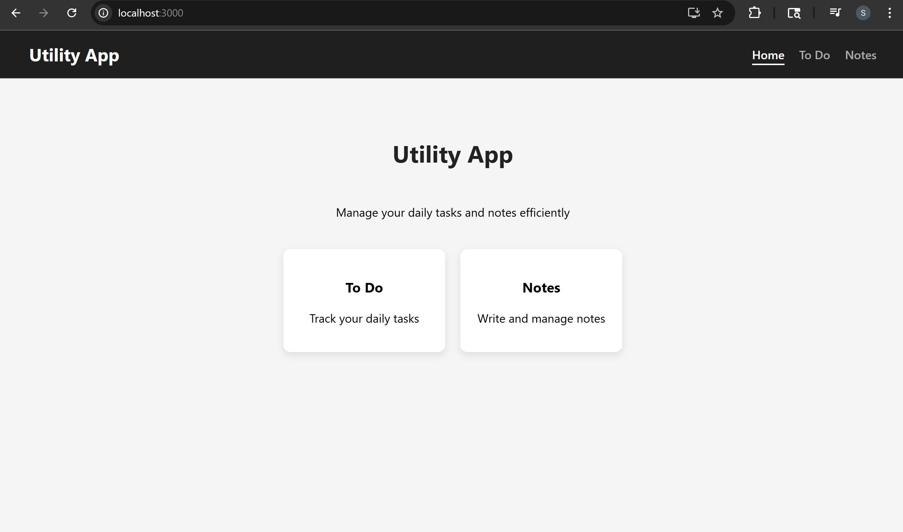

#### Todo: Add Task

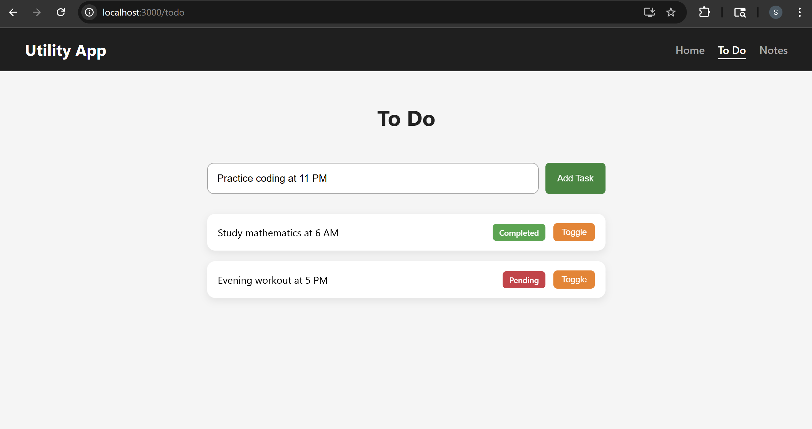

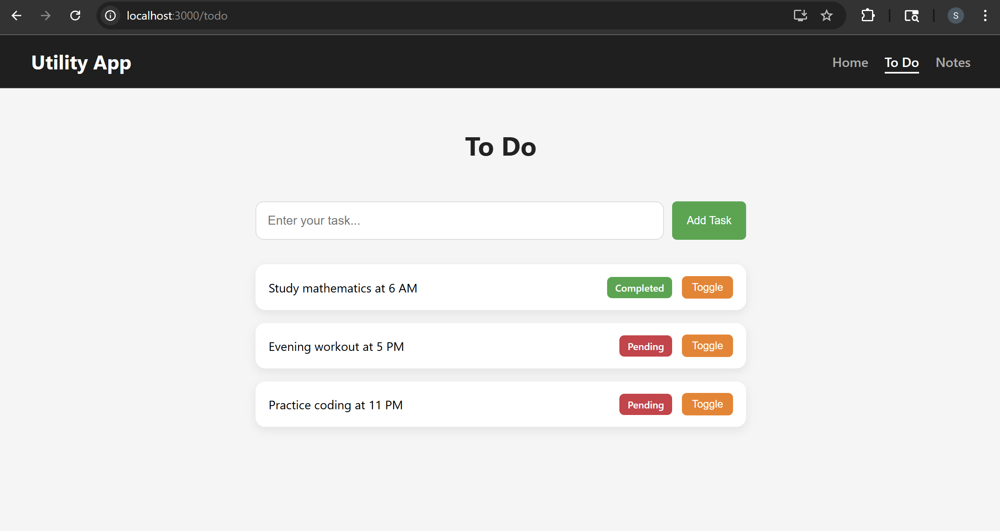

#### Todo: Toggle Task

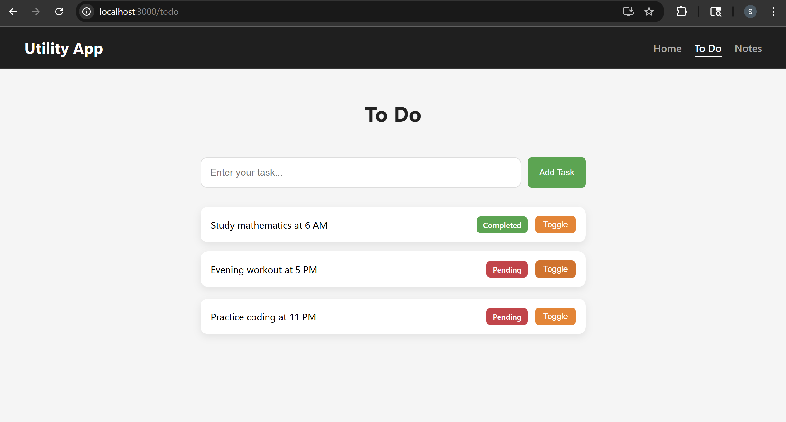
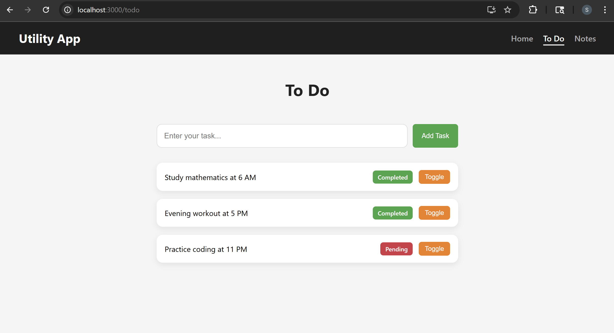

#### Notes: Add Note

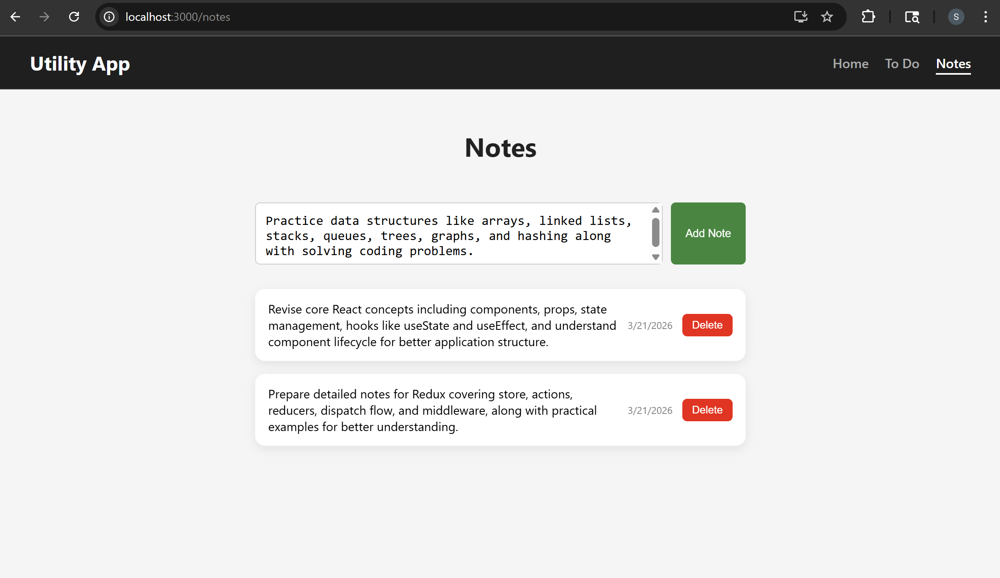

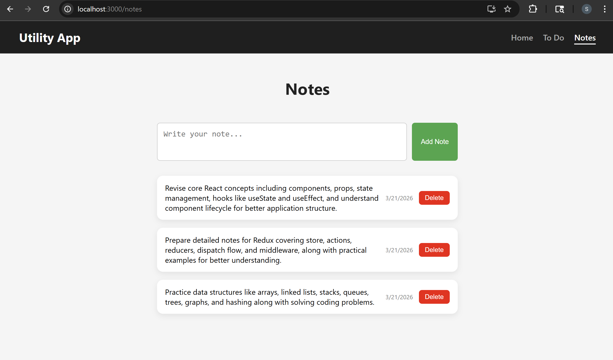

#### Notes: Delete Note


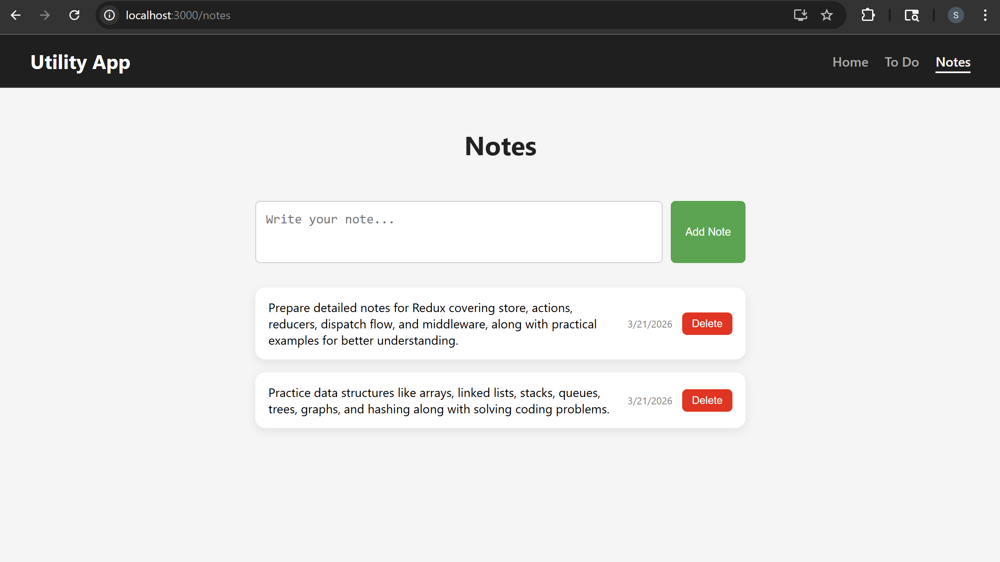

## Redux Quick Notes

- **Reducer → used in store**
  - Defines how the application state changes based on different actions
  - Contains the logic for updating data like adding, deleting, or toggling items
  - Registered inside `configureStore` to manage the global state of the app
- **Actions → used in component (dispatch)**
  - Represent events that trigger changes in the state
  - In Redux Toolkit, actions are automatically created inside slices
  - Called using `dispatch(action)` from components to update the store
- **Selector → used in component (read data)**
  - Used to retrieve specific data from the Redux store
  - Helps avoid repeating state access logic across components
  - Used with `useSelector()` to keep component code clean and readable

## CSS Modules Migration

- **Why converted `.css` → `.module.css`**
  - To avoid global CSS conflicts (especially with Bootstrap)
  - To scope styles to individual components
  - To prevent unintended style overrides across the app
- **CSS Changes**
  - Renamed files from `.css` → `.module.css`
  - Ensured styles are locally scoped per component
- **JS/JSX Changes**
  - Updated imports:
    - from `import "./file.css"`
    - to `import styles from "./file.module.css"`
  - Updated class usage:
    - from `className="class-name"`
    - to `className={styles.className} or className={styles["class-name"]}`
- **Files updated (CSS → renamed, JS → updated imports + class usage)**
  - `ToDoForm.css` → `ToDoForm.module.css` + `ToDoForm.js`
  - `ToDoList.css` → `ToDoList.module.css` + `ToDoList.js`
  - `NoteForm.css` → `NoteForm.module.css` + `NoteForm.js`
  - `NoteList.css` → `NoteList.module.css` + `NoteList.js`
  - `Home.css` → `Home.module.css` + `Home.js`
  - `NavBar.css` → `NavBar.module.css` + `NavBar.js`

### NavBar.js

```jsx
import { NavLink } from "react-router-dom";
import styles from "./NavBar.module.css";

function NavBar() {
  return (
    <nav className={styles.navbar}>
      <h2 className={styles.logo}>Utility App</h2>

      <div className={styles["nav-links"]}>
        <NavLink
          to="/"
          end
          className={({ isActive }) => (isActive ? `${styles.active}` : "")}
        >
          Home
        </NavLink>

        <NavLink
          to="/todo"
          className={({ isActive }) => (isActive ? `${styles.active}` : "")}
        >
          To Do
        </NavLink>

        <NavLink
          to="/notes"
          className={({ isActive }) => (isActive ? `${styles.active}` : "")}
        >
          Notes
        </NavLink>
      </div>
    </nav>
  );
}

export default NavBar;
```

### Home.js

```jsx
import { Link } from "react-router-dom";
import styles from "./Home.module.css";

function Home() {
  return (
    <div className={styles["home-container"]}>
      <h1>Utility App</h1>
      <p>Manage your daily tasks and notes efficiently</p>

      <div className={styles["home-cards"]}>
        <Link to="/todo" className={styles.card}>
          <h3>To Do</h3>
          <p>Track your daily tasks</p>
        </Link>

        <Link to="/notes" className={styles.card}>
          <h3>Notes</h3>
          <p>Write and manage notes</p>
        </Link>
      </div>
    </div>
  );
}

export default Home;
```

### ToDoForm.js

```jsx
import { useState } from "react";
import { useDispatch } from "react-redux";
import { actions } from "../../redux/reducers/todoReducer";
// import { addTodo } from "../../redux/actions/todoActions";
import styles from "./ToDoForm.module.css";

function ToDoForm() {
  const [todoText, setTodoText] = useState("");
  const dispatch = useDispatch();
  const handleSubmit = (e) => {
    e.preventDefault();
    if (!todoText.trim()) return;
    dispatch(actions.add(todoText));
    // dispatch(addTodo(todoText));
    setTodoText("");
  };

  return (
    <div className={styles["form-container"]}>
      <form onSubmit={handleSubmit} className={styles.form}>
        <input
          type="text"
          placeholder="Enter your task..."
          value={todoText}
          onChange={(e) => setTodoText(e.target.value)}
        />
        <button type="submit">Add Task</button>
      </form>
    </div>
  );
}

export default ToDoForm;
```

### ToDoList.js

```jsx
import { useSelector, useDispatch } from "react-redux";
import { actions } from "../../redux/reducers/todoReducer";
import { todoSelector } from "../../redux/reducers/todoReducer";
import styles from "./ToDoList.module.css";

function ToDoList() {
  const todos = useSelector(todoSelector);
  console.log(todos);
  const dispatch = useDispatch();

  return (
    <div className={styles["list-container"]}>
      <ul>
        {todos.map((todo, index) => (
          <li key={todo.id}>
            <span className={styles.content}>{todo.text}</span>

            <span
              className={todo.completed ? styles.completed : styles.pending}
            >
              {todo.completed ? "Completed" : "Pending"}
            </span>

            <button
              className={styles["toggle-btn"]}
              onClick={() => dispatch(actions.toggle(index))}
            >
              Toggle
            </button>
          </li>
        ))}
      </ul>
    </div>
  );
}

export default ToDoList;
```

### NoteForm.js

```jsx
import { useState } from "react";
import { useDispatch } from "react-redux";
import { actions } from "../../redux/reducers/noteReducer";
import styles from "./NoteForm.module.css";

function NoteForm() {
  const [noteText, setNoteText] = useState("");
  const dispatch = useDispatch();

  const handleSubmit = (e) => {
    e.preventDefault();
    if (!noteText.trim()) return;
    dispatch(actions.add(noteText));
    setNoteText("");
  };

  return (
    <div className={styles["form-container"]}>
      <form onSubmit={handleSubmit} className={styles.form}>
        <textarea
          placeholder="Write your note..."
          value={noteText}
          onChange={(e) => setNoteText(e.target.value)}
        />
        <button type="submit">Add Note</button>
      </form>
    </div>
  );
}

export default NoteForm;
```

### NoteList.js

```jsx
import { useSelector, useDispatch } from "react-redux";
import { actions } from "../../redux/reducers/noteReducer";
import { noteSelector } from "../../redux/reducers/noteReducer";
import styles from "./NoteList.module.css";

function NoteList() {
  const notes = useSelector(noteSelector);
  const dispatch = useDispatch();
  return (
    <div className={styles["list-container"]}>
      <ul>
        {notes.map((note, index) => (
          <li key={index}>
            <span className={styles["note-content"]}>{note.text}</span>

            <span className={styles["note-date"]}>
              {note.createdOn.toLocaleDateString()}
            </span>

            <button
              className={styles["delete-btn"]}
              onClick={() => dispatch(actions.delete(index))}
            >
              Delete
            </button>
          </li>
        ))}
      </ul>
    </div>
  );
}

export default NoteList;
```

## Create React App with Redux Template

Redux Toolkit provides a template for creating a React app with Redux
preconfigured, which you can use to start quickly with building a new
Redux-powered React application. Run the following command to create a new
React app with the Redux Toolkit template:

```bash
npx create-react-app my-app --template redux
```

This will create a new React app with the Redux Toolkit template and install all the
necessary dependencies.

## Extra Reducers

Extra Reducer allows you to execute an action which is the action of some other
reducer. It allows you to share an action, invoke an action or dispatch an action that
belongs to some other reducer. Using extra reducers like this can help simplify your
code and make it easier to share actions between different reducers in your Redux
store.

### Creating Extra Reducers using Builder and addCase

Creating extra reducers using the Builder and Case API in Redux Toolkit allows you
to handle actions dispatched from other slices of your Redux store without
hardcoding their names into your reducer.

```jsx
const notificationSlice = createSlice({
  name: "notification",
  initialState,
  reducers: {
    reset: (state, action) => {
      state.message = "";
    },
  },
  extraReducers: (builder) => {
    builder.addCase(actions.add, (state, action) => {
      state.message = "Todo is created!";
    });
  },
});
```

The `builder` argument is an instance of the `ActionReducerMapBuilder` class, which
provides methods for adding new case reducers to your slice. The addCase method
takes two arguments: the action creator function and a callback function that handles
the action. In this case, we pass the `actions.add` action creator function, which is
defined elsewhere in our application, and a callback function that sets the message
property of our state to "Todo is created1". This approach allows us to handle actions
from other parts of our application without tightly coupling our reducers to the actions
that they handle.

### redux/reducers/notificationReducer.js

Introduced a notification system using Redux Toolkit’s `extraReducers`, allowing one slice (notification) to respond to actions from another slice (todo). This helps in showing UI messages like “Todo is created!” without mixing notification logic inside the todo reducer.

```jsx
import { createSlice } from "@reduxjs/toolkit";
import { actions } from "./todoReducer";

const initialState = {
  message: "",
};

const notificationSlice = createSlice({
  name: "notification",
  initialState,
  reducers: {},
  extraReducers: (builder) => {
    builder.addCase(actions.add, (state, action) => {
      state.message = "Todo is created!";
    });
  },
});

export const notificationReducer = notificationSlice.reducer;
export const notificationSelector = (state) =>
  state.notificationReducer.message;
```

Defines a new slice to manage notification messages and listens to todo actions using extraReducers.

- Creating a separate slice (`notificationSlice`)
  - Maintains a simple state with a `message` field
  - Keeps notification logic independent from todo logic
- Using `extraReducers`
  - Listens to `actions.add` from `todoSlice`
  - Automatically updates message when a todo is added
  - Demonstrates cross-slice communication
- Exporting reducer and selector
  - `notificationReducer` → added to store
  - `notificationSelector` → used in components to read message

### components/ToDoForm/ToDoForm.js

```diff
  import { useState } from "react";
- import { useDispatch } from "react-redux";
+ import { useDispatch, useSelector } from "react-redux";
  import { actions } from "../../redux/reducers/todoReducer";
+ import { notificationSelector } from "../../redux/reducers/notificationReducer";
  import styles from "./ToDoForm.module.css";

  function ToDoForm() {
    const [todoText, setTodoText] = useState("");
    const dispatch = useDispatch();
+   const message = useSelector(notificationSelector);

    const handleSubmit = (e) => {
      e.preventDefault();
      if (!todoText.trim()) return;
      dispatch(actions.add(todoText));
      setTodoText("");
    };

    return (
      <div className={styles["form-container"]}>
+       {message && (
+         <div class="alert alert-success" role="alert">
+           {message}
+         </div>
+       )}
        <form onSubmit={handleSubmit} className={styles.form}>
          <input
            type="text"
            placeholder="Enter your task..."
            value={todoText}
            onChange={(e) => setTodoText(e.target.value)}
          />
          <button type="submit">Add Task</button>
        </form>
      </div>
    );
  }

  export default ToDoForm;
```

Updated component to display notification message from Redux store.

- Adding `useSelector`
  - Reads message using `notificationSelector`
  - Keeps component clean (no manual state for notification)
- Displaying notification in UI
  - Shows alert only when message exists
  - Improves user feedback after adding todo
- Keeping dispatch logic unchanged
  - Still uses `dispatch(actions.add(todoText))`
  - Notification is triggered automatically (via extraReducers)

### redux/store.js

```diff
  import { todoReducer } from "./reducers/todoReducer";
  import { noteReducer } from "./reducers/noteReducer";
+ import { notificationReducer } from "./reducers/notificationReducer";
  import { configureStore } from "@reduxjs/toolkit";

  export const store = configureStore({
    reducer: {
      todoReducer,
      noteReducer,
+     notificationReducer,
    },
  });
```

Integrated notification reducer into global store.

- Importing new reducer
  - `notificationReducer` added alongside todo and notes
- Updating store configuration
  - Now store manages three slices:
    - todos
    - notes
    - notifications
- Enables global access
  - Notification state can now be accessed from any component

### index.js

```diff
  import React from "react";
  import ReactDOM from "react-dom/client";
+ import "bootstrap/dist/css/bootstrap.min.css";
  import "./index.css";
  ...
```

Added Bootstrap styling for better UI presentation.

- Importing Bootstrap
  - Enables prebuilt styles like alerts
  - Used for notification display
- No change in logic
  - Only UI enhancement

### Complete Flow (Real Understanding)

```text
User adds todo
      ↓
dispatch(actions.add)
      ↓
todoReducer updates todos
      ↓
notificationSlice (extraReducers) listens
      ↓
message = "Todo is created!"
      ↓
useSelector reads message
      ↓
UI shows alert automatically
```

#### 🖥️ What You See in Browser:

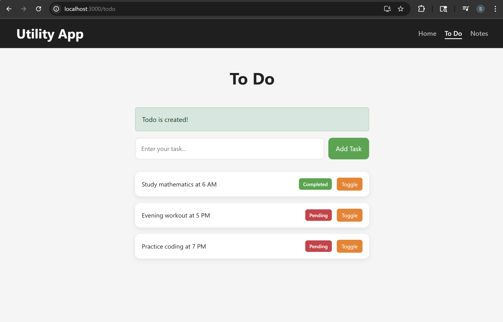

## Reset Notification

Enhanced the notification system by adding a reset mechanism so that messages automatically disappear after a short time. This improves user experience by preventing stale messages from staying on the screen.

### redux/reducers/notificationReducer.js

```diff
  import { createSlice } from "@reduxjs/toolkit";
  import { actions } from "./todoReducer";

  const initialState = {
    message: "",
  };

  const notificationSlice = createSlice({
    name: "notification",
    initialState,
-   reducers: {},
+   reducers: {
+     reset: (state, action) => {
+       state.message = "";
+     },
+   },
    extraReducers: (builder) => {
      builder.addCase(actions.add, (state, action) => {
        state.message = "Todo is created!";
      });
    },
  });

  export const notificationReducer = notificationSlice.reducer;
+ export const resetNotification = notificationSlice.actions.reset;

  export const notificationSelector = (state) =>
    state.notificationReducer.message;
```

Added a new reducer (`reset`) to clear the notification message.

- Adding `reset` action
  - Sets `message` back to empty string
  - Used to remove notification after display
- Exporting action
  - `resetNotification` is exported for use in components
  - Allows components to manually or automatically clear message
- No change in `extraReducers`
  - Still listens to `actions.add` for showing message

### components/ToDoForm/ToDoForm.js

```diff
import { useState } from "react";
import { useDispatch, useSelector } from "react-redux";
import { actions } from "../../redux/reducers/todoReducer";
import styles from "./ToDoForm.module.css";
-import { notificationSelector } from "../../redux/reducers/notificationReducer";
+import {
+  notificationSelector,
+  resetNotification,
+} from "../../redux/reducers/notificationReducer";

function ToDoForm() {
  const [todoText, setTodoText] = useState("");
  const dispatch = useDispatch();
  const message = useSelector(notificationSelector);

+  if (message) {
+    setTimeout(() => {
+      dispatch(resetNotification());
+    }, 1000);
+  }

  const handleSubmit = (e) => {
    e.preventDefault();
    if (!todoText.trim()) return;
    dispatch(actions.add(todoText));
    setTodoText("");
  };

  return (
    <div className={styles["form-container"]}>
      {message && (
        <div class="alert alert-success" role="alert">
          {message}
        </div>
      )}

      <form onSubmit={handleSubmit} className={styles.form}>
        <input
          type="text"
          placeholder="Enter your task..."
          value={todoText}
          onChange={(e) => setTodoText(e.target.value)}
        />
        <button type="submit">Add Task</button>
      </form>
    </div>
  );
}

export default ToDoForm;
```

Updated component to automatically clear notification after a delay.

- Importing reset action
  - `resetNotification` used to clear message
- Adding auto-reset logic
  - When message exists → trigger `setTimeout`
  - After 1 second → dispatch reset action
- Improves UX
  - Notification disappears automatically
  - No manual clearing required

## Notification Support for Notes

Extended the existing notification system to support Notes alongside Todos, enabling notifications for both add and delete actions.
Added dynamic styling (success/danger) and reused centralized Redux logic to keep behavior consistent and scalable across the application.

### redux/reducers/notificationReducer.js

```jsx
import { createSlice } from "@reduxjs/toolkit";
import { actions as todoActions } from "./todoReducer";
import { actions as noteActions } from "./noteReducer";

const initialState = {
  message: "",
  type: "",
};

const notificationSlice = createSlice({
  name: "notification",
  initialState,
  reducers: {
    reset: (state) => {
      state.message = "";
      state.type = "";
    },
  },
  extraReducers: (builder) => {
    builder
      // TODO ADD
      .addCase(todoActions.add, (state) => {
        state.message = "Todo is created!";
        state.type = "success";
      })

      // NOTE ADD
      .addCase(noteActions.add, (state) => {
        state.message = "Note is created!";
        state.type = "success";
      })

      // NOTE DELETE
      .addCase(noteActions.delete, (state) => {
        state.message = "Note is deleted!";
        state.type = "danger";
      });
  },
});

export const notificationReducer = notificationSlice.reducer;
export const resetNotification = notificationSlice.actions.reset;

export const notificationSelector = (state) => state.notificationReducer;
```

Extended notification system to support notes and dynamic styling.

- Adding `type` field
  - Stores notification type (`success` / `danger`)
  - Used for dynamic UI color
- Updating `reset` reducer
  - Clears both `message` and `type`
  - Ensures clean state after notification disappears
- Handling multiple slice actions
  - `todoActions.add` → success message
  - `noteActions.add` → success message
  - `noteActions.delete` → danger message (red)
- Updating selector
  - Returns full object instead of just message
  - Enables access to both `message` and `type`

### components/NoteForm/NoteForm.js

```jsx
import { useState, useEffect } from "react";
import { useDispatch, useSelector } from "react-redux";
import { actions } from "../../redux/reducers/noteReducer";
import styles from "./NoteForm.module.css";
import {
  notificationSelector,
  resetNotification,
} from "../../redux/reducers/notificationReducer";

function NoteForm() {
  const [noteText, setNoteText] = useState("");
  const dispatch = useDispatch();
  const notification = useSelector(notificationSelector);
  const { message, type } = notification;

  useEffect(() => {
    if (message) {
      const timer = setTimeout(() => {
        dispatch(resetNotification());
      }, 1000);

      return () => clearTimeout(timer);
    }
  }, [message, dispatch]);

  const handleSubmit = (e) => {
    e.preventDefault();
    if (!noteText.trim()) return;
    dispatch(actions.add(noteText));
    setNoteText("");
  };

  return (
    <div className={styles["form-container"]}>
      {message && (
        <div className={`alert alert-${type}`} role="alert">
          {message}
        </div>
      )}
      <form onSubmit={handleSubmit} className={styles.form}>
        <textarea
          placeholder="Write your note..."
          value={noteText}
          onChange={(e) => setNoteText(e.target.value)}
        />
        <button type="submit">Add Note</button>
      </form>
    </div>
  );
}

export default NoteForm;
```

Integrated notification UI and auto-reset logic in NoteForm.

- Using `useSelector`
  - Reads notification state from Redux
  - Accesses `message` and `type`
- Adding useEffect
  - Runs when message appears
  - Automatically clears notification after 1 second
- Dynamic alert styling
  - Uses `alert-${type}` for color
  - Shows green for success and red for delete

## components/ToDoForm/ToDoForm.js

```jsx
import { useState, useEffect } from "react";
import { useDispatch, useSelector } from "react-redux";
import { actions } from "../../redux/reducers/todoReducer";
import styles from "./ToDoForm.module.css";
import {
  notificationSelector,
  resetNotification,
} from "../../redux/reducers/notificationReducer";

function ToDoForm() {
  const [todoText, setTodoText] = useState("");
  const dispatch = useDispatch();
  const notification = useSelector(notificationSelector);
  const { message, type } = notification;

  useEffect(() => {
    if (message) {
      const timer = setTimeout(() => {
        dispatch(resetNotification());
      }, 1000);

      return () => clearTimeout(timer);
    }
  }, [message, dispatch]);

  const handleSubmit = (e) => {
    e.preventDefault();
    if (!todoText.trim()) return;
    dispatch(actions.add(todoText));
    setTodoText("");
  };

  return (
    <div className={styles["form-container"]}>
      {message && (
        <div className={`alert alert-${type}`} role="alert">
          {message}
        </div>
      )}
      <form onSubmit={handleSubmit} className={styles.form}>
        <input
          type="text"
          placeholder="Enter your task..."
          value={todoText}
          onChange={(e) => setTodoText(e.target.value)}
        />
        <button type="submit">Add Task</button>
      </form>
    </div>
  );
}

export default ToDoForm;
```

Refactored TodoForm to support new notification structure and improve behavior.

- Updating selector usage
  - Now reads full notification object
  - Extracts `message` and `type`
- Replacing direct setTimeout
  - Moved into `useEffect`
  - Prevents multiple timers on re-render
- Dynamic alert styling
  - Replaces fixed success class
  - Supports both success and danger states

#### 🖥️ What You See in Browser:

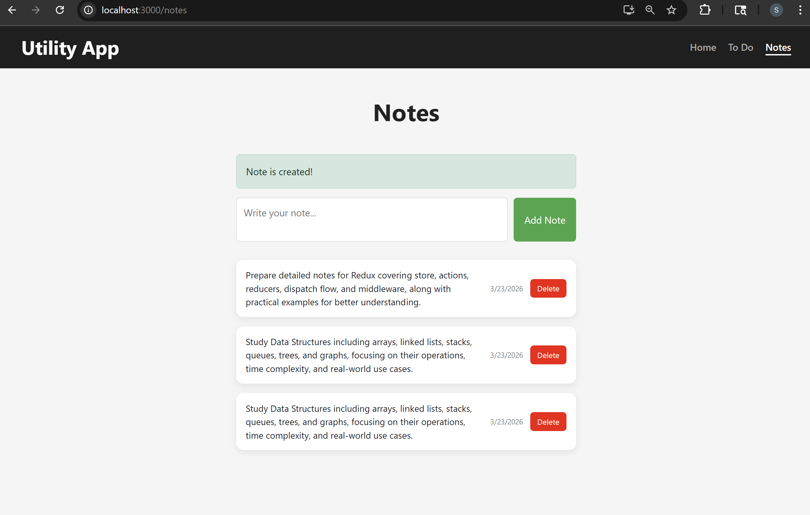

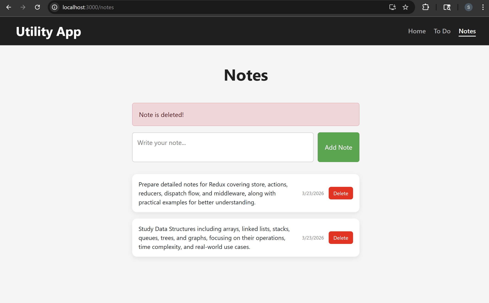
